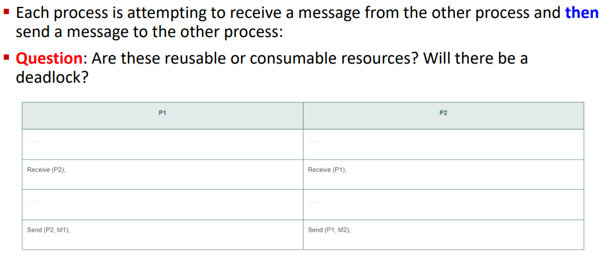
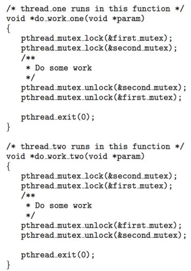
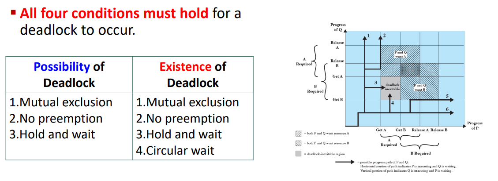
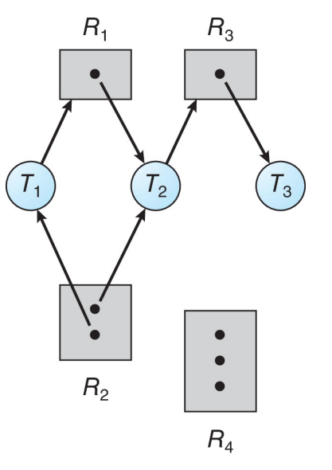
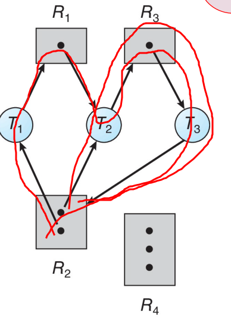
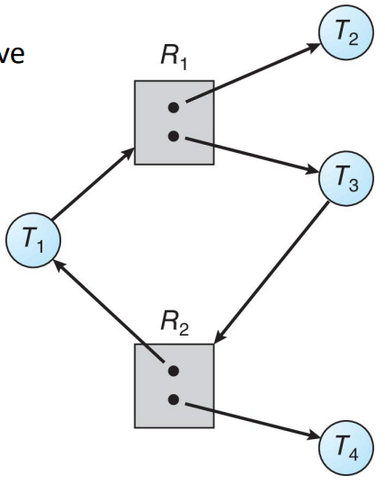

`Deadlock and Starvation` slide deck

toc:
- [Housekeeping](#housekeeping)
- [Principles of Deadlocks](#principles-of-deadlocks)
  - [Deadlock](#deadlock)
- [Deadlock in Multithreaded Applications](#deadlock-in-multithreaded-applications)
- [Deadlock Characterization](#deadlock-characterization)
  - [Resource Allocation Graph](#resource-allocation-graph)
- [Methods for Handling Deadlocks](#methods-for-handling-deadlocks)
  - [Prevention](#prevention)
    - [Deny Hold and Wait](#deny-hold-and-wait)
    - [Deny No Preemption](#deny-no-preemption)
    - [Deny Circular Wait](#deny-circular-wait)
  - [Deadlock Avoidance](#deadlock-avoidance)
    - [Safe State](#safe-state)
    - [Avoidance Algos](#avoidance-algos)
      - [Resource-Allocation Graph Scheme](#resource-allocation-graph-scheme)
      - [Banker's Algorithm](#bankers-algorithm)
  - [Deadlock Detection](#deadlock-detection)
- [Recovery from Deadlock](#recovery-from-deadlock)

# Housekeeping

Strike won't be affecting us too much

# Principles of Deadlocks

Systems have different resources

Threads must:
- request a resource before using it
- release the resource after using it

The number of resources requested cannot exceed the total number of resources available in the system
- a thread cannot request 2 net interface if there is only 1
- `can't ask for what we don't have`

Request:
- Thread requests the resource
- if you can give it, then give it immediately
- If it can't be given right now then the requesting thread must wait until it can acquire the resource

Use:
- the thread can operate on the resource
- ex: use the mutex lock to access a process' critical section

Release:
- resource is released and made usable again

Reusable Resources:
- can be used safely by one process at a time
- not depleted by that use
- not consumable
- ex: proessors, I/O channels, memory (main and secondary), I/O devices, data structures (files, databases, and semaphores)

Consumable Resources:
- created/produced and destroyed/consumed
- ceases to exist after being acquired by the consuming process
- ex: interrupts, singals, messages, info in I/O buffers

## Deadlock

A deadlock is the __permanent__ block.

Two or more processes are waiting for the other process to release a shared resource.


A set of processes is deadlocked when each process
in the set is blocked awaiting an event that can only
be triggered by another blocked process in the set.

The block is permanenet because none of the events ever get triggered.


Trace 1 sees process $Q$ execute all of its desire operations before process $P$ can perform any single operation

Trace 2 sees process $Q$ get A then make process $P$ wait until it was done.

Trace 3 sees $Q$ get B and $P$ get A. 4 does the same but in reverse order

Traces 3 & 4 eventually leads to a deadlock as each process will want the other's acquired resource that they can't release until they get the resource they want.

Trace 5 sees process $P$ get B then make process $Q$ wait until it's done.

Trace 6 sees $P$ exectute everything before $Q$ gets make some meaningful progress.


>"I would like to leave that for the banking algorithm" - Prof, no one knows what she meant by that

This rearrangement is not always a possible solution since we don't know what the order of the instructions/operations will be beforehand.

Traces 1, 2, 5, and 6 are unaffected but now traces 3 and 4 don't lead to deadlock.

instead with Trace 3
- $Q$ gets B
- $P$ gets A then releases A
- $Q$ gets A, releases B, then releases A
- $P$ gets B then releases B

Similarly with trace 4


These are reusable resources.

There will be a deadlock.

$p_0 q_0 p_1 q_1$ introduces the possibility of a deadlock

$p_0 q_0 p_1 q_1 p_2 q_2$ is where the deadlock happens.


These are reusable resources.

There will be a deadlock.

P1 and P2 can make their requests then the next requests will cause a deadlock.

P1 or P2 can make both requests but then upon the next request from the other process we will run into deadlock. That is unless there is some kind of release condition that we don't see beyond the processes' second requests.

The cause of the deadlock being that we don't have enough resources to give.



Consumable resource.

There is a deadlock as they are both waiting on each other.

If receive is not blocking - i.e. the processes just make themself open to receiving and don't wait - then there is no deadlock.

It depends on the nature of the receive operation.

```
Prof will tell us if it's blocking or not blocking.
```

# Deadlock in Multithreaded Applications

2 mutex locks are created and initialized:


2 threads are created and both threads have access to both mutex locks.



Deadlock is possible if thread 1 acquires `first_mutex` and thread 2 acquires `second_mutex`

Each thread then waits for the other's mutex.


THe order depends on how the threads are scheduled by the cpu scheduler.
hard to test for deadlocks as they may only occur under certain scheduling circumstances.

this is the livelock of waiting continually trying to acquire

---
knowledge check:
- a deadlocked state occurs whenever
  - every process in a set is waiting for an event that can only be cauesd by another process in the set
- Deadlock occurs when every thread in a set is blocked waiting for an event that can be caused only by another thread in the set, while livelock occurs when a thread continuously attempts an action that fails.
  - true
- in the dining philosophers problem, there is a possibility of deadlock but not livelock
  - false
  - everyone picks a fork up then there is deadlock
  - if they keep picking it up and putting it down then there is livelock

# Deadlock Characterization

deadlock can arise if 4 conditions hold at the same time:
- mutual exclusion
  - only one process at a time can use a resource
- hold and wait
  - a process holding at least one resource is waiting to acquire additional resources held by other processes
- no preemption (for resources no the process)
  - resource only released by the process holding it after it's done its task
  - resource cannot be preempted
    - processor can't take resources from process and give it to other processes arbitrarily
- circular wait
  - process 1 is waiting on process 2
  - process 2 is waiting on process 3
  - ...
  - process n-1 is waiting on process n
  - process n is waiting on process 1




## Resource Allocation Graph


A digraph with vertices $V$ partitioned into $P$ processes and $R$ resources




There are 3 threads and 4 resources.

.|$T_1$|$T_2$|$T_3$
-|-|-|-
$R_1$|req|assigned|
$R_2$|assigned|assigned|
$R_3$||req|assigned
$R_4$|||

There are 1 instance of $R_1$ and $R_2$

2 of $R_2$ and 3 of $R_4$

There are no cycles in the graph.

Therefore there are no deadlocks

If there is no cycle then there is no deadlock.



There are 2 cycles.

T1 is assigned R2 and wants R1

T2 is assigned R1+R2 and wants R3

T3 is assigned R3 and wants R2 which it can't get since there's no more instances of R2

```
It might seem like there's no deadlock if we look at the smaller cycle.

T2 is assigned R2 and wants R3
T3 is assigned R3 and wants R2 which it can get since there's another instance of R2

T3 finishes with R3 and gives it up for T2.

This is a static situation so we have a deadlock
```



There is a cycle with the middle 4 nodes.

There is no deadlock.

The outter threads of $T_2$ and $T_4$ can finish and release their instances of $R_1$ and $R_2$ respectively.

Then $T_1$ and $T_3$ can get hold of the resources and work on them.

---
If there is no cycle,
then there is no deadlock

If there is a cycle then there may or may not be a deadlock
- if only one instance per resource type, then deadlock
- if there are several instances per resource type, possibility of deadlock

---

deadlock:


no deadlock:


Resource Allocation graph for the car deadlock example showing circular wait


We can take the numbers on the cars to be the numbers of the processes.

Car 1 is sitting lane __Ra__ and wants to cross lane Rb

Car 2 is sitting lane Rb and wants to cross lane Rc

Car 3 is sitting lane Rc and wants to cross lane Rd

Car 4 is sitting lane Rd and wants to cross lane __Ra__

---
Knowledge Check
- one necessary condition for deadlock is \_\_\_, which states taht a process must be holding one resource and waiting to acquire additional resources
  - a: hold and wait
- a cycle in a resource-allocation graph is \_\_\_
  - d. a necessary and sufficient condition for a deadlock in the case that each resource has exactly one instance
- if a resource-allocation graph has a cycle, the system must be in a deadlocked state.
  - false

# Methods for Handling Deadlocks

In general,
there are 3 ways to deal with deadlocks:
1. prevention and avoidance
2. detection and recovery
3. ignoring it

most OSes including windows and linux just pretend that deadlocks don't happen `???`

```
Prof later explained that this is just left up to the programmer/user and it's not up to the OS.

pulled a pontius pilate and washed their hands of the whole situ
```

## Prevention

In order to prevent deadlocks we have to invalidate one of the 4 necessary conditions for deadlock
```
as a refresher

deadlock can arise if 4 conditions hold at the same time:
- mutual exclusion
  - only one process at a time can use a resource
- hold and wait
  - a process holding at least one resource is waiting to acquire additional resources held by other processes
- no preemption (for resources no the process)
  - resource only released by the process holding it after it's done its task
  - resource cannot be preempted
    - processor can't take resources from process and give it to other processes arbitrarily
- circular wait
  - process 1 is waiting on process 2
  - process 2 is waiting on process 3
  - ...
  - process n-1 is waiting on process n
  - process n is waiting on process 1
```

Though there are shareable resources,
we cannot invalidate mutual exclusion as a whole since some resources just cannot be shared and used at the same time.

### Deny Hold and Wait

We can invalidate hold and wait by ensuring that whenever a requests a resource it won't be holding any other resources.
Put another way,
If the process is holding a resource then they won't be making any requests.

how:
- require process to request and allocate all resources before execution
  - **dynamic nature of resource requesting makes this impractical**
- only allow resource requests when process has no resource allocated
  - must release resources before requesting for more

cons:
- low resource utilization
  - resources allocated but not used
- starvation possible
  - a thread may have to wait indefinitely if it needs several popular resources
  - those resources will always end up allocated to processes that will only need those resources
  - `I imagine that even with bounded wait time considerations, priority will cause this to happen as well`

### Deny No Preemption

`reminder:
non-preemptive is when a process enters into the processor and only leaves when it's finished or voluntarily leaves when waiting on something`

if
- a process is holding some resources
- the process requests another resources
- that resource cannot be immediately allocated to it

then __all resources currently being held are preempted__, released by the processor.

Preempted resources are added to the list of resources that the process is waiting for.

The process starts again once it regains all of the resources it's requesting
(the old preempted ones and the new ones).

This is often `selectively` applied to resources whose state can be easily saved and restored later,
such as cpu registers and database transactions.

cons:
- cannot be applied to resources like mutex locks and semaphores which are the type of resources where deadlock occurs most commonly
  - it's hard to save the condition of a mutex when a process wants to lock for a critical section
  - not easy to store and retrieve $\rarr$ not easy to preempt
  - `we can't do this for the shit we actually care about bruhhhhhhh`

### Deny Circular Wait

This is the most common approach


how:
- assign each resource a unique number
- resources must be acquired in the order of their unique number

---
Knowledge check:
- to handle deadlocks, operating systems most often \_\_\_
  - a. pretend that deadlocks never occur
- both deadlock prevention and deadlock avoidance techniques ensure that the system will never enter a deadlocked state
  - true
- most operating systems choose to ignore deadlocks, because
  - d. all of the above
  - handling is expensive, they occur infrequently, livelock  recovery methods can be use on deadlocks

## Deadlock Avoidance

Dynamically made decision to see if an allocation request will potentially lead to a deadlock if granted.

System considers
- currently available resources
- currently allocated resources
- and the future requests and releases of each thread

requires knowledge of future process requests.

basics:
- state
  - reflects current allocation of resources to processes
- safe state
  - state where there is at least one execution path where all the processes will finish
  - there will be no deadlock
- unsafe state
  - state resulting in possibility of deadlock
- avoidance
  - ensuring system will never enter an unsafe state

### Safe State


---


In the above example we only have 3 resources available.

For T1 we give it 2 then release back 4 once it's done.

Then the above steps just go as shown.

So we are in a safe state


This is the same example as seen above but now $T_2$ needs 1 more resource,
requests the resource and receives it,
resulting in only 2 resources available at the beginning.

We can start the sequence with $T_1$ and allocate 2 then get back 2 once done.

We end up with only 4 available resources which isn't enough to satisfy the maximum needs of $T_0$ and $T_2$

### Avoidance Algos

There are 2 algos:
1. using a resource-allocation when there's a single instance of a resource type
2. use the Banker's Algo when there's multiple instances of a resource type

#### Resource-Allocation Graph Scheme


`a priori` = `ahead of time`

claims turn into requests which turn into assignments before turning back into claim edges


make sure there is no cycles forming if you convert a request edge to an assignment edge

#### Banker's Algorithm

`prof misspells this is as Baker at some point. It's Banker.`

conditions:
- multiple instances of resources
- each process must have a prior claim maximum use
- when a process requests a resource, it may have to wait
- when aprocess gets all its resources it must return them in a finite amount of time


---


Q: Does the sequence $<P_1, P_3, P_4, P_2, P_0>$ satisfy safety criteria?

A: yes

we start with $<3, 3, 2>$

$P_1$ can be allocated and give back $<5, 3, 2>$

$P_3$ can be allocated and give back $<7, 4, 3>$

$P_4$ can be allocated and give back $<7, 4, 5>$

$P_2$ can be allocated and give back $<10, 4, 7>$, making all instances of $A$ and $C$ available

$P_0$ can be allocated and give back $<10, 5, 7>$,
making all instances of all resources available.

---


you do the same process with this.

A: the sequence satisfies safety requirement


---

In essence:
- we are in a safe setaet if there is at least one sequence of resource allocations to processes that does not result in a deadlock
- for $i\in[0..n]$
  - compare the available with the need vector
  - if the available is lesser than the need vector then unsafe
  - else, it can be allocated
  - add allocation vector to available vector as the resources are now returned from process
- at no point should the available exceed the maximum for each entry in the vector
- if at any point in the vector of processes does the above `for-loop` exit then it does not satisfy the safety requirement

---
Knowledge Check:
- which of the following statements is true:
  - d. An unsafe state may lead to a deadlocked state
  - we may avoid the deadlocked state
- 
  - b. It is not safe
- 
  - It is safe

## Deadlock Detection

If we don't use deadlock prevention or avoidance then a deadlock situation may occur

in lieu of prevention and avoidance we can use detection and recovery

A detection algorithm to look at the system state see if a deadlock has happened.

A recovery scheme to recovery from the deadlock.

For situations where we have a single instance of each resource type:
- maintain a `wait-for` graph
  - nodes are processes
  - $P_i\rarr P_j$ if $P_i$ is waiting for $P_j$
- Periodically check for a cycle in the graph
  - if there is a cycle then there is a deadlock
- takes $O(n^2)$ where $n$ is the number of vertices in the graph


In the above,
we see that there is a deadlock as there are cycles so we are in deadlock.

For situations where we have multiple instances for each resource type:
- we use something similar to the banker's algo
- all the matrices and all of that
- "it's exactly similar to the Banker's algorithm" - prof

How often we invoke this depends on how likely it is to occur and how many threads would be affected by a deadlock if it happens.

The more often and the more impactful then the more frequently we should invoke.

Invoking everytime there is a resource request is expensive (except in the case of Banker's algo since we use it anyways).

A less expensive alternative is to invoke the algo at defined intervals.

---
Knowledge Check
- the wait-for graph scheme is not applicable to a resource allocation system with mutliple instances of each resource type
  - True
- in a wait-for graph
  - d. None of the above
  - b and c are each others' contrapositive so they're both false
- The decision of when to invoke a detection algorithm depends on the likely frequency of deadlocks and the number of threads likely to be affected by a deadlock when it happens
  - True

# Recovery from Deadlock

We have 2 options in a deadlock:
- break circular wait by aborting one or more involved threads
- preempt some resources from one or more of the deadlocked threads
  - take some resources away

for abortion we have some options
- abort all the deadlocked processes
- abort one at a time until the deadlock cycle is eliminated

Let's not kill everything.

What affects the process abortion order:
1. priorty of process
2. elapsed and remaining computation time
3. allocated resources
4. required resources
5. number of processes to be terminated


`copying slides now`

selecting a victim that minimizes cost

rollback to some safe state, restart process for that state once the resources are available.

We may have starvation if we keep selecting the same victim over and over again

we have to include the number of rollbacks as part of the cost factor

---
Knowledge Check
- a system can recover from a deadlock by
  - d. All of the above
- to recover from a deadlock using resource preemption,
  - d. All of the above

This concludes the `Deadlock and Starvation` slide deck.