Note: this is a part 2 sister note for [the other lecture note](./LN%2011%20p1.md).

This note will start coverage for the `Deadlock and Starvation` slide deck

toc:
- [Housekeeping](#housekeeping)
- [Principles of Deadlocks](#principles-of-deadlocks)
  - [Deadlock](#deadlock)
- [Deadlock in Multithreaded Applications](#deadlock-in-multithreaded-applications)
- [Deadlock Characterization](#deadlock-characterization)
  - [Resource Allocation Graph](#resource-allocation-graph)
- [Methods for Handling Deadlocks](#methods-for-handling-deadlocks)
- [Recovery from Deadlock](#recovery-from-deadlock)

# Housekeeping

Strike won't be affecting us too much

# Principles of Deadlocks

Systems have different resources

Threads must:
- request a resource before using it
- release the resource after using it

The number of resources requested cannot exceed the total number of resources available in the system
- a thread cannot request 2 net interface if there is only 1
- `can't ask for what we don't have`

Request:
- Thread requests the resource
- if you can give it, then give it immediately
- If it can't be given right now then the requesting thread must wait until it can acquire the resource

Use:
- the thread can operate on the resource
- ex: use the mutex lock to access a process' critical section

Release:
- resource is released and made usable again

Reusable Resources:
- can be used safely by one process at a time
- not depleted by that use
- not consumable
- ex: proessors, I/O channels, memory (main and secondary), I/O devices, data structures (files, databases, and semaphores)

Consumable Resources:
- created/produced and destroyed/consumed
- ceases to exist after being acquired by the consuming process
- ex: interrupts, singals, messages, info in I/O buffers

## Deadlock

A deadlock is the __permanent__ block.

Two or more processes are waiting for the other process to release a shared resource.

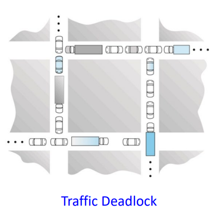

A set of processes is deadlocked when each process
in the set is blocked awaiting an event that can only
be triggered by another blocked process in the set.

The block is permanenet because none of the events ever get triggered.

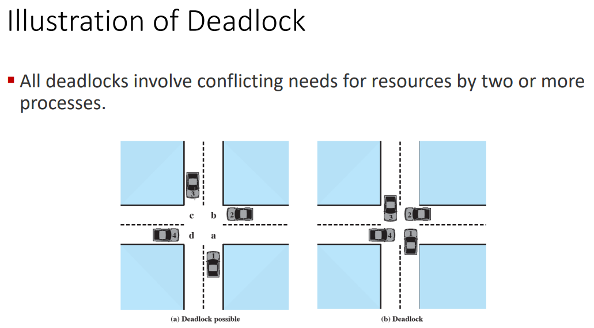

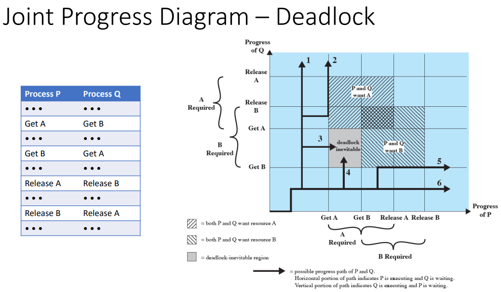

Trace 1 sees process $Q$ execute all of its desire operations before process $P$ can perform any single operation

Trace 2 sees process $Q$ get A then make process $P$ wait until it was done.

Trace 3 sees $Q$ get B and $P$ get A. 4 does the same but in reverse order

Traces 3 & 4 eventually leads to a deadlock as each process will want the other's acquired resource that they can't release until they get the resource they want.

Trace 5 sees process $P$ get B then make process $Q$ wait until it's done.

Trace 6 sees $P$ exectute everything before $Q$ gets make some meaningful progress.

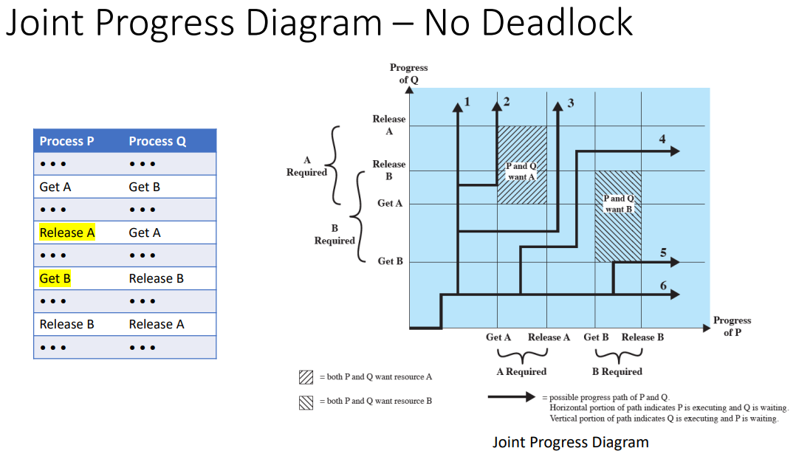

>"I would like to leave that for the banking algorithm" - Prof, no one knows what she meant by that

This rearrangement is not always a possible solution since we don't know what the order of the instructions/operations will be beforehand.

Traces 1, 2, 5, and 6 are unaffected but now traces 3 and 4 don't lead to deadlock.

instead with Trace 3
- $Q$ gets B
- $P$ gets A then releases A
- $Q$ gets A, releases B, then releases A
- $P$ gets B then releases B

Similarly with trace 4

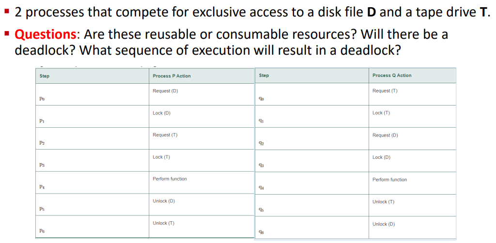

These are reusable resources.

There will be a deadlock.

$p_0 q_0 p_1 q_1$ introduces the possibility of a deadlock

$p_0 q_0 p_1 q_1 p_2 q_2$ is where the deadlock happens.

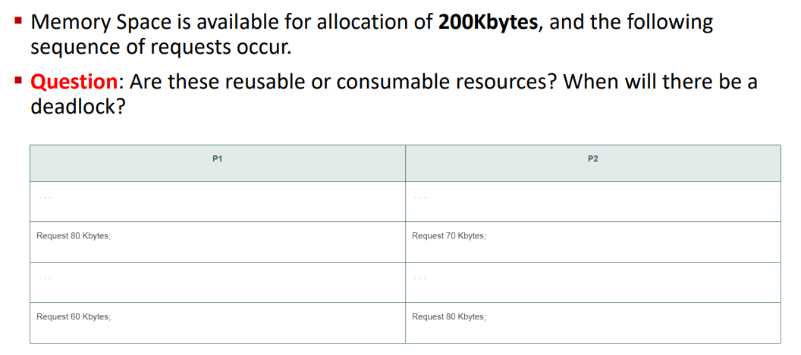

These are reusable resources.

There will be a deadlock.

P1 and P2 can make their requests then the next requests will cause a deadlock.

P1 or P2 can make both requests but then upon the next request from the other process we will run into deadlock. That is unless there is some kind of release condition that we don't see beyond the processes' second requests.

The cause of the deadlock being that we don't have enough resources to give.

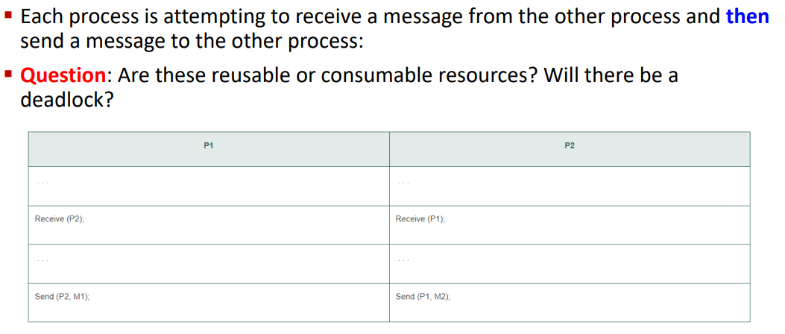

Consumable resource.

There is a deadlock as they are both waiting on each other.

If receive is not blocking - i.e. the processes just make themself open to receiving and don't wait - then there is no deadlock.

It depends on the nature of the receive operation.

```
Prof will tell us if it's blocking or not blocking.
```

# Deadlock in Multithreaded Applications

2 mutex locks are created and initialized:

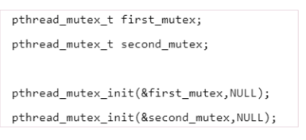

2 threads are created and both threads have access to both mutex locks.

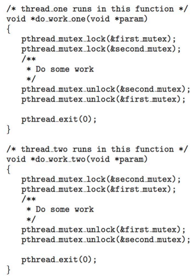

Deadlock is possible if thread 1 acquires `first_mutex` and thread 2 acquires `second_mutex`

Each thread then waits for the other's mutex.

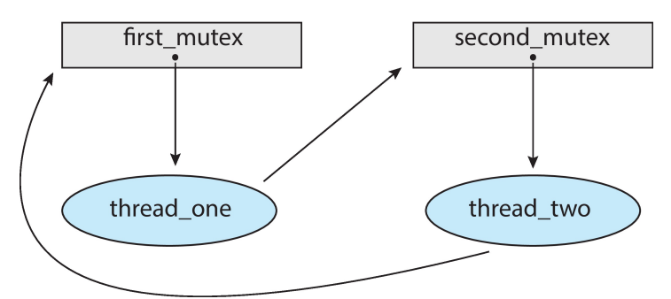

THe order depends on how the threads are scheduled by the cpu scheduler.
hard to test for deadlocks as they may only occur under certain scheduling circumstances.

this is the livelock of waiting continually trying to acquire

---
knowledge check:
- a deadlocked state occurs whenever
  - every process in a set is waiting for an event that can only be cauesd by another process in the set
- Deadlock occurs when every thread in a set is blocked waiting for an event that can be caused only by another thread in the set, while livelock occurs when a thread continuously attempts an action that fails.
  - true
- in the dining philosophers problem, there is a possibility of deadlock but not livelock
  - false
  - everyone picks a fork up then there is deadlock
  - if they keep picking it up and putting it down then there is livelock

# Deadlock Characterization

deadlock can arise if 4 conditions hold at the same time:
- mutual exclusion
  - only one process at a time can use a resource
- hold and wait
  - a process holding at least one resource is waiting to acquire additional resources held by other processes
- no preemption (for resources no the process)
  - resource only released by the process holding it after it's done its task
  - resource cannot be preempted
    - processor can't take resources from process and give it to other processes arbitrarily
- circular wait
  - process 1 is waiting on process 2
  - process 2 is waiting on process 3
  - ...
  - process n-1 is waiting on process n
  - process n is waiting on process 1

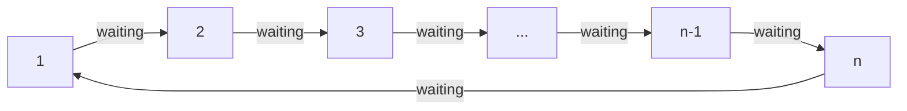

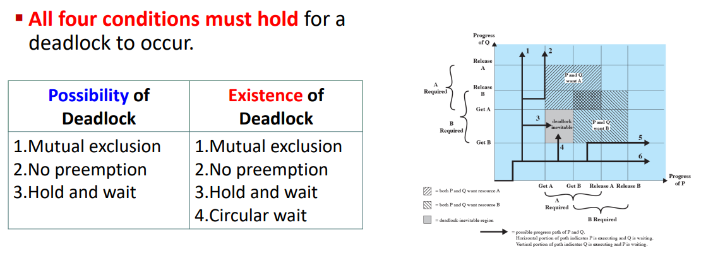

## Resource Allocation Graph

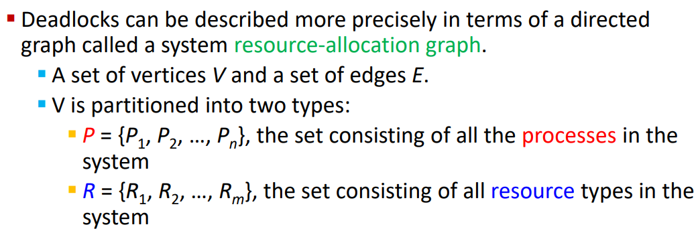

A digraph with vertices $V$ partitioned into $P$ processes and $R$ resources

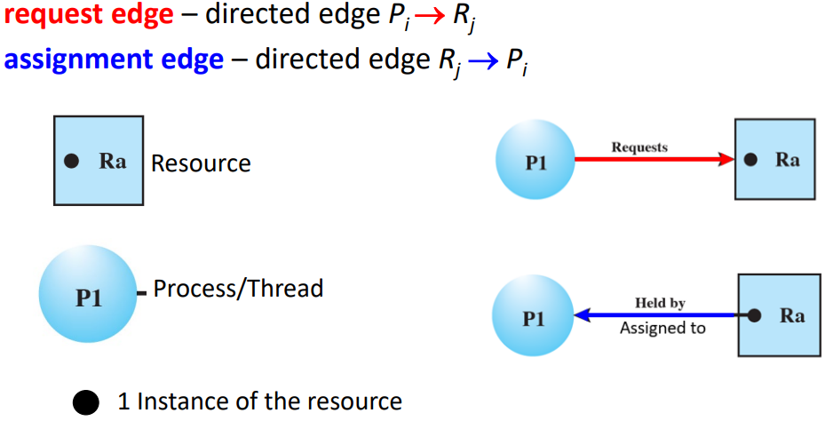

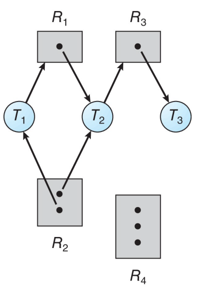

There are 3 threads and 4 resources.

.|$T_1$|$T_2$|$T_3$
-|-|-|-
$R_1$|req|assigned|
$R_2$|assigned|assigned|
$R_3$||req|assigned
$R_4$|||

There are 1 instance of $R_1$ and $R_2$

2 of $R_2$ and 3 of $R_4$

There are no cycles in the graph.

Therefore there are no deadlocks

If there is no cycle then there is no deadlock.

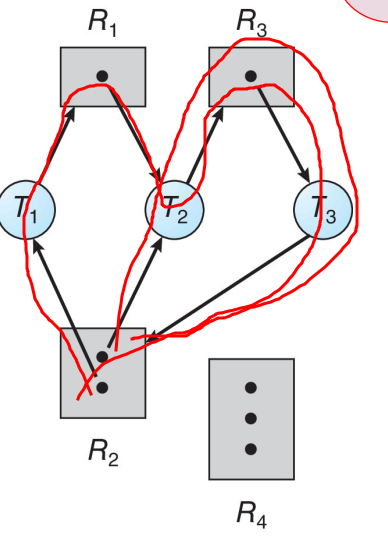

There are 2 cycles.

T1 is assigned R2 and wants R1

T2 is assigned R1+R2 and wants R3

T3 is assigned R3 and wants R2 which it can't get since there's no more instances of R2

```
It might seem like there's no deadlock if we look at the smaller cycle.

T2 is assigned R2 and wants R3
T3 is assigned R3 and wants R2 which it can get since there's another instance of R2

T3 finishes with R3 and gives it up for T2.

This is a static situation so we have a deadlock
```

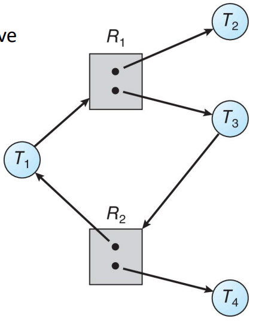

There is a cycle with the middle 4 nodes.

There is no deadlock.

The outter threads of $T_2$ and $T_4$ can finish and release their instances of $R_1$ and $R_2$ respectively.

Then $T_1$ and $T_3$ can get hold of the resources and work on them.

---
If there is no cycle,
then there is no deadlock

If there is a cycle then there may or may not be a deadlock
- if only one instance per resource type, then deadlock
- if there are several instances per resource type, possibility of deadlock

---

deadlock:

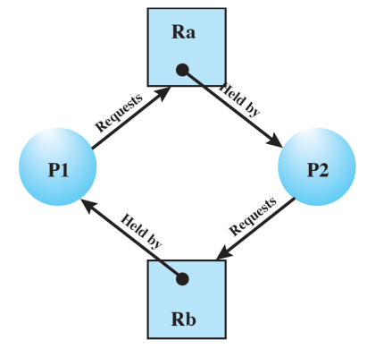

no deadlock:

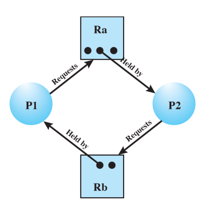

```mermaid
flowchart LR


```

# Methods for Handling Deadlocks

# Recovery from Deadlock