This covers the `Memory Management` slide deck

toc:
- [Background](#background)
  - [Memory Protection](#memory-protection)
  - [Logical vs Physical Address Space](#logical-vs-physical-address-space)
  - [Memory Mangement Unit](#memory-mangement-unit)
  - [Dynamic Loading](#dynamic-loading)
  - [Dynamic Linking](#dynamic-linking)
- [Contiguous Memory Allocation](#contiguous-memory-allocation)
  - [Memory Protection in Contiguous Memory Allocation](#memory-protection-in-contiguous-memory-allocation)
  - [Memory Allocation](#memory-allocation)
  - [Fragmentation](#fragmentation)
- [Paging](#paging)
  - [Paging Hardware](#paging-hardware)
  - [Example](#example)
  - [Calculating Internal Fragmentation](#calculating-internal-fragmentation)
  - [Free Frames](#free-frames)
  - [Implementation of Page Table](#implementation-of-page-table)
    - [TLB](#tlb)
      - [Effective Access Time](#effective-access-time)
      - [Memory Protection in Page Table](#memory-protection-in-page-table)
      - [Shared Pages](#shared-pages)
- [Sawpping](#sawpping)

# Background

recap:
- a program must be brought from the disk into the memory and placed within a process for it to be run
- main memory and registers are the only storage the CPU can access directly
  - accessing the non-volatile memory is limited to copying over data to the memory to work with
  - we don't work directly off of disk


a memory unit only sees a stream of either:
  - addresses & read reqeusts
  - addresses & data and write requests

register access is done in one CPU clock cycle.

main memory can take many cycles, causing a stall where the cpu hasd to wait on the memory.

cache sits b/w main mem & cpu regs for faster access than mem
- principle of locality
  - whenever a task is being done on a specific collection of data, it is very likely that we're going to select the next piece of data in the collection so we may fetch it preemptively as we anticipate that it will be required next
  - hit ratio keeps increasing
  - at some point we start doing something else however

## Memory Protection

Protection is required to ensure correct operation.
`recall: mutual exclusion`

Make sure that a proccess can only access its allocated area in the address space.

We can use a pair of `base` and `limit` registers to define the logical address space of a process

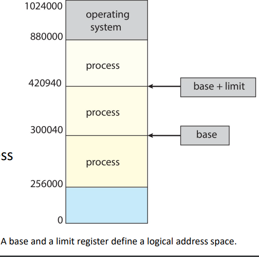

`base` = smallest legal physical mem address

`limit` = size of range

`base+limit` = highest legal physical mem address

trying to access anything outside of the range is not allowed.

In the above we see a base of 300040 and a limit of 120900 added together to get the highest legal address of 420940.

```
prof brought up the fact that modern operating systems sit in the highest addresses while older operating systems may do other things like sitting at the oldest

prof will designate which one is which on assessment(s)
```

```
Q: Are all the ranges mutually exclusive?
A: Yes. All the ranges are mutually exclusive
```

Hardware Address Protection
- CPU has to check every memory access request generated in user mode to make sure it's inside of the range
- the instructions to loading the base and limit registers are privileged

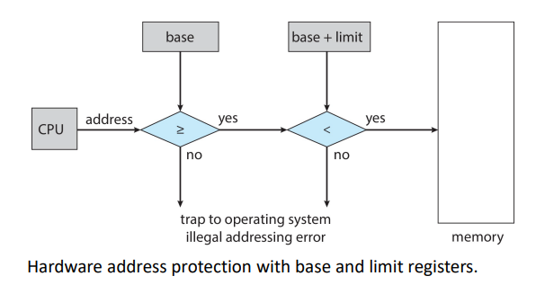

```
malicious programs often try to break out of this limit.
```

Address Binding
- programs are stored on disk, ready to be brought into memory to execute form an input queue
  - most systems allow a user process to reside in any part of the physical memory
  - the address space of the computer may start at 00000 but the first address of the user process does not need to be 00000
    - it's inconvenient to enforce it to be 00000
      - why?
        - you can waste memory as you get closer to the OS in mem space
        - we have processes starting and finishing all the time so we have to fit them in whereever we can

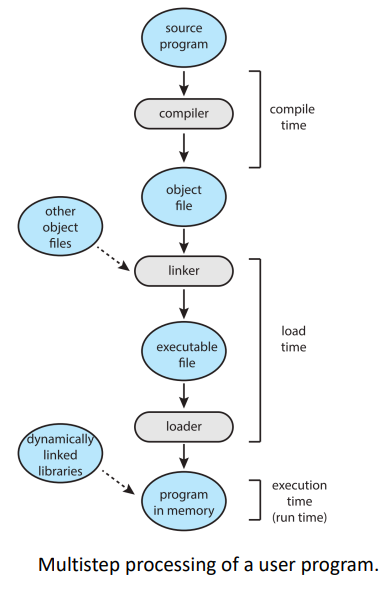

- we start out with the source code
- compile it
- link with the object file
- turn it into an executable
- dynamically linked libraries are provided by the OS and are linked by the loader
- program gets swapped in and swapped out as it needs the libraries

addresses are represented in different ways at different stages of a program's life:
- source code addresses are usually symbolic (`int x`)
- compiled code addresses bind to relocatable addresses
  - "14 bytes from beginning of this module"
- `after this point we have to have actual concrete physical addresses`
- linker or loader will bind relocatable addresses to absolute addresses
  - ex: 74014
- each binding maps one address space to another

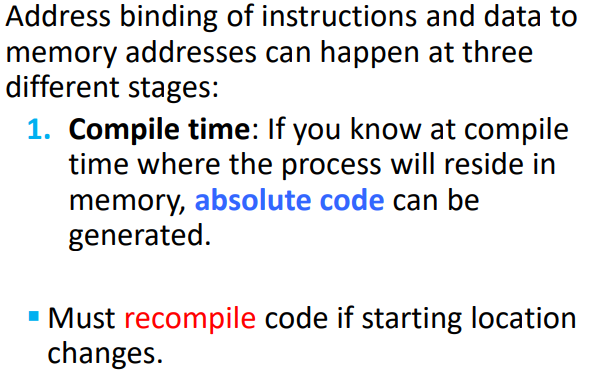

it's very unlikely that you will know at compile time where the process will reside in memory.

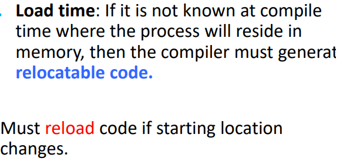

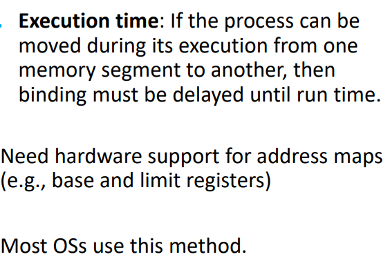

Most OSes do this binding during execution time.

## Logical vs Physical Address Space

Logical Address
- generated by cpu
- aka virtual address

Physical Address
- address seen by the memory unit

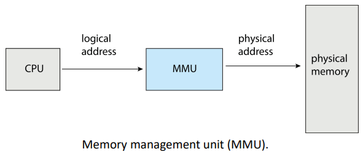

logical address space is bound to the phsyical address space.

The CPU does not directly see/access the physical addresses, only the logical.

Both types of addresses are the same in compile-time and load-time address-binding schemes.

They differ in the execution-time address-binding schemes (so most OSes)

The addresses are all generated by a program by refer to different address spaces (logical or physical)

## Memory Mangement Unit

The memory management unit (MMU) is a hardware device that maps virtual to physical addresses at run time.

many methods to do this mapping

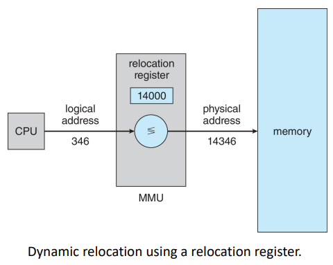

simple scheme:
- generalization of the base-register scheme
- base register is now called relocation register
- value of in the relocation register is added to every address generated by a user process at the time it is sent to memory
- user program deals with logical addresses
  - never sees real physical addresses
- execution-time binding occurs when a reference is made to a location in memory
- memory-mapping hardware converts logical addresses into physical addresses

## Dynamic Loading

sometimes the program is larger than the size of memory

with dynamic loading, a routine is not loaded until it is called
- better memory-space util
  - unused routine never loaded
- all routines kept on disk in relocatable load format

this is very useful when large amounts of code are needed to handle infrequently occuring cases.
`heavy, memory-hungry edge cases`

There is no special support from the OS required
- implement via program design
- OS *can* help by providing libraries to implement dynamic loading

## Dynamic Linking

Dynamically Linked Libraries (DLLs) are system libraries that are linked to user programs when the run (during execution time)

DLLs are also known as shared libraries
- used extensivley in windows and linux systems
- small pieces of code (stub) used to locate the appropriate memory-resident library routine
- stub replaces itself with the address of the routine and executes the routine

Dyn. Linking and DLLs require help from the OS
- if the processes in mem are protected from one another, OS is th eonly one that can check to see that
  - whether the needed reoutines is in another process' memory space
  - can allow multiple processes to access the same memory address
- w/o this each program needs to include its own copy of its language library

Static linking
- used only by older computers
- system libraries and program code combined by the loader into the binary program image

---
Knowledge Check
- absolute code can be generated for \_\_\_
  - a. compile-time binding
  - load-time binding can gen relocatable
- In a dynamically linked library, \_\_\_
  - d. a stub is included in the image for each library-routine reference
- the mapping of a logical address to a physical address is done in hardware by the \_\_\_
  - a. memory-management-unit (MMU)

# Contiguous Memory Allocation

> Contiguous means continuous. No broken pieces. Only one large piece

mem support OS and user processes

contiguous allocation is an earlyo method of memory management

mem usually divided into 2 partitions
- OS partition
  - usually held in high memory with interrupt vector
  - used to be in the lowest vector in older systems
- user processes held in low memory
  - each process contained in single contiguous section of memory.

## Memory Protection in Contiguous Memory Allocation

Relocation Registers
- protect user processes from each other
- prevent user processes from chaing operating-system code and data
- base contains value of smallest physical address
- limit contains range of logical addresses
  - example: relocation = 100040 and limit = 74600
- MMU maps logical address dynamically
- relocation-register scheme allows OS' size to chnage dyanmically

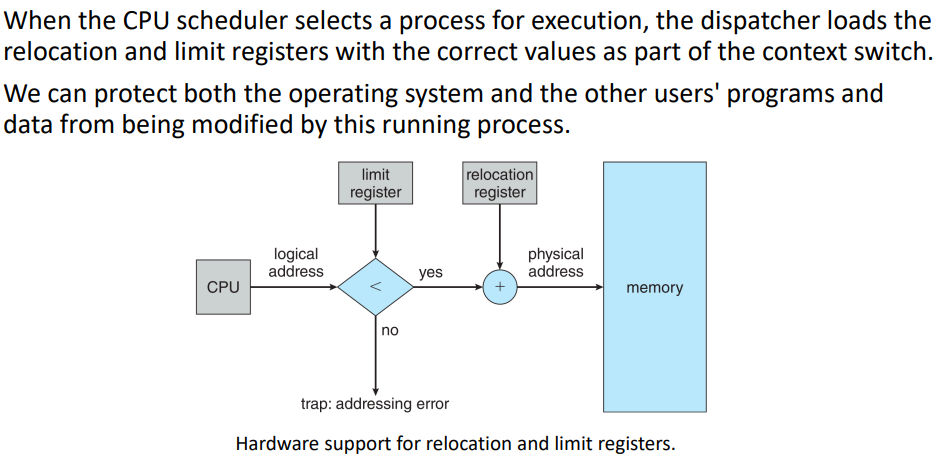

## Memory Allocation

a simple method to allocate memory is to use variably sized partitions
- used for efficiency
- hole
  - block of available memory
  - holes of various size are scattered throughout memory

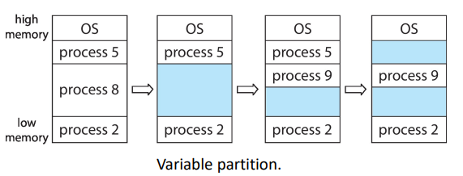

- Process 8 finishes and leaves a hole b/w processes 5 and 2.
- we allocate process 9 and and it fits into the hole
- process 5 finishes and makes another hole

Holes are a problem that we need to deal with later on.

When a process arrives,
it is allocated memory form a hole large enouhg to accomodate it.

A process exiting frees its partition.

Adjacent free partitions are combined.

OS maintains info about
- allocated partitions
- free partitions (holes)

How do we satisfy an allocation request of size `n` from a list of free holes?

fitting approaches:
- first-fit
  - allocate the first hole that is big enough
- best-fit
  - allocate the smallest hole that is big enough
  - must search entire list unless ordered by size
  - produces smallest leftover hole
- worst-fit
  - allocate the largest hole
  - must search entire list unless ordered by size
  - produces the largest leftover hole
    - may be more useful than the smaller leftover hole from a best-fit approach
    - not so much smaller fragments of memory
    - usually not used
```
- next-best-fit
  - not used in the course
  - we find the best-fit then take the next one
  - prof thought it was cool so she brought it up
```

simulations show
- first-fit and best-fit are better thatn worst-fit in terms of
  - decreasing time util
  - decreasing storage util
- neither is clearly better than the other in terms of storage util
- first-fit is generally faster than best-fit

## Fragmentation

External Fragmentation
- outside the process
- total memory space exists to satisfy a request but not contiguous
  - the holes are not within an assigned space of a process

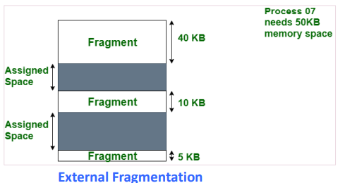

Internal Framgentation
- allocated memory may be slightly larger than requested memory
- size difference is memory interla to a partition but not being used

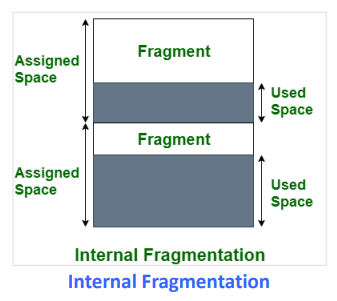

The processes in the above don't use up all of their allocated memory

given $N$ blocks allocated, $N/2$ blocks will be lost to (internal and external) fragmentation.
- 1/3`?` may be unusuable -> 50% rule

Reduce external fragmentation by compaction:
- shuffle memory contents to place all fre memory together in one largeblock
- requires
  - dynamic relocation
  - done at execution time
    - not compile or load time

Fragmentation applies to more than just memory and can occur wherever we manage blocks of data (disk, external storages, etc.)

The simplest compaction is algo is to move all processes toward one end of memory
- all holes move in the other direction to make one large hole
- can be very expensive

We will discuss other strategies in the following 2 sections

---
Knowledge Check:
- \_\_\_ is the dynamic storage-allocation algo which results in the smallest leftover hole in memory.
  - b. best fit
- \_\_\_ is the dynamic storage-allocation algorithm which results in the largest leftover hole in memory
  - c. worst fit
- which of the following is true of compaction
  - c. it is possible only fif relocation is dynamic and done at execution time

# Paging

Permitting the physical address space of processes to be non-contiguous in order to solve the external-fragmentation problem.

This still has internal fragmentation.

set up a `page table` to translate logical to physical addresses
- divide physical memory into fixed-sized blocks called `frames`
  - size is a power of 2
    - between 512 bytes and 16 Mbytes
- divide logical memory into fixed-sized blocks called `pages`
  - size is a power of 2
    - typically either 4 kb or 8kb in size

These aren't equivalent to one another so frames can be different sizes as pages.

We can eventually use paging to load processes that are too big for our memory.

- keep track of all free frames

to run a program of size $N$ pages, need to find $N$ free frames and the program.

Address generated by CPU divided into:
- p - page number
  - index into page table
  - contains base address of each page in physical memory
- d - page offset
  - conbinedw with base address to define the physical memory address that is sent to the memory unit

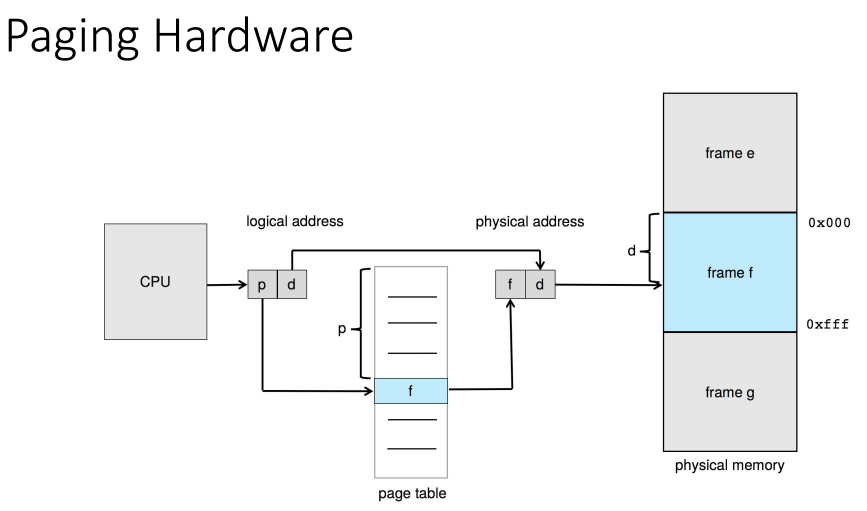

page size:
- defined by hardware
  - like frame size
- size is a power of 2
  - makes translation of logilcal address to page number and page offset easier this way
- if the size of the logical address space is $2^m$ and page size is $2^n$
  - the high-order $m-n$ bits of a logicla address designate the page number
  - $n$ low-order bits designate the page offset

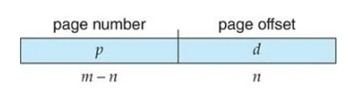

## Paging Hardware

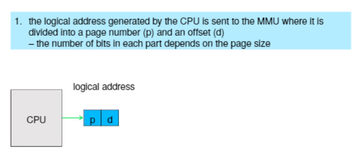

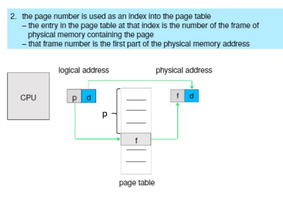

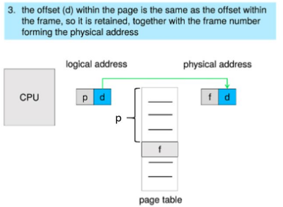

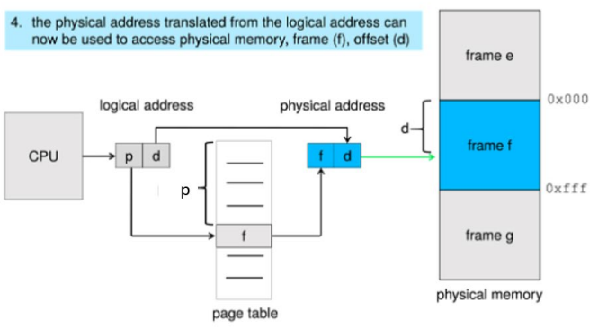

steps the MMU takes to translate a logical address gen'd by cpu to a phys address
- extract page number `p` and use it to index into page table
- get corresponding frame number `f` from page table
- replace `p` in the logcal address with `f` to get physical address

the offset `d` is unchanged and unreplaced, combining with `f` to get the physical address

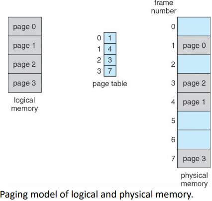

Logically we see the pages as being contiguous but physically they are all over the place and in a different order.

our paging scheme makes it so that there is no external fragmentation since any free frame can be allocated to a process that needs it.

## Example

given
- n = 2
- m = 4

map the following logical addresses to physical addresses:
- 0
- 3
- 4
- 13

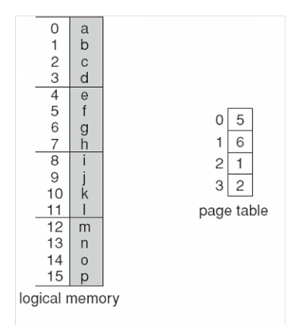

using a page size of $2^n = 4$ bytes
and a physical memory of $2^m=32$
bytes (8 pages)

so the logical addresses translate as follows:
- $0=(5\times 4)+0=20$
- $3=(5\times 4)+3=23$
- $4=(6\times 4)+0=24$
- $13=(2\times 4)+1=9$ 

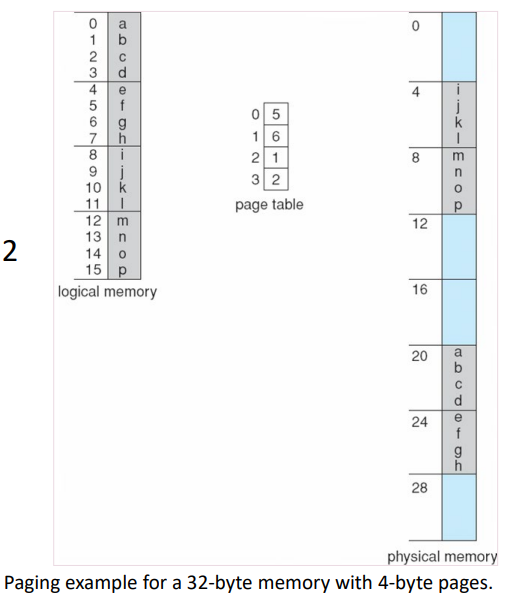

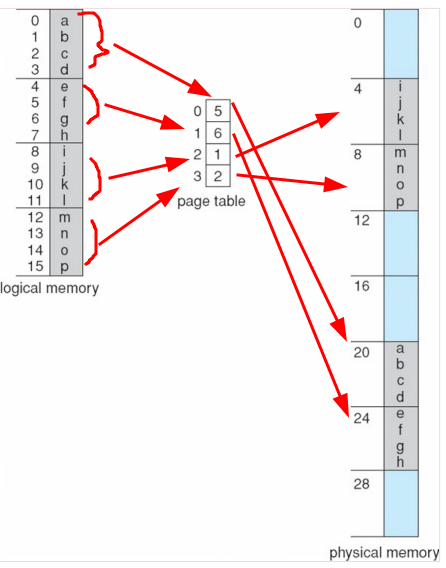

## Calculating Internal Fragmentation

if page size = 2048 bytes, how many pages will a process of size 72,766 bytes need?
- 35 pages + 1,086 bytes

It will be allocated 36 pages with an internal framgentation of 2048 - 1086 = 962 bytes

can you think of a worst case internal fragmentation scenario
- process needs n pages + 1 byte
- will be allocated n+1 frames with an internal fragmentation of almost a frame

on average fragmentation = 1/2 frame size. so are the small frames more desirable?
- not necessarily as each page table entry takes memory to track.

## Free Frames

The frame table has one entry for each physical page frame indicating whether the latter is free or allocated and, if it is allocated, to whihc page of whihc process.

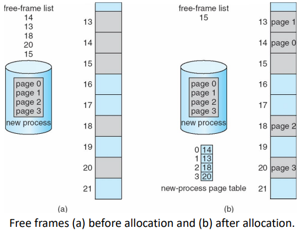

## Implementation of Page Table

OS maintains a copy of the page table for each process just as it maintains a copy of the instruction counter and register contents

page table is kept in main memory
- page-table base register (PTBR) points to the page table
- page-table length register (PLTR) indicates size of the page table

in this scheme ever data/instruction access requires two memory accesses
- one for the page table
- one for the actual data or instruction
- memory access is slowed by a factor of 2

sol'n:
- se a special fast-lookup hardware cached called translation look-aside buffers (TLBs) (aka associative memory)

### TLB

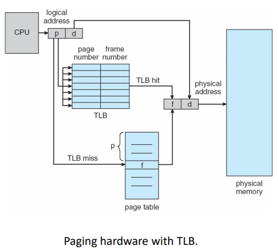

each entry in the TLB has 2 parts:
1. key/tag
2. value

TLB is associative, hihg-speed memory
- when the associative memory is presented with an item
- the item is compared with all keys simultaneously

typically small
- 32-1024 entries

tlb is a hardware feature

`This is a lot like a cache`

on hit:
- mmu checks if page number is present in the tlb
- if the number is found then its frame number is immediately available and is used to access memory

on miss:
- page number is not in the tlb
- have to reference the page table
- page and frame number are loaded into TLB for faster access next time

if TLB is full:
- an existing entry must be selected for replacement
  - replacement policies must be considered
    - range from least recently used (LRU) through round-robin to random
  - some CPUs allow the OS to participate in LRU entry replacment
    - other handle the matter themselves
  - some entries can be wired down for permanent fast access
    - never replaced
    - entries for key kernel code are wired down, typically

#### Effective Access Time

Hit ratio
- % of times that a page number is found in the TLB
- % of the time we find our desired page number

ex:
- suppose it takes 10 nanoseconds to access memory
- if we find the desired page in TLB then a mapped-memory access takes 10 ns
- otherwise we need 2 memory accesses, one to the page table and frame number then one more to access the desired byte in memory, which takes 20 ns
- calculate effective access time

Effective Access Time
- statistical or real measure of how long it takes the CPU to read or write to memory
  - 80% hit ratio
    - EAT = 0.8 * 10 + 0.2 * 20 = 12 ns
    - 20% slowdown in access time implied
    - ((12-20)/10)*100%
  - 99% hit ratio (more realistic)
    - EAT = 0.99 * 10 + 0.01 * 20 = 10.1 ns
    - 1% slowdown in access time implied
    - ((10.1-10)/10)*100%

#### Memory Protection in Page Table

memory protection implemented by associating protection bit with each frame to indicate if read-only or read-write acces is allowed
- can also add more bits to indicate page execute-only, and so on

for now we're doing a valid-invalid bit attached to each entry in the page table
- valid
  - the associated page is in the process' logical address space
  - thus a legal page
- invalid
  - indicates the page is no tin the process' logical address space
- or we can use the page-table length register (PTLR)

any violations result in a trap to the kernel

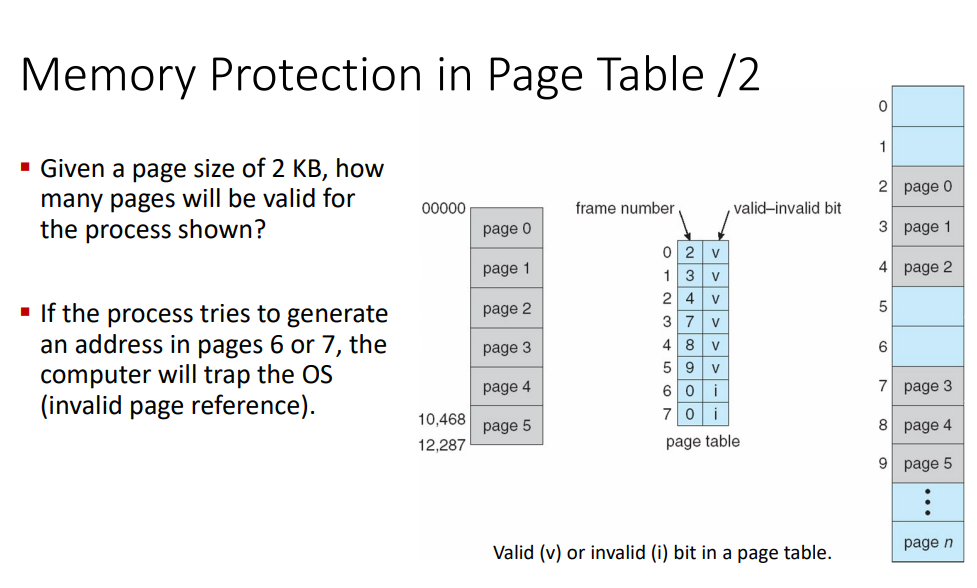

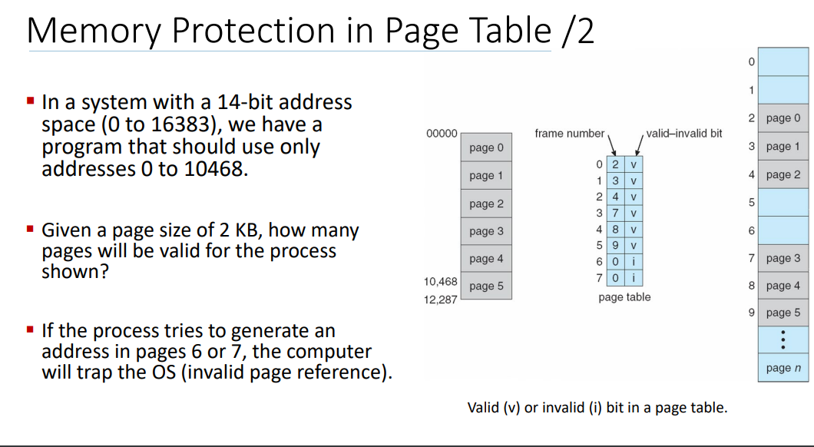

#### Shared Pages

shared code
- one copy of read-only code shared among processes
  - text editors, compilers, window systems
- multiple threads sharing the same process space

private code and data
- each process keeps a separate copy of the code and data
- th epages for the private code and data can appear anywhere in the logical address space

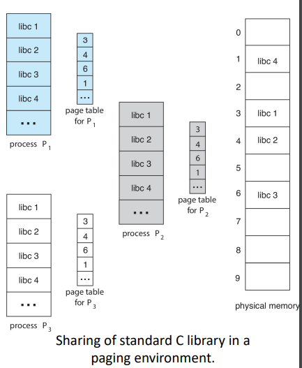

---
Knowledge Check
- consider a logical address with a page size of 8 kb. How many bits must be used to represent the page offset in the logical address?
  - the page offset in a logical address is determined by the size of the page
  - to represent the page offset iwthin this 8 kb page we need enough bits to address each byte within the page
    - (8*1024=8192)
  - nnumber of bits required $=log_2(\text{Page Size})=log_2(8192)=13$


`prof recommends doing the knowledge checks at home.`

# Sawpping

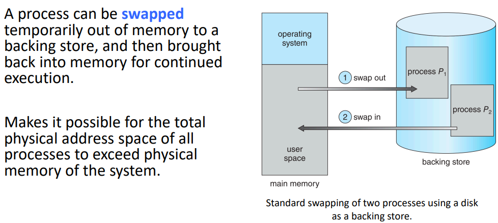

the backing store can be a harddrive or ssd or whatever

standard swapping
- moving entire processes between main memory and a backing store

backing store
- fast disk large enough to accomodate copies of all memory images for all users
- must provide direct access to these memory images

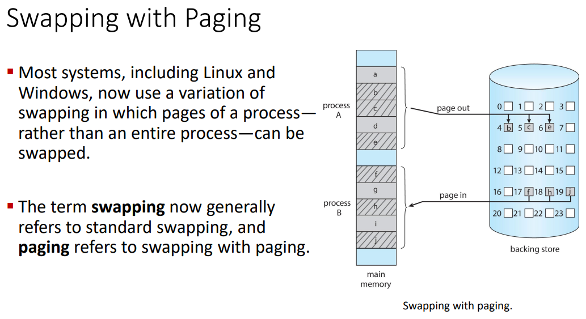

page out
- move page from memory to the backing store

page in
- move page from backing store to memory