What's up with OS books with dinos:
- evolution
- old
- the war between operating systems
  - similar to how dinos fought in the old days

toc:
- [What Operating Systems Do](#what-operating-systems-do)
- [Computer-System Organization](#computer-system-organization)
  - [Competing for Resources](#competing-for-resources)
- [Computer-System Operation](#computer-system-operation)
  - [Instruction Execution](#instruction-execution)
  - [Interrupts](#interrupts)
    - [Instruction Cycle with Interrupts](#instruction-cycle-with-interrupts)
    - [Program Status Word](#program-status-word)
    - [Flow Control With and Without Interrupts](#flow-control-with-and-without-interrupts)
    - [Multiple Interrupts](#multiple-interrupts)
  - [Storage Structure](#storage-structure)
    - [Von Neumann Architecture](#von-neumann-architecture)
    - [Main Memory](#main-memory)
      - [ROM, EPROM, and EEPROM](#rom-eprom-and-eeprom)
        - [ROM](#rom)
        - [EPROM](#eprom)
        - [EEPROM](#eeprom)
    - [Secondary Storage](#secondary-storage)
    - [Tertiary Storage](#tertiary-storage)
    - [Storage Hierarchy](#storage-hierarchy)
    - [Caching](#caching)
  - [I/O Structure](#io-structure)
    - [Direct Memory Access Structure](#direct-memory-access-structure)
- [Operating System Structures](#operating-system-structures)
  - [Computer System Architecture](#computer-system-architecture)
  - [Operating System Operations](#operating-system-operations)
    - [Multiprogramming and Multitasking](#multiprogramming-and-multitasking)
    - [Dual Mode](#dual-mode)
      - [Transition from User to Kernel Mode](#transition-from-user-to-kernel-mode)
    - [Resource Management](#resource-management)
      - [Process Management](#process-management)
      - [Memory Management](#memory-management)
      - [File-System Management](#file-system-management)
      - [Mass-Storage Management](#mass-storage-management)
      - [Caching Management](#caching-management)
        - [Cache Coherence](#cache-coherence)
      - [I/O Subsystem Management](#io-subsystem-management)
  - [Operating System Services](#operating-system-services)
    - [For the User](#for-the-user)
    - [For the System](#for-the-system)
  - [User Operating System Interfaces](#user-operating-system-interfaces)
  - [System call](#system-call)

# What Operating Systems Do

Components to a computer structure:
- user
- application programs
- operating system
- computer hardware

OS sits in between the user and the hardware,
handling how the application programs interact with the hardware.

OS Goals:
- execute user programs
- convenient and easy to use
  - not hard to use
- efficiently use hardware

user pov:
- want
  - easy to use
  - good performance
  - secure
- don't care about efficiency

Smartphones and tablets are good from the user pov since they are optimized for usability and batter life.

The touch screens and voice interactions allow for better usability.

Even though in reality the phone could be pretty wasteful when it comes to the resources.

---

Profesor's Soapbox:
- we should be more concerned with the lack of privacy that comes with the convenience
- she doesn't like the argument that if you don't have anything to hide then you shouldn't care
- "privacy is our right"
- she wants us to take into account privacy and security regarding user data

---

Embedded Computers:
- little/no user interface
- ex
  - home devices
    - motion sensor lights
    - computerized water systems
    - computerized heating system
  - car computers
  - numeric keypads
  - presto scanner
- run primarily without user intervention

System pov:
- OS must keep all users happy in the case of shared computers
- OS is the resource allocator and control program
  - efficiently manage the execution of user programs
- I/O devices are important in this respect
  - hard to manage and work with efficiently

Operating System definition
- no universally accepted definition
  - "we define the operating system as we go"
- is a resource allocator
  - manage all resources
  - decides between conflicting requests for efficient and fair resource use
- is a control program
- controls execution of programs to prevents erors and imporoper use of the computer
- everything a vendor ships when you order an operating system is a good approximation but varies wildly
- the one program running at all times on the computer is the kernel which is part of the operating system
- everything else is either
  - a system program that ships with the operating system
  - or
  - an application program

Mobile operating systems often include not only a core kernel but also middleware
- a set of software frameworks that provide additional services to application developers

kernel is the core of the system

not all computer systems have some sort of user interaction

# Computer-System Organization

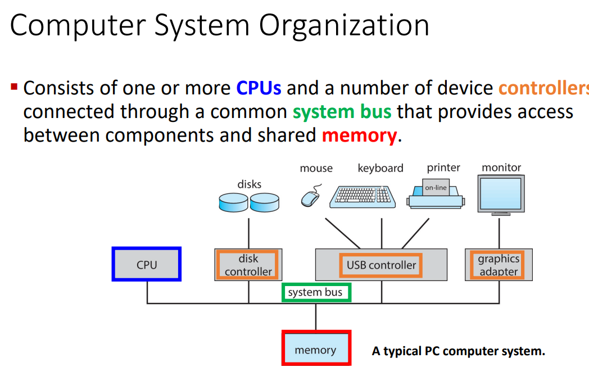

cpu talks to the memory in order to get instructions

memory is typically volatile so it loses all information once it shuts down

system bus:
- provides communication among processors, main memory, and I/O modules

Device controllers are things like the disk controller and usb controller.

There's local memory on the controller that acts as a buffer storage.

the controller moves data between the peripheral devices and the buffer storage.

There are software versions of these drivers too.

## Competing for Resources

CPU and controllers can execute in parallel, competing for memory cycles.

They both need to go through the memory
- cpu fetches instructions from memory
- I/O device sends information through memory
- modern computers use DMA (direct memory address) that we speak on later

# Computer-System Operation

How does the processor execute an instruction?

There are registers inside of the cpu itself
- this is based off of the architecture (design) of the processor itself
- very fast storage to read and write to
- used to save, store, and use instructions
- very expensive, fast, and limited

Memory Address Register (MAR) specifies the address in memory for the next read or write

Memory Buffer Register (MBR)contains teh data to be written/read into/from memory

I/O Address Register (I/O AR) specifies a particular I/O device we're working with

I/O Buffer Register (I/O BR) used for the exchange of data between an I/O module and the processor.

CPU is waiting for the inupt

Instructions always have to come from memory.
It can only be loaded from the memory.

I/O doesn't input instructions,
it inputs/outputs data.

CPU can pull directly from IO device

Memory and I/O:
- memory is a set of locatiosn defined in sequentially numbered addresses
- each location contains a bit pattern that can be interpreted as either an instruction or data
- an I/O module transfers dtat from external devices to processor and emmory, and vice versa

## Instruction Execution

A program to be executed by a processor consists of a set of instructions stored in
memory.

The processor reads (fetches) instructions from memory one at a time and
executes each instruction.

The processing required for a single instruction is called an instruction cycle.

Fetch and Execute is an atomic operation:
- If you fetch an operation then you can't do anything else until you execute that operation
- they come together

Program halts if:
- processor turns off
- unrecoverable error occurs
- program instruction that halts the processor is encountered
  - tell the processor to wait for an input or output

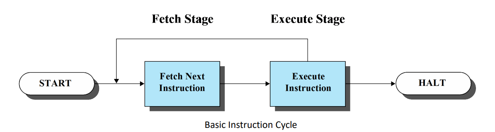

Instruction Fetch and Execute from CPU pov:
- processor fetches an instruction from memory
- program counter (PC) holds the address of the next instruction to be fetched
- PC is incremented after each fetch
  - on to the next instruction
  - unless the instruction loaded tells us to change the PC differently
- fetched instruction is loaded into the instruction register (IR)
- the processor interprets the instruction and performs the required action:
  - processor-memory: data transfer
  - Processor-I/O: data transfer
  - Data processing: arithmetic or logic operations
  - Control: an instruction may specify that the sequence of execution be altered.

---

Hypoethical 16 bit machine


opcode - operation code that tells the processor what to do

address - data needed

S - sign of the data (0 = +ve, 1 = -ve)

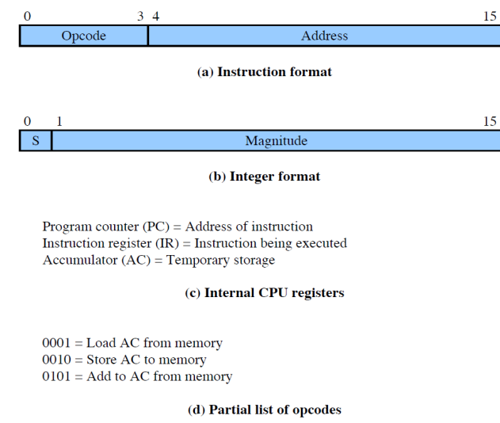


These are all displayed in hex

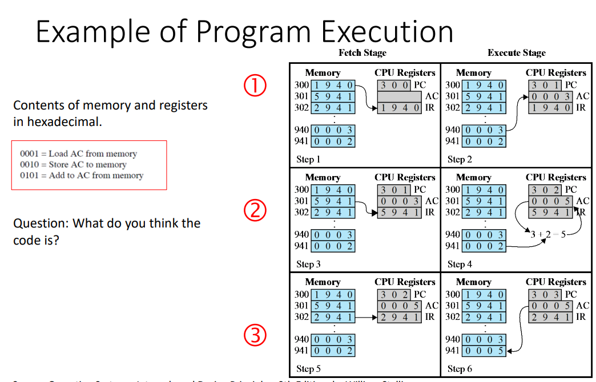

1:
- fetch instruction from `300`
- `1940` is loaded to `IR`
  - `1` = `001` = load AC from memory
  - `940` is where we're grabbing from
- increment `PC`
- load `0003` from `940` into `AC`


## Interrupts

An interrupt is a signal for the cpu to pay attention to the device.

You can process user inputs very quickly so that it doesn't feel laggy.

Most IO devices are much slower than the cpu so it's less efficient for the cpu to just wait on the IO device so it's better for the IO device to just cut in whenever it needs to.

Most operating systems are interrupt driven, I/O devices will cut in whenever they need to so that the cpu doesn't have to pause and wait on them.

---
lect 1 end

---

There are different kinds of interrupts:
- hardware and software
  - whenever hardware or software wants to seek the attention of the processor
  - hardware sends *signal* through a peripheral device to interrupt the processor
  - software executes a specific instruction to interrupt the processor
- vectored and non-vectored
  - interupt transfers control to a specific address which contains the interrupt vector
    - the interrupt vector has the address of the ISR
    - it's like a low level database that tells you what to do for a given interrupt
  - interrupt vector table contains addresses that inform the interrupt handler as to where to find the interrupt service routines (ISR)
  - vectored: manufacturer of the processor predefines this vector address
    - it's hardcoded/built-in
  - non-vectored: vector address is not predefined
    - address of the required ISR for the interrupt is provided by the interrupting device
- maskable and non-maskable
  - non-maskable: cannot be ignored
    - reserved for events such as
      - unrecoverable memory errors
      - hardware failure
      - system crash
      - force shutdown or cutting power
        - non-maskable, hardware interrupt
        - needs to have the option to shutdown gracefully and minimize damage to hardware
      - overheating
        - heat sensors tell the processor to stop so that the heat can dissipate
    - don't ignore
    - attend to immediately
  - maskable: can be ignored
    - turned off by CPU before the execution of critical instruction sequences that cannot be interrupted
    - non-essential for core system function
    - used by device controllers to request service
      - keyboard
      - printer
    - usually only ignored for a while
    - could potentially be ignored forever
      - almost never happens

These different types are can overlap.

We might have a vectored, non-maskable, software interrupt or a non-vectored, maskable, hardware interrupt.

When the cpu is interrupted,
it stops what it's doing and transfers execution to a fixed location.

Fixed location usually has a starting address where the service routine for the interrupt is located.

The interrupt service routine executes.

After the routine completes, the cpu goes back to what it was doing before.

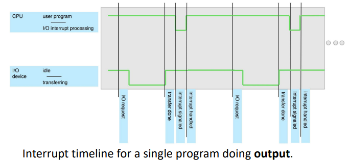

For the user program,
an interrupt suspends the noraml sequence of execution.

When the interrupt processing is completed,
execution resumes.

In the above image we see the I/O device making the request, sending it to the processor, then the processor processing the interrupt shortlythereafter then signalling that it's done when it's done.

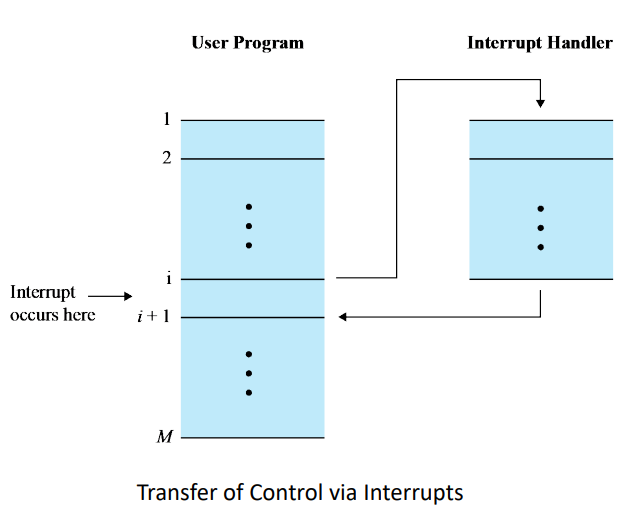

### Instruction Cycle with Interrupts

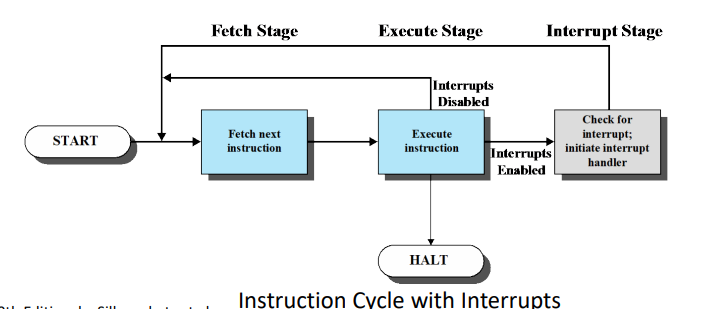

Interrupt stage is added to the instruction cycle.

At the execute stage,
the processor checks to see if any interrupts have occured.

If none,
proceed to fetch stage as usual.

Otherwise,
the processor executes an interrupt handler routine instead of going to the fetch stage continue the program execution.
After that it continues.

An interrupt handler routine is generally part of the OS.

The routine:
- determines the nature of the interrupt
- performs whatever actions are needed
  - e.g. find out what I/O module generated the interrupt and brach to a program that will write more data out to that I/O module
- allows the processor to continue executing the uesr program after it finishes

### Program Status Word

An interrupt can trigger lots of events in the processor hardware and software.

Program Status Word (PSW) contains status information about the currently running process:
- memory usage
- codes
- status information
  - interrupt enable/disable bit
  - kernel/user-mode bit

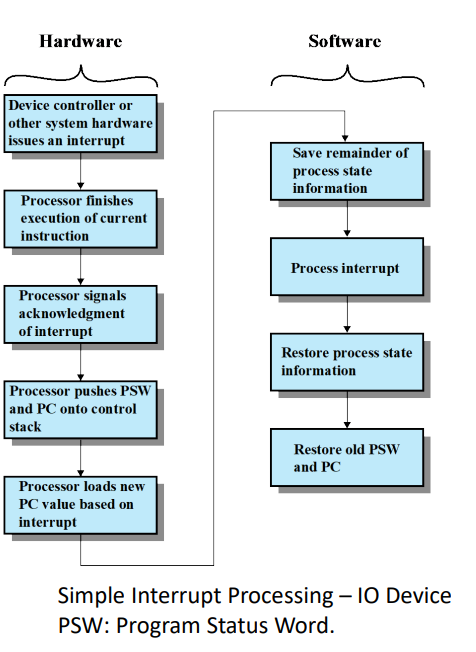

We cover this in more detail later on.

### Flow Control With and Without Interrupts

Let's take an example of flow control without interrupts.

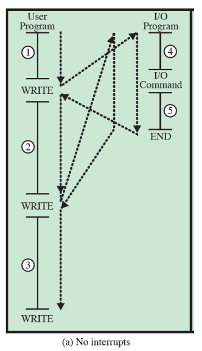

the black dotted arrow shows how the execution flows

`1`, `2`, `3` refer are segments of code that don't involve I/O

The write calls involve I/O and call an I/O routine/program pictured on the right:
- `4` prepares for the actual I/O operation
- then there's the I/O command
- `5` complete the I/O operation
- then it ends and we return

The write calls call to an I/O routine

Suppose now there are interrupts with short waits.

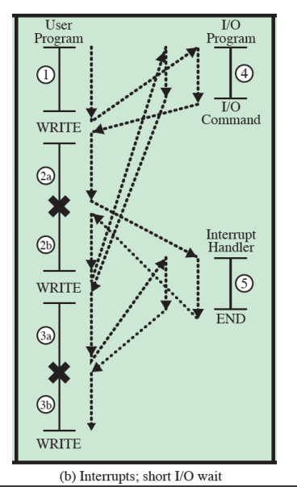

Now we see an interrupt in the segments `2` and `3` dividing them into `2a`&`2b` and `3a`&`3b` respectively.

At the dividing points we have the execution move to the interrupt handler before going back to the user program.

Suppose now there are still interrupts but now with long waits

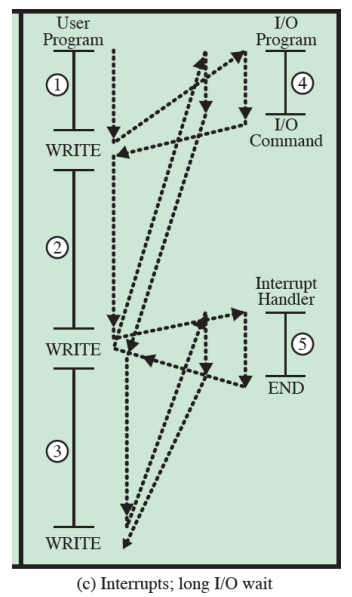

The interrupts no longer occur during the segments that don't involve calling to another routine.

Instead they happen when the user program calls to another routine,
the write calls.

So above we went over different techniques for handling I/O operations
- `(a)`: programmed I/O
- `(b)` and `(c)`: interrupt-driven I/O

There is another third technique that we can go over later today called direct memory access (DMA)

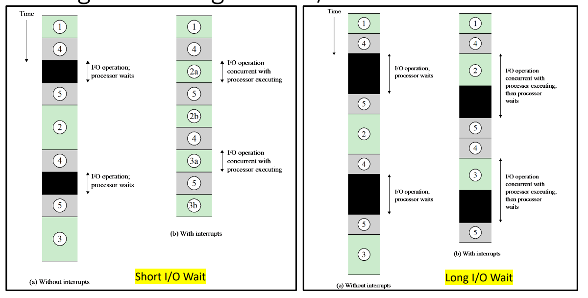

Using interrupts it takes less time and is more efficient as the processor doesn't need to idle.

We have to be aware of the overhead as we get faster however.

A cpu core can execute 1 instruction at a time. Multi-core CPUs can execute multiple cores at a time.
Multi-threading adds to this.

In order to utilize this we need to program in a way to take advantage of parallel execution.

### Multiple Interrupts

Suppose there is an interrupt during the processing of another interrupt, we can either:
- disable interrupts while an interrupt is being processed
  - hard to work with if there's un-maskable interrupts
- use a priority scheme

With disabled interrupts we might have an interrupt while we're handling another interrupt.

We finish handling the first interrupt before attending to the other interrupt.

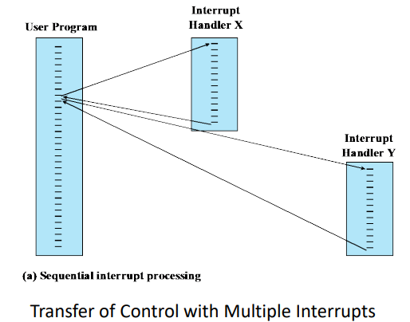

This does not take into account relative priority or time-critical needs.

With prioritized interrupts we can interrupt the interrupt handler in order to handle a more important interrupt.

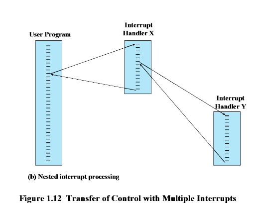

Interrupt Y has a higher priority than interrupt X which results in the execution we see above.

---
Example

3 I/O devices in order of least to greatest priority:
- printer - priority 2
- disk - priority 4
- comms - priority 5

timeline `t=x`:
- 00: begin
- 10: printer interrupt
- 15: comms interrupt
- 20: disk interrupt

each interrupt lasts 10 time units

how will these interrupts be executed?

my answer:
- 10: begin printer interrupt
  - 15: begin comms interrupt
  - 25: end comms interupt
  - 25: begin disk interrupt
  - 35: end disk interrupt
- 40: end printer interrupt

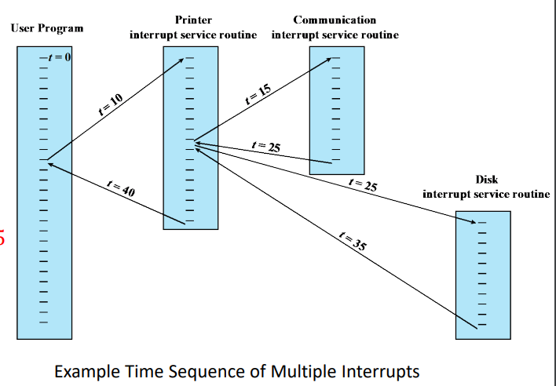

---

## Storage Structure

### Von Neumann Architecture

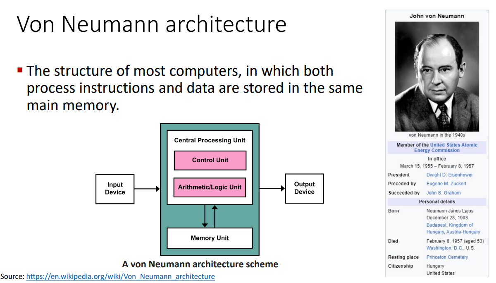

### Main Memory
CPU can only load instructions from memory so programs must be loaded into memory in order to run.

Computers run most of their programs from rewritable memory, called main memory (aka random access memory(aka RAM))

Main memory is volatile (loses everything when powered off) and is commonly implemented in a semiconductor technology called dynamic random-access memory (DRAM).

#### ROM, EPROM, and EEPROM

bootstrap program is loaded at power-up
or reboot:
- the computer is checking itself
  - this is also known as post
- Initializes all aspects of the system
  - all your bios shit
- Loads operating system kernel and
starts execution
- We can’t store it to the RAM, instead
it is typically stored in ROM or
EPROM, and is generally known as
firmware
  - the rom, eprom, or eeprom are non-volatile so we put the bootstrap there

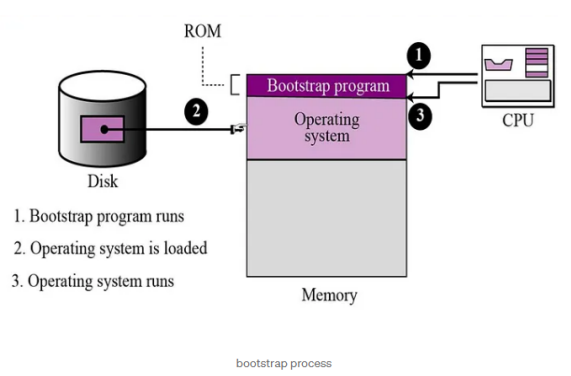

##### ROM

read only memory.

non-volatile

data is written there permanently during the manufacturing.

Used for storing firmware and software that does not need to be changed ferquently

ex:
- BIOS
- embedded system firmware

##### EPROM

EPROM (Erasable Programmable Read-Only
Memory): only reprogrammable after being erased by exposing it to
ultraviolet (UV) light.

Commonly used in early embedded systems and
microcontrollers.

##### EEPROM

EEPROM (Electrically Erasable Programmable
Read-Only Memory): A type of memory that can
be reprogrammed electrically, without the need
for UV light.

Can be reprogrammed in place without the need
for removal from the circuit.

Used in applications where data needs to be
updated or modified periodically, such as in
configuration settings.

### Secondary Storage

we want programs and data to reside in main memory permanently but main memory is too small (to get a reasonably large size to store data permanently) and it's volatile.

We use non-volatile secondary storage as an extension of the main memory.

Hard-disk drives (HDDs) and nonvolatile memory (NVM) hold onto things before we load them into memory.

HDD
- metal or glass platters covered with magnetic recording material
- head that moves and disk that rotates to read off of the disk
- physical head moves

Solid-state disks (SSD)
- faster than HDD
- is not limited by the disk head movement

It's more accurate to think of it as storage in addition to being an extension of the main memory as opposed to just being an extension of the main memory.

Non-volatile memory (NVM)
- harder than hard disks
- becoming more popular

prof uses external ssd but doesn't know about nvme ssd and sata ssd??

### Tertiary Storage

Slow and large.

Used for special purposes,
typically as a backup of material stored on other devices.

CD-ROM or blu-ray

magnetic tapes.

We still use magnetic tapes even though prof doesn't think we do since last she used them was in '97.
What a fucking world we live in.
Still using magnetic tape.

### Storage Hierarchy

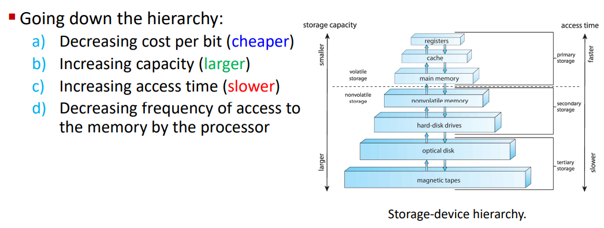

going down the hierarchy we get cheaper, larger, and slower memory that is accessed less and less frequently by the processor.

### Caching

Used at many levels in a computer from the most basest of hardware to the most frivolous of software.

If we want to use information from a slower piece of storage then we will copy that information to a faster piece of storage.

In the above instance we would describe the faster piece of memory as our cache.

We copy things from the secondary storage (the drives) to the main memory (ram) in order to have programs execute faster.
The main memory is the cache.

When we want to grab information we check the cache to see if it's there
- if it is, we use it directly from there
- if not, we copy the data to the cache from the other storage and then use it there

Hit Ratio:
- fraction of all memory accesses that are found in the faster memory
- ex
  - processor has access to two levels of memory
  - lvl 1 - 1,000 bytes and access time of T1=0.1 μs
  - lvl 2 - 100,000 bytes and access time of T2=1 μs
  - Suppose 95% of the memory accesses are found in the cache
  - For H=0.95, the average time to access a byte = (0.95) (0.1 μs) + (0.05) (0.1 μs + 1 μs) = 0.095 + 0.055 = 0.15 μs
  - We want to keep the hit ratio high and the access time(s) low

## I/O Structure

A large portion of operating sytem code is dedicated to managing I/O:
- important to keeping system reliable
- the varying nature of devices makes this a complex task that requires a lot of code
  - cameras, mice, keyboards, printers, fax machines, scanners, and all manner of devices are all classified under I/O device but will all have different needs

When the prcoessor encounters an instruction relating to I/O,
it executes that instruction by issuing a command to the appropriate I/O module.

Possible techniques for I/O operations (2 of which covered previously [here](#flow-control-with-and-without-interrupts)):
1. programmed I/O
2. interrupt-driven I/O
3. Direct Memory Access (DMA)

We previously mentioned that programmed I/O is very inefficient as it would require the processor to wait on the I/O devices as no device can keep up with the processor.

Interrupt-driven is fine for moving small amounts of dat but can produce high overhead when used for bulk data movement.
Burst memory movement is pretty good for all of this
Remember that all operating systems nowadays are interrupt-driven.

But we run into the problem of I/O requests running into other I/O requests.

We need more efficiency which is where DMA comes in.

### Direct Memory Access Structure

DMA is used for high speed I/O devices capable of transmitting info at close to memory speeds.

Blocks of data is transfered from the buffer storage to the main memory by the device controller w/o the cpu intervening.

Only one interrupt is generated per block, rather than one interrupt per byte as is the case in interrupt-driven I/O.

A von Neumann architecture:
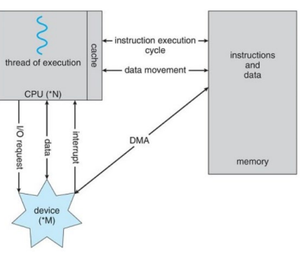

DMA is performed by a separate module on the system bus or incorporated into an I/O module.

When the prcessor wishes to read or write data it issues a command to the DMA module containing:
- whether a read or write is requested
- address of the involved I/O device
- starting memory location for the read/write
- number of words to read/write

The processor returns to it's own work while the I/O operation is contrinued on by the DMA module.

DMA transfers the block one word at a time, directly to/from memory w/o processor.

Once complete,
DMA sencds interrupt signal to the processor.

Processor is only involved at the beginning and end of the transfer makig it far more efficient than interrupt driven or programmed I/O.

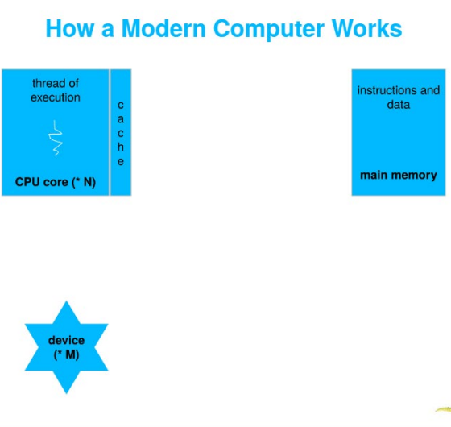
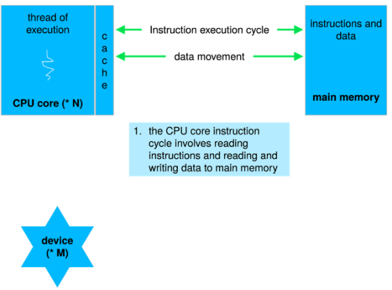
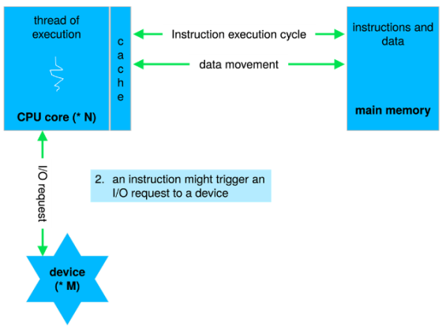
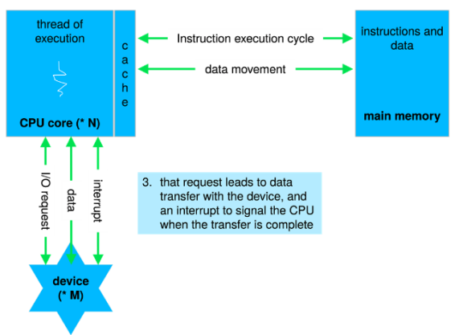

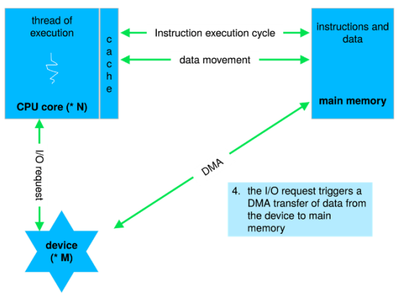
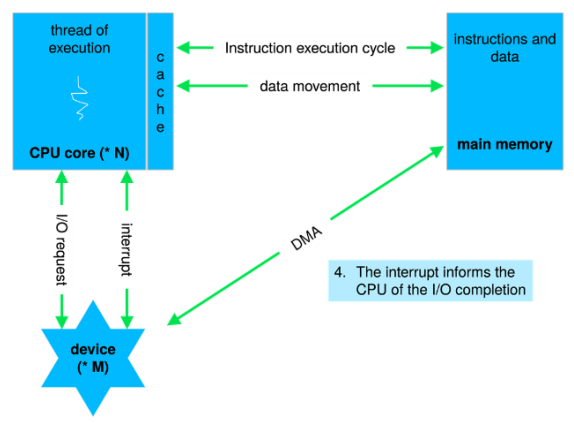

# Operating System Structures

We look at generic operating system design in this course.

Different designers have different paradigms and ideas.

POSIX is used for linux and macOS

Android uses different things.

The fundamentals are all the same but we may have different names for things and different styles of schedules.

For specific issues we may look at examples of how different operating systems do things

## Computer System Architecture

we can categorize a computer system according to teh # of general-purpose processors used:
- in contrast to application specific processors
  - found less often or even not at all
- single-processor systems
- multiprocessor systems
- clustered systems
  - different machines that work together


general purpose processor:
- type of microprocessor designed to handle a wide range of takss and applications
- the typical processor

single processor system:
- old days
- most systems used to use only one cpu
- a core is a basic computation unit of the cpu
  - a unit that can execute instructions

```
prof's dad used to work at msx

that was her first computer

it was popular in the middle east and asia

there was a huge pyramid scheme surrounding msx

she remembered playing hangman on it with her brother

hunt and peck typing to code up hangman.

they had to reprogram hangman everytime they wanted to play since they didn't know how to save shit or I think they couldn't idk.

she saw the rise of the era of the 1.44 mb 3.5 inch floppies

if we had a lab this would've been so cool to listen to but rn idk
```

Most systems have special-purpose processors as well.

We might have graphics processors and all that

multiprocessor:
- these now dominate the landscape of computing
- aka parallel systems, tighly-coupled systems
- advantages:
  - increaseed throughput
  - increased reliability - fault tolerance
- 2 types of systems
  - symmetric multiprocessing
    - each processor performs all tasks
    - processors share memory
  - asymetric multriprocessing
    - each processor perofrms a specific assigned task

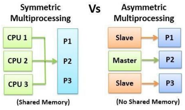

Symmetric:
- most common and what we're workginw tih
- each processor has a cpu w/ their own registers
- they also have their own private/local cache
- All processors share physical memory over the system bus
- `N` processes can run if there are `N` CPUs

multicore systems can be more efficient that multiple chips with single cores because on-chip communication is faster tahn between-chip communications

each core effectively acts as a separate cpu in terms of execution (there are some caveats) and can more quickly communicate with one another.

One chip w multiple core uses significantly less power than multiple single-core chips.

There's always a lot of overhead that comes in the form of inter-process and inter-program communication as well as resource allocation.
These problems feed back into one another as they need to communicate about the resource allocation.
It's a big fucking mess

Dual-Core design

each core has it's own reigster set and it's own local chache often referred to as L1 cache

The level 2 or L2 cache is local to the chip and is shared by the two processing cores.

multicore processor with `N` cores appears to teh operating systems as N standard CPUs

Clustered Systems:
- 2 or more individual systems (known as nodes) joined together
- each node is typically a multicore system
- no shared memory
- loosely coupled systems
- usually there is shared storage via a Storage-Area Network (SAN)
  - usually for very large networks
  - prof used to use a lot of SANs back in her old job
- communication at a hardware and software level
  - there is clustering software that shows the status of every node and all that
  - at the hardware level there is a sort of mini-operating system
  - maybe not too important but cool
- all cloud servers are clustered so that any server going down is invisible to the user
  - if you ping a server that goes down then you might not even notice as the ping just gets redirected
- all linked together to communicate via a Local-Area Network (LAN)
- provides high availability and fault tolerance service which survives failures and provides increased reliability which is crucial in many applications
  - financial applications

Asymetric clustering:
- one machine in hot-standby mode while the other is running the applications
  - if server fails then standby becomes the active

symmetric clustering:
- multiple nodes running the applications and monitoring each other
- more efficient
- all active at the same time

Some clusteres are for high-performance computing (HPC)
- applications must be spciallly writeten for use parallelization

```
Prof told us about PS/2, hdmi, dvi, and other ports and allat

Going over the anatomy of the motherboard.

The old university monitors still use vga and all of that.

Prof tells us how to intsall cpu and ram.
```


## Operating System Operations

### Multiprogramming and Multitasking

Allows the operating system to run multiple programs

Multiprogramming (batch system) needed for efficiency:
- single user cannot keep CPU and I/O devices busy at all times
- multiprogramming orgnanizes jobs (code and data) so CPU always has one to execute
- a subset of total jobs in asystem is kept in memory
- one job selected and run via job scheduling
- when it has to wait (for I/O for ex), OS switches to another job

multitasking is a logical extension in which CPU executes multiple processes by switching among them very quickly.

Interactive computing.

multitasking
- each user has at least one program executing in memory, a process
- if several jobs are ready to run at teh same time then we scheudle jobs for the cp
- if processes don't fit in memory then we swap them in and out of memory in order to run

multiprogramming only can only execute one program at a time meanwhile all other processors are waiting for the processor.

With multiprocessing, more than one process can be running simultaneously, each on a different processor.

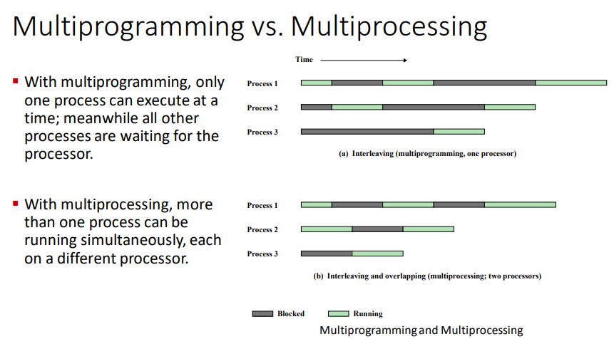

Both of these let us run programs "at the same time".

### Dual Mode

Dual-mode operation:
- OS able to protect itself and other system components
- 2 modes
  - user mode
  - kernel mode
- mode bit is provided by hardware
  - distinguish between system running user or kernel code
  - some instructions are only executable in kernel mode
    - privileged instructions
  - system call changes mode to kernel mode and return from call resets it ot user mode

CPUs increasignly support multi-mode operations
- Virtual Machine Manager (VMM) mode for guest VMs

I'm thinking most of the operating system shit lives in kernel mode.

#### Transition from User to Kernel Mode

Operating system must always be in control of the CPU.

The user program can't get stuck in an infinite loop or fail to call system services.

We use a timer to stop that from happening.
When the timer runs out it interrupts the computer.
The time length can either be fixed or variable.
No matter what we are able to regain control or terminate the program that goes over time.

There are different timers.

For example on linux systems we can observe different types of timers based on how the kernel is configured, what kind of machine it's on, and what the architecture of the components are like.
We can configure a certain number of interrupts per second for example and it's a HZ value.

Crucial takeaways:
- a timer can be used to prevent a user program from never returning control to the operating system
- kernel mode has many different names
  - supervisor mode
  - system mode
  - privileged mode

### Resource Management

Remember that the operanting system is a resource manager.

File space, i/o, processes, memory, chache, etc. all managed by the OS

#### Process Management

Process management:
- a process is a program in execution
  - program is passive entity
  - process is active entity
  - unit of work within the system
  - once we run a program we have a runtime environment
    - allocated area in the memory where we will load in the code and text and stack and other values/variables that we need for the process
- process needs resources to accomplish its task
  - CPU cycles
  - memory space
  - I/O
  - files
  - initialization data
- upon termination, resuable resources are reclaimed

Threads and Processes:
- threads can be single-threaded or multithreaded
- single-threaded
  - one program counter specifying the location of the next instruction to execute
  - process executes instructions sequentially
- multi-threaded
  - one program counter per thread
  - requires a multicore processor, each core works on a different thread
  - most processes aren't multithreaded

Issues to Consider with Process Management
- synchronization
  - coordinate processes that need to share data
- mutual exclusion
  - how to make processes or users share a resource at the sam etime
- deadlocks
  - \>=2 processes can't continue b/c they are waiting for the others to do something
- livelock
  - \>=2 processes continuously change their states in response to changes in other other process(es) without doing anything useful
  - "you go first" "no you go first" "no you go first" "no you go first" "no you go first" "no you go first" and then we do nothing forever
- starvation
  - process is overlooked indefinitely by the scheduler
  - it can proceed but is never chosen

We're going to be looking at the pseudocode and underlying theory for programs that do this stuff correctly.

After that we can look at some real, runnable code to see what's really going on.

There's a lot of groundwork that needs to be done until we can even understand what the demos we're going to get are doing when we run them.

Activities connected to process management:
- creating/deleting user and system processes
- suspending/resuming processes
- providing mechanisms for
  - process
    - synchronization
    - communication
  - handling deadlocks

#### Memory Management

All or part of the instructions and data needed for a program in the memory in order to execute the process.

Memory management optimizes cpu utilization and response to users.

What's in the memory and when.

Memory Management Activities:
- keep track of what memory is being used by who
- decide which processes (and their parts) and data to move in/out of memory

#### File-System Management

most visible component

uniform, logical view of information storage

Abstracts from the physical properties of its storage devices (stores 1s and 0s and engravings and shit) to define a logical storage unit - file (`.c`, `.java`, `.py`, `.txt`, `.exe` files)

Each storage medium is controlled by a device with various processes
- access speed
- capacity
- data-transfer rate
- access method
  - sequential or random

Activities:
- organize files into dirs
- manage access perms
- os activities
  - creating/deleting files/dirs
  - primitives to manip files and dirs
  - mapping files onto secondary storage
  - backup files onto stable(non-volatile) storage media

#### Mass-Storage Management

storing things like code and data when not in memory

Long term storage.

Very important to manage properly

Speed of computer operation hinges on dis subsystem and its algos.
How do we read and write in an efficient way

SSDs have semiconductor tech that's really good but still very expensive so we still have to take other forms of storage into account.

Some storage doesn't even have to be fast, just very long lived, large, and cheap.

Optical drives and magnetic tapes fall under the above category but they still need to be managed by OS or applications.

```
Q: When I move a file to another computer, how does the other computer know what kind of file it is?

A: Every operating system has their own system to manage files. But there are many universally used ways of interpreting the files. The physical files themselves are the same so we just have to worry about the interpretation. Some files are platform specific (`.msi` = microsoft installer, `.deb` = debian package file) and they can't be interpreted properly by machines with the wrong operating system
```

OS Activities:
- (un)mounting
  - (dis)connect to storage medium
- free-space management
  - if you want to write, where do you go to write?
  - do we even have enough space to write?
- storage allocation
- disk scheduling
- partitioning
- protection

#### Caching Management

Recall that cache is a faster piece of storage that we place frequently accessed data that we would ordinarily store in slower storage.

Caches have limited size so we need to manage what we store in their and when.

The size and replacement policy can greatly impact performance.

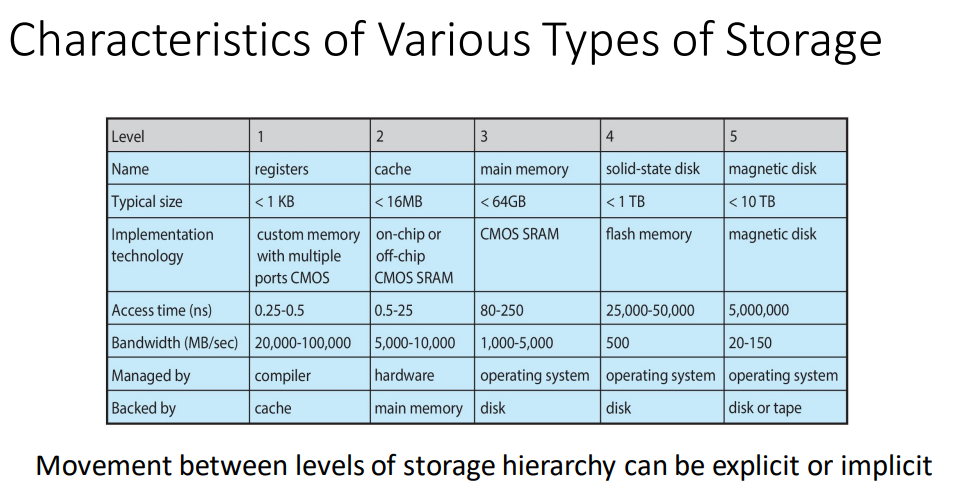

CPUs have cache that the OS doesn't really mess with but there's other forms of cache that the OS is concerned with

Access time:
- time needed to arrive at the byte we want to read/write
- takes time to do the calculation and find the exact address
- the time the cache tech needs to arrive at the right location

Bandwidth:
- speed of the read/write
- a unit of data per second, typically megabytes

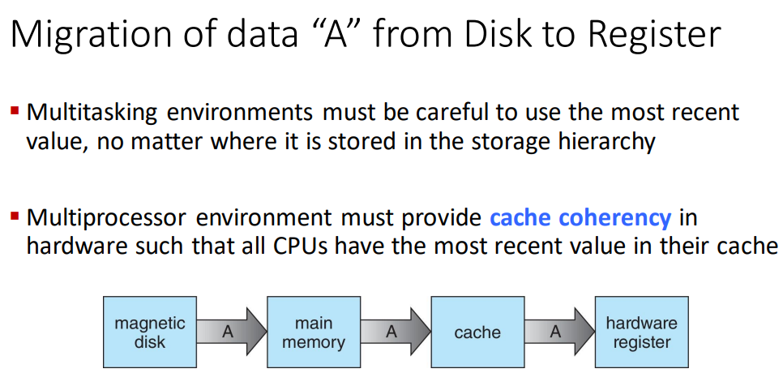

##### Cache Coherence
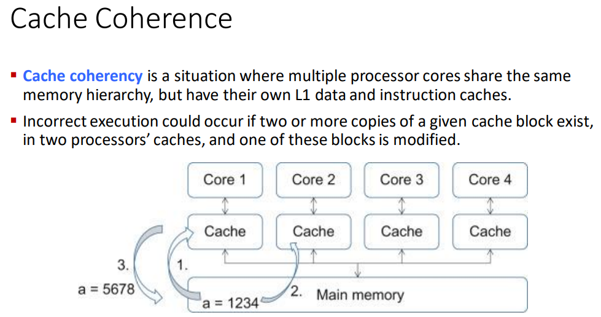

There might be multiple processors with their own caches but there cuold be some incorrect execution that results in 2 or more copies of a cache block to exist in 2 different processors' caches

This is a problem when we try to write back that cache.

#### I/O Subsystem Management

OS is meant to hide particularities of hardware devices from the user

responsible for:
- memory management of I/O
  - buffering - temp storage of data while being trasnferred
  - caching - storing parts of data in faster storage for performance
  - spooling - overlapping of output of one job with input of other jobs
- general device-driver interface
- drivers for specific hardware devices

Everything not under processor or memory management can be thought of as being I/O in general but in this course we think of things more granularly

---

Q: Two important design issues for cache memory are

A: Size and replacement policy

Q: What is the unit of work in a system?

A: Process

## Operating System Services

OSes provide an env to execute programs and services for users and other programs

2 types of OS Services with different goals:
- helpful to user
- efficient operation of the system itself

Services for the system and services for the user

### For the User

The user does not have to be aware of how all of this works

User Interface:
- almost all operating systems have a User Interface (UI)
- types:
  - Command-Line (CLI)
  - Graphical User Interface (GUI)
  - touch-screen

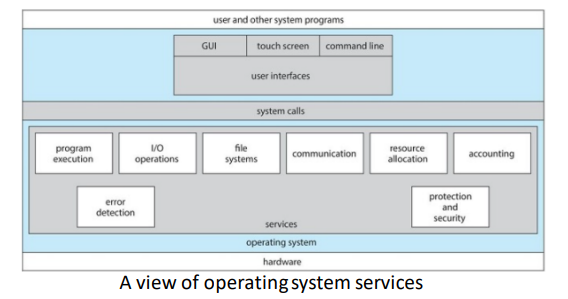

Program Execution:
- load program into memory
- run program
- end execution
  - normally or abnormally and give error

I/O ops

File System Manip:
- read/write files
- create/delete dirs
- search for files/dirs
- list file/dir info
- manage perms

Communications:
- exchange info within or without the computer using a network
- shared memory or message passing via packets moved by the OS

Error Detection:
- constantly aware of all errors and what to do
- errors in CPU, memory, I/O devices, and programs
- give debugging facilities

```
Q: What service is it when we force quit a program?

A: Things can go wrong on the software level, hardware level, or any number of other levels (within those levels). The best thing to do is dive into the debugging hole. If you're at a low level then you can see each instruction execute one at a time. EAX register, RAX register available to you. If you're at a higher level then you'll likely just get an error code to work it out.

It depends on what is happening. 
```

### For the System

Resource Allocation:
- same as before
- make sure no one can access what they shouldn't be able to

Logging:
- keep track of what's being done and by who with what resources

Protection and Security:
- control information that is stored and used
- concurrent processes should not interfere with each other
- protection ensures that all access to system resources are controlled
- security
  - outside users require authentication
    - passwords
    - biometrics
    - physical key - yubikey
    - 2FA
  - defend against external I/O devices from invalid access attempts
- once users are allowed in the OS looks on the access control list (ACL) to see what the user is allowed to do

---

System call interface is the boundary between user programs and operating system services.

Yes

Is the GUI the most common UI?

It depends. CLI might be more common depending on what you're doing.

There's probably more CLIs kicking around in total but people mostly use GUIs

Touch screen is used on mobile a lot

yes

## User Operating System Interfaces

CLI or command interpreter allows direct command entry
- implemented by kernel or some system programs
- sometimes multiple different kinds of interpreters implemented
  - known as `shells`
  - shell is loaded into run time env and we execute from there
- sometimes commands built-in, sometimes just names of programs
  - in the latter case then we don't have to modify the shell itself to add new features
    - the shell is just a powerful program that can run other programs directly and access the resources
  - we have the latter case a lot in our linux systems, even if we think things are built in they're really just programs in the `/bin/` directory
- shell is merely the interpreter that you put in commands, the OS looks at what to do with that command, and runs the program
- access to the shell is access to the whole computer

```
prof loves security, very passionate
```

GUI:
- user-friendly desktop metaphor interface
  - usually mouse, keyboard, and monitor
  - icons represent files, programs, actions, etc
  - invented at Xerox PARC
- Big developments in GUI designs come from open-source projects
  - KDE - K Desktop Environment
  - GNOME desktop by GNU project
  - both run on linux and unix systems
  - source code readily available for reading, modification, and even contribution under specific license terms

Touchscreen:
- impossible/undesired mouse
- gesture based
- virtual keyboard
- uses a lot of voice commands

---

Remember that there are many different kinds of shells to choose from

## System call

Provides a programming interface to the services provided by the OS

System calls are typically written in a high-level language (C or C++).


Mostly accessed by programs via a high-level Application
Programming Interface (API) rather than direct system call use

API specifies a set of functions that are availbe to an application programmer

params passed to functions to return expected values

3 most common:
- Win32 API for Windows
- POSIX API
  - UNIX, Linux, Mac OS X
- Java API for Java Virtual Machine

We might use system calls for:
- copying contents of one file to another file

Types of System Calls:
- Process control
- File management
- Device Management
- Information Maintenance
- Communications
- Protection

System calls are run in kernel mode