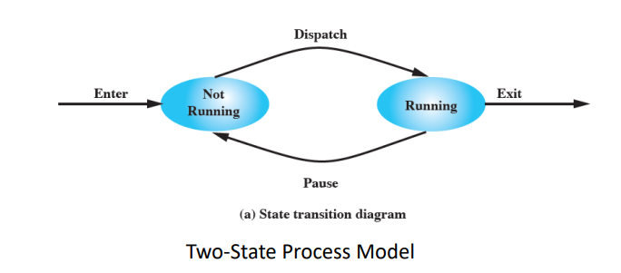
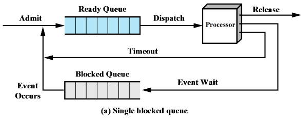
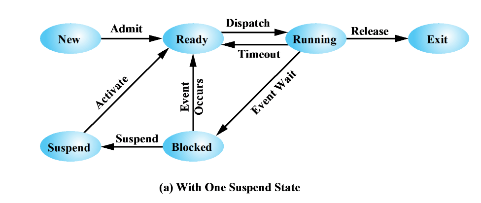
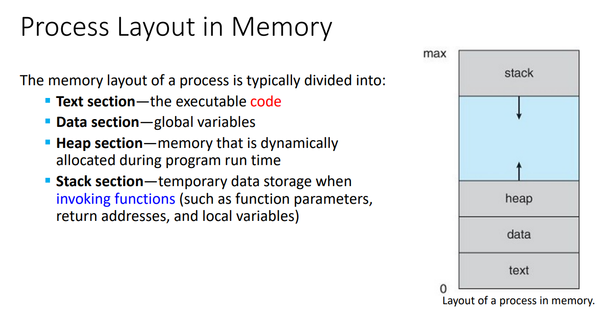
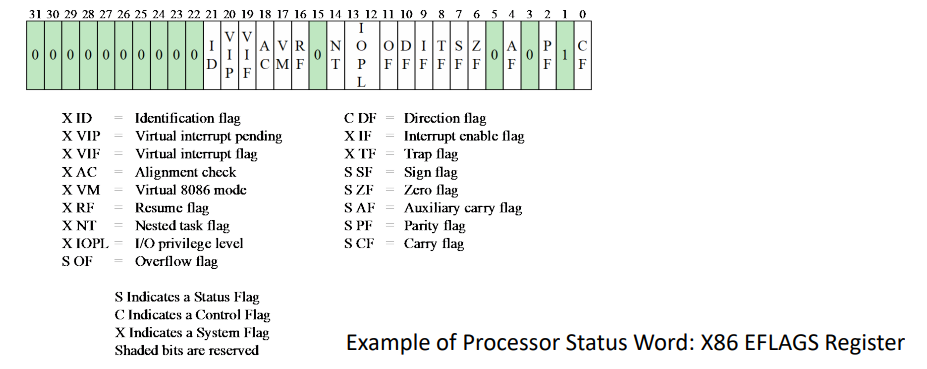
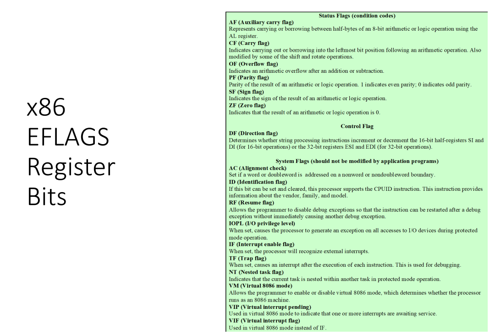
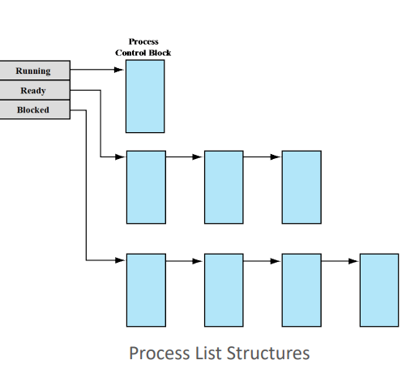

toc:
- [Housekeeping](#housekeeping)
- [What is a Process](#what-is-a-process)
- [Process States](#process-states)
  - [Process Trace](#process-trace)
  - [Simple Two-State Process Model](#simple-two-state-process-model)
  - [Operations on Processes](#operations-on-processes)
    - [Creation](#creation)
      - [fork](#fork)
      - [CreateProcess](#createprocess)
      - [Tree of Processes in Linux](#tree-of-processes-in-linux)
    - [Termination](#termination)
  - [Five-State Process Model](#five-state-process-model)
  - [Suspended Processes](#suspended-processes)
- [Process Description and Control](#process-description-and-control)
  - [Memory Tables](#memory-tables)
  - [I/O Tables](#io-tables)
  - [File Tables](#file-tables)
  - [Process Tables](#process-tables)
  - [Process Control](#process-control)
  - [Process Location](#process-location)
  - [Process Attributes](#process-attributes)
- [Process Control](#process-control-1)
  - [Creation](#creation-1)
  - [Switching](#switching)
- [Execution of the Operating System](#execution-of-the-operating-system)

Process Description and Control

# Housekeeping

No cheatsheet for midterm and final b/c it's multisection and the other section profs don't want to do cheatsheets.

# What is a Process

Computers used to only execute 1 program at a time.
This program had complete control of the system and access to all it's resources.

Now they can have multiple programs loaded into memory and executed at the same time.

With that evolution we needed more control and compartmentalization of running programs.

Thus came the birth of the process.

A process is:
- a program in execution
- the unit of owrk in a modern computing system
- an entity that can be assigned to a processor and executed on a processor
- a unit of activity characterized by
  - the execution of a sequence of instructions
  - having a current state
  - having an associated set of system resources

2 essential components of processes:
- program code
  - text section
- set of data associated with that code
  - data section

We may be more precise later

A process can be uniquely characterized by anumber of elements:
- identifier
  - unique identifier associated w/ process to distinguish from all other processes
  - pid - process ID unique to a process
  - no 2 processes have the same pid
- state
  - if a prcess is currently executing it is in the `running` state
- priority
  - priority relative to other processes
  - what processes can it interrupt and what processes can interrupt it
- program counter
  - the address of the next instruction in the program to be executed
- memory pointers
  - includes pointers to the program code and data associated witht he process plus any memory blocks shared with other processes
- context data
  - data that are present in the registers during execution
- i/o status information
  - outstanding i/o requests
  - assigned devices
  - list of files used in the process
- accounting information
  - may include
    - amount of processor time
    - clock time used
    - time limits
  - helps us log activities
  - find out who/what accessed things, when and why

This is all very general,
every OS has their own implementations but most every OS is going to have these things just under different names.

All of the above is stored in the process control block (PCB):
- created and managed by the operating system
- makes it possible to interrupt a running process and later resume execution as if the interruption had not occured (context-switching)
  - context-switching is what this course is all about
    - trying to keep the processor busy and feed it new processes in order to increase the performance and allat
    - the speed of the processor is the speed limit of the computer, no one is faster than the processor. less of a road speed limit and more of a physical speed limit, like the speed of light

Each process has only one program counter and thread for now.
We talk about multithreading and parallelism later on.

# Process States
## Process Trace

Trace:
- Characterize the behavior of an individual process by listing the sequence of instructions that execute for that process
- *set of instructions for a process*
- show how the traces of the various processes are interleaved

---

Example

We have a small dispatcher process that switches the process from one process to another.

---

Process Trace Execution

There's a limit to how long a process can stay in the processor.

The above image shows how the dispatcher switches between the different processes in the previous image to the one above.

## Simple Two-State Process Model

Processes change state as they execute.

With a 2 state model we have 2 states:
- running
  - the process is being executed
- not running
  - not being executed by processor

We can have the processes in a queue stored in the ram and we cycle through them, kicking a process out of the processor and back into the queue.
When we do that we set it's state to the `Not Running` state.

When we start executing the new process we get to set that process' state to `Running`.

Note: the entries in the queue are links to the process' PCB as opposed to the whole process itself.

---

The queue is a first-in-first-out list and the
processor operates in round-robin fashion on the
available processes.

Round-Robin: each process in the queue is given
a certain amount of time, in turn, to execute and
then returned to the queue, unless blocked.

`I think every prof seems to have a different definition of "round robin"`

---

## Operations on Processes

We need to be able to `_____` processes:
- create
- terminate

### Creation

4 reasons to create a new process:
- new batch job
  - OS is provided with a batch job control system
  - operating system is given a ton of jobs and has to execute them all in the proper priority
- interactive logon
  - system d, inet, etc
  - tons of processes start up to serve the user
- created by os to provide a service
  - when the user does stuff they will often start processes, withuot the user having to wait
  - send information to printers
- spawned by existing process
  - opportunity to exploit parallelism or for the purposes of modularity
  - modular design will allow any user to take advantage of the work that the process is doing
  - processes made to support other processes

On Spawning:
- parent process creates child processes forming a tree of processes
- they may or may not be communicating with one another and/or sharing resources
- all, some, or none of the resources are shared between the parent and child process
- the parent and child may execute concurrently or the parent may wait until the child terminates
- it all depends on what the purpose for the spawning was and what the processes were designed to do

#### fork

In unix-like OSes,
the creation of a child process is established through a system called `fork`

`fork` system call creates a copy by duplicating the parent process
- returns the child process ID to the parent and returns 0 to the child process
- the child and parent processes know each others PIDs

child process can execute a different program using `exec` system call

child can't terminate until the parent collects the output of the child.
parent gives a `wait` command to the child and does the collection.

While the child waits then the child is known as a zombie.

If the parent dies then the child becomes an orphan.

---

fork can be used in a program written by the user.

There are a variety of different reasons why you would want to fork so there's many things that the child and parent processes can do together or separate.
We could see that they duplicate and continue to execute the same thing or they'll duplicate and start doing different things and receiving commands from the parent program.

---

Mircrosoft doesn't like `fork()`
- fork is insecure
- fork gives the child more access than it needs since it copies everything by default
- defies the least privilege principle
  - give the least privilege possible to get a job done in order to protect the user and system
- programs that fork but don't exec render address-space layout randomisation ineffective, since each process has the same memory layout

fork is fast and ha 0 parameters while windows' CreateProcess has many parameters.

We also don't run into the error of running out of memory.

`prof really likes this paper and found it very interesting.`

#### CreateProcess

Windows doesn't have a direct equivalent to fork.

`CreateProcess` is used by Windows API

Spawn vs Fork
- fork
  - existing process creates identical copy of itself
- spawn
  - more general term for creating new process
  - implemented in various different ways depending on OS and programing env
  - doesn't necessarily involve duplicating the existing process
  - spawned process may or may not have a relationship with the parent process
    - spawned process can be a different program altogether

#### Tree of Processes in Linux

`pstree`

prof:

mine:

### Termination

A process terminates when it finishes executing its final statement and askss the operating system to delete it by using the `exit()` system call

all the resources of the process (physical and virtual) are deallocated and reclaimed by the operating system.

Batch job should include a halt instruction or an explicit os service call for termination. Halt will geernate an interrupt to alert the os that a process has completed.

Interactive applications (browsers and shit used by user) are terminated when the user decides typically.

parents can terminate children

WOW:

not reading allat but pretty cool :thumbsup:
## Five-State Process Model
***Note: THis is on the assignemnt (Thanks Cate)***

USing a single queue the dispatcher could not just select the process at the oldest end.

Dispatcher needs to find a process that is not blocked and that has been in the list for the queue for the longest.

Turn not `Not Running` into `Ready` and `Blocked`

State process diagram

States:
- new
  - newly created process not yet admitted to the pool of executable processes by the OS
- ready
  - prepared to execute when given opportunity
- running
  - process that is currently being executed
- blocked
  - unix-based: waiting
  - process cannot execute until some event occurs such as completeion of an I/O operation
- exit
  - unix-based: terminated
  - process released from pool of executable processes by the OS
  - process has been halted or aborted for whatever reason

Transitions:
- null -> new
  - new process is created to exec program
- new -> ready
  - os is prepared to take on additional process
- ready -> running
  - dispatcher dispatches the process
  - OS chooses ready process to run
- running -> exit
  - process is terminated by the OS if the process indicates it has completed or if it aborts
- running$\rarr$ready
  - running process has reached teh maximum allowable time for uninterrupted execution
  - no longer your turn on the xbox
- running$\rarr$blocked
  - process requrests something for which it must wait
- blocked$\rarr$ready
  - process in blocked state is moved to ready state when the event for which is has been waiting occurs

remember that we never have blocked to running.

still not perfect but more later

---

Example

while the processses are simply ready but not running, the dispatcher is running in order to go to dispatch them

There are 2 queues:
1. ready queue
2. blocked queue

So when we ready something up it actually goes into a queue and when something gets hit with an event wait it gets put into a blocked queue.

When a process
- is admitted to the system $\rarr$ admit to requdy queue
- is chosen to run $\rarr$ select from ready queue
- has to wait $\rarr$ send to blocked queue
- times out $\rarr$ send to ready queue again
- finishes $\rarr$ release

In the absence of any priority scheme this can be a simple FIFO queue (round-robin).
Otherwise we could use something like a priority queue.

When an event occurs, any process in the blocked queue that has been waiting on that event only is moved to the ready queue.

The problem is that we have to scan the entire blocked queue which could have 100s or 1000s of blocked processes.

We can remedy this with the use of multiple blocked queues

For each event that will cause an interrupt we will make a queue for it that way we don't have to scan through the whole queue to find a process that corresponds to the event.

## Suspended Processes

Problem - it will become common for all of th eprocesses in memory to be waiting for I/O, and for the processor to become idle.
- there's only so much memory space to store so many processes
- we can pretty easily fill up the memory with all the processes and leave the processor idle since it only really works with shit in the memory.

Solution - swapping
- move part or all of a process from mai memory to disk
- it's a very specific part of the disk that's allocated for the memory to work with
- "there is a specific page file dedicated by the operating system"
- this is like the linux swap

The only problem is how do we do that?

We add another state to our process model

When the OS swaps one of the `blocked` processes out on to the disk we put it into a `suspend`ed queue:
- a queue of existing processes that have been temporarily kicked out of th emain memory or suspended

the os then brings in another process from the suspend queue or it honors a new-process request

execution then continues withthe newly arrived process

So now when we block a process from there it can either go back to the ready queue or get sent to the suspend queue.

When it gets sent to the suspend queue then it gets sent to the disk to make more space in the memory.

Once it's in the suspend queue,
we can activate it again.

So there are now 4 ways to get a process into the ready queue
1. a newly admitted process
2. a proces times out
3. a blocked process is unblocked thanks to the event it was waiting on occuring
4. a suspended process is selected to become active once more

If there is nothing in the ready queue and we're waiting on blocked processes then we will start suspending processes to swap out of main memory so that we can admit new processes or activate one from the suspend.

It's always preferrable to activate a suspended process.

The swap is always available - it is built into the architecture - and there's always labels for each state.

When the OS performs a swapping-out operation, it has 2 choices for selecting a process to bring into main meomry:
1. admit a newly created process
2. bring a previously suspended process(preferred)

problem:
- all suspended processes were blocked when they were suspended
- which one do we bring back?

Each process in the suspend state was originally blocked on a particular event, something tha twe accounted for with the use of multiple queues.
We also know that once that event is over we know that the processes in its corresponding queue are no longer blocked.

We want to make another state for suspended processes

For the processes in the secondary memory we're able to have a ready and blocked queue for the suspended.

When we hear/read "suspend" then we think of the disk.

`Blocked` $\rarr$ `Blocked+Suspend`:
- if there are no `Ready` processes then at least one blocked process is swapped out to make room for another process that is not blocked.

`Blocked+Suspend` $\rarr$ `Ready+Suspend`:
- a process was waiting for an event
- the event finishes
- the process is no longer blocked but it's still suspended so it remains in the disk space but gets sent to a suspended ready queue

`Ready+Suspend`$\rarr$`Ready`:
- when there are no `Ready` processes the OS will need to bring oen in to continue execution

`Ready`$\rarr$`Ready+Suspend`:
- to free up a sufficiently large block of main memory
- we have a ton of processes that are ready.

`Running`$\rarr$`Ready+Suspend`:
- the OS is preempting the process because a higher-priority process on the `Blocked+Suspend` queue has just become unblocked
- something higher priority just got unblocked and we need to execute on that one now instead
- the os could move the running process directly to the `Read+Suspend` queue and fre some main memory
- process preemption occurs when an execution process i interrupted by the processor so that another process can be executed

`New`$\rarr$`Ready+Suspend`:

`New`$\rarr$`Ready`:

We could add more states but then there's more work involved in changing between states.
There are more states in different designs however.

Q: How do we decide wether a `New` process goes straight to `Ready+Suspend` or `Ready`?

A:
we prefer to send a new process to the suspended queue.
THe OS will prefer grabbing from ready suspend.
Very rare that we will send something straight to ready since that would mean that the suspend is empty as well so there would be no point in sending it there first and wasting compute time on switching

A suspended process
- non immediately available for execution
  - all info sitting on secondary memory instead of main
- process was placed in a suspended state by
  - itself
  - a parent process
  - OS
- suspended in order to prevent execution
- may or may not be waiting on an event
- process may not be removed from this state until the agent orders the removal
- reasons for suspensions
  - swapping
  - other OS reason
    - illegal memory access
      - usually terminates in that case
    - buffer overflow
  - interactive user request
    - debugging
    - want to use resource
    - minimizing applications or switching off of tabs so we don't really need the program working
  - timing
  - parent process request

# Process Description and Control

In a multiprogramming env there are several processes that have been created and exist in virtual memory.

What info doe sthe OS need to control processes and manage resources for them?

OS constructs and maintains tables of information about each entity that it is managing:
- memory tables
- I/O tables
- file tables
- process tables

## Memory Tables

main = real

secondary = virtual

we use memory tables to do:
- allocation of main meory to processes
- allocation of secondary memory to processes
- any protection attributes of blocks of main or virtual memory
  - which processes may access certain shared memory regions
  - prevent programs from accessing main or virtual memory that it's not allowed to
- any information needed to manage virtual memory

## I/O Tables

used by the OS to manage the I/O devices and channels of the computer system

at any given time, an I/O device may be available or assigned toa  particular process

OS needs to know the status of the I/O operation and the location in main memory being used as the source or destination fo the I/O transfer

## File Tables

Provide information about the:
- existence of files
- location on secondary memory
- current statwus
- other attribs

may be maintined by a file management system (windows NTFS, linux/unix FAT) or the OS based on different operating system

## Process Tables

Must be maintained to manage processes

References memory, I/O, and files directly or indirectly in the process tables to show what the process needs/uses

when the OS is initialized it must have some access to some configuartion data that define the basic environment
- all the info required to build out the tables
- everything you can see and view in the bios
- I think anyways

## Process Control

to manage and control a process, the OS must know
- where the process is located
- the attribs of the process that are necessary for its management
- basically everything in the PCB

What is the physical manifestation of a process?

a process must inclue:
- a program or set of programs to be executed
- a set of data location for local and global variables
- stack that is used to keep track of
  - procedure calls
  - parameter passing between procedures
- a number of attributes that are used by the OS for process control (Process control block)

We refer to this as the `process image`

Process Layout in Memory

The stack goes from higher to lower addresses while the heap grows from lower addresses to higher addresses.

## Process Location

location of a process image will depend on the memory managemnt scheem being used

At any given time parts of the process image can be both in the main and secondary memory

so we need process tables maintained by the OS to show the location of each page of each process image

## Process Attributes

info resides in a process control block

there are 3 general categories
1. process identification
2. processor state information
3. process control information

process identification:
- each processor gets a unique numeric identifier
  - PID
- many of the bales controlled by the OS may use process identifiers to cross-reference process tables
- interprocess communication uses PIDs to determine who is who and where
- PIDs let us see who are parent and descendent processes
  - the parents have the child PIDs and the children have the parent PID

Process State Information
- what is the current state of the process
- consists of the contents of processor registers
  - registers on the cpu itself, very fast
- nature of registers involved depend on the design of the processor but typically
  - user-visible registers
  - control and status registers
  - stack pointers
- all processor designs include a register or set of registers often known as the program status word (PSW) that contains condition codes plus status information
  - EFLAGS registers is an example of a PSW used by any OS running on an x86 processor
  - 
  - 

Process Control Information
- the additional information needed by the OS to control and coordinate the various active processes

Role of the Process Control Block
- most important data structure in an OS
  - contains all info needed by OS about process
  - blocks are read and/or modified by virtually every module in the OS
- the set of PCBs define that state of the OS

# Process Control

Typical mangement functions:
- creation and termination
- scheduling and dispatching
- switching
- synchronizationand support for interprocess communication
- mangaement of PCBs

we're going to be looking at a lot of these.

## Creation

OS decides to create a new process
1. assign a unique PID to the new process
2. allocate space for the process
3. initialize the process control block
4. set the appropriate linkages (put it in the queue)
5. creates or expands other data structures

## Switching

Context switching

`I do want to give this enough time to explain this context switching`

---
lect end

---

# Execution of the Operating System