toc:
- [Housekeeping](#housekeeping)
- [What is a Process](#what-is-a-process)
- [Process States](#process-states)
  - [Process Trace](#process-trace)
  - [Simple Two-State Process Model](#simple-two-state-process-model)
  - [Operations on Processes](#operations-on-processes)
    - [Creation](#creation)
      - [fork](#fork)
      - [CreateProcess](#createprocess)
      - [Tree of Processes in Linux](#tree-of-processes-in-linux)
    - [Termination](#termination)
  - [Five-State Process Model](#five-state-process-model)
  - [Five-State Process Model](#five-state-process-model-1)
- [Process Description](#process-description)
- [Process Control](#process-control)
- [Execution of the Operating System](#execution-of-the-operating-system)

Process Description and Control

# Housekeeping

No cheatsheet for midterm and final b/c it's multisection and the other section profs don't want to do cheatsheets.

# What is a Process

Computers used to only execute 1 program at a time.
This program had complete control of the system and access to all it's resources.

Now they can have multiple programs loaded into memory and executed at the same time.

With that evolution we needed more control and compartmentalization of running programs.

Thus came the birth of the process.

A process is:
- a program in execution
- the unit of owrk in a modern computing system
- an entity that can be assigned to a processor and executed on a processor
- a unit of activity characterized by
  - the execution of a sequence of instructions
  - having a current state
  - having an associated set of system resources

2 essential components of processes:
- program code
  - text section
- set of data associated with that code
  - data section

We may be more precise later

A process can be uniquely characterized by anumber of elements:
- identifier
  - unique identifier associated w/ process to distinguish from all other processes
  - pid - process ID unique to a process
  - no 2 processes have the same pid
- state
  - if a prcess is currently executing it is in the `running` state
- priority
  - priority relative to other processes
  - what processes can it interrupt and what processes can interrupt it
- program counter
  - the address of the next instruction in the program to be executed
- memory pointers
  - includes pointers to the program code and data associated witht he process plus any memory blocks shared with other processes
- context data
  - data that are present in the registers during execution
- i/o status information
  - outstanding i/o requests
  - assigned devices
  - list of files used in the process
- accounting information
  - may include
    - amount of processor time
    - clock time used
    - time limits
  - helps us log activities
  - find out who/what accessed things, when and why

This is all very general,
every OS has their own implementations but most every OS is going to have these things just under different names.

All of the above is stored in the process control block (PCB):
- created and managed by the operating system
- makes it possible to interrupt a running process and later resume execution as if the interruption had not occured (context-switching)
  - context-switching is what this course is all about
    - trying to keep the processor busy and feed it new processes in order to increase the performance and allat
    - the speed of the processor is the speed limit of the computer, no one is faster than the processor. less of a road speed limit and more of a physical speed limit, like the speed of light

Each process has only one program counter and thread for now.
We talk about multithreading and parallelism later on.

# Process States
## Process Trace

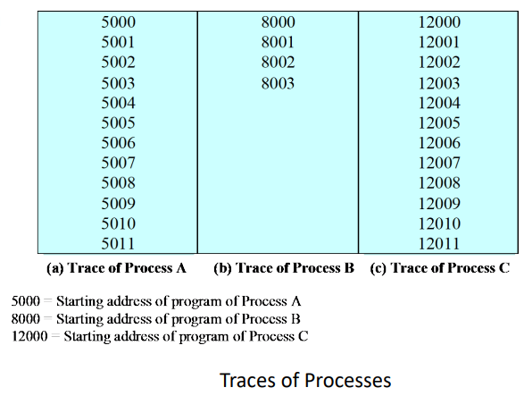

Trace:
- Characterize the behavior of an individual process by listing the sequence of instructions that execute for that process
- *set of instructions for a process*
- show how the traces of the various processes are interleaved

---

Example

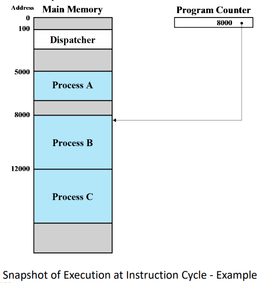

We have a small dispatcher process that switches the process from one process to another.

---

Process Trace Execution
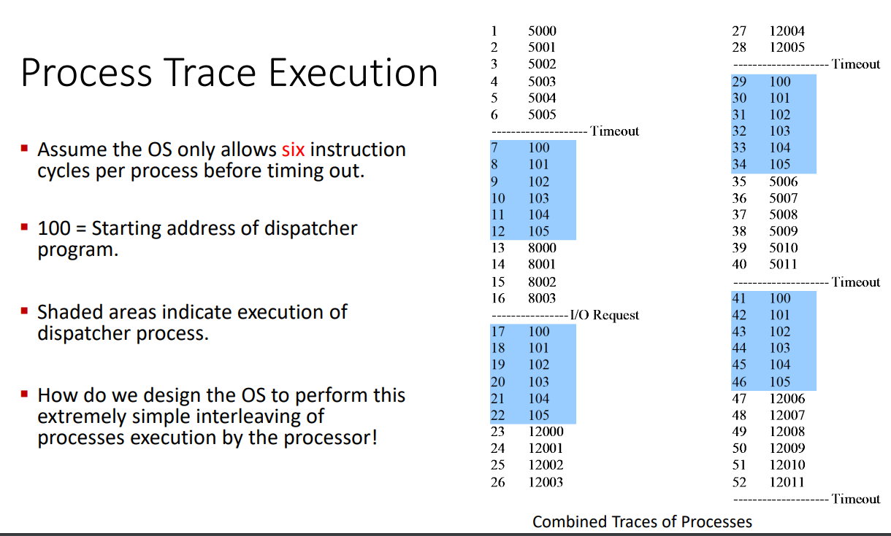

There's a limit to how long a process can stay in the processor.

The above image shows how the dispatcher switches between the different processes in the previous image to the one above.

## Simple Two-State Process Model

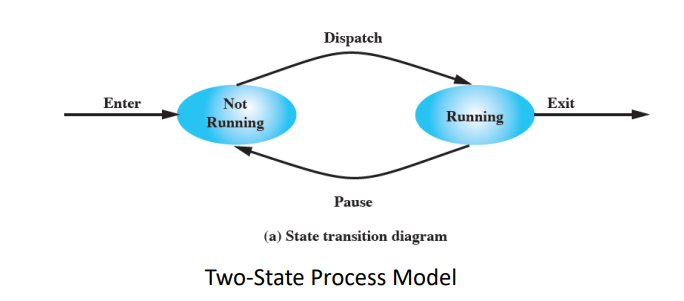

Processes change state as they execute.

With a 2 state model we have 2 states:
- running
  - the process is being executed
- not running
  - not being executed by processor

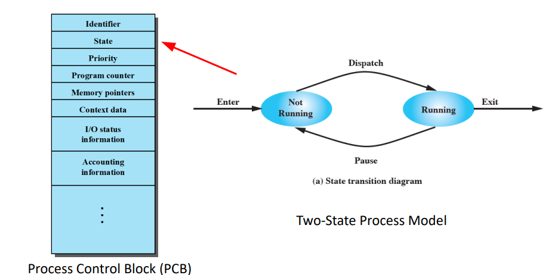

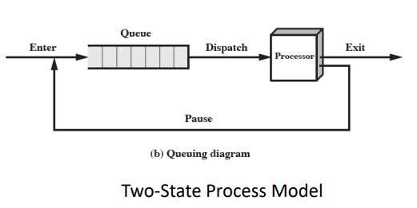

We can have the processes in a queue stored in the ram and we cycle through them, kicking a process out of the processor and back into the queue.
When we do that we set it's state to the `Not Running` state.

When we start executing the new process we get to set that process' state to `Running`.

Note: the entries in the queue are links to the process' PCB as opposed to the whole process itself.

---

The queue is a first-in-first-out list and the
processor operates in round-robin fashion on the
available processes.

Round-Robin: each process in the queue is given
a certain amount of time, in turn, to execute and
then returned to the queue, unless blocked.

`I think every prof seems to have a different definition of "round robin"`

---

## Operations on Processes

We need to be able to `_____` processes:
- create
- terminate

### Creation

4 reasons to create a new process:
- new batch job
  - OS is provided with a batch job control system
  - operating system is given a ton of jobs and has to execute them all in the proper priority
- interactive logon
  - system d, inet, etc
  - tons of processes start up to serve the user
- created by os to provide a service
  - when the user does stuff they will often start processes, withuot the user having to wait
  - send information to printers
- spawned by existing process
  - opportunity to exploit parallelism or for the purposes of modularity
  - modular design will allow any user to take advantage of the work that the process is doing
  - processes made to support other processes

On Spawning:
- parent process creates child processes forming a tree of processes
- they may or may not be communicating with one another and/or sharing resources
- all, some, or none of the resources are shared between the parent and child process
- the parent and child may execute concurrently or the parent may wait until the child terminates
- it all depends on what the purpose for the spawning was and what the processes were designed to do

#### fork

In unix-like OSes,
the creation of a child process is established through a system called `fork`

`fork` system call creates a copy by duplicating the parent process
- returns the child process ID to the parent and returns 0 to the child process
- the child and parent processes know each others PIDs
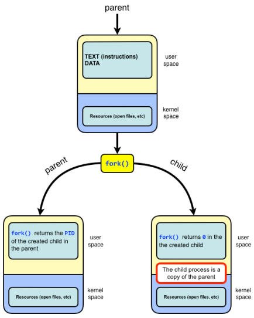

child process can execute a different program using `exec` system call

child can't terminate until the parent collects the output of the child.
parent gives a `wait` command to the child and does the collection.

While the child waits then the child is known as a zombie.

If the parent dies then the child becomes an orphan.

---

fork can be used in a program written by the user.

There are a variety of different reasons why you would want to fork so there's many things that the child and parent processes can do together or separate.
We could see that they duplicate and continue to execute the same thing or they'll duplicate and start doing different things and receiving commands from the parent program.

---

Mircrosoft doesn't like `fork()`
- fork is insecure
- fork gives the child more access than it needs since it copies everything by default
- defies the least privilege principle
  - give the least privilege possible to get a job done in order to protect the user and system
- programs that fork but don't exec render address-space layout randomisation ineffective, since each process has the same memory layout

fork is fast and ha 0 parameters while windows' CreateProcess has many parameters.

We also don't run into the error of running out of memory.

`prof really likes this paper and found it very interesting.`

#### CreateProcess

Windows doesn't have a direct equivalent to fork.

`CreateProcess` is used by Windows API

Spawn vs Fork
- fork
  - existing process creates identical copy of itself
- spawn
  - more general term for creating new process
  - implemented in various different ways depending on OS and programing env
  - doesn't necessarily involve duplicating the existing process
  - spawned process may or may not have a relationship with the parent process
    - spawned process can be a different program altogether

#### Tree of Processes in Linux

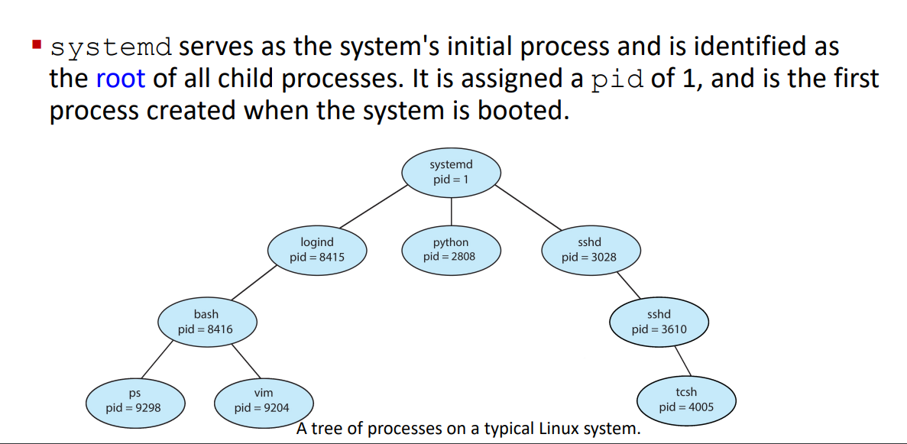

`pstree`

prof:
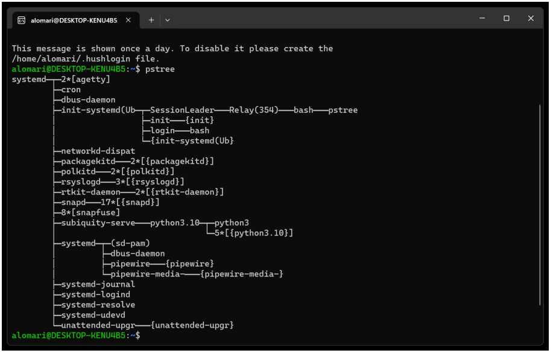

mine:
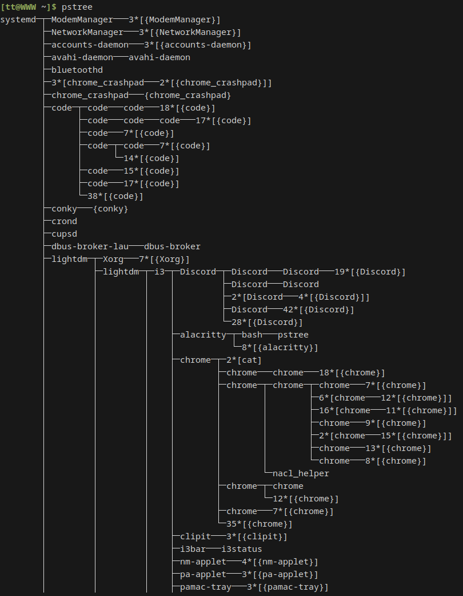
### Termination

A process terminates when it finishes executing its final statement and askss the operating system to delete it by using the `exit()` system call

all the resources of the process (physical and virtual) are deallocated and reclaimed by the operating system.

Batch job should include a halt instruction or an explicit os service call for termination. Halt will geernate an interrupt to alert the os that a process has completed.

Interactive applications (browsers and shit used by user) are terminated when the user decides typically.

parents can terminate children

WOW: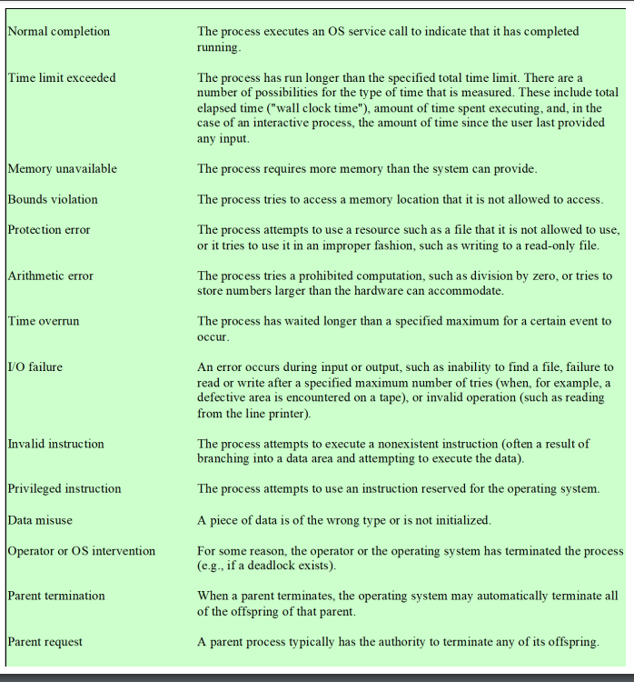

not reading allat but pretty cool :thumbsup:
## Five-State Process Model
***Note: THis is on the assignemnt (Thanks Cate)***

USing a single queue the dispatcher could not just select the process at the oldest end.

Dispatcher needs to find a process that is not blocked and that has been in the list for the queue for the longest.

Turn not `Not Running` into `Ready` and `Blocked`

State process diagram
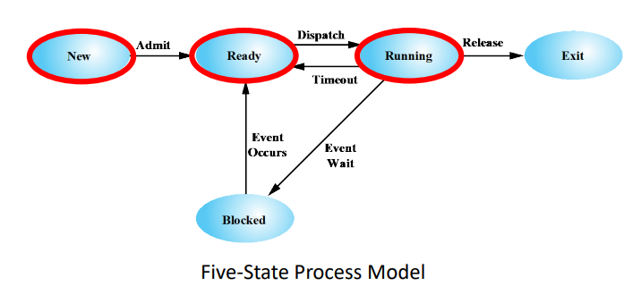

States:
- new
  - newly created process not yet admitted to the pool of executable processes by the OS
- ready
  - prepared to execute when given opportunity
- running
  - process that is currently being executed
- blocked
  - unix-based: waiting
  - process cannot execute until some event occurs such as completeion of an I/O operation
- exit
  - unix-based: terminated
  - process released from pool of executable processes by the OS
  - process has been halted or aborted for whatever reason

Transitions:
- null -> new
  - new process is created to exec program
- new -> ready
  - os is prepared to take on additional process
- ready -> running
  - dispatcher dispatches the process
  - OS chooses ready process to run
- running -> exit
  - process is terminated by the OS if the process indicates it has completed or if it aborts
- running$\rarr$ready
  - running process has reached teh maximum allowable time for uninterrupted execution
  - no longer your turn on the xbox
- running$\rarr$blocked
  - process requrests something for which it must wait
- blocked$\rarr$ready
  - process in blocked state is moved to ready state when the event for which is has been waiting occurs

remember that we never have blocked to running.

still not perfect but more later

---

Example

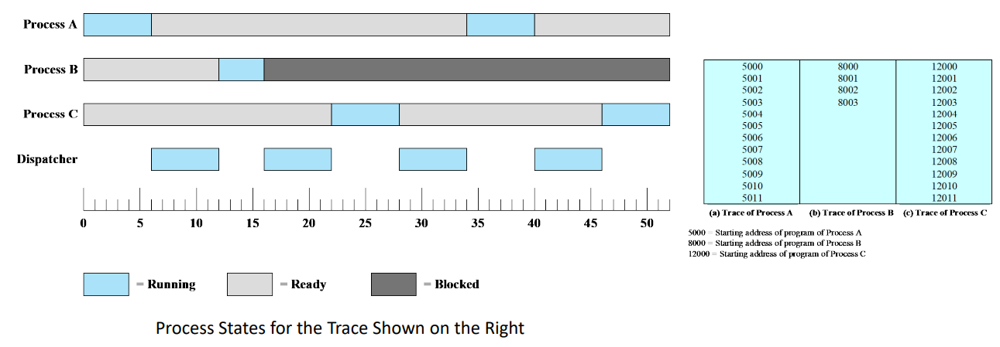

## Five-State Process Model
# Process Description
# Process Control
# Execution of the Operating System