toc:
- [Housekeeping](#housekeeping)
- [Processes and Threads](#processes-and-threads)
  - [Threaded Approaches](#threaded-approaches)
  - [What is a Thread](#what-is-a-thread)
  - [Why Multithread?](#why-multithread)
- [Multicore Programming](#multicore-programming)
  - [Concurrency vs Parallelism](#concurrency-vs-parallelism)
  - [Amdahl's Law](#amdahls-law)
  - [Thread States and Operations](#thread-states-and-operations)
  - [Thread Synchronization](#thread-synchronization)
- [Multithreading Models](#multithreading-models)
  - [User Threads](#user-threads)
  - [Kernel Threads](#kernel-threads)
  - [Combined User and Kernel level threading](#combined-user-and-kernel-level-threading)
- [Background](#background)
- [Critical-Section Problem](#critical-section-problem)
  - [Single Core](#single-core)
  - [OS](#os)
- [Mutual Exclusion](#mutual-exclusion)
  - [Software Approaches](#software-approaches)
    - [Dekker's Algo](#dekkers-algo)
    - [Peterson's Solution](#petersons-solution)
  - [Hardware Support Approaches](#hardware-support-approaches)
      - [Memory Barrier](#memory-barrier)
    - [Hardware Instructions](#hardware-instructions)
    - [Atomic Variables](#atomic-variables)
  - [OS \& Programming Languages Approaches](#os--programming-languages-approaches)
    - [Mutex Locks](#mutex-locks)
    - [Semaphores](#semaphores)
    - [Monitors](#monitors)

combining 7&8 so that the threads slides are all in one note.

The last week's 2nd lecture was cancelled due to the prof getting sick.

# Housekeeping


# Processes and Threads

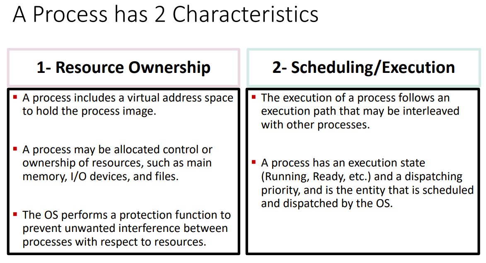

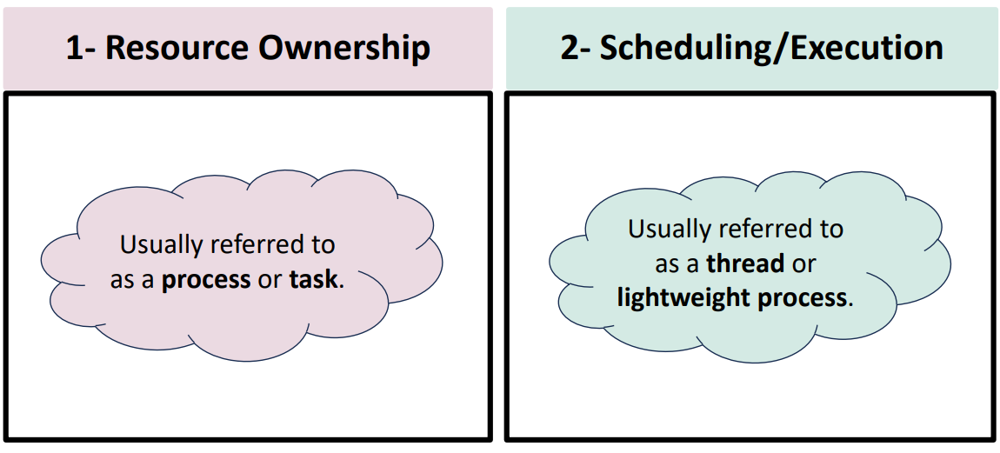

The actual fetching and execution of the instructions is thought of as a thread or lightweight process (LWP).

Most unix based processing will say threads.

Some OSes don't differentiate between threads and processes, treating them all as processes.

THe process model introduced so far assumed that a process as an executing program with a single thread of control.

Virtually all modern operating sytems, however, provide features enabling aprocess to contain multiple threads of control.


## Threaded Approaches

Single threaded approaches

a single thread of execution per process

threads are not recognized


ex.
- ms-dos
- old linux

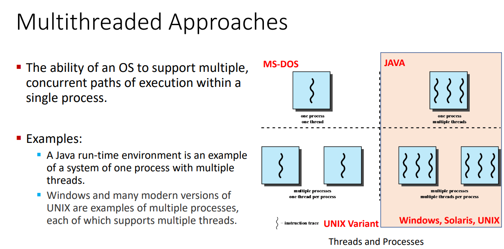

we can make it seem as though the processes are all working simultaneously but we're actually just switching around very quickly

## What is a Thread


thread is a basic unit of cpu utilization
- each thread knows its parent process
- thread ID
- program counter
- a register set
- a stack

thread = instruction trace


If a process has multiple threads of control then it can perform more than one task at a time.

Threads belonging to the same process
- share
  - code section
  - data section
  - other operating system resources
    - open files
    - signals
- have unqiue
  - registers
  - stack
  - PC
  - ID

## Why Multithread?

Most modern applications are multhreaded

an application is typically implemented as a separate process with several threads of control

multiple tasks with the application can be implemented by separate threads for different reasons

ex:
- making thumbnails of tons of different images at once
  - 1 thread per image
- loading a webpage
  - 1 thread for text
  - 1 thread for images
- word processors
  - 1 thread for responding to keystrokes
  - 1 thread for displaying graphics
  - 1 thread for spell checking

we feed each thread a different task and they don't interfere with one another

multithreading is also good for client/server applications

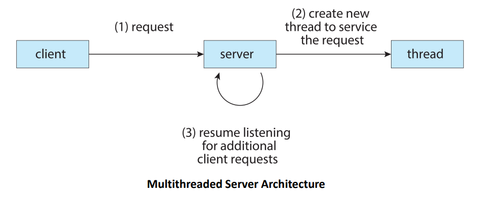

Server will have
- have a port open and a thread to listen for connection requests
- make a thread to do what the request wants
- the open port
  - very vulnerable
  - an open door
  - necessary as otherwise no one can connect

Q: why multithread and not multi proces

A: It's much faster
- process creation is heavywhite while thread creation is lightweight
- creation, termination, and switching of threads is faster than with processes
- threads are ten times faster to create than processes in UNIX

kernels are generally multithreaded
- during system boot time on linux system, several kernel threads are created
- each thread performs a specific task
  - device management
  - memory management
  - interrup handling
  - etc

benefits of multithreading
- responsiveness
  - allow contonued execution if part of th eprocess is blocked
  - good for user interfaces
- resource sharing
  - threads share resources of process
  - easier than shared memory or message passing b/w processes
- economy
  - cheaper than process creation
  - thread switching lower overhead than context switching
- scalability
  - process can take advantage of multicore architectures
  - one process can use at most one core
  - multi-threads could use all available cores or CPUs
  - speed of execution

# Multicore Programming


multicore:
- multiple computing cores on a single chip
- each core appears as a separate CPU to the operating system
- each core can execute 1 trace at a time

```
word on caches, specifically in this intel architecture

L1 cache has all of the instructions and stuff.
All the highest value things

L2 can allow communication between 2 cores physically next to one another. They look separate in the diagram but that's just the allocation we do, they can look at each other's work and talk to one another basically.

L3 is on the chip and is shared by all of the cores

There are different kinds of architectures out there so the interesing L2 cache sharing won't be true of every architecture.
```

multithreaded programming
- provides a mechanism for more efficeint use of these multiple computing cores and improved concurrency

we need to program properly in order to take advantage of the presence of multithreading

## Concurrency vs Parallelism

Parallelism
- implies a system can perform more than one task simultaneously
- 2 cores doing 2 threads at the same time
- working in parallel

Concurrency
- supports more than one task by allowing all the tasks to make progress

Q: Is it possible to have concurrency without parallelism?

A: yes. utilize thread switching.
parallelism requires parallel execution.
We can have all the tasks progress together without parallel execution by way of thread switching.

```
parallelism cannot happen on a single core

parallelism implies concurrency

there can be concurrency on a single core

parallelism is faster than concurrency alone
```


We are either parallelising data or tasks

data parallelism:
- distribute distinctive chunk of data across multiple cores, and perofmr the same operation on each
- ex
  - each core gets a different image
  - each core performs the same operation of creating a thumbnail

task parallelism
- distributing threads across cores
- each thread performs a unique operation
- not necessarily all working on the same data
  - 1 core is summing rows
  - 1 core is averaging rows
  - 1 core is finding the median
  - all may or may not be working on the same rows

There are a number of challenges that come with programming for multicore or multiprocessor systems
- dividing activities into separate concurrent takss
  - what takss are independent of each other
- balance
  - pick tasks that perform equal work of equal value
- data spliting
  - data accessed and manip'd by the tasks must be divided to run on separate cores
- data dependency
  - see what tasks require what data and see which pieces of data are shared by tasks
- testing and debugging
  - testing and debugging concurrent programs is inherently more difficult than testing and debugging single-threaded applicdations

Many deveopers argue that the advent of multicore systems will require an entirely new approach to designing software systems in the future.

Many educators believe that there should be an increased emphasis on parallel programming in software development.

## Amdahl's Law

Identifies performance gains from adding additional cores to an application that has both serial and parallel components

$$
speedup\le\frac{1}{S+\frac{(1-S)}{N}}
$$
- $S$ - serial portion
- $N$ - processing cores

example:
- application is
  - 75% parallel
  - 25% serial
- 1 core $\rarr$ 2 cores
$$
speedup\le\frac{1}{0.25+\frac{(1-0.25)}{2}}
\newline
= \frac{1}{0.25+\frac{0.75}{2}}
\newline
= \frac{1}{0.25+0.375}
\newline
= \frac{1}{0.625}
\newline
= 1.6
$$
- 1 core $\rarr$ 4 cores
$$
speedup\le\frac{1}{1/4+\frac{(1-1/4)}{4}}
\newline
=\frac{1}{1/4+\frac{3/4}{4}}
\newline
=\frac{1}{1/4+3/16}
\newline
= \frac{1}{7/16}
\newline
= 16/7
\newline
\approx 2.28
$$

as $N$ approchaes infinity
- speedup approaches 1/S
- 50% of application is serial, maximum speedup = 2 regardless of $N$

serial portion of an application has a dispropportionate effect on performance gained by adding cores.

---
Knowledge Check:
- parallelism involves distributing tasks across multiple computing cores
- use amdahl's law to find the speedup gain for an application that is 60% parallel component for 2 processing cores
  - 1.43
- it is possible to have concurrency without parallelism

---

## Thread States and Operations

Key states for a thread
- running
- ready
- blocked

thread operations associated with a change in thread state are:
- spawn
  - new process is spawned, a thread for that process is also spawned
- block
  - a thread needs to wait for an event and is blocked
- unblock
  - the event the thread was waiting for has occured, the thread is moved to the ready queue
- finish
  - thread completes. deallocate register, context, and stacks

## Thread Synchronization

We need to synch up the activities on the threads because:
- all threads share the same resources
  - namely address space
- one thread altering the shared resource will affect the other threads in the same process
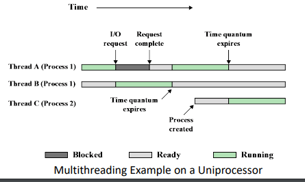

# Multithreading Models

Types of threads:
- user threads
  - supported above the kernel
  - managed by user-level thread library w/o kernel support
- kernel threads
  - supported and managed directly by the kernel

virtually all contemporary operating systems support kernel threads

thread libraries contain code for:
- creating an ddestroying threads
- passing messages and data between threads
- scheduling thread execution
- saving and restoring thread contexts

3 primary thread libraries
- POSIX Pthreads
- Windows threads
- Java threads

## User Threads

User Threads
- many are mapped to a single kernel thread
- kernel is not aware of the existence of threads
- thread management is done by threda library at the user level


---
examples

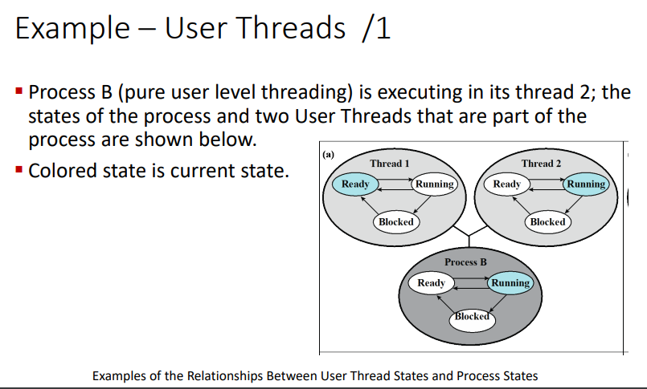

Process `B` has 2 threads.
OS only sees process `B`,
not its threads


We're blocking the whole process.

The threads remain in their states but they aren't actually doing anything.

We can't just switch to thread 1 as the kernel isn't aware of the threads,
only the process.


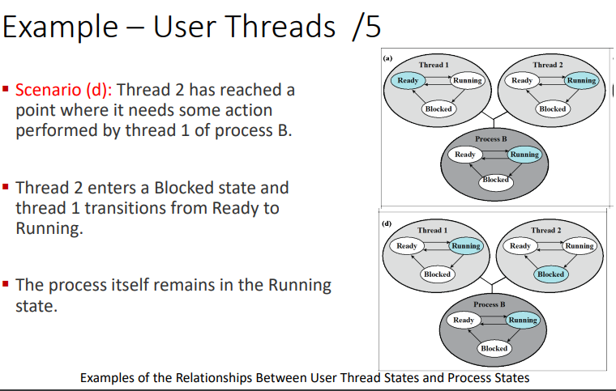

---

pros:
- thread switching does not require kernel mode privileges
  - saves overhead of two mode switches
- scheduling can be application specific
  - scheduling algo can be tailored to the application
- ULTs can run on any OS

cons:
- entire process wil block if a single thread makes a blocking system call
- pure ULT strat, multithreaded application cannot take advantage of multiprocessing/parallelism
- very few systems use this model because of its inability to utilize multiple cores
  - solaris green threads

## Kernel Threads

thread management is all done by the kernel

creating a user thread creates a kernel thread (one-to-one)

kernel maintains context information fo rthe process as a whole and for individual threads within the process


pros:
- kernel can simultaneously schedule multiple threads from the same process on multiple processes
- if one theread in a process is blocked, the kernel can schedule another thread of the same process
- linux and windows implement this

cons:
- 1-1 correspondence b/w user and kernel threads will burden the performance of a system after creating a large number of threads
  - so many threads to have to switch between

## Combined User and Kernel level threading

- thread creation done in user space
- most of scheudling and synchronization of threads within an application
- multiple user-level threads from a single application are mapped onto smaller or equal number of kernel threads
  - many-to-many
- number of kernel threads may be specific to either a particular application or a particular machine

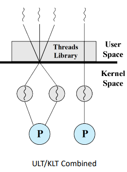

Note:
- we can't map 3 threads to 4 cores.
- a kernel thread can only belong to one processor
- a user thread can only map to one kernel thread

pros:
- appears flexible
- number of threads and parallelism
  - many-to-one (pure ULT)
    - create many threads but no parallelism
  - one-to-one (pure KLT)
    - better concurrency but high overhead
  - many-to-many (combined approach)
    - as many threads as needed running parallel on a multiprocessor
- blocking
  - when a thread performs a blocking system call, the kernel can schedule another thread for execution 

cons:
- difficult to implement
  - windows with the `ThreadFiber` package
  - not very common outside of the above

Whether KLT or ULT remember that

a relationship must exist between user threads and kernel threads no matter the cardinality


2-level model is like many-to-many but we're able to bind a user thread to a kernel thread.

we can basically dedicate a core to a thread.

Q: can we interleave threads from different processes?

A:
This is just normal process switching.

---
knowledge check

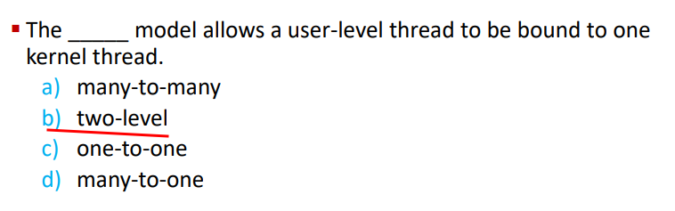

---


prof:

"the threads need to have a connection to the processor in order for execution"

---
the rest of the slideshow is for self-reading I guess

time for `Concurrency: Mutual Exclusion and Synchronization`

---

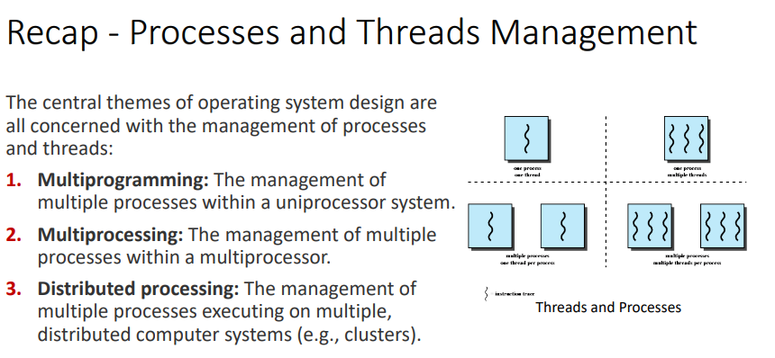

# Background

processes can execute concurrently or in parallel

may be interrupted at any time, partially completing execution


we have a shared memory where we store variables and everything we want to work with.

If we don't manage that shared memory properly we end up with data inconsistency


make sure the processes execute in an orderly fashion and don't fuck with each other when they share a resources

Race Condition
- several processes access and manip the same data at the same time
- outcome depends on who got there first


# Critical-Section Problem

critical segement of code:
- process may be accessing and updating data that is shared with at least one other process
- only one process in critical section at a time

when a process wants to enter the critical section
- entry section - process asks permission to enter
- it does the critical section
- exit section - let's eeryone know it's done
- remainder section is the rest of the noncritical stuff

we need to ensure the 3 following conditions
1. mutual exclusion
   - only one process in critical section at a time
2. progress
   - if no one else is in critical and someone else wants to go critical then we have to select the next process
   - we can't postpone this selection indefinitely
3. bounded waiting
   - there must be a limit on the number of times that other processes can enter the critical sections after a process has made a request to enter
   - assume same speed of all processes


## Single Core

very shrimple

we could prevent interrupts from occuring whilue a shared variable was being modified

useless when we try to move to multiprocessor since it would just start disabling everything.

## OS

2 approaches depending on preemption
- preemptive
  - allows preemption of process when running in kernel mode
  - processor can tell the process to pack all their bags and get ready to move
- non-preemptive
  - runs until kernel mode, blocks, or voluntarily yields CPU
  - essentially free of race conditions as only one process is active in the kernel at a time

preemptive are difficult to design.

it allows two kernel-mode processes to run simultaneously on diff cores

it also makes things more responsive

---
knowledge check

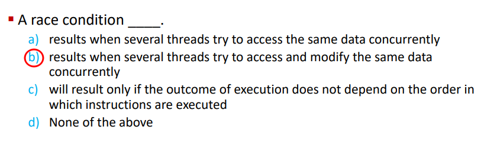

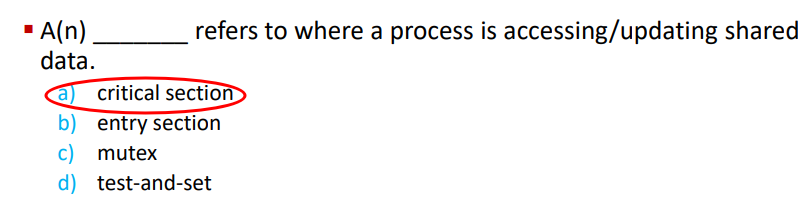

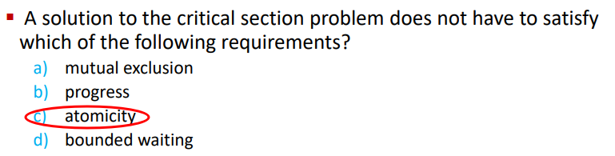

---
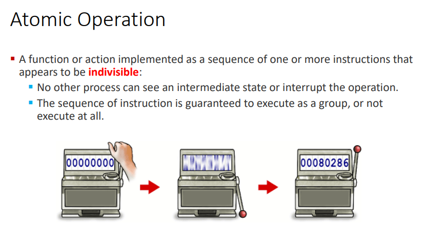

atomic operations

# Mutual Exclusion

## Software Approaches

### Dekker's Algo

Dijkstra went to go publish it for him so that's why there's a jpeg of him on the slide

first known sol'n to the mutual exclusion problem in concurrent programming

allows 2 threads to shar ea single-use resource without conflict, using on ly shared memory for communication

only one access to a memory location can be made at a time

we have a global memory location labelled `turn` that is shared between the two processes

Processes check to see if it's their turn and execute accordingly.
Once their done they give the turn to the other process.

Mutual exclusion is guaranteed.

What is the problem?

---
prof left off here for 05/02/24 lect

---
midterm is all question formats and on paper

---

Porcesses must strictly alternate in their use of their critical section
- the pace of execution is dictated by teh slower of the two processes

One process being slow makes the whole things slower since everyone has to wait on that slower process.

if one process fails then the other process is permanently blocked
- this happens because the failed process can't give the turn over to the other process by exiting and setting the flag
- this happens whether or not the process is in the critical section or not

2nd attempt - a revision:
- each process has it's __own key _(flag)___
- if one fails, the other can still access its critical section
- processes can look at others flags
- one process can't change the flag of another process
- processes share a boolean vector that holds the flags
  - `Boolean vector flag[2]`


drawbacks:
- permanent blocking still possible
  - process fails inside critical section or after setting flag to true w/o entering
- no guaranteed mutual exclusion
  - P0 exeutes the while statement and finds flag[1] set to false
  - P1 executes the while statement and finds flag[0] set to false
  - P0 sets flag[0] to true and enters its critical section
  - P1 sets flag[1] to true and enters its critical section
  - now both processes arenow executing their critical sections so the program is incorrect

3rd attempt - another revision
- the problem from before was that a process can change its state after the other process has checked it but before the other process can enter its critical section
- swap around the two stateemnts to guarantee mutual exclusion


we set the flag's value before we execute the while loop

drawbacks:
- this results in a deadlock
- both processes set their flags to true
- later on they will check each other's flags and decide they need to wait for the other
  - the flag value makes them think the other process is in their critical section

4th attempt - yet another revision:
- Each process sets its flag to indicate its desire to enter its critical section but is prepared to reset the flag to defer to the other process
- mtuual exclusion is guaranteed under this model


drawbacks:
- 
  - each process sets their flag to true
- 
  - each process checks the other's flag before proceeding with the while loop
- 
  - each flag flips from false and back to true
- the loop ends up repeating in what's known as a _livelock_
- this won't sustain for a long time
  - the processes are different and we can presume that the while loops won't always take the same amount of time and that one will finish their while loop before the other can so they'll enter the critical section first

5th iteration - the correct solution:
- we introduce ___the right to insist___

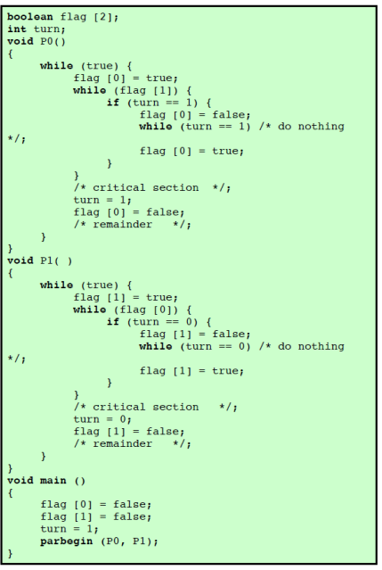

- when P0 wants to enter the critical section
  - it sets its flag to true
  - checks P1's flag
    - if P1 flag is false then P0 gets to go critical
    - else, P0 consults turn
      - turn==0
        - it's P0's turn to insist
        - P0 will just keep on checking P1's flag in order to try and enter its critical section
- P1 will at some point note that it is its turn to defer and set its flag to false, allowing P0 to proceed
- after P0 has used its critical section
  - P0 flag set to false
  - turn set to 1 to transfer the right to sinsit to P1

### Peterson's Solution

Dekker's algo solves things but it's hard to follow

Peterson has a simpler sol'n that allows two processes to share a single-use resource w/o conflict

only shared memory is used for communication

it is kind of rewriting Dekker's algorithm

---


`int turn` - indicates whose turn it is to enter the critical section

`bool flag[2]` - indicate if a process is ready to enter the critical section

`flag[i]==true` implies that process $P_i$ is ready


3 critical-section requirements are met(provably):
1. mutual exclusion is preserved 
   - $P_i$ enters critical section only if: either `flag[j]==false` or `turn == i`
     - the other process is not ready or
     - it is $P_i$'s turn
2. Progress requirements is satisfied
3. Bounded-waiting requirement is met

Useful for demonstrating an algo but not guaranteed to work on modern architectures.

to improve performance, processors and/or compilers may reorder operations that have no dependencies
- fine for single-threaded as result is always the same
- may produce inconsistent or unexpected results for multithreading

```
two threads share _flag_ and _x_ variables

boolean flag = false;
int x = 0;

Thread 1 performs

while (!flag)
  print x;

Thread 2 performs

x = 100;
flag = true;

what is the expected output

100 is the expected output however the operations for thread 2 may be reordered so the output might be 0
```


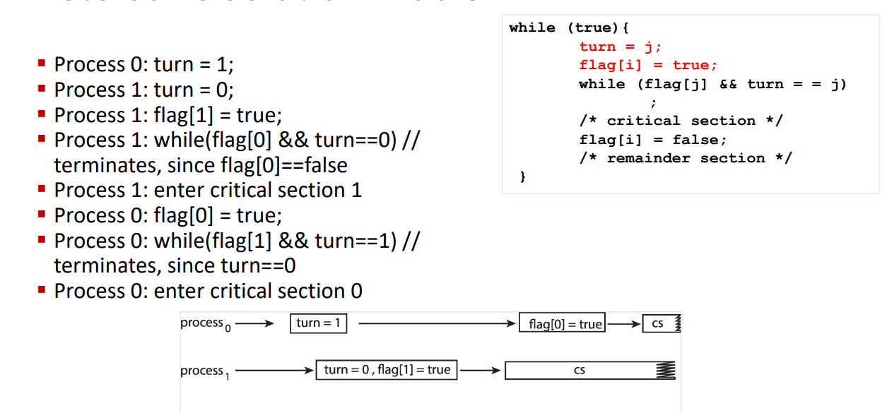

We have to use a ___Memory Barrier__ to make sure that Peterson's solution will work correctly on modern computer architecture.

So this software based support will need the aid of some hardware.

---
Knowledge check:
- In Peterson's solution, the \_\_\_ variable indicates if a process is ready to enter its critical section
  - `flag[i]`

## Hardware Support Approaches

---
"There is no bullet solution... all solutions build on each other"

---

Many systems provide hardware support for implementing the cirtical section code

uniprocessors - could disable interrupts
- currently running code would execute w/o preemption
- genearlly, too inefficient on multiprocessor systems
  - OS using this are not broadly scalable

looking at 3 forms of hardware support
1. memory barriers (aka memory fences)
2. hardware instructions
3. atomic variables

#### Memory Barrier

How a computer architecture determines what memory guarantees it
will provide to an application program is known as its memory model.

models may be either
- strongly ordered
  - memory modification of one processor is immediately visible to all other processors
- weakly ordered
  - not always immediately visible to all other processors

developers cannot make an assumption about whether or not the memory model is strongly or weakly ordered.

in lieu of this guarantee,
we use memory barriers


memory barriers
- computer instructions that force any changes in memory to be propogated to all other processors in the system

`Sfence` is a memory barrier instruction for example with regards to storing

`lfence` is another type of instruction with regards to loading

`mfence` prevents reording of reading and writing before or after the fence

do not reorder anything before the barrier with anything that comes after the barrier


we're not able to mov the loads to either side of the fence


### Hardware Instructions

```c
boolean test_and_set (boolean *target){
  boolean rv = *target;
  *target = true;
  return rv;
}
```

`test_and_set()`
- executed atomically
- read a value in memory
- set it to true
- return the value that was in memory

This let's us make a lock out of the flag we want us to make sure we don't enter the critical section while anothre program is in its critical section.

```c
do {
  while (test_and_set(&lock));
  /*critical section*/
  lock = false;
  /*remainder section*/
} while (true);
```

This is suported by nearly every architecture.

`compare_and_swap()`
```c
int compare_and_swap(int *value, int expected, int new_value) {
  int temp = *value;
  if (*value == expected)
    *value = new_value;
  return temp;
}
```
- executed atomically
- returns the original value of `value`
- set the `value` to the value of `new_value`
  - but only if `*value == expected`

We can also use this to make a shared lock for mutual exclusion. 
Have it initialized to 0.

```c
while (true) {
  //lock is the lock, 0 is the expected value, 1 is the prospective new value
  while (compared_and_swap(&lock, 0 ,1) != 0) {/*do nothing, someone else is in critical section*/}
  /*critical section, lock has been set to by us*/
  lock = 0;     //we left the critical section so we're able to set the lock back to 0
  /*remainder section*/
}
```

### Atomic Variables

Typically instructions such as compare-and-swap are used as bhilding blocks for other synchronization tools.

One tool is an atomic variable that provdes *atomic* (uninterruptible) updates on basic data types such as integers and booleans.

Ex:
- `sequence` - our atomic variable
- `increment()` - an operation on `sequence`
- command
  - `increment(&sequence)`
  - ensures the sequence is inremented without interruption

we make atomic updates so that we're guaranteed to update a variable.

`increment()` can be implemented like so:
```c
void increment (atomic_int *v) {
  int temp;
  do {
    temp = *v;
  }
  while (temp != compare_and_swap(v, temp, temp+1));
  // the above keeps looping until we are able to successfully swap, effectively incrementing the value of `v`
}
``` 

---
Knowledge Check:
- race conditions are prevented by requiring that critical regions be protected by locks
  - true
- `test_and_set()` instruction is executed atomically
  - true
- an instruction that executes atomically
  - executes as a single, uninterruptible unit

## OS & Programming Languages Approaches

### Mutex Locks

Previous solutions are compicated and generally inaccessible to application programmers.

OS designers build software tools to solve critical section problem.

The simplest solution is the mutex lock.

>fun fact: mutex is a portmanteau of `mut`ual `ex`clusion, as it was created to solve that problem


note that the mutex is an integer that alternates between 0 for locked and 1 to unlocked, this is effectively a boolean.

Protect a critical section by first `acquire()` a lock then `release()` the lock.
Boolean variable indicating if `lock` is available or not.

`acquire()` and `release()` must be atomic.
Usually implemented via hardware atomic instructions such as compare-and-swap.

```c
while (true) {
  acquire lock

  critical section

  release lock

  remainder section
}
```

You `acquire()` the lock and no one else can touch it while you're in the critical section.
Afterwards you can `release()` since you're done with the critical section.

The instructions look something like this in implementation.
```c
acquire() {
  while (!available) { /* busy wait */}
  available = false;
}
release () {
  available = true;
}
```
- these two functions must be implemented atomically, typically through the use of something like `test_and_set()` and `compare_and_swap()`

cons:
- sol'n requires busy waiting
  - a process trying to enter enter its critical section will loop call `acquire()` over and over again to try and grab hold of it
- this lock is called a *spinlock*
  - if a lock is to be held for a `short duration`, one thread can "spin" on one processing core while another thread performs its critical section on another core.

short duration:
- how short is short?
- waiting on a lock requires 2 context switches
  - move the thread to the waiting state
    - storing away all of the process info (pcb, psw, etc.) introduces overhead
  - restore the waiting thread once the lock becomes available
- the general rule is to use a spinlock if the lock will be held for a duration of less than two context switches
- we don't know how long it will take for a critical section to take but we can get some good estimates

---
Knowledge check
- a mutex lock
  - is essentially a boolean variable
- what is the correct order of operations for protecting a critical section using mutex locks?
  - `acquire()` followed by `release()`
- busy waiting refers to the phenomenonthat while a process is in its critical section, any other prcess that tries to enter its critical section must loop continuously in the call to acquire the mutex lock
  - yes

```
Prof very briefly touched upon a notion of 2 different kinds of implementation of semaphore and mutex.
Something about a classic implementation versus some other implementation.
```

### Semaphores

One problem we had with the mutex was the busy waiting.

basic idea:
- $\ge$ 2 processes can work together using simple signals
- a process can be forced to stop at a specified place until it has received a specific signal
- any complex coordination can be done with an appropriate amount of signals
- our previously mentioned mutex is akin to a single flag that we can raise up and down.

Sempahores are a more sophisticated synchronization tool than mutex locks.

A semaphore `S` is an integer variable, that can only be accessed through 2 atomic operations:
1. `wait()` - decrements the semaphore value
2. `signal()` - increments the semaphore value

```
these each have other names.
wait() originally P() from Dutch proberen, "to test", semWait()
signal() originally V() from verhogen, "to increment", semSignal()

we may find these in other literature
```
Implementation
```c
wait(S) {
  while (S <= 0) {/* busy wait */}
  S--;
}
signal(S) {
  S++;
}
```

There are 2 different kinds of semaphores:
1. counting sempahore
2. binary semaphore

Counting semaphores (aka general semaphore) is an integer value that can range over an unrestricted domain

Binary semaphores are an integer value that can only range between 0 and 1.
This is a mutex lock.

We can implement a counting semaphore as a binary semaphore.

Good tool to solve synch problems.


Initializing the semaphore to 0 will allow us to only allow $P_2$ to execute $S_2$ after the execution of $S_1$.

A semaphore must guarantee that no 2 processes can execute the `wait()` and `signal()` on the same semaphore at the same time

implementation becomes the critical sectin problem where the `wait` and `signal` code are placed in critical section.

Could now have busy waiting in critical section implementation.

Process can just suspend instead of waiting for the semaphore.
Each semaphore has a waiting queue w/ 2 items
- value (of type integer)
- pointer to next record in the list

2 operations:
- block (aka sleep) - place the process invoking the operation on the appropriate waiting queue
- wakeup - remove one of the processes from the waiting queue and place in ready queue

waiting queue:
```c
typedef struct {
  int value;
  struct process *list;
} semaphore
```

No busy waiting implementation:
```c
wait (semaphore *S) {
  S->value--;

  if (S->value < 0) {
    add this process to S->list;
    block;
  }
}

signal(semaphore *S) {
  S->value++;
  if (S->value <= 0) {
    remove a process P from S->list;
    wakeup(P);
  }
}
```


We're using the incrementing and decrementing to iterate through the queue.

A strong semaphore uses a queue of blocked processes, the process unblocked is the one in the queue for the longest time.

A weak semaphore uses a set of blocked processes.
The processes unblocked is unpredictable.
This can lead to process starvation as a process may remained blocked forever


---
knowledge check
- a counting semaphore
  - is essentially an integer variable
- \_\_\_ can be used to prevent busy waiting when implementing a semaphore
  - waiting queues
- mutex locks and binary sempahores are essentially the same thing
  - true

### Monitors