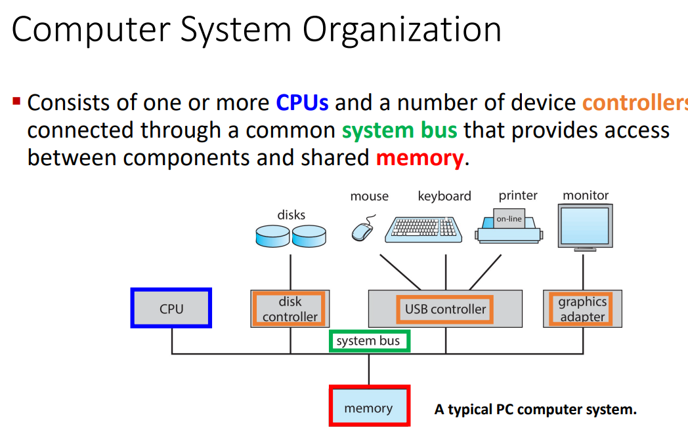
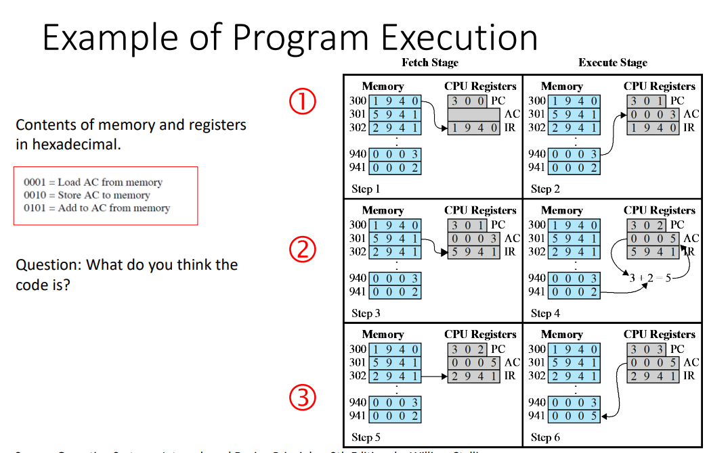
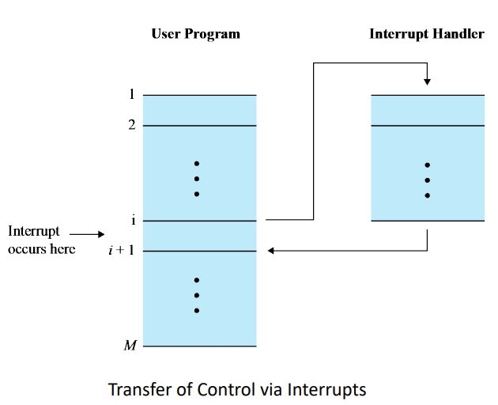
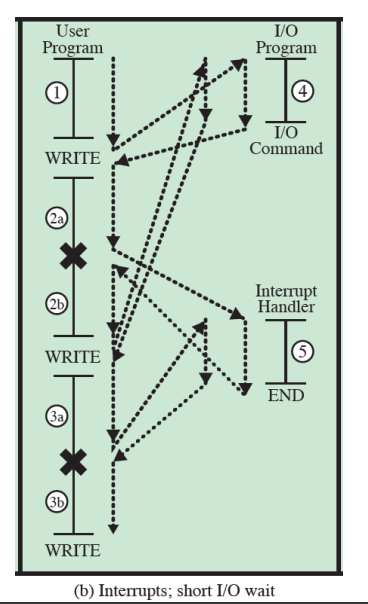
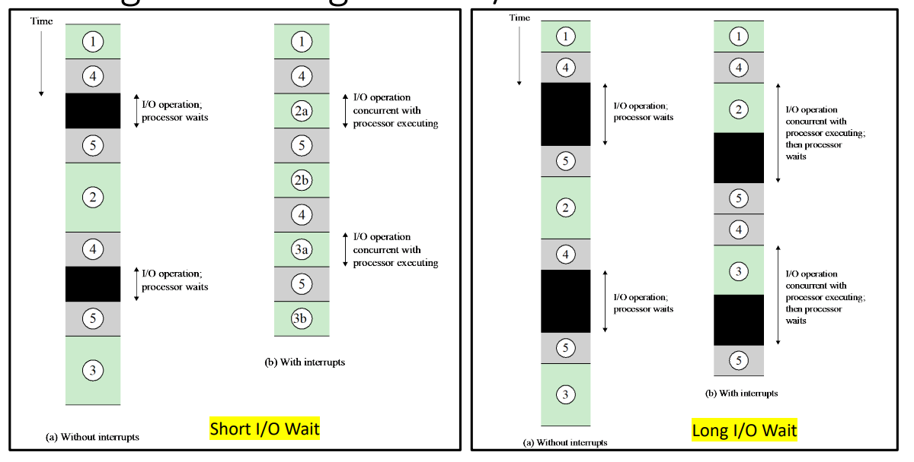
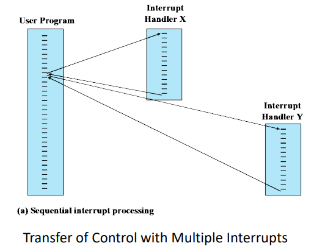
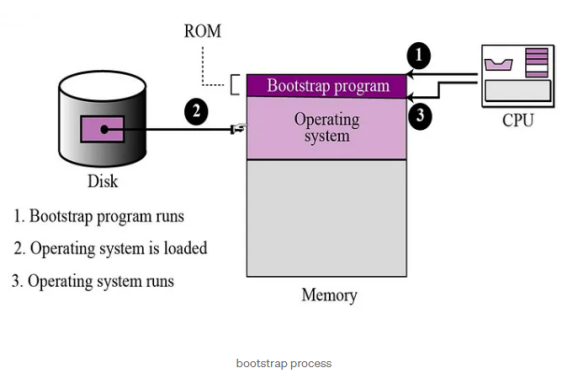
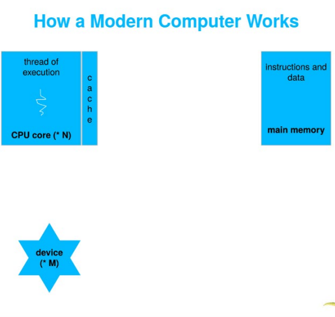
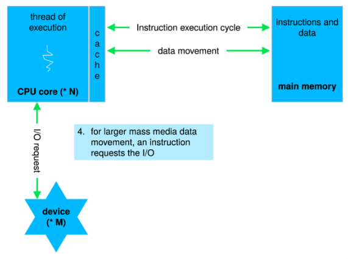
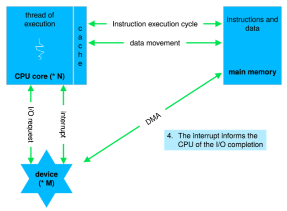

toc:
- [What Operating Systems Do](#what-operating-systems-do)
- [Computer-System Organization](#computer-system-organization)
  - [Competing for Resources](#competing-for-resources)
- [Computer-System Operation](#computer-system-operation)
  - [Instruction Execution](#instruction-execution)
  - [Interrupts](#interrupts)
    - [Instruction Cycle with Interrupts](#instruction-cycle-with-interrupts)
    - [Program Status Word](#program-status-word)
    - [Flow Control With and Without Interrupts](#flow-control-with-and-without-interrupts)
    - [Multiple Interrupts](#multiple-interrupts)
  - [Storage Structure](#storage-structure)
    - [Von Neumann Architecture](#von-neumann-architecture)
    - [Main Memory](#main-memory)
      - [ROM, EPROM, and EEPROM](#rom-eprom-and-eeprom)
        - [ROM](#rom)
        - [EPROM](#eprom)
        - [EEPROM](#eeprom)
    - [Secondary Storage](#secondary-storage)
    - [Tertiary Storage](#tertiary-storage)
    - [Storage Hierarchy](#storage-hierarchy)
    - [Caching](#caching)
  - [I/O Structure](#io-structure)
    - [Direct Memory Access Structure](#direct-memory-access-structure)

# What Operating Systems Do

Components to a computer structure:
- user
- application programs
- operating system
- computer hardware

OS sits in between the user and the hardware,
handling how the application programs interact with the hardware.

OS Goals:
- execute user programs
- convenient and easy to use
  - not hard to use
- efficiently use hardware

user pov:
- want
  - easy to use
  - good performance
  - secure
- don't care about efficiency

Smartphones and tablets are good from the user pov since they are optimized for usability and batter life.

The touch screens and voice interactions allow for better usability.

Even though in reality the phone could be pretty wasteful when it comes to the resources.

---

Profesor's Soapbox:
- we should be more concerned with the lack of privacy that comes with the convenience
- she doesn't like the argument that if you don't have anything to hide then you shouldn't care
- "privacy is our right"
- she wants us to take into account privacy and security regarding user data

---

Embedded Computers:
- little/no user interface
- ex
  - home devices
    - motion sensor lights
    - computerized water systems
    - computerized heating system
  - car computers
  - numeric keypads
  - presto scanner
- run primarily without user intervention

System pov:
- OS must keep all users happy in the case of shared computers
- OS is the resource allocator and control program
  - efficiently manage the execution of user programs
- I/O devices are important in this respect
  - hard to manage and work with efficiently

Operating System definition
- no universally accepted definition
  - "we define the operating system as we go"
- is a resource allocator
  - manage all resources
  - decides between conflicting requests for efficient and fair resource use
- is a control program
- controls execution of programs to prevents erors and improper use of the computer
- everything a vendor ships when you order an operating system is a good approximation but varies wildly
- the one program running at all times on the computer is the kernel which is part of the operating system
- everything else is either
  - a system program that ships with the operating system
  - or
  - an application program

Mobile operating systems often include not only a core kernel but also middleware
- a set of software frameworks that provide additional services to application developers

kernel is the core of the system

not all computer systems have some sort of user interaction

# Computer-System Organization



cpu talks to the memory in order to get instructions

memory is typically volatile so it loses all information once it shuts down

system bus:
- provides communication among processors, main memory, and I/O modules

Device controllers are things like the disk controller and usb controller.

There's local memory on the controller that acts as a buffer storage.

the controller moves data between the peripheral devices and the buffer storage.

There are software versions of these drivers too.

## Competing for Resources

CPU and controllers can execute in parallel, competing for memory cycles.

They both need to go through the memory
- cpu fetches instructions from memory
- I/O device sends information through memory
- modern computers use DMA (direct memory address) that we speak on later

# Computer-System Operation

How does the processor execute an instruction?

There are registers inside of the cpu itself
- this is based off of the architecture (design) of the processor itself
- very fast storage to read and write to
- used to save, store, and use instructions
- very expensive, fast, and limited

Memory Address Register (MAR) specifies the address in memory for the next read or write

Memory Buffer Register (MBR)contains the data to be written/read into/from memory

I/O Address Register (I/O AR) specifies a particular I/O device we're working with

I/O Buffer Register (I/O BR) used for the exchange of data between an I/O module and the processor.

CPU is waiting for the inupt

Instructions always have to come from memory.
It can only be loaded from the memory.

I/O doesn't input instructions,
it inputs/outputs data.

CPU can pull directly from IO device

Memory and I/O:
- memory is a set of locations defined in sequentially numbered addresses
- each location contains a bit pattern that can be interpreted as either an instruction or data
- an I/O module transfers data from external devices to processor and memory, and vice versa

## Instruction Execution

A program to be executed by a processor consists of a set of instructions stored in
memory.

The processor reads (fetches) instructions from memory one at a time and
executes each instruction.

The processing required for a single instruction is called an instruction cycle.

Fetch and Execute is an atomic operation:
- If you fetch an operation then you can't do anything else until you execute that operation
- they come together

Program halts if:
- processor turns off
- unrecoverable error occurs
- program instruction that halts the processor is encountered
  - tell the processor to wait for an input or output


Instruction Fetch and Execute from CPU pov:
- processor fetches an instruction from memory
- program counter (PC) holds the address of the next instruction to be fetched
- PC is incremented after each fetch
  - on to the next instruction
  - unless the instruction loaded tells us to change the PC differently
- fetched instruction is loaded into the instruction register (IR)
- the processor interprets the instruction and performs the required action:
  - processor-memory: data transfer
  - Processor-I/O: data transfer
  - Data processing: arithmetic or logic operations
  - Control: an instruction may specify that the sequence of execution be altered.

---

Hypothetical 16 bit machine


opcode - operation code that tells the processor what to do

address - data needed

S - sign of the data (0 = +ve, 1 = -ve)


These are all displayed in hex



rows and explanation:
- 1:
  - fetch instruction from `300`
  - `1940` is loaded to `IR`
    - `1` = `0001` = load AC from memory
    - `940` is where we're grabbing from
  - increment `PC` to `301`
  - load `0003` from `940` into `AC`
- 2:
  - fetch instruction from `301`
  - `5941` is loaded to `IR`
    - `5` = `0101` = add to AC from memory
    - `941` is where we're grabbing from
  - increment `PC` to `302`
  - add `0002` from `941` to `0003` in `AC`
- 3:
  - fetch instruction from `302`
  - `2941` is loaded to `IR`
    - `2` = `0010` = Store AC to memory
    - `941` is where we're storing the data to
  - increment `PC` to `303`
  - `0005` from `AC` is stored to `941`

## Interrupts

An interrupt is a signal for the cpu to pay attention to the device.

You can process user inputs very quickly so that it doesn't feel laggy.

Most IO devices are much slower than the cpu so it's less efficient for the cpu to just wait on the IO device so it's better for the IO device to just cut in whenever it needs to.

Most operating systems are interrupt driven, I/O devices will cut in whenever they need to so that the cpu doesn't have to pause and wait on them.

There are different kinds of interrupts:
- hardware and software
  - whenever hardware or software wants to seek the attention of the processor
  - hardware sends a *signal* through a peripheral device to interrupt the processor
  - software executes a specific instruction to interrupt the processor
- vectored and non-vectored
  - interrupt transfers control to a specific address which contains the interrupt vector
    - the interrupt vector has the address of the ISR
    - it's like a low level database that tells you what to do for a given interrupt
  - interrupt vector table contains addresses that inform the interrupt handler as to where to find the Interrupt Service Routines (ISR)
  - vectored: manufacturer of the processor predefines this vector address
    - it's hardcoded/built-in
  - non-vectored: vector address is not predefined
    - address of the required ISR for the interrupt is provided by the interrupting device
- maskable and non-maskable
  - non-maskable: cannot be ignored
    - reserved for events such as
      - unrecoverable memory errors
      - hardware failure
      - system crash
      - force shutdown or cutting power
        - non-maskable, hardware interrupt
        - needs to have the option to shutdown gracefully and minimize damage to hardware
      - overheating
        - heat sensors tell the processor to stop so that the heat can dissipate
    - don't ignore
    - attend to immediately
  - maskable: can be ignored
    - turned off by CPU before the execution of critical instruction sequences that cannot be interrupted
    - non-essential for core system function
    - used by device controllers to request service
      - keyboard
      - printer
    - usually only ignored for a while
    - could potentially be ignored forever
      - almost never happens

These different types are can overlap.

We might have a vectored, non-maskable, software interrupt or a non-vectored, maskable, hardware interrupt.

When the cpu is interrupted,
it stops what it's doing and transfers execution to a fixed location.

Fixed location usually has a starting address where the service routine for the interrupt is located.

The interrupt service routine executes.

After the routine completes, the cpu goes back to what it was doing before.


For the user program,
an interrupt suspends the noraml sequence of execution.

When the interrupt processing is completed,
execution resumes.

In the above image we see the I/O device making the request, sending it to the processor, then the processor processing the interrupt shortlythereafter then signalling that it's done when it's done.



### Instruction Cycle with Interrupts


Interrupt stage is added to the instruction cycle.

At the execute stage,
the processor checks to see if any interrupts have occured.

If none,
proceed to fetch stage as usual.

Otherwise,
the processor executes an interrupt handler routine instead of going to the fetch stage continue the program execution.
After that it continues.

An interrupt handler routine is generally part of the OS.

The routine:
- determines the nature of the interrupt
- performs whatever actions are needed
  - e.g. find out what I/O module generated the interrupt and branch to a program that will write more data out to that I/O module
- allows the processor to continue executing the user program after it finishes

### Program Status Word

An interrupt can trigger lots of events in the processor hardware and software.

Program Status Word (PSW) contains status information about the currently running process:
- memory usage
- codes
- status information
  - interrupt enable/disable bit
  - kernel/user-mode bit


We cover this in more detail later on.

### Flow Control With and Without Interrupts

Let's take an example of flow control without interrupts.


the black dotted arrow shows how the execution flows

`1`, `2`, `3` refer are segments of code that don't involve I/O

The write calls involve I/O and call an I/O routine/program pictured on the right:
- `4` prepares for the actual I/O operation
- then there's the I/O command
- `5` complete the I/O operation
- then it ends and we return

The write calls call to an I/O routine

Suppose now there are interrupts with short waits.



Now we see an interrupt in the segments `2` and `3` dividing them into `2a`&`2b` and `3a`&`3b` respectively.

At the dividing points we have the execution move to the interrupt handler before going back to the user program.

Suppose now there are still interrupts but now with long waits


The interrupts no longer occur during the segments that don't involve calling to another routine.

Instead they happen when the user program calls to another routine,
the write calls.

So above we went over different techniques for handling I/O operations
- `(a)`: programmed I/O
- `(b)` and `(c)`: interrupt-driven I/O

There is another third technique covered later on called Direct Memory Access (DMA)



Using interrupts it takes less time and is more efficient as the processor doesn't need to idle.

We have to be aware of the overhead as we get faster however.

A cpu core can execute 1 instruction at a time. Multi-core CPUs can execute multiple cores at a time.
Multi-threading adds to this.

In order to utilize this we need to program in a way to take advantage of parallel execution.

### Multiple Interrupts

Suppose there is an interrupt during the processing of another interrupt, we can either:
- disable interrupts while an interrupt is being processed
  - hard to work with if there's un-maskable interrupts
- use a priority scheme

With disabled interrupts we might have an interrupt while we're handling another interrupt.

We finish handling the first interrupt before attending to the other interrupt.



This does not take into account relative priority or time-critical needs.

With prioritized interrupts we can interrupt the interrupt handler in order to handle a more important interrupt.


Interrupt Y has a higher priority than interrupt X which results in the execution we see above.

---
Example

3 I/O devices in order of least to greatest priority:
- printer - priority 2
- disk - priority 4
- comms - priority 5

timeline `t=x`:
- 00: begin
- 10: printer interrupt
- 15: comms interrupt
- 20: disk interrupt

each interrupt lasts 10 time units

how will these interrupts be executed?

my answer:
- 10: begin printer interrupt
  - 15: begin comms interrupt
  - 25: end comms interupt
  - 25: begin disk interrupt
  - 35: end disk interrupt
- 40: end printer interrupt


---

## Storage Structure

### Von Neumann Architecture


```
transcribed:

The structure of most computers, in which both process instructions and data are stored in the same main memory.
```

### Main Memory
CPU can only load instructions from memory so programs must be loaded into memory in order to run.

Computers run most of their programs from rewritable memory, called main memory (aka random access memory(aka RAM))

Main memory is volatile (loses everything when powered off) and is commonly implemented in a semiconductor technology called dynamic random-access memory (DRAM).

#### ROM, EPROM, and EEPROM

bootstrap program is loaded at power-up
or reboot:
- the computer is checking itself
  - this is also known as post
- Initializes all aspects of the system
  - all your bios shit
- Loads operating system kernel and
starts execution
- We can’t store it to the RAM, instead
it is typically stored in ROM or
EPROM, and is generally known as
firmware
  - the rom, eprom, or eeprom are non-volatile so we put the bootstrap there



##### ROM

read only memory.

non-volatile

data is written there permanently during the manufacturing.

Used for storing firmware and software that does not need to be changed frequentlya

ex:
- BIOS
- embedded system firmware

##### EPROM

EPROM (Erasable Programmable Read-Only
Memory): only reprogrammable after being erased by exposing it to
ultraviolet (UV) light.

Commonly used in early embedded systems and
microcontrollers.

##### EEPROM

EEPROM (Electrically Erasable Programmable
Read-Only Memory): A type of memory that can
be reprogrammed electrically, without the need
for UV light.

Can be reprogrammed in place without the need
for removal from the circuit.

Used in applications where data needs to be
updated or modified periodically, such as in
configuration settings.

### Secondary Storage

we want programs and data to reside in main memory permanently but main memory is too small (to get a reasonably large size to store data permanently) and it's volatile.

We use non-volatile secondary storage as an extension of the main memory.

Hard-disk drives (HDDs) and nonvolatile memory (NVM) hold onto things before we load them into memory.

HDD
- metal or glass platters covered with magnetic recording material
- the platters are known as disks and rotate
- physical head moves to parts of the disks in order to read from them as they spin

Solid-state disks (SSD)
- faster than HDD
- is not limited by the disk head movement

It's more accurate to think of it as storage in addition to being an extension of the main memory as opposed to just being an extension of the main memory.

Non-volatile memory (NVM)
- harder than hard disks
- becoming more popular

prof uses external ssd but doesn't know about nvme ssd and sata ssd??

### Tertiary Storage

Slow and large.

Used for special purposes,
typically as a backup of material stored on other devices.

CD-ROM or blu-ray

magnetic tapes.

`
We still use magnetic tapes even though prof doesn't think we do since last she used them was in '97.
What a fucking world we live in.
Still using magnetic tape.
`

### Storage Hierarchy


going down the hierarchy we get cheaper, larger, and slower memory that is accessed less and less frequently by the processor.

### Caching

Used at many levels in a computer from the most basest of hardware to the most frivolous of software.

If we want to use information from a slower piece of storage then we will copy that information to a faster piece of storage.

In the above instance we would describe the faster piece of memory as our cache.

We copy things from the secondary storage (the drives) to the main memory (ram) in order to have programs execute faster.
The main memory is the cache.

When we want to grab information we check the cache to see if it's there
- if it is, we use it directly from there
- if not, we copy the data to the cache from the other storage and then use it there

Hit Ratio:
- fraction of all memory accesses that are found in the faster memory
- ex
  - processor has access to two levels of memory
  - lvl 1 - 1,000 bytes and access time of T1=0.1 μs
  - lvl 2 - 100,000 bytes and access time of T2=1 μs
  - Suppose 95% of the memory accesses are found in the cache
  - For H=0.95, the average time to access a byte = (0.95) (0.1 μs) + (0.05) (0.1 μs + 1 μs) = 0.095 + 0.055 = 0.15 μs
  - We want to keep the hit ratio high and the access time(s) low

## I/O Structure

A large portion of operating sytem code is dedicated to managing I/O:
- important to keeping system reliable
- the varying nature of devices makes this a complex task that requires a lot of code
  - cameras, mice, keyboards, printers, fax machines, scanners, and all manner of devices are all classified under I/O device but will all have different needs

When the processor encounters an instruction relating to I/O,
it executes that instruction by issuing a command to the appropriate I/O module.

Possible techniques for I/O operations (2 of which covered previously [here](#flow-control-with-and-without-interrupts)):
1. programmed I/O
2. interrupt-driven I/O
3. Direct Memory Access (DMA)

We previously mentioned that programmed I/O is very inefficient as it would require the processor to wait on the I/O devices as no device can keep up with the processor.

Interrupt-driven is fine for moving small amounts of data but can produce high overhead when used for bulk data movement.
Burst memory movement is pretty good for all of this.
Remember that all operating systems nowadays are interrupt-driven.

But we run into the problem of I/O requests running into other I/O requests.

We need more efficiency which is where DMA comes in.

### Direct Memory Access Structure

DMA is used for high speed I/O devices capable of transmitting info at close to memory speeds.

Blocks of data are transferred from the buffer storage to the main memory by the device controller w/o the cpu intervening.

Only one interrupt is generated per block, rather than one interrupt per byte as is the case in interrupt-driven I/O.

A von Neumann architecture:


DMA is performed by a separate module on the system bus or incorporated into an I/O module.

When the prcessor wishes to read or write data it issues a command to the DMA module containing:
- whether a read or write is requested
- address of the involved I/O device
- starting memory location for the read/write
- number of words to read/write

The processor returns to it's own work while the I/O operation is continued on by the DMA module.

DMA transfers the block one word at a time, directly to/from memory w/o processor.

Once complete,
DMA sends interrupt signal to the processor.

Processor is only involved at the beginning and end of the transfer making it far more efficient than interrupt driven or programmed I/O.








