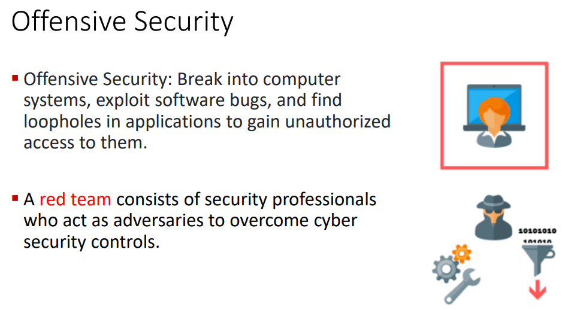
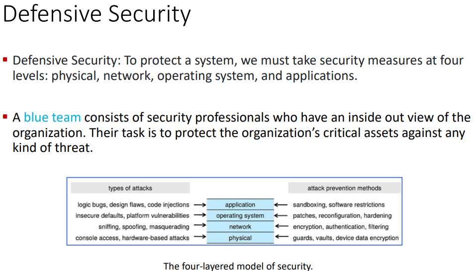

toc:
- [Security](#security)
  - [How Systems Fail](#how-systems-fail)
  - [What is Security](#what-is-security)
  - [Info Security Strats](#info-security-strats)
- [Protection](#protection)
  - [Goal of protection](#goal-of-protection)
  - [Principles of Protection](#principles-of-protection)

# Security

>"I will tell you a few stories today. Everybody loves a good story that is perfectly fine but they also have some kind of impact on hardware and software design" - Professor


Starting at Lawrence Berkely Laboratory (LBL or Berkely Lab) in California had the 75 cent error.
They were performing research for some energy dept.
They were connected to many other institutions, army bases, and defense contractors over the combination arpanet and milnet.

How could this happen?

```
prof wanted to show us a cool little video 

 Clifford Stoll - Watch from 2:22 to 5:05 - Movie: The KGB, the Computer, and Me
available at https://www.youtube.com/watch?v=PGv5BqNL164
```

Clifford Stoll was a grad student at UC Berkely.
He pointed out the 75 cent error after taking a summer job there.

Stoll found out that a single account was responsible for this.
Surely,
just a prankster of u cali.
This account was the acct of a prof who was on sabattical after all.


The account from a prof who was on sabattical.

Clifford got a notification that someone was trying to log into docmaster.


tons of pinging from the person trying to login and creating tons of accounts


LBL was a part of a huge network of very important organizations' computers.
An attacker started from Tymnet machines.


By gaining the privileges the attacker was able to move between machines.

movemail
- worked by changing the file ownership and moving it to the designated user's folder
- permanently ran as sudo
  - `movemail` can write into protected system folders
  - given access to any and every folder
  - also had access to `atrun` folder
- the attacker
  - wrote a script
  - used `movemail` to put the script in the `atrun` folder
  - set the script to execute in 5 minutes
  - the script gave his account superuser privileges

The attacker used the new privileges to make more accounts.

An original thought was to start locking down all those accounts.

But Stoll wanted to get to the root of it.
Who is the hacker, what are they doing, and why?


Stoll had a gf (SHOCKING)
who suggested making some fake docs to lure the attacker to stay in a machine long enough to trace the connection.

This is what would come to be known as a honeypot.

The honeypot of fabricated docs that were supposed described the Strategic Initiative (SDI) aka the Star Wars program.

The honeypot worked and they traced it back to a West German man named Markus Hess.

It took 6 months to get to this point.

3 years later Stoll was flown into Germany to testify.

```
prof likes this summary

Watch The 1985 KGB Hack (6:43 minutes) at
https://www.youtube.com/watch?v=dFagMZLMI6o
```

There was no huge damage in the end though.


---

New story: passwords and power drills

This story ends with someone using a power drill to crack open a safe.

In 2012,
google had their own internal password manager to store and share secrets for third-party services that don't support better auth mechanisms at the time.

Initially for very few people.

This was used for the auth for shuttlebus wifi for google employees.


`In 2012, Stamen Design tracked the movements of
tech shuttles and created a map of them - a map that
was never created or released by the companies
themselves who keep routes and stops secret.`


This crashed the service b/c everyone hopped on to load up the password.


It took an hour for everyone to realize that they were putting the card in wrong.

password manager failure was triggered by an availability problem:
poor load-balancing.

recovery complicated by multiple measures designed to increase system sec
- improve breakglass mechanisms
  - mechanisms to bypass policies to allow engineers to quickly resolve outages

---

march 2012 there was a power outage at a google datacenter in in belgium

turn out a cat destroyed some nearby external psu thingies


---
in 2006 an open-source dev noticed that the memory debugger Valgrind was reporting warnings about memory used prior to initialization.

to eliminate the warnings, the dev removed two lines of code.


cuased a bug in OpenSSL's pseudo-random number gen.
Only got seeded w/ process ID.

lead to things being easily brute force breakable.

understanding the systems' adversaries is critical to buildilng reliable and secure systems

adversaries to reliability are typically benign, routine hardware failures or config changes that make unintended effects

security adversaries are typically humans trying to make the system work in a way that they want

## How Systems Fail

many reasons including
- reliability
  - accidental failures
- usability
  - failures from operating mistakes
- design and goal oversights
  - oversights, errors, adn omissions during designing
- security
  - intentional failures created by intelligent parties

all of the above are related

## What is Security


CNSS Security Model
- Committee on National Security Systems (CNSS)
- serves as standard for understanding many aspects of infosec


still used today.

ahead of his time

3 dimensions of infosec
- info characteristics
  - confidentiality
  - integrity availability
- security controls
  - policy
  - education
  - technology
- information location
  - storage
  - processing
  - transmition

Each cube cell is a specific 3 way intersection that we should be thinking about


AAA processes
- start with identification
  - subject must provide an identity to a sytsem to start the AAA processes
  - identities should be
    - unique
    - securely issued
  - non-descriptive of role
- authentication
  - proves identiy of subj that tires to connect
  - subject must supply verifiable creds referred at as factors
    - single-factor
      - just one pasword
    - multifactor
      - two or more
      - password + duo mobile
      - bank card + pin
  - factor categories
    - knowledge - something you know
      - passowrd, pin, answer to security questions
    - possession - something you have
      - one time auth password, smart cards, ubikey
    - biometrics - something you are
      - fingerprints, eye scan
  - you might notice that these days the message for an incorrect username or password are the same message, this is also a security measure
- authorization
  - determines what a user is allowed to do on a computer system or network
  - the model for this defines how access rights and permissions are granted
    - there are many different models
      - rule based
      - dynamic
      - discretionary
      - 
- accounting
  - auditing and monitoring what a user does w/ accessed resources
  - produce audit trail log
  - when the user accessed the resource
  - what the user did with that resource
  - when the user stopped using that resource

## Info Security Strats

don't just hope that it works out for you

off sec (read team) and defensive sec (blue team)

zero trust security: never trust, always verify






# Protection

## Goal of protection

defend the system from internal or external attacks

concerned with controlling access of processes or users to the resources of the computer system.

Protection problem
- ensure that each object is accessed correctly
- only accessed by those processes that are allowed to do so

## Principles of Protection

protection principles including but not limited to
- principle of least privilege
  - similar to need-to-know basis
  - properly set perms can limit damage in the case of bugs or abuse of perms
  - can be static or dynamic
    - static during life of system or pocess
    - dyanmically changed by process as needed
      - privilege escalation
- compartmentalization
  - derivative concept regarding access to data
  - protect each individual system component
  - use specific permissions and access restrictions
  - ex
    - we can have a virtual testing machine so that if the testing machine gets compromised we can kill it very easily and hopefully the attacker doesn't know to try and jump the hypervisor
    - we don't even have to do a full blown vm for some usecases
- audit trail
  - recording all protection-oriented activities
  - important to understand
    - what happened
    - why
    - what happened that shouldn't have happened

Defense in Depth
- application of multiple, sometimes redundant, defense mechanisms
- if a single control fails then the other controls can still protect the env and assets
