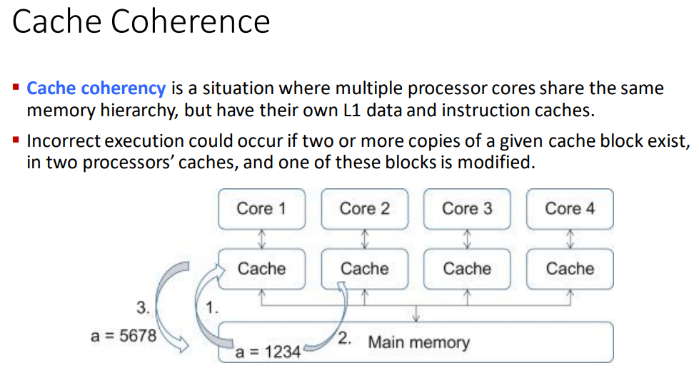
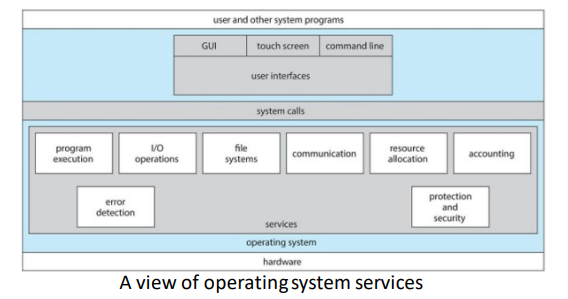

toc:
- [Computer System Architecture](#computer-system-architecture)
- [Operating System Operations](#operating-system-operations)
  - [Multiprogramming and Multitasking](#multiprogramming-and-multitasking)
  - [Dual Mode](#dual-mode)
    - [Transition from User to Kernel Mode](#transition-from-user-to-kernel-mode)
  - [Resource Management](#resource-management)
    - [Process Management](#process-management)
    - [Memory Management](#memory-management)
    - [File-System Management](#file-system-management)
    - [Mass-Storage Management](#mass-storage-management)
    - [Caching Management](#caching-management)
      - [Cache Coherence](#cache-coherence)
    - [I/O Subsystem Management](#io-subsystem-management)
- [Operating System Services](#operating-system-services)
  - [For the User](#for-the-user)
  - [For the System](#for-the-system)
- [User Operating System Interfaces](#user-operating-system-interfaces)
- [System call](#system-call)

We look at generic operating system design in this course.

Different designers have different paradigms and ideas.

POSIX is used for linux and macOS

Android uses different things.

The fundamentals are all the same but we may have different names for things and different styles of schedules.

For specific issues we may look at examples of how different operating systems do things

# Computer System Architecture

we can categorize a computer system according to the # of general-purpose processors used:
- in contrast to application specific processors
  - found less often or even not at all
- single-processor systems
- multiprocessor systems
- clustered systems
  - different machines that work together


general purpose processor:
- type of microprocessor designed to handle a wide range of takss and applications
- the typical processor

single processor system:
- old days
- most systems used to use only one cpu
- a core is a basic computation unit of the cpu
  - a unit that can execute instructions

```
prof's dad used to work at msx

that was her first computer

it was popular in the middle east and asia

there was a huge pyramid scheme surrounding msx

she remembered playing hangman on it with her brother

hunt and peck typing to code up hangman.

they had to reprogram hangman everytime they wanted to play since they didn't know how to save shit or I think they couldn't idk.

she saw the rise of the era of the 1.44 mb 3.5 inch floppies

if we had a lab this would've been so cool to listen to but rn idk
```

Most systems have special-purpose processors as well.

We might have graphics processors and all that

multiprocessor:
- these now dominate the landscape of computing
- aka parallel systems, tighly-coupled systems
- advantages:
  - increaseed throughput
  - increased reliability - fault tolerance
- 2 types of systems
  - symmetric multiprocessing
    - each processor performs all tasks
    - processors share memory
  - asymetric multriprocessing
    - each processor perofrms a specific assigned task


Symmetric:
- most common and what we're working with
- each processor has a cpu w/ their own registers
- they also have their own private/local cache
- All processors share physical memory over the system bus
- `N` processes can run if there are `N` CPUs

multicore systems can be more efficient than multiple chips with single cores because on-chip communication is faster than between-chip communications

each core effectively acts as a separate cpu in terms of execution (there are some caveats) and can more quickly communicate with one another.

One chip w/ multiple cores uses significantly less power than multiple single-core chips.

There's always a lot of overhead that comes in the form of inter-process and inter-program communication as well as resource allocation.
These problems feed back into one another as they need to communicate about the resource allocation.
It's a big fucking mess

Dual-Core design

each core has it's own reigster set and it's own local cache often referred to as L1 cache

The level 2 or L2 cache is local to the chip and is shared by the two processing cores.

multicore processor with `N` cores appears to teh operating systems as N standard CPUs

Clustered Systems:
- 2 or more individual systems (known as nodes) joined together
- each node is typically a multicore system
- no shared memory
- loosely coupled systems
- usually there is shared storage via a Storage-Area Network (SAN)
  - usually for very large networks
  - prof used to use a lot of SANs back in her old job
- communication at a hardware and software level
  - there is clustering software that shows the status of every node and all that
  - at the hardware level there is a sort of mini-operating system
  - maybe not too important but cool
- all cloud servers are clustered so that any server going down is invisible to the user
  - if you ping a server that goes down then you might not even notice as the ping just gets redirected
- all linked together to communicate via a Local-Area Network (LAN)
- provides high availability and fault tolerance service which survives failures and provides increased reliability which is crucial in many applications
  - financial applications

Asymetric clustering:
- one machine in hot-standby mode while the other is running the applications
  - if server fails then standby becomes the active

symmetric clustering:
- multiple nodes running the applications and monitoring each other
- more efficient
- all active at the same time

Some clusters are for high-performance computing (HPC)
- applications must be spciallly writeten for use parallelization

```
Prof told us about PS/2, hdmi, dvi, and other ports and allat

Going over the anatomy of the motherboard.

The old university monitors still use vga and all of that.

Prof tells us how to intsall cpu and ram.
```


# Operating System Operations

## Multiprogramming and Multitasking

Allows the operating system to run multiple programs

Multiprogramming (batch system) needed for efficiency:
- single user cannot keep CPU and I/O devices busy at all times
- multiprogramming organizes jobs (code and data) so CPU always has one to execute
- a subset of total jobs in a system is kept in memory
- one job selected and run via job scheduling
- when it has to wait (for I/O for ex), OS switches to another job

multitasking is a logical extension in which CPU executes multiple processes by switching among them very quickly.

Interactive computing.

multitasking
- each user has at least one program executing in memory, a process
- if several jobs are ready to run at the same time then we scheudle jobs for the cpu
- if processes don't fit in memory then we swap them in and out of memory in order to run

multiprogramming only can only execute one program at a time meanwhile all other processors are waiting for the processor.

With multiprocessing, more than one process can be running simultaneously, each on a different processor.


Both of these let us run programs "at the same time".

## Dual Mode

Dual-mode operation:
- OS able to protect itself and other system components
- 2 modes
  - user mode
  - kernel mode
- mode bit is provided by hardware
  - distinguish between system running user or kernel code
  - some instructions are only executable in kernel mode
    - privileged instructions
  - system call changes mode to kernel mode
  - return from system call resets it to user mode

CPUs increasignly support multi-mode operations
- Virtual Machine Manager (VMM) mode for guest VMs

`I'm thinking most of the operating system shit lives in kernel mode.`

### Transition from User to Kernel Mode

Operating system must always be in control of the CPU.

The user program can't get stuck in an infinite loop or fail to call system services.

We use a timer to stop that from happening.
When the timer runs out it interrupts the computer.
The time length can either be fixed or variable.
No matter what we are able to regain control or terminate the program that goes over time.

There are different timers.

For example on linux systems we can observe different types of timers based on how the kernel is configured, what kind of machine it's on, and what the architecture of the components are like.
We can configure a certain number of interrupts per second for example and it's a HZ value.

Crucial takeaways:
- a timer can be used to prevent a user program from never returning control to the operating system
- kernel mode has many different names
  - supervisor mode
  - system mode
  - privileged mode

## Resource Management

Remember that the operating system is a resource manager.

File space, i/o, processes, memory, chache, etc. all managed by the OS

### Process Management

Process management:
- a process is a program in execution
  - program is passive entity
  - process is active entity
  - unit of work within the system
  - once we run a program we have a runtime environment
    - allocated area in the memory where we will load in the code and text and stack and other values/variables that we need for the process
- process needs resources to accomplish its task
  - CPU cycles
  - memory space
  - I/O
  - files
  - initialization data
- upon termination, resuable resources are reclaimed

Threads and Processes:
- threads can be single-threaded or multithreaded
- single-threaded
  - one program counter specifying the location of the next instruction to execute
  - process executes instructions sequentially
- multi-threaded
  - one program counter per thread
  - requires a multicore processor, each core works on a different thread
  - most processes aren't multithreaded

Issues to Consider with Process Management
- synchronization
  - coordinate processes that need to share data
- mutual exclusion
  - how to make processes or users share a resource at the same time
- deadlocks
  - \>=2 processes can't continue b/c they are waiting for the others to do something
- livelock
  - \>=2 processes continuously change their states in response to changes in other other process(es) without doing anything useful
  - "you go first" "no you go first" "no you go first" "no you go first" "no you go first" "no you go first" and then we do nothing forever
- starvation
  - process is overlooked indefinitely by the scheduler
  - it can proceed but is never chosen

We're going to be looking at the pseudocode and underlying theory for programs that do this stuff correctly.

After that we can look at some real, runnable code to see what's really going on.

There's a lot of groundwork that needs to be done until we can even understand what the demos we're going to get are doing when we run them.

Activities connected to process management:
- creating/deleting user and system processes
- suspending/resuming processes
- providing mechanisms for
  - process
    - synchronization
    - communication
  - handling deadlocks

### Memory Management

All or part of the instructions and data needed for a program in the memory in order to execute the process.

Memory management optimizes cpu utilization and response to users.

What's in the memory and when.

Memory Management Activities:
- keep track of what memory is being used by who
- decide which processes (and their parts) and data to move in/out of memory

### File-System Management

most visible component

uniform, logical view of information storage

Abstracts from the physical properties of its storage devices (stores 1s and 0s and engravings and shit) to define a logical storage unit - file (`.c`, `.java`, `.py`, `.txt`, `.exe` files)

Each storage medium is controlled by a device with various processes
- access speed
- capacity
- data-transfer rate
- access method
  - sequential or random

Activities:
- organize files into dirs
- manage access perms
- os activities
  - creating/deleting files/dirs
  - primitives to manip files and dirs
  - mapping files onto secondary storage
  - backup files onto stable(non-volatile) storage media

### Mass-Storage Management

storing things like code and data when not in memory

Long term storage.

Very important to manage properly

Speed of computer operation hinges on this subsystem and its algos.
How do we read and write in an efficient way

SSDs have semiconductor tech that's really good but still very expensive so we still have to take other forms of storage into account.

Some storage doesn't even have to be fast, just very long lived, large, and cheap.

Optical drives and magnetic tapes fall under the above category but they still need to be managed by OS or applications.

```
Q: When I move a file to another computer, how does the other computer know what kind of file it is?

A: Every operating system has their own system to manage files. But there are many universally used ways of interpreting the files. The physical files themselves are the same so we just have to worry about the interpretation. Some files are platform specific (`.msi` = microsoft installer, `.deb` = debian package file) and they can't be interpreted properly by machines with the wrong operating system
```

OS Activities:
- (un)mounting
  - (dis)connect to storage medium
- free-space management
  - if you want to write, where do you go to write?
  - do we even have enough space to write?
- storage allocation
- disk scheduling
- partitioning
- protection

### Caching Management

Recall that cache is a faster piece of storage that we place frequently accessed data that we would ordinarily store in slower storage.

Caches have limited size so we need to manage what we store in there and when.

The size and replacement policy can greatly impact performance.


CPUs have cache that the OS doesn't really mess with but there's other forms of cache that the OS is concerned with

Access time:
- time needed to arrive at the byte we want to read/write
- takes time to do the calculation and find the exact address
- the time the cache tech needs to arrive at the right location

Bandwidth:
- speed of the read/write
- a unit of data per second, typically megabytes


#### Cache Coherence


```
transcribed:

Cache coherency is a situation where multiple processor cores share the same memory hierarchy, but have their own L1 data and instruction caches

Incorrect execution could occur if two or more copies of a given cache block exist, in two processors' caches, and one of these blocks is modified.
```

There might be multiple processors with their own caches but there could be some incorrect execution that results in 2 or more copies of a cache block to exist in 2 different processors' caches

This is a problem when we try to write back that cache.

### I/O Subsystem Management

OS is meant to hide particularities of hardware devices from the user

responsible for:
- memory management of I/O
  - buffering - temp storage of data while being transferred
  - caching - storing parts of data in faster storage for performance
  - spooling - overlapping output of one job with input of other jobs
- general device-driver interface
- drivers for specific hardware devices

Everything not under processor or memory management can be thought of as being I/O in general but in this course we think of things more granularly

---

Q: Two important design issues for cache memory are

A: Size and replacement policy

Q: What is the unit of work in a system?

A: Process

# Operating System Services

OSes provide an env to execute programs and services for users and other programs

2 types of OS Services with different goals:
- helpful to user
- efficient operation of the system itself

Services for the system and services for the user

## For the User

The user does not have to be aware of how all of this works

User Interface:
- almost all operating systems have a User Interface (UI)
- types:
  - Command-Line (CLI)
  - Graphical User Interface (GUI)
  - touch-screen



Program Execution:
- load program into memory
- run program
- end execution
  - normally or abnormally and give error

I/O ops

File System Manip:
- read/write files
- create/delete dirs
- search for files/dirs
- list file/dir info
- manage perms

Communications:
- exchange info within or without the computer using a network
- shared memory or message passing via packets moved by the OS

Error Detection:
- constantly aware of all errors and what to do
- errors in CPU, memory, I/O devices, and programs
- give debugging facilities

```
Q: What service is it when we force quit a program?

A: Things can go wrong on the software level, hardware level, or any number of other levels (within those levels). The best thing to do is dive into the debugging hole. If you're at a low level then you can see each instruction execute one at a time. EAX register, RAX register available to you. If you're at a higher level then you'll likely just get an error code to work it out.

It depends on what is happening. 
```

## For the System

Resource Allocation:
- same as before
- make sure no one can access what they shouldn't be able to

Logging:
- keep track of what's being done and by who with what resources

Protection and Security:
- control information that is stored and used
- concurrent processes should not interfere with each other
- protection ensures that all access to system resources are controlled
- security
  - outside users require authentication
    - passwords
    - biometrics
    - physical key - yubikey
    - 2FA
  - defend against external I/O devices from invalid access attempts
- once users are allowed in, the OS looks on the Access Control List (ACL) to see what the user is allowed to do

---

System call interface is the boundary between user programs and operating system services.

Yes

Is the GUI the most common UI?

It depends. CLI might be more common depending on what you're doing.

There's probably more CLIs kicking around in total but people mostly use GUIs

Touch screen is used on mobile a lot

yes

# User Operating System Interfaces

CLI or command interpreter allows direct command entry
- implemented by kernel or some system programs
- sometimes multiple different kinds of interpreters implemented
  - known as `shells`
  - shell is loaded into run time env and we execute from there
- sometimes commands built-in, sometimes just names of programs
  - in the latter case then we don't have to modify the shell itself to add new features
    - the shell is just a powerful program that can run other programs directly and access the resources
  - we have the latter case a lot in our linux systems, even if we think things are built in they're really just programs in the `/bin/` directory
- shell is merely the interpreter that you put in commands, the OS looks at what to do with that command, and runs the program
- access to the shell is access to the whole computer

```
prof loves security, very passionate
```

GUI:
- user-friendly desktop metaphor interface
  - usually mouse, keyboard, and monitor
  - icons represent files, programs, actions, etc
  - invented at Xerox PARC
- Big developments in GUI designs come from open-source projects
  - KDE - K Desktop Environment
  - GNOME desktop by GNU project
  - both run on linux and unix systems
  - source code readily available for reading, modification, and even contribution under specific license terms

Touchscreen:
- impossible/undesired mouse
- gesture based
- virtual keyboard
- uses a lot of voice commands

---

Remember that there are many different kinds of shells to choose from

# System call

Provides a programming interface to the services provided by the OS

System calls are typically written in a high-level language (C or C++).


Mostly accessed by programs via a high-level Application
Programming Interface (API) rather than direct system call use

API specifies a set of functions that are availbe to an application programmer

params passed to functions to return expected values

3 most common:
- Win32 API for Windows
- POSIX API
  - UNIX, Linux, Mac OS X
- Java API for Java Virtual Machine

We might use system calls for:
- copying contents of one file to another file

Types of System Calls:
- Process control
- File management
- Device Management
- Information Maintenance
- Communications
- Protection

System calls are run in kernel mode
