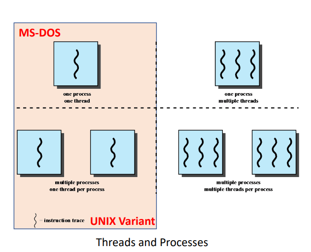
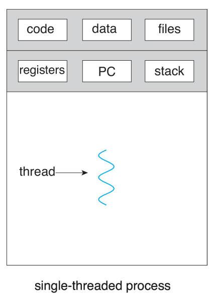
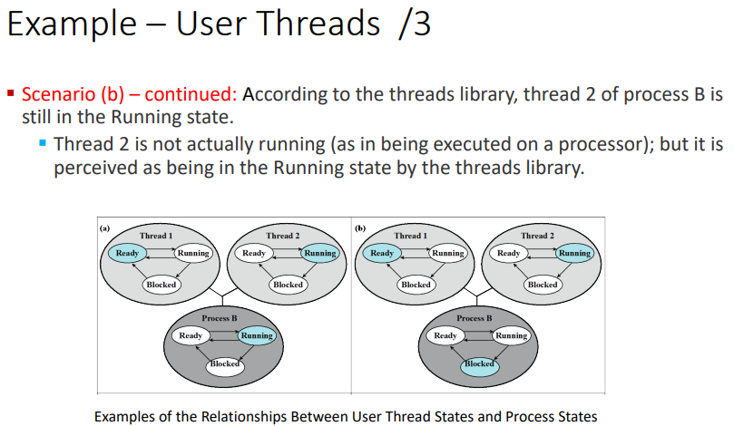
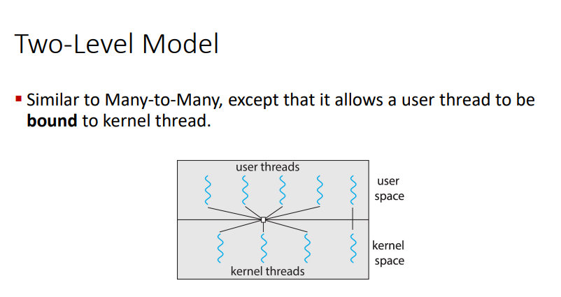

toc:
- [Processes and Threads](#processes-and-threads)
  - [Threaded Approaches](#threaded-approaches)
  - [What is a Thread](#what-is-a-thread)
  - [Why Multithread?](#why-multithread)
- [Multicore Programming](#multicore-programming)
  - [Concurrency vs Parallelism](#concurrency-vs-parallelism)
  - [Amdahl's Law](#amdahls-law)
  - [Thread States and Operations](#thread-states-and-operations)
  - [Thread Synchronization](#thread-synchronization)
- [Multithreading Models](#multithreading-models)
  - [User Threads](#user-threads)
  - [Kernel Threads](#kernel-threads)
  - [Combined User and Kernel level threading](#combined-user-and-kernel-level-threading)

# Processes and Threads


The actual fetching and execution of the instructions is thought of as a thread or lightweight process (LWP).

Most unix based processing will say threads.

Some OSes don't differentiate between threads and processes, treating them all as processes.

THe process model introduced so far assumed that a process as an executing program with a single thread of control.

Virtually all modern operating sytems, however, provide features enabling aprocess to contain multiple threads of control.


## Threaded Approaches

Single threaded approaches

a single thread of execution per process

threads are not recognized



ex.
- ms-dos
- old linux


we can make it seem as though the processes are all working simultaneously but we're actually just switching around very quickly

## What is a Thread



thread is a basic unit of cpu utilization
- each thread knows its parent process
- thread ID
- program counter
- a register set
- a stack

thread = instruction trace


If a process has multiple threads of control then it can perform more than one task at a time.

Threads belonging to the same process
- share
  - code section
  - data section
  - other operating system resources
    - open files
    - signals
- have unqiue
  - registers
  - stack
  - PC
  - ID

## Why Multithread?

Most modern applications are multhreaded

an application is typically implemented as a separate process with several threads of control

multiple tasks with the application can be implemented by separate threads for different reasons

ex:
- making thumbnails of tons of different images at once
  - 1 thread per image
- loading a webpage
  - 1 thread for text
  - 1 thread for images
- word processors
  - 1 thread for responding to keystrokes
  - 1 thread for displaying graphics
  - 1 thread for spell checking

we feed each thread a different task and they don't interfere with one another

multithreading is also good for client/server applications


Server will have
- have a port open and a thread to listen for connection requests
- make a thread to do what the request wants
- the open port
  - very vulnerable
  - an open door
  - necessary as otherwise no one can connect

Q: why multithread and not multi proces

A: It's much faster
- process creation is heavywhite while thread creation is lightweight
- creation, termination, and switching of threads is faster than with processes
- threads are ten times faster to create than processes in UNIX

kernels are generally multithreaded
- during system boot time on linux system, several kernel threads are created
- each thread performs a specific task
  - device management
  - memory management
  - interrup handling
  - etc

benefits of multithreading
- responsiveness
  - allow contonued execution if part of th eprocess is blocked
  - good for user interfaces
- resource sharing
  - threads share resources of process
  - easier than shared memory or message passing b/w processes
- economy
  - cheaper than process creation
  - thread switching lower overhead than context switching
- scalability
  - process can take advantage of multicore architectures
  - one process can use at most one core
  - multi-threads could use all available cores or CPUs
  - speed of execution

# Multicore Programming


multicore:
- multiple computing cores on a single chip
- each core appears as a separate CPU to the operating system
- each core can execute 1 trace at a time

```
word on caches, specifically in this intel architecture

L1 cache has all of the instructions and stuff.
All the highest value things

L2 can allow communication between 2 cores physically next to one another. They look separate in the diagram but that's just the allocation we do, they can look at each other's work and talk to one another basically.

L3 is on the chip and is shared by all of the cores

There are different kinds of architectures out there so the interesing L2 cache sharing won't be true of every architecture.
```

multithreaded programming
- provides a mechanism for more efficeint use of these multiple computing cores and improved concurrency

we need to program properly in order to take advantage of the presence of multithreading

## Concurrency vs Parallelism

Parallelism
- implies a system can perform more than one task simultaneously
- 2 cores doing 2 threads at the same time
- working in parallel

Concurrency
- supports more than one task by allowing all the tasks to make progress

Q: Is it possible to have concurrency without parallelism?

A: yes. utilize thread switching.
parallelism requires parallel execution.
We can have all the tasks progress together without parallel execution by way of thread switching.

```
parallelism cannot happen on a single core

parallelism implies concurrency

there can be concurrency on a single core

parallelism is faster than concurrency alone
```


We are either parallelising data or tasks

data parallelism:
- distribute distinctive chunk of data across multiple cores, and perofmr the same operation on each
- ex
  - each core gets a different image
  - each core performs the same operation of creating a thumbnail

task parallelism
- distributing threads across cores
- each thread performs a unique operation
- not necessarily all working on the same data
  - 1 core is summing rows
  - 1 core is averaging rows
  - 1 core is finding the median
  - all may or may not be working on the same rows

There are a number of challenges that come with programming for multicore or multiprocessor systems
- dividing activities into separate concurrent takss
  - what takss are independent of each other
- balance
  - pick tasks that perform equal work of equal value
- data spliting
  - data accessed and manip'd by the tasks must be divided to run on separate cores
- data dependency
  - see what tasks require what data and see which pieces of data are shared by tasks
- testing and debugging
  - testing and debugging concurrent programs is inherently more difficult than testing and debugging single-threaded applicdations

Many deveopers argue that the advent of multicore systems will require an entirely new approach to designing software systems in the future.

Many educators believe that there should be an increased emphasis on parallel programming in software development.

## Amdahl's Law

Identifies performance gains from adding additional cores to an application that has both serial and parallel components

$$
speedup\le\frac{1}{S+\frac{(1-S)}{N}}
$$
- $S$ - serial portion
- $N$ - processing cores

example:
- application is
  - 75% parallel
  - 25% serial
- 1 core $\rarr$ 2 cores
$$
speedup\le\frac{1}{0.25+\frac{(1-0.25)}{2}}
\newline
= \frac{1}{0.25+\frac{0.75}{2}}
\newline
= \frac{1}{0.25+0.375}
\newline
= \frac{1}{0.625}
\newline
= 1.6
$$
- 1 core $\rarr$ 4 cores
$$
speedup\le\frac{1}{1/4+\frac{(1-1/4)}{4}}
\newline
=\frac{1}{1/4+\frac{3/4}{4}}
\newline
=\frac{1}{1/4+3/16}
\newline
= \frac{1}{7/16}
\newline
= 16/7
\newline
\approx 2.28
$$

as $N$ approchaes infinity
- speedup approaches 1/S
- 50% of application is serial, maximum speedup = 2 regardless of $N$

serial portion of an application has a dispropportionate effect on performance gained by adding cores.

---
Knowledge Check:
- parallelism involves distributing tasks across multiple computing cores
- use amdahl's law to find the speedup gain for an application that is 60% parallel component for 2 processing cores
  - 1.43
- it is possible to have concurrency without parallelism

---

## Thread States and Operations

Key states for a thread
- running
- ready
- blocked

thread operations associated with a change in thread state are:
- spawn
  - new process is spawned, a thread for that process is also spawned
- block
  - a thread needs to wait for an event and is blocked
- unblock
  - the event the thread was waiting for has occured, the thread is moved to the ready queue
- finish
  - thread completes. deallocate register, context, and stacks

## Thread Synchronization

We need to synch up the activities on the threads because:
- all threads share the same resources
  - namely address space
- one thread altering the shared resource will affect the other threads in the same process


# Multithreading Models

Types of threads:
- user threads
  - supported above the kernel
  - managed by user-level thread library w/o kernel support
- kernel threads
  - supported and managed directly by the kernel

virtually all contemporary operating systems support kernel threads

thread libraries contain code for:
- creating an ddestroying threads
- passing messages and data between threads
- scheduling thread execution
- saving and restoring thread contexts

3 primary thread libraries
- POSIX Pthreads
- Windows threads
- Java threads

## User Threads

User Threads
- many are mapped to a single kernel thread
- kernel is not aware of the existence of threads
- thread management is done by threda library at the user level


---
examples


Process `B` has 2 threads.
OS only sees process `B`,
not its threads


We're blocking the whole process.

The threads remain in their states but they aren't actually doing anything.

We can't just switch to thread 1 as the kernel isn't aware of the threads,
only the process.




---

pros:
- thread switching does not require kernel mode privileges
  - saves overhead of two mode switches
- scheduling can be application specific
  - scheduling algo can be tailored to the application
- ULTs can run on any OS

cons:
- entire process wil block if a single thread makes a blocking system call
- pure ULT strat, multithreaded application cannot take advantage of multiprocessing/parallelism
- very few systems use this model because of its inability to utilize multiple cores
  - solaris green threads

## Kernel Threads

thread management is all done by the kernel

creating a user thread creates a kernel thread (one-to-one)

kernel maintains context information fo rthe process as a whole and for individual threads within the process


pros:
- kernel can simultaneously schedule multiple threads from the same process on multiple processes
- if one theread in a process is blocked, the kernel can schedule another thread of the same process
- linux and windows implement this

cons:
- 1-1 correspondence b/w user and kernel threads will burden the performance of a system after creating a large number of threads
  - so many threads to have to switch between

## Combined User and Kernel level threading

- thread creation done in user space
- most of scheudling and synchronization of threads within an application
- multiple user-level threads from a single application are mapped onto smaller or equal number of kernel threads
  - many-to-many
- number of kernel threads may be specific to either a particular application or a particular machine


Note:
- we can't map 3 threads to 4 cores.
- a kernel thread can only belong to one processor
- a user thread can only map to one kernel thread

pros:
- appears flexible
- number of threads and parallelism
  - many-to-one (pure ULT)
    - create many threads but no parallelism
  - one-to-one (pure KLT)
    - better concurrency but high overhead
  - many-to-many (combined approach)
    - as many threads as needed running parallel on a multiprocessor
- blocking
  - when a thread performs a blocking system call, the kernel can schedule another thread for execution 

cons:
- difficult to implement
  - windows with the `ThreadFiber` package
  - not very common outside of the above

Whether KLT or ULT remember that

a relationship must exist between user threads and kernel threads no matter the cardinality




2-level model is like many-to-many but we're able to bind a user thread to a kernel thread.

we can basically dedicate a core to a thread.

Q: can we interleave threads from different processes?

A:
This is just normal process switching.

---
knowledge check


---


prof:

"the threads need to have a connection to the processor in order for execution"
