toc:
- [Recap for CPU Scheduling](#recap-for-cpu-scheduling)
- [Basics for CPU Scheduling](#basics-for-cpu-scheduling)
- [Scheduling Criteria](#scheduling-criteria)
- [Scheduling Algos](#scheduling-algos)
- [Multi-Processor Scheduling](#multi-processor-scheduling)
  - [Multicore](#multicore)
  - [Multithreaded Cores](#multithreaded-cores)
  - [Load Balancing](#load-balancing)
  - [Processor Affinity](#processor-affinity)
  - [NUMA Systems](#numa-systems)
  - [Hetereogeneous Multiprocessing](#hetereogeneous-multiprocessing)
- [Real-Time CPU Scheduling](#real-time-cpu-scheduling)
  - [Priority Based Scheduling](#priority-based-scheduling)
- [Algo Eval](#algo-eval)
  - [Deterministic](#deterministic)
  - [Queueing Models](#queueing-models)
  - [Simulations](#simulations)
  - [Real Implementation](#real-implementation)


# Recap for CPU Scheduling


# Basics for CPU Scheduling

Kernel threads are ht eones being scheduled.

"Process scheduling" and "thread scheduling" are often used interchangeably.

We say CPU to mean CPU core as a computation unit

Maximum CPU utilization obtained with multiprogramming

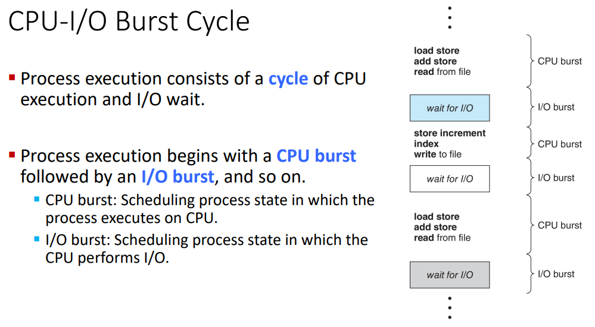

We alternate working (cpu) and wait (i/o) bursts.

We end on an I/O burst as the process is ending


On the histogram:
- above is cpu-bound
- below is i/o bound


Reminder: the whole process itself isn't in the queue, just the pcb (which has all the info and points to where the process actually is)


Preemptive scheduling makes decisions at all these times.


---
Knowledge Check
- which of the following is true of cooperative scheduling
  - b. A process keeps the CPU until the releases the CPU either by terminating or by switching to the waiting state.
- In preemptive scheduling, the sections of code affected by interrupts must be guarded from simultaneous use
  - True
  - we want to ensure mutual exclusion
  - we want to make sure no other process is accessing at the same time

# Scheduling Criteria

- cpu util
  - keep as busy as possible
  - maximize this
- throughput
  - num of processes that complete their execution per time unit
  - maximize this
- turnaround time
  - amount of time to execute a particular process
  - minimize this
- waiting time
  - aggregate amount of time a process has been waiting int eh ready queue
  - will be affected by scheduling algo
  - minimize this
- response time
  - time between request submission and first response for interactive systems
  - minimize this

All numbers in milliseconds (ms) unless stated otherwise.

For now we assume we have 1 cpu.


# Scheduling Algos


we're assuming these all arrived at (more or less) the same time since there is no `arrival time` column in the chart.
We assume in order of number just because it's convenient here.

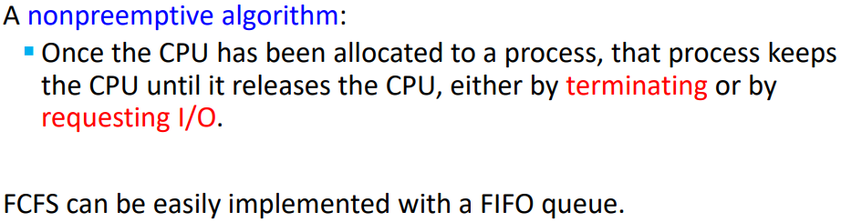

different orders will result in different wait times but FCFS can't account for that


Convoy effect:
- short process behind long process
- consider one cpu-bound and many i/o-bound processes


FCFS is not good for interactive systems
- important that each process get a share of the cpu at regular intervals


Shortest-Job-First (SJF) Scheduling
- for each process, associate the length of its next CPU burst
  - use these lengths to schedule the process with the shortest time
  - shortest-next-cpu-burst is a more accurate description
- SJF is optimal
  - gives minimum average waiting time for a given set of processes

If the next bursts of 2 processes are the same, FCFS scheduling is used to break the tie.

But how do we know how long the next cpu burst is?
We can ask the user but there's more to it.


Remember that waiting time is the time that the process waits to ***start*** not to finish.

So the above calculation w/ start time $s_i$ for process $p_i$ would look like this:

average waiting time $= (w_1 + w_2 + w_3 + w_4)/4$

For FCFS we'd have

average waiting time $= (0+6+14+21)/4=10.75$

We can only estimate the length,
typically assumiing it to be similar to the previous one.
Then pick the process with the shortest predicted next CPU burst.

We use an exponential averaging of the length of the previous cpu bursts

$\tau_{n+1}=\alpha t_n + (1-\alpha)\tau_n$
- $t_n$ = actual length of $n^{th}$ CPU burst
- $\tau_{n+1}$ = predicted value of the next CPU burst
- $\alpha\in[0,1]$, typically $\frac{1}{2}$ for our applications

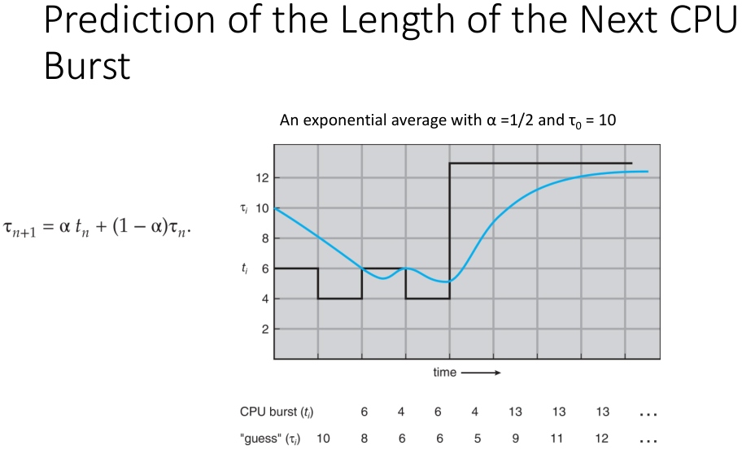

We start by predicting 10 ms for the first burst.

It actually uses 6 ms.

We use these values to predict the next burst.

$$
\tau_{n+1}=\alpha t_n + (1-\alpha)\tau_n
=\frac{1}{2}6+(1-\frac{1}{2})10
=8
$$

Then we check against the next actual burst length.

So on and so forth.

The predictions aren't the tightest at times but they're not too too far off.

Note that we're using the actual previous burst time as well as the prebious prediction in our calculations to predict the next burst time.

---
More on exponential averaging:
- $\alpha=0$
  - $\tau_{n+1}=\tau_n$
  - recent history does not count
- $\alpha=1$
  - $\tau_{n+1}=\alpha t_n$
  - only the actual last CPU burst counts

Exponential averaging is a series that we use for prediction in genearl,
not just for processors.

Tweaking the $\alpha$ value will allow us to put more weight on near or far.

---

Preemptive vs Non-Preemptive
- SJF can be either
- the choice arises when anew process arrives at the ready queue while a previous process is still executing
- the next burst of the newer process may be shorter than what is left of the currently executing process
- in this scenario
  - if preemptive
    - preempt the currently executing process
    - sometimes known as `shortest-remaining-time-first-scheduling`
  - if non-preemptive
    - allow the currently running process to finish its CPU burst

The context switches take about 10 microseconds so preempting here is fine for us as we're typically just working in milliseconds.


- $P_1$ arrives and works for 1 ms
- $P_2$ arrives and has 4 ms compared to $P_1$'s 7 ms
- $P_1$ is preempted and $P_2$ begins execution
- $P_3$ arrives and has 9 ms compared to $P_2$'s 3 ms
- $P_4$ arrives and has 5 ms compared to $P_2$'s 2 ms
- @ $t=5$, $P_2$ finishes
- We choose $P_4$ as it has the least remaining time to finish
- $P_4$ finishes
- $P_1$ is chosen to execute as it has 7 ms remaining
- $P_3$ is chosen after $P_1$ finishes as it has 9 ms reamining

Average waiting time
$= [P_1+P_2+P_3+P_4]/4$

Remember that waiting time is the time waiting in the queue.
So we have to add in the 9 ms that $P_1$ was sent back to the queue for.

Round Robin (RR) Scheduling
- each process gets a time quantum (q)
  - a small unit of cpu time
  - usually 10-100 ms
- after the quantum has passed
  - process is preempted
  - process added to end of ready queue
  - 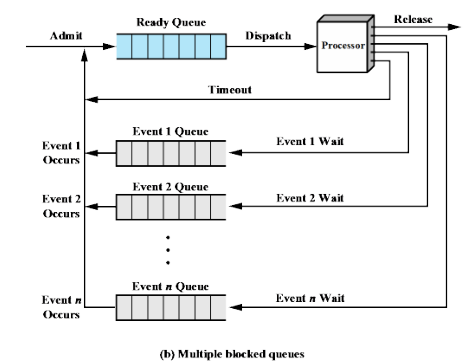

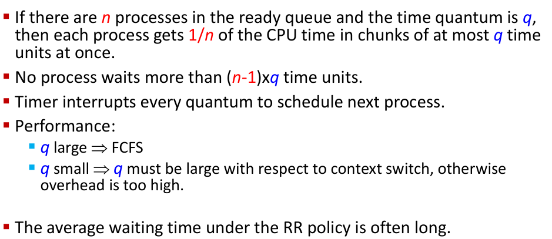


- $P_1$ starts executing
- 4 ms pass and the cpu checks the queue
- $P_1$ is preempted and $P_2$ is put in its place for execution
- $P_2$ finishes execution
- $P_3$ executes and finishes
- $P_1$ begins to execute once more and runs the course of the 4 ms quantum

averaging waiting time $= \frac{6+4+7}{3}=5.666...$


Priority Scheduling
- priority number (integer) associated w/ each process
- CPU is allocated to the process with the highest priority
  - can be done preemptively or nonpreemptively
- SJF is priority scheudling where priority is the inverse of predicted next CPU burst time
  - larger burst = lower priority
  - smaller burst = higher priority


Linux and Windows use the same numbering system


Starvation is a problem for both preemptive and nonpreemptive.

We up priority for old processes

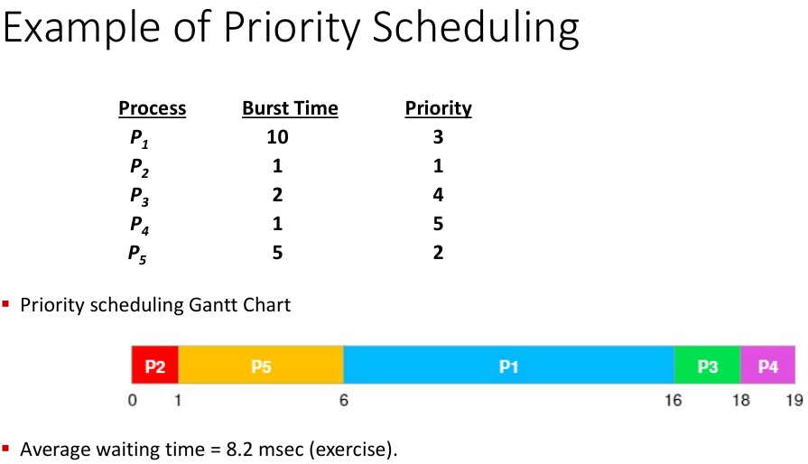


A process can't be preempted for a process with a lower priority.
If a process is the only process within its priority tier and there are no other higher priority processes then the process gets to run with impunity.


Aging is done via moving them do a different queue.

---
Knowledge Check
- \_\_\_ scheduling is approximated by predictin the next CPU burst with an exponential average of the measued lengths of previous CPU bursts
  - d. SJF
- The \_\_\_ scheduling algo is designed especially for time-sharing systems
  - c. RR
- which of the following is ture of multilevel queue scheduling?
  - b. each queue has its own scheduling algorithm
  - the most general CPU-scheduling algo is multilevel feedback
  - processes can only move between queues using the feedback variant

# Multi-Processor Scheduling

CPU scheduling is more complex when multiple CPUs available.

multiprocessor may be any one of the following architectures:
- multicore CPUs
- multithreaded cores
- NUMA systems
- heterogeneous multiprocessing

## Multicore

Symmetric Multi Processing
- each processor is self scheduling
- all threads may be in a common ready queue
- each processor may have its own private queue of threads


Lately we've been making multicore chips that are faster and less power hungry.

Multithreaded cores are also a recent advancement we've made.

This takes advantage of memory stall to make progress on another thread while memory retrieve happens.


---
What is Memory Stall?

When a processor acceses memory it waits around for the data to become available.

THe processor is much faster than the memory so it has to wait on the memory.

THis can also occur during due to a cache miss

---

## Multithreaded Cores

Each core as > 1 hardware thread

if one thread has amemory stall then we switch to another thread for 0 downtime.

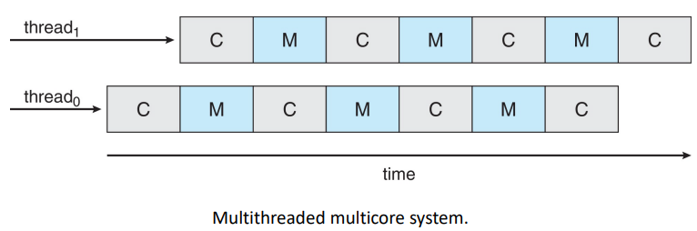


each thread is basically treated as their own cpu from a logical perspective

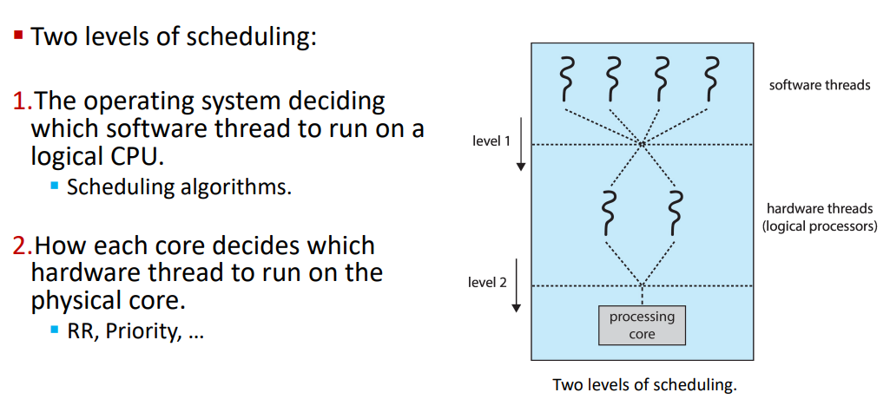

choose a chip then choose a thread

## Load Balancing

a concept for symmetric multiprocessing systems


push migration
- periodic task checks load on each processor
- imbalance found $\rarr$ task pushed from overloaded CPU to other CPUs

pull migration
- idle processors pull a waiting task from a busy processor

## Processor Affinity

When a thread has been running on one processor, the cache contents of that processor stores the memory accesses by that thread.

Successive memory accesses by thread are often satisfied in cache memory (aka "warm cache").

```
Prof uses an example of repititive actions on a data structure, something like a for-loop iterating through an array or spreadsheet.

We start to move things to the cache to speed things up
```

If load balancing causes a thread to migrate to another processor:
- contents of cache memory must be invalidated for the 1st processor
- cache for 2nd processor must be repopulated
- ***high cost***

This high cost is undesireable so OS and SMP try to avoid migrating a thread from one processor to another.

Proceesor Affinity:
- a process has an affinity for the processor on which it is currently running
- the warm cache is there for the process to take advantage of

Soft Affinity
- OS attempts to keep a thread running on the same processor
- no guarantees

Hard Affinity
- allows a process to specify a set of processor it may run on

```
initially the cache is empty (usually almost all 16 kilobytes)

when the process starts it misses over and over again but then starts filling out the cache

processor starts prepopulating the cache in order to help it out.
seeing what to remove and what to get rid of.

for hard affinity the process decides on a number of CPUs.

It can choose CPUs to benefit from a shared L2 cache
```

## NUMA Systems

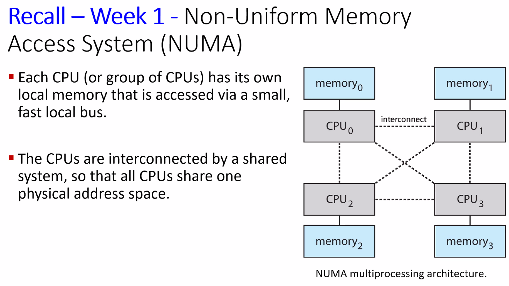

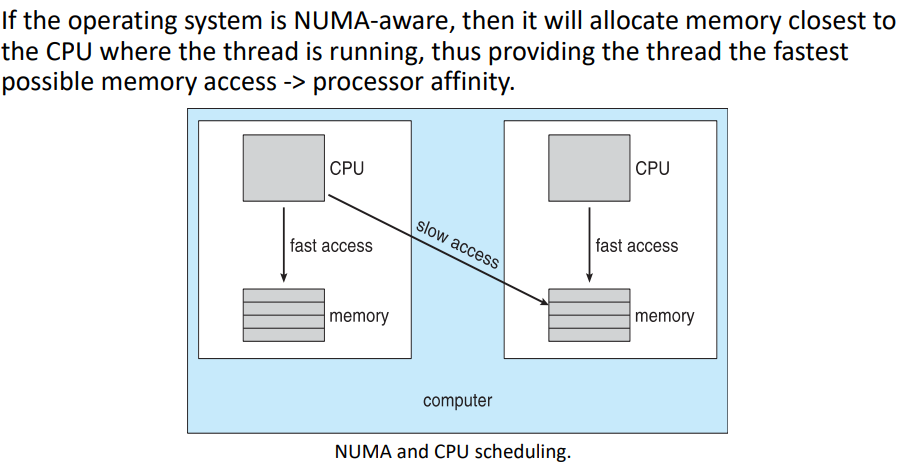

## Hetereogeneous Multiprocessing

so far we have assumed all processors are identical so we can allow any thread to run on any processing core.

We only differed based on load balancing, processor affinity policies, and NUMA systems

Some mobile systems are now designed using cores that run the same instruction set but vary in terms of their clocks peed and power management.

They can also adjust the power draw of a core to the point of idling.

These are known as Heterogeneous Multiprocessing (HMP).

This type of architecture is known as `big.LITTLE`:
- `big` cores are higher-performance cores
  - greater power draw $\rarr$ used for short periods of time
  - interactive tasks
- `LITTLE` are energy efficient cores
  - use less energy $\rarr$ used for longer periods of time
  - background tasks

Windows 10 supports HMP scheduling by allowing a thread to select a scheduling policy that best supports its power management

---
knowledge check
- \_\_\_ allows a thread to run on only one processor
  - a. processor affinity
- two general approaches to load balancing are \_\_\_ and \_\_\_
  - d. push migration, pull migration
  - course grained is when a process keeps executing on a core until there's a huge stall event
  - fine grained is when we are switching on a very fine level of granularity between processes
    - the boundary of an instruction cycle
      - fetch and execute then now we switch to another thread
  - each comes with their pros and cons with relation to process switching

# Real-Time CPU Scheduling

can present special issues

2 types
- soft real-time systems
  - critical real-time tasks have the highest priority
  - no guarantee as to when tasks will be scheduled
- hard real-time systems
  - task must be serviced by its deadline
  - service after deadlin has expired
    - same as no service at all

event latency
- amount of time that elapses from when an event occurs to when it is serviced
- 2 types that affect performance
  - interrupt
  - dispatch
    - time for schedule to take current process off CPU and switch to another


conflict phase of dispatch latency:
1. preemption of any process running in kernel mode
2. release by low-priority process of resources needed by high-preiority processes

## Priority Based Scheduling

for soft real-time scheduling, scheduler must support preemptive, priority-based scheduling.

For hard real-time we must also provide the ability to meet deadlines which requires additional scheduling features.

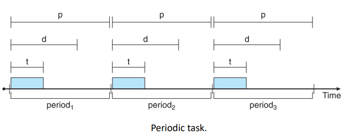


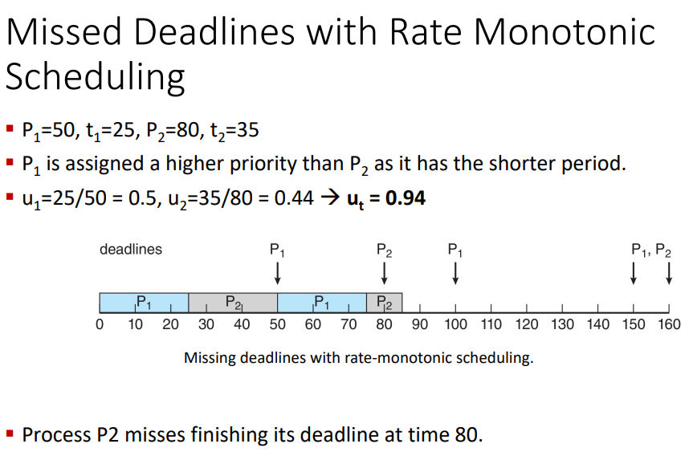


---
knowledge check
- the reate of a periodic tasks in a hard real-time system is \_\_\_, where p is a period and t is the processing time.
  - a. 1/p
- which of the following is true of the rate-monotonic scheduling algo?
  - a is for first scheduling
  - rate-monotonic scheduling does not have a dynamic priority policy
  - it has to be preemptive
  - answer: c. cpu utilization is bounded when using this algo
- which of the following is true of earliest-deadline-first (EDF) scheduling algo?
  - the rule for `b` is reversed
  - priorities aren't assigned statically
  - priorities are not fixed
  - answer: a. when a proces becomes runnable, it must announce its deadline

# Algo Eval

How to select CPU-scheduling algo for an OS?

Determine criteria, then eval algos

example of criteria:
- maximizing utilization under the constratint that the maximum response time is 300 milliseconds
- maximizing throughput such that turnaround time is (on average) linearly proportional to total execution time

## Deterministic

Deterministic Modelling:
- type of analytic evaluation
- takes a particular predetermined workload and defines the performance of each algo for that workload

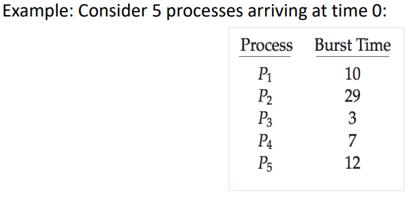


## Queueing Models

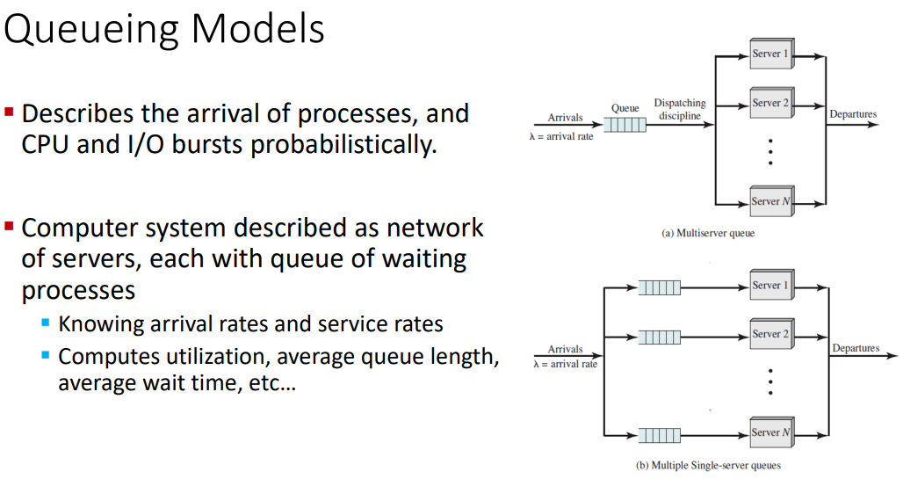


## Simulations

Queueing models are complicated and limited.

Simulations give more accurate evlaution of scheduling algos:
- programmed model of computer system
- clock is a variable
- gather stats indicating algo performance
- data to drive sim gathered via:
  - rng according ot probabilities
  - dists defined mathematically or empirically
  - trace files record sequences of real events in real systems

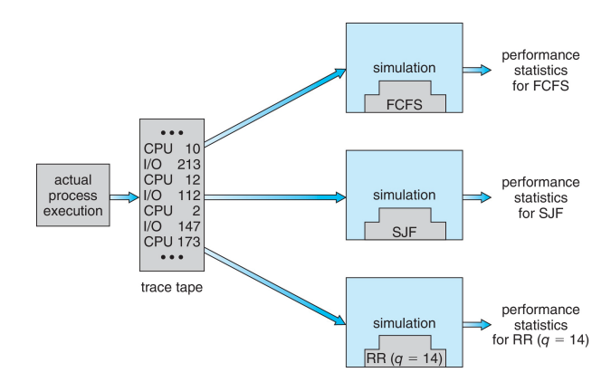

`I did not fucking hear anything she said about this`

## Real Implementation

The best way is to just implement this stuff for real.

This is very costly.

In general,
most flexible scheduling algos are those that can be altered by the system amangers or by the users so that they can be tuned for a specific (set of) app(s)

Envionments can vary however.

---
Knowledge Check
- in little's formula, $\lambda$, represents the \_\_\_:
  - b. average arrival time for new processes in the queue
- 
