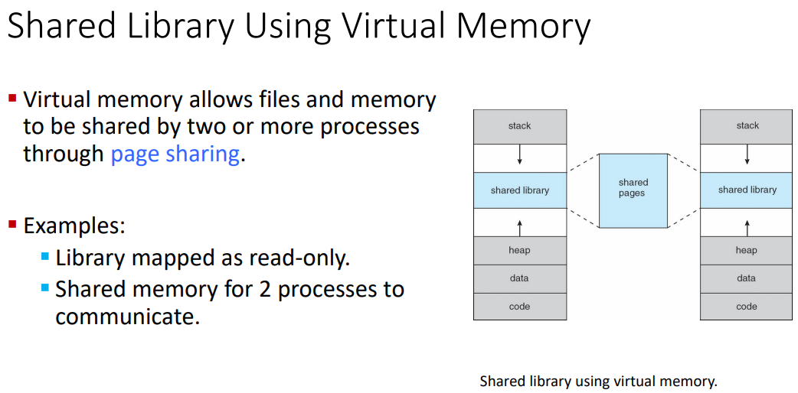
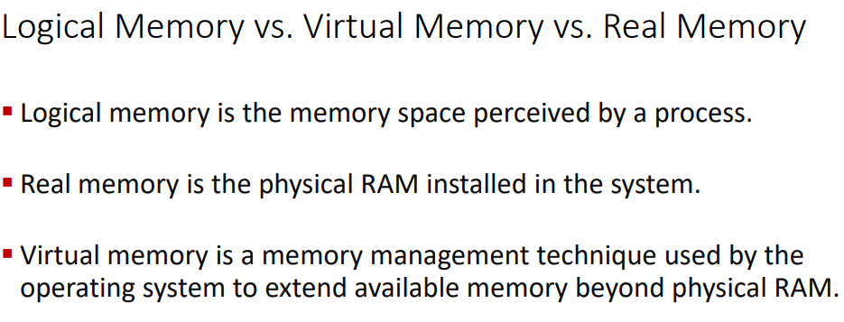
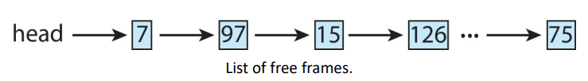
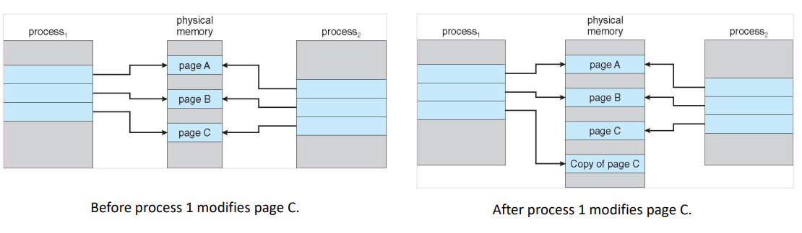
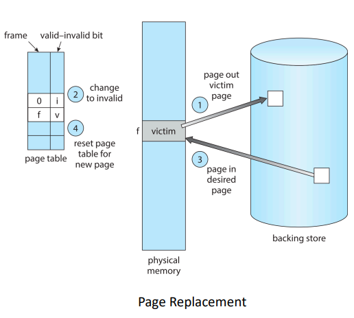
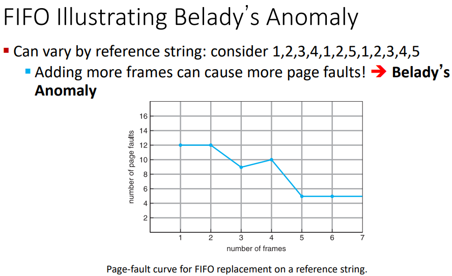
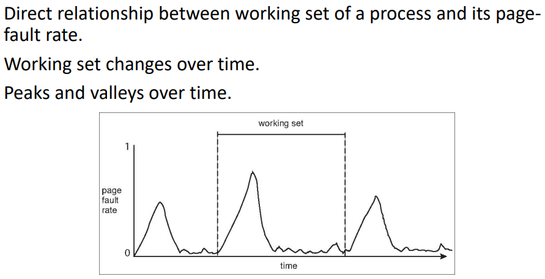

this covers the `virtual memory` slide deck

toc:
- [Background](#background)
- [Demand Paging](#demand-paging)
- [Copy on Write](#copy-on-write)
- [Page Replacement](#page-replacement)
  - [Page Replacement Algorithms](#page-replacement-algorithms)
    - [Page Replacement Algo Evalutation](#page-replacement-algo-evalutation)
    - [Different Types](#different-types)
      - [FIFO](#fifo)
      - [Optimal Algo](#optimal-algo)
      - [Least Recently Used (LRU) Algorithm](#least-recently-used-lru-algorithm)
        - [Second-Chance Algo (Clock) - LRU Approximation](#second-chance-algo-clock---lru-approximation)
        - [Enhanced Second-Chance Algo](#enhanced-second-chance-algo)
      - [Counting Algos](#counting-algos)
- [Allocation of Frames](#allocation-of-frames)
- [Thrashing](#thrashing)
  - [Demand Paging](#demand-paging-1)
  - [Working-Set Model](#working-set-model)
- [Allocating Kernel Memory](#allocating-kernel-memory)

# Background

code needs to be in physical memory to execute but entire program is rarely used
- error code
  - used to handle unusual error conditions
  - almost never executed
- large data structures
  - often allocated more mem than needed
- unusual routines
  - lesser used options and features of a program

we only have to load what we need for execution

ability to execute partially-loaded program
- no longer limited by physicla mem
- each program takes less memory while running
  - more programs can run at the same time
    - cpu util and throughput increase
    - response time and turnaround time the same
- less i/o needed to load or swap programs into mem
  - each user program runs faster

virtual mem
- separation of user logical mem from physical mem
- only part of the pgram needs to be in mem for execution
- logical address space can be larger than physical address space
- allows address spaces to be shared by several processes
- allows for more efficient process creation
- more programs running concurrently
- less i/o needed to load or swap processes






- logical memory
  - memory space perceived by a process
- real/physical memory
  - physical ram sticks in you're machine
- virtual memory
  - memory management technique
  - used by operating system
  - extends beyond available physical ram

---
Knowledge check:
- which of the following is a benefit of allowing a program that is only partially in memory to execute?
  - d. all of the above
  - programs can be written to use more memory than is available in physical memory
  - cpu util and throughput is incdreased
  - less io needed to load or swap each user program into mem
- in general virtual memory decreases the degree of multiprogramming in a system
  - false
  - why would these even effect each other??????????????????

# Demand Paging

virtual memory can be implemented via
- demand paging
- demand segmation

demand paging:
- bring a page into memeory ONLY when it is needed
  - less required
    - I/O
    - memory
  - faster response
  - more users
- similar to a paging system with swapping


valid-invlid bit
- with each page entry there is a valid-invalid bit
  - v $\rarr$ in-memory - memory resident
  - i $\rarr$ not-in-memory
- initially valid-invalid bit is set to `i` on all entries
  - all invalid
- during MMU address translation
  - if bit is invalid for a page entry then there's a page fault


`there are some more slides that are the same thing`

free-frame list
- a pool of free frames for satisfying such requests
- maintained by most operating systems
- when a page fault occurs, the operating system must bring the desired page from secondary storage into main memory
- OS typically allocate free frames using zero-fill-on-demand
  - we flush out the frame
  - the content of the frames zeroed-out before being allocated
- when a system starts up, all available memory is placed on the free-frame list
  - this lets us start allocating frames as they are demanded



performance of demand paging
- 3 major activities of servicing a page-fault
  - serivce the page-fault interrupt
  - read in the page
    - this is where most of the time is spent
  - restart the process
- page fault rate $0\le p\le 1$
  - $p=0 \rarr$ no page faults
  - $p=1 \rarr$ every reference is a fault
- Effective Access Time (EAT) =
  - $(1-p) \times \text{memory access} + p (\text{page fault overhead} + \text{swap page out} + \text{swap page in})$
  - we're basically averaging it out

---
Example of Demand Paging

memory access time = 200 ns

avg page-fault service time = 8 ms

$$
\text{EAT} = (1-p) \times 200 + p(8 \text{ms})
\newline
=((1-p)\times 200) + (p \times 8,000,000)
\newline
=200 + (p \times 7,999,800)
$$

if 1 in 1000 accesses causes a page fault ($p=0.001$) then EAT = 8.2 microseconds. a slowdown by a factor of 40

if we want a perfoamnce degredation (slowdown) less than 10 percent
- 10% of 200 (effective access time we want) = 20 ns
- 220>200 + 7,999,800 * p
- 20 > 7,999,800 * p
- p < 0.0000025
- p < one page fault in every 400,000 memory accesses

This needs hardware support,
it can't all be done by the OS.

---
Knowledge Check
- on a system with demaend-paging, a process will experience a high page fault rate when the process begins execution
  - true
  - similar principle to caching where we need to slowly fill things up in the memory that the process asks for
  - since the page table is invalid to start with we end up faulting a ton as we're setting things up for the process
  - as it starts going on it'll start hitting the pages we already loaded for it
- a page fault occurs when
  - c. a process tries to access a page that is not loaded in memory
- if memory access time is 250 ns and average page fault service time 10 ms the probability of page faults must be less \_\_\_ to keep the performance degradation less than 20%
  - options
    - a) 0.0000025
    - b) 0.000005
    - c) 0.0000075
    - d) 0.00001
  - takehome exercise

# Copy on Write

copy-on-write (COW):
- allows both parent and child processes to initially share the same pages in memory
- the page is copied once either process modifies a shared page
  - read: write
- allows more efficient process creation as only modified pages are copied



---
Knowledge Check
- \_\_\_ allows the parent and child processes to initially share the same pages, but when either process modifies a page, a copy of the shared page is created.
  - a. copy-on-write

# Page Replacement

sometimes there is no free frame

how:
- memory is used up by process pages but also in demand from the kernel, I/O buffers, etc
- the page is a hot commodity that everyone needs access to

scenario
- process executing
- page fault occurs
- OS determines where the desired page is residing on secondary storage
- but there are no free frames on the free-frame list
  - all mem is in use


need for page replacement
- algorithms
  - do we terminate it
  - do we swap out the whole process till there are more free frames
  - do we replace the page
    - we can find some page in memory but notreally in use, page it out
    - most operating systems now combine swapping pages with page replacement

we want an algor that has the minimum number of page faults

basic page replacement:
- prevent over-allocation of mem
  - modify page-fault service routine to include page replacement
- use modify (dirty) bit to reduce the overhead of page transfers
  - only modified pages are written to disk
  - unmodified pages have no need ot be written back to backing store since it wouldn't make a differnce
- page replacement completes separation b/w logicla mem and phys mem
  - large virt mem can be provided on a smaller phys mem




frame allocation algo determines how many frames given to each process
- some small processes are smaller
- are frames reserved
- etc

page-replacement algo
- which pages to replace
- want lowest page-fault rate on both first access and re-access

## Page Replacement Algorithms

### Page Replacement Algo Evalutation

evalutate algo by running it on a particular string of memory reference (reference string)
and
computing the number of page faults on that string
- string is just page numbers, not full addresses
- if we have a referece to a page `p`, then any references to page `p` that immediately follow will never cuase a page fault
- results depend on the number of frames available


### Different Types

algos:
- FIFO
- Optimal
- Least Recently Used (LRU)
- LRU-Approximation
  - Second-Chance
  - Enhanced Second-Chance
- Counting-Based

In all our examples, the reference string of referenced page numbers is:
7, 0, 1, 2, 0, 3, 0, 4, 2, 3, 0, 3, 0, 3, 2, 1, 2, 0, 1, 7, 0, 1

#### FIFO

first-in-first-out algo

Reference string:
7, 0, 1, 2, 0, 3, 0, 4, 2, 3, 0, 3, 0, 3, 2, 1, 2, 0, 1, 7, 0, 1

3 frames (3 pages can be in memory at a time per process)

How to track ages of pages?
Just use a FIFO queue.




#### Optimal Algo


This is an example,
not an actual algo.

#### Least Recently Used (LRU) Algorithm

Replace the page that has not been used in the most amount of time.
Associate time of last use with each page.

Results in 12 faults which is closer to optimal than FIFO

generally good and frequently used.


```
7 - assign to open page
0 - assign to open page
1 - assign to open page
2 - replace 7 since LRU
0 - 0 already has page
3 - replace 1 since LRU
0 - 0 already has page
4 - replace 2 since LRU
2 - replace 3 since LRU
3 - replace 0 since LRU
...
```
It's possible that with a different reference string we'll end up with performance similar to FIFO

---
Implementation
- requires hardware support
- hardware counter implementation
  - every page entry has a counter
    - every tmie the page is referenced through this entry, copy the clock into the counter
  - when a page needs to be changed
    - look at the counters (clock) of the pages
    - find the one w/ smallest value (least recently used)
      - replace that one
- `prof also mentioned a stack hardware implementation which is interesting`

---

LRU approximation algos
- LRU needs special hardware
  - the aforementioned counter implementation
- LRU is still slow even with the special hardware
- reference bit
  - with each page associate a bit
    - initially set to 0
  - when a page is refernced, the bit is set to 1
  - if a reference page has reference bit = 0 then we replace it
    - we don't know the order so this isn't perfect
- for this reason, we make many algos that approximate LRU

##### Second-Chance Algo (Clock) - LRU Approximation

Generally implemented using FIFO and a hardware-provided reference bit

if the reference bit of the page to be replaced is equal to:
- 0 $\rarr$ replace it
- 1
  - page is given second chance
  - move on to select the next FIFOpage
  - clear reference bit
    - set it to 0
  - arrival time is set to current time

if all the bits are set then this algo degenerates to FIFO replacement.


> "The hand is like a clock going tick, tick, tick around the circle... that is why it is called the clock algorithm" - Professor

##### Enhanced Second-Chance Algo

Uses 2 bits
- reference bit
- modify bit (if available)

replacing a modified page introduces more overhead

So we can eval pages with the ordered pair (reference, modify)

pair|meaning|assessment
-|-|-
(0,0)|neither recently used nor modified| best page to replace
(0,1)|not recently used but modified|must write out before replacement, more overhead
(1,0)|recently used but clean|will probably be used again soon
(1,1)|recently used and modified|probably will be used again AND need to write out before replacement

The above table is in order of replacement preference

When page replacement is called for, use the clock scheme but use the four classes & replace page in lowest non-empty class
- this may require searching the circular queue several times

#### Counting Algos

Keep a counter of the # of references that have been made to each page

Least Frequently Used (LFU) algo
- replaces the page with the smallest count

Most Frequently Used (MFU) algo
- based on the argument that the page with the smallest count was probably just brought in and has yet to be used

neither are common
- implementation is expensive
- does not approximate OPT well

---
Knowledge Check
- Q:
  - Suppose we have the follow page accesses:
    - 12342341211314
  - 3 frames within our system
  - use LRU replacement algo
  - what is the # of page faults for the given ref string?
- A:
  - take home exercise
  - The answer is: c. 8
- Q: Belady's anomaly states that \_\_\_
- A:
  - d. for some page replacement algorithms, the page-fault rate may increase as the number of allocated frames increases
- Q: in the enhanced second chance algo, which orderd pair represents a page that would be the best choice for replacmeent?
- A: a. (0,0)

# Allocation of Frames

`Much easier design principle compared to page replacement according to prof`

The question of how we allocate the fixed amount of ofree memory among the various processes

ex:
- 128 frames
- os takes 35
- 93 free for iser
- we have 2 processes
  - how many frames does each process get?

1. when a user process started execution, it would generate a sequence of page faults

The first requests need to generate the page faults to populate their frames

2. first 93 page faults wuold all get free frames from the free-frame list

3. when the free-frame list was exhausted, a page-replacement algo would be used to select one of the 93 in-memory pages to replaced by the 94th, and so on
4. when the process terminated, the 93 frames would once again be placed on the free-frame list

2 major allocation schemes that variate this simple strat
- fixed allocation
  - equal allocation
    - each process gets an equal amount of frames
    - ex. 93 frames split among 5 processes result in 18 frames/process and 3 free frames
  - proportional allocation
    - bigger processes get more frames than smaller processes
    - dynamic as degree of multiprogramming
    - process sizes change
- priority allocation
  - proportional allocation scheme using priority rather than size
  - higher priority processes get more frames

# Thrashing

thrashing
- process is spending more time paging than executing

if there aren't "enough" pages, page fault rate is very high
- page fault to get page
- replace existing frame
- quickly need replaced frame back

leads to
- low cpu util
- os thnks it needs to increase degree of multiprogramming
- can be exacerbated by more processes being added


## Demand Paging

The solution to thrashing


locality:
- the tendency of processes to reference memory in patterns rather than randomly
- process migrates from one locality to anther
- localities may overlap

why does thrashing occur
- total size of locality is greater than total memory size

we can limit the effect by using local or priority page replacement

## Working-Set Model

the working-set model is based on the assumption of locality




---
Knowledge Check
- Q:
  - \_\_\_ occurs when a process spends more time paging than executing
- A:
  - a. thrashing
- Q:
  - The \_\_\_ is an approximation of a program's locality
- A:
  - b. working set
- Q:
  - if the page fault rate is too high, the process may have too many frames. True or false?
- A:
  - false

# Allocating Kernel Memory

treated differnetly from user memory, allocating and deallocating memory frequently

often allocated from a free-memory pool:
- kernel reqs memory for structure of varying sizes
- some kernel memory needs to be contiguous like for device i/o

The "buddy system"
- strategy for managing free memory that is assigned to kernel processes
- allocates memory from fixed-size segments consisting of physically-contiguous pages
- memory allocated using power-of-2 allocator
  - satisfies requests in units sized as power of 2
  - request rounded up to next highest power of 2
  - when smaller allocation needed than is available
    - current chunk split into two buddies of next-lower power of 2
    - continue until the appropriate-sized chunk becomes available
- quickly combining(coalescing) unused chunks into a larger chunk
- can cause internal fragmentation
  - 50% wastage of memory


example:
- 256kb chunk available
- kernel req 21kb
- split into $A_L$ & $A_R$ of 128 kb each
- 1 further divided into $B_L$ and $B_R$ of 64kb each
- 1 further divided into $C_L$ and $C_R$ of 32 kb each
- finallly have a chunk small enough to justify using on the request
  - any smaller would be 16kb