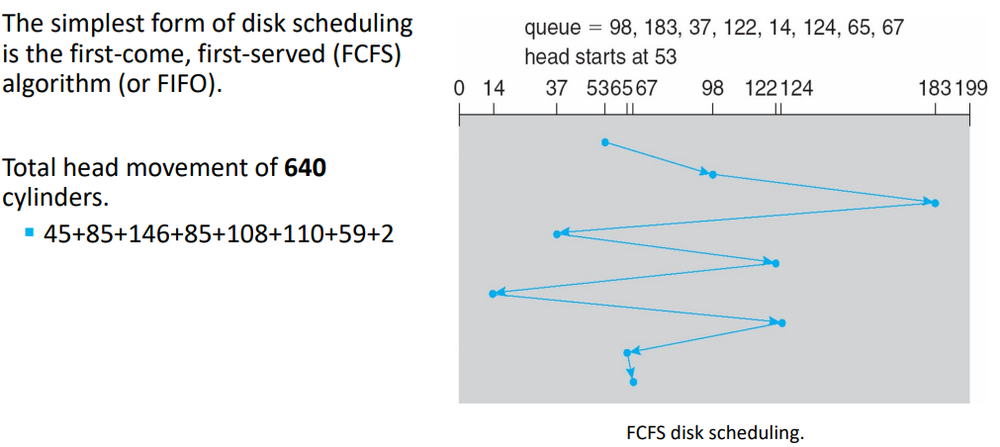
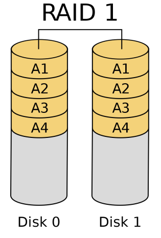
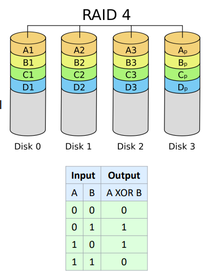
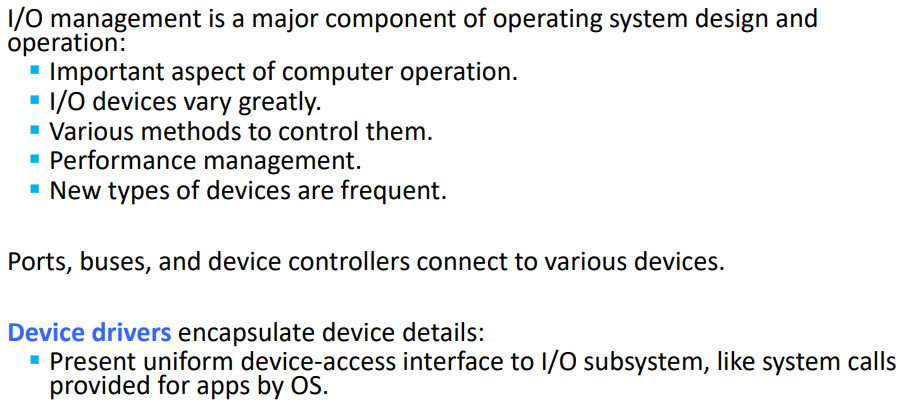
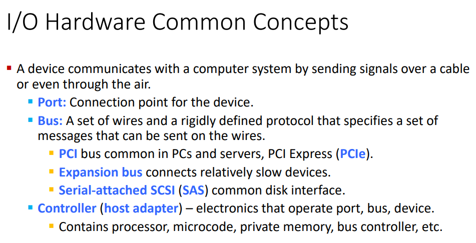

This covers the `Storage Management` slide deck

toc:
- [Mass-Storage Structure](#mass-storage-structure)
  - [Overview of Mass Storage Structure](#overview-of-mass-storage-structure)
    - [Hard Disks](#hard-disks)
    - [Nonvolatile Memory Devices](#nonvolatile-memory-devices)
    - [Disk Attachment](#disk-attachment)
    - [Address Mapping](#address-mapping)
  - [HDD Scheduling](#hdd-scheduling)
    - [First Come First Serve](#first-come-first-serve)
    - [SCAN](#scan)
    - [C-SCAN](#c-scan)
  - [NVM Scheduling](#nvm-scheduling)
  - [RAID Structure](#raid-structure)
- [I/O Systems](#io-systems)
  - [Overview](#overview)
  - [I/O Hardware](#io-hardware)

# Mass-Storage Structure

## Overview of Mass Storage Structure

bulk of secondary storage for modern computers provided by
- hard disk drives HDDs
- nonvolatile memory (NVM)
  - semiconductor tech like ram
  - doesn't dump info on power off like ram
  - relatively newer

### Hard Disks

Note that there are several read/write heads and magnetically coated platters.

`Landing Zone` is where the read/write head sits when it's not doing anything

HDDs spin platters of magnetically-coated materiaul under moving read-write heads

info stored by recording magnetically on platters

read info by detecting magnetic pattern on platters

read-write head "flies" just above each surface of every platter.
Head cannot touch the platter or else it causes damage to the disk.

The surface of a platter is logically divided into circular `tracks` which are subdivided into `sectors`.

The set of tracks at a given arm position make up a cylinder.

The heads themselves cannot move independently of one another as they all share one phsyical arm assembly but each platter can rotate independently of one another.

Drives rotate at 60-250 times per second (can vary depending on brand and usecase).
Rotation speed relates to transfer rates.

Trasnfer rate is rate at which data flow b/w drive and computer.

This can be improved by other things.

Positioning time (random-access time) is time to
1. move disk arm to desired cylinder (seek time)
2. time for desired sector to rotate under the disk head (rotational latency)

Head crash results from disk head making contact with the disk surface which is really bad.
This can be caused by sudden power off.
`Prof says and it is true, better to be safe than sorry. But it's also worth noting that a lot of modern drives have mechanisms to prevent head crashes as a result of sudden power loss. Mechanism in place to automatically retract the head upon power loss detection. Not infallible mechanisms and not in all drives, especially old ones, but it's worth noting.`

Platters range from .85" to 14" (historyically).
More commonly they will be in 3.5, 2.5, and 1.8 inch sizes

range from 30gb to 3tb per drive `we've gotten much larger from then`

disks can be removable

performance varies.

### Nonvolatile Memory Devices

electrical rather tahn mechanical

solid-state-disk (SSD)
- flash-memory based NVM
- used in a disk-drive-like container

USBs also fall under this category

pros:
- can be more reliable than HDDs
- faster
  - no moving parts
    - no seek time
    - no rotatinoal latency
- less power hungry

cons:
- more expensive per mb
- less capcity

### Disk Attachment

NVM is much faster than HDD

new fast interface for NVM called NVM express (NVMe) connects directly to the PCI (peripheral component interconnect) bus.

PCI provides a high-speed data path b/w cpu and peripher devices such as netowrk adpaters, sound cards, graphics cards, and storage controllers

### Address Mapping

disk drives are addressed as large 1-dimensional arrasy of logical blocks
- 1 block is the smallest unit of transfer
- low-level formatting creates logical blocks on physical media
- each logical block maps to a physical sector or semiconductor page
- logical block address is easier for algos to use than a secotry, cylinder, or track

---
Knowledge Check
- read or write perforamnce depends on 
  - bit transfer rate, seek time, and rotational latency
- one advantage of HDDs over SSDs is
  - HDDs are cheaper per megabyte than SSDs

Note:

## HDD Scheduling

OS wants to get a fast access time and high disk bandwidth

minimize seek time
- can be minimized by minimizing seek distance

bandwidth
- total bytes transferred / total time b/w first req and completion of last transfer
- bytes transferred / time elapsed for transfer

improve both by managing order in which i/o requests are serviced

### First Come First Serve

### SCAN

disk arm starts at one end fo the disk, and moves toward the other end, servicing requests until it gets to the other end of the disk.

once it gets to the end of disk it goes back the other way

the head continuously scans back and forth across the disk

also known as the elevator algo

`prof left this for us to read`

### C-SCAN

circular scan

higher seek time but more uniform wait time than SCAN

does the same motion of running across the whole disk but it doesn't service on the return trip,
just goes back to the start immediately

SCAN and C-SCAN perform better fo rsystems that place a heavy load on the disk

---

d since it's first come first serve

## NVM Scheduling

nvm devices do not contain moving disk heads and commonly use a simple FCFS policy

FCFS is used but adjacent requests are combined for optimization purposes

NVM best perform at random I/O while HDD excels at sequential I/O

c. NVMs do not contain moving disk heads

## RAID Structure

Redundant Array of Inexpensive (or independent) Disks

a set of physical disk drives viewed by the operating system as a single logical drive

data is copied onto multiple disks to provide fault tolerance

raid is arranged into different levels
`and these different levels are different from each person you may ask lmao`

data copying techniques whihc differ based on raid level
- data mirroring
  - logical disk consists of two physical drives
  - every write carried out on both drives
- data striping
  - splitting the bits of each byte across multiple drives
    - bit-level striping
  - blocks of a file are striped across multiple drives
    - block-level striping

typically a small number of hot-spare disks are left unallocated, automatically replacing a failed disk and having data rebuilt onto them

levels and their features (that Ruba thinks is good enough to give us an idea to jump off of)

- logical disk is divided into stripes
  - prof is assuming byte level for this
- user and system data are distributed across all of the disks in the array
- doesn't rpovide fault tolerance
  - failure of one disk causes complete data loss
- improves performance
  - 2 heads instead of 1 makes accessing data faster
- only helps with performance
- might actually be worse for fault tolerance due to the striping since 1 disk failing corrupts the data on the remaining disk

- drive mirroring present
- when a dirve fails the data may still be accessed from the second drive
  - actual fault tolerance
- main disad is cost

Redundant disk capacity is used to store parity information which guarantees data recoverability in case of a disk failure.

parity is calculated across corresponding blocks on all data disks
- for every stripe of data blocks, a parity block is calculated

ex:
- an array of three drives where $A_1$ - $A_3$ contain data, and $A_p$ is the parity disk.
- calculate using
- $A_p = A_3 \oplus A_2\oplus A_1$
- $A_1 = A_p\oplus A_3\oplus A_2$

If we lose a disk we can recover the data using the parity calculations.

Only 1 disk

- distribute parity blocks across all disks
  - interleaved distributed parity
  - typical allocation is a round-robin scheme
- avoids potential overuse of a single parity drive which can occur with RAID 4
- RAID 5 is the most common parity RAID
- can lose any single disk

---
Knowledge Check
- a RAID structure
  - c. stands for redundant arrays of inexpensive disks
  - b. is primarily used to ensure higher data reliability
- in most RAID implemenations, a hot spare disk is not used for data, but is configured for replacement should any other disk fail
  - true

# I/O Systems

## Overview

## I/O Hardware

next week is security lect and exam review
