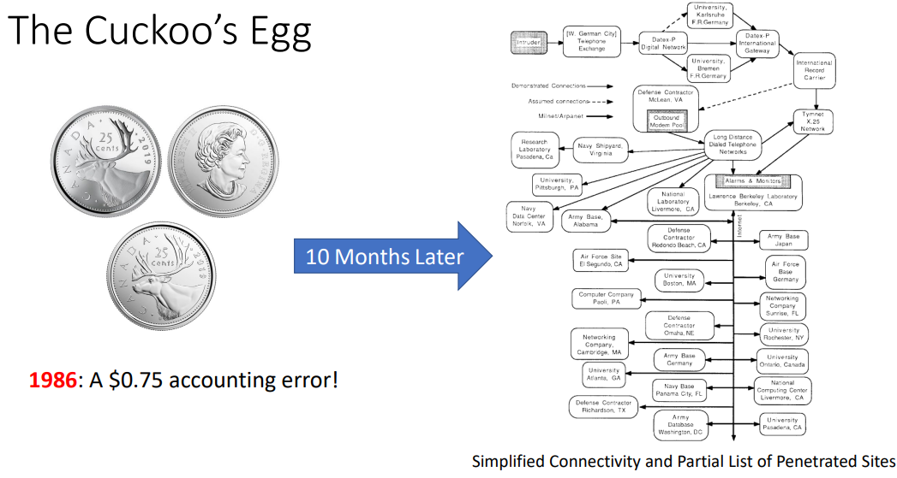
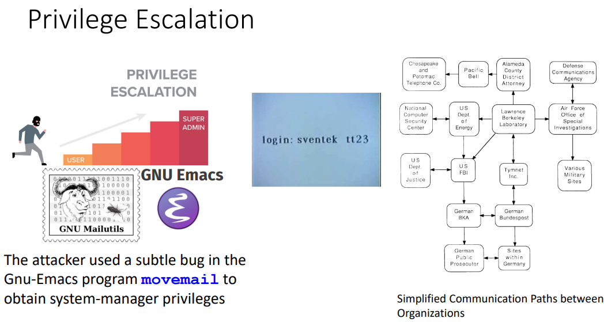
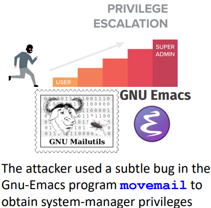
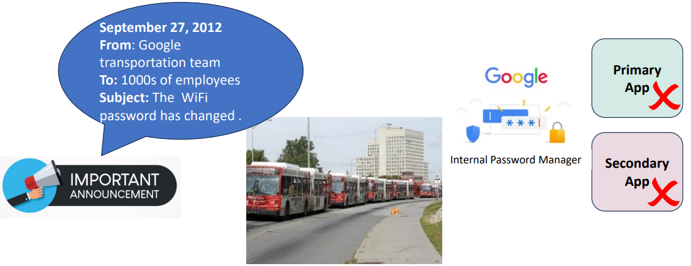
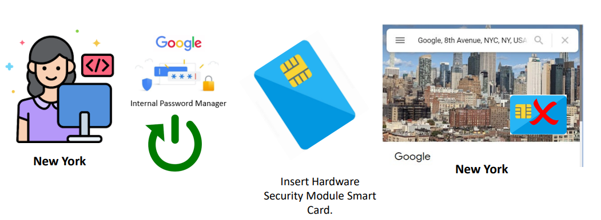
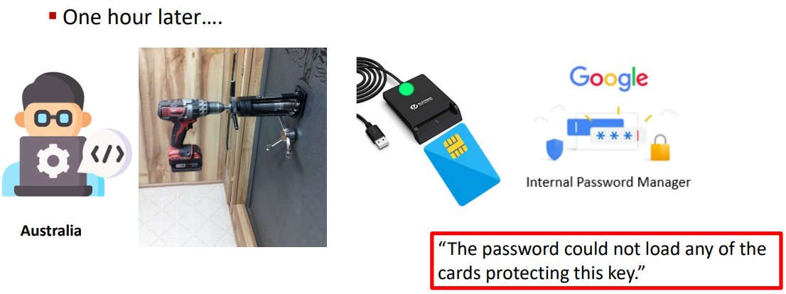
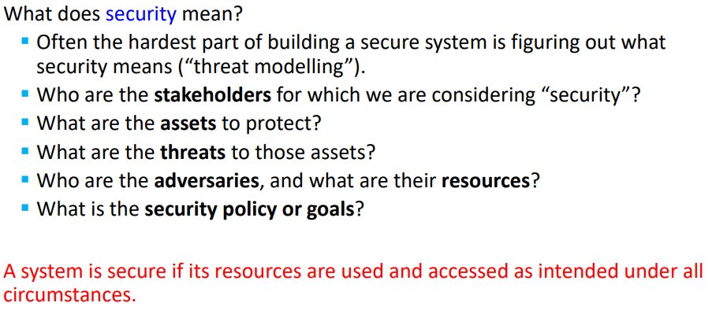
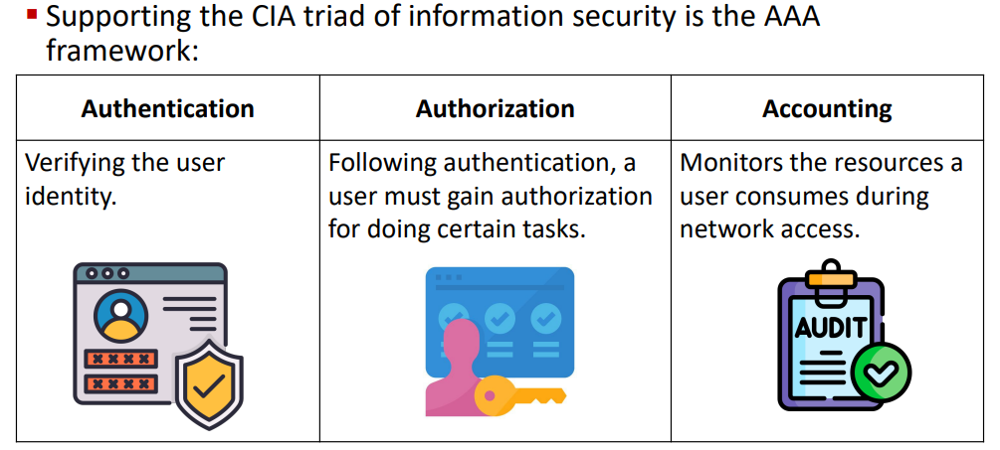

This covers the `Security and Protection` slide deck.

toc:
- [Housekeeping](#housekeeping)
- [Security](#security)
  - [How Systems Fail](#how-systems-fail)
  - [What is Security](#what-is-security)
  - [Info Security Strats](#info-security-strats)
- [Protection](#protection)
  - [Goal of protection](#goal-of-protection)
  - [Principles of Protection](#principles-of-protection)
- [Exam Review](#exam-review)
  - [Exam Housekeping](#exam-housekeping)
  - [QnA](#qna)
  - [Final Exam Practice](#final-exam-practice)

# Housekeeping

Wednesday will be talking about what we need to do about the exam.

The `Storage Management` slide deck has been updated.

`A2` (unmarked) will have sample answers released

This week will be the last week of classes

# Security

>"I will tell you a few stories today. Everybody loves a good story that is perfectly fine but they also have some kind of impact on hardware and software design" - Professor



Starting at Lawrence Berkely Laboratory (LBL or Berkely Lab) in California had the 75 cent error.
They were performing research for some energy dept.
They were connected to many other institutions, army bases, and defense contractors over the combination arpanet and milnet.

How could this happen?

```
prof wanted to show us a cool little video 

 Clifford Stoll - Watch from 2:22 to 5:05 - Movie: The KGB, the Computer, and Me
available at https://www.youtube.com/watch?v=PGv5BqNL164
```

Clifford Stoll was a grad student at UC Berkely.
He pointed out the 75 cent error after taking a summer job there.

Stoll found out that a single account was responsible for this.
Surely,
just a prankster of u cali.
This account was the acct of a prof who was on sabattical after all.


The account from a prof who was on sabattical.

Clifford got a notification that someone was trying to log into docmaster.



tons of pinging from the person trying to login and creating tons of accounts


LBL was a part of a huge network of very important organizations' computers.
An attacker started from Tymnet machines.



By gaining the privileges the attacker was able to move between machines.

movemail
- worked by changing the file ownership and moving it to the designated user's folder
- permanently ran as sudo
  - `movemail` can write into protected system folders
  - given access to any and every folder
  - also had access to `atrun` folder
- the attacker
  - wrote a script
  - used `movemail` to put the script in the `atrun` folder
  - set the script to execute in 5 minutes
  - the script gave his account superuser privileges

The attacker used the new privileges to make more accounts.

An original thought was to start locking down all those accounts.

But Stoll wanted to get to the root of it.
Who is the hacker, what are they doing, and why?


Stoll had a gf (SHOCKING)
who suggested making some fake docs to lure the attacker to stay in a machine long enough to trace the connection.

This is what would come to be known as a honeypot.

The honeypot of fabricated docs that were supposed described the Strategic Initiative (SDI) aka the Star Wars program.

The honeypot worked and they traced it back to a West German man named Markus Hess.

It took 6 months to get to this point.

3 years later Stoll was flown into Germany to testify.

```
prof likes this summary

Watch The 1985 KGB Hack (6:43 minutes) at
https://www.youtube.com/watch?v=dFagMZLMI6o
```

There was no huge damage in the end though.


---

New story: passwords and power drills

This story ends with someone using a power drill to crack open a safe.

In 2012,
google had their own internal password manager to store and share secrets for third-party services that don't support better auth mechanisms at the time.

Initially for very few people.

This was used for the auth for shuttlebus wifi for google employees.


`In 2012, Stamen Design tracked the movements of
tech shuttles and created a map of them - a map that
was never created or released by the companies
themselves who keep routes and stops secret.`



This crashed the service b/c everyone hopped on to load up the password.






It took an hour for everyone to realize that they were putting the card in wrong.

password manager failure was triggered by an availability problem:
poor load-balancing.

recovery complicated by multiple measures designed to increase system sec
- improve breakglass mechanisms
  - mechanisms to bypass policies to allow engineers to quickly resolve outages

---

march 2012 there was a power outage at a google datacenter in in belgium

turn out a cat destroyed some nearby external psu thingies


---
in 2006 an open-source dev noticed that the memory debugger Valgrind was reporting warnings about memory used prior to initialization.

to eliminate the warnings, the dev removed two lines of code.


cuased a bug in OpenSSL's pseudo-random number gen.
Only got seeded w/ process ID.

lead to things being easily brute force breakable.

understanding the systems' adversaries is critical to buildilng reliable and secure systems

adversaries to reliability are typically benign, routine hardware failures or config changes that make unintended effects

security adversaries are typically humans trying to make the system work in a way that they want

## How Systems Fail

many reasons including
- reliability
  - accidental failures
- usability
  - failures from operating mistakes
- design and goal oversights
  - oversights, errors, adn omissions during designing
- security
  - intentional failures created by intelligent parties

all of the above are related

## What is Security



CNSS Security Model
- Committee on National Security Systems (CNSS)
- serves as standard for understanding many aspects of infosec


still used today.

ahead of his time

3 dimensions of infosec
- info characteristics
  - confidentiality
  - integrity availability
- security controls
  - policy
  - education
  - technology
- information location
  - storage
  - processing
  - transmition

Each cube cell is a specific 3 way intersection that we should be thinking about




AAA processes
- start with identification
  - subject must provide an identity to a sytsem to start the AAA processes
  - identities should be
    - unique
    - securely issued
  - non-descriptive of role
- authentication
  - proves identiy of subj that tires to connect
  - subject must supply verifiable creds referred at as factors
    - single-factor
      - just one pasword
    - multifactor
      - two or more
      - password + duo mobile
      - bank card + pin
  - factor categories
    - knowledge - something you know
      - passowrd, pin, answer to security questions
    - possession - something you have
      - one time auth password, smart cards, ubikey
    - biometrics - something you are
      - fingerprints, eye scan
  - you might notice that these days the message for an incorrect username or password are the same message, this is also a security measure
- authorization
  - determines what a user is allowed to do on a computer system or network
  - the model for this defines how access rights and permissions are granted
    - there are many different models
      - rule based
      - dynamic
      - discretionary
      - 
- accounting
  - auditing and monitoring what a user does w/ accessed resources
  - produce audit trail log
  - when the user accessed the resource
  - what the user did with that resource
  - when the user stopped using that resource

## Info Security Strats

don't just hope that it works out for you

off sec (read team) and defensive sec (blue team)

zero trust security: never trust, always verify


# Protection

## Goal of protection

defend the system from internal or external attacks

concerned with controlling access of processes or users to the resources of the computer system.

Protection problem
- ensure that each object is accessed correctly
- only accessed by those processes that are allowed to do so

## Principles of Protection

protection principles including but not limited to
- principle of least privilege
  - similar to need-to-know basis
  - properly set perms can limit damage in the case of bugs or abuse of perms
  - can be static or dynamic
    - static during life of system or pocess
    - dyanmically changed by process as needed
      - privilege escalation
- compartmentalization
  - derivative concept regarding access to data
  - protect each individual system component
  - use specific permissions and access restrictions
  - ex
    - we can have a virtual testing machine so that if the testing machine gets compromised we can kill it very easily and hopefully the attacker doesn't know to try and jump the hypervisor
    - we don't even have to do a full blown vm for some usecases
- audit trail
  - recording all protection-oriented activities
  - important to understand
    - what happened
    - why
    - what happened that shouldn't have happened

Defense in Depth
- application of multiple, sometimes redundant, defense mechanisms
- if a single control fails then the other controls can still protect the env and assets

# Exam Review

## Exam Housekeping
Date: Mon 15 apr 2024 @ 0900

location: WSC 106 108 105

Duration: 2 hours

Format: e-class quiz with use of labtest mode

Scope: Everything

bring: id, mfa auth, pen and/or dark pencil, calculator (leave in backpack)

closed book, no
- notes
- book
- e-class resources
- slides

Provided with 5 scratch papers to be left.

Use of the calculator app is permitted.

All questions may be on the exam.

Number of questions, question types, and weight of questions are shown on exam.

Non-sequential, allowed to go back and forth between questions.

protocol:
- Arrive 15 minutes before exam.
- Put device into airplane mode after logging in.
- Leave photo id on desk
- no questions during test
- choose the ***best*** answer for multiple-choice or true-false questions
- write your assumptions
- don't worry too much about the answer format. just go with what the question is asking for
  - if you're unsure then there will be manual review
- deduct 5 marks if you ask the instructor/proctor to
  - explain a question
    - this will not be answered
  - verify understanding of question
  - verify answer
  - ask about answer format
  - voice concern of missing info in answer
    - do so after the exam

in the case of technical/machine related login failure, restart the machine and try again

All else fails, you will be provided a paper-based copy and retrieve your calculator.

## QnA

Q: are we allowed cheat sheats?

A: No.

Q: Will there be a practice exam?

A: Yes.

Q: Will there be more weight given to post midterm material?

A: There will be more weight but the exam is cumulative so study up on everything.

Q: Will there be any coding questions?

A: No. You won't be creating code to feed to a java or c compiler but we will be looking at snippets that we looked at in class. We may also be asked to write a small piece of code to implement a mutex.

Q: Do we still get to write "I don't know" for 10%?

A: No

Q: Why not do a paper exam?

A: Prof likes e tests better

Q: Will we be given formulas?

A: Only Amdahl's law type fomulae. Things like effective access time you need to memorize

Q: What will be the weight of the exam?

A: It's still 40%. The weight of A2 was placed on to the other completed course materials

Q: Is there any sort of set seating arrangement between the rooms?

A: undecided

Q: WIll the difficulty be similar to the midterm?

A; "It depends. Did you think it was Difficult?" "This is a very relative question"

Q: Can we opt-in to paper based?

A: No, it is only an emergency provision. Likely only a single digit number of paper-based tests will be on-site.

## Final Exam Practice

suggested study methods
- go through lecture notes and existing notes
- refer to textbook to attain deeper understanding
  - Operating System Concepts, 10th Edition, by Abraham Silberschatz, Greg Gagne, et al., (Aavailable from York Library in Softcopy)
  - contains practice questions
- practice and understand assignments and tutorials
  - `tutorial, singular`
- use the practice exam given by professor
  - provides answers to the knowledge checks throughout the course
  - new knowledge checks added for chapters that didn't have many
  - "there are only 117 questions that I encourage you to go through"
  - answer to on the following slide

what have we learned
1. computer system overview
2. os structures
3. process description and control
4. threads
5. synchronization and mutex
6. deadlocka nd starvation 
7. cpu scheudling
8. main memory
9. virtual memory
10. storage management
11. Security and Protection

There are also sub-topics