Compilation of all my lecture notes

toc:
- [Computer System Overview](#computer-system-overview)
  - [What Operating Systems Do](#what-operating-systems-do)
  - [Computer-System Organization](#computer-system-organization)
    - [Competing for Resources](#competing-for-resources)
  - [Computer-System Operation](#computer-system-operation)
    - [Instruction Execution](#instruction-execution)
    - [Interrupts](#interrupts)
      - [Instruction Cycle with Interrupts](#instruction-cycle-with-interrupts)
      - [Program Status Word](#program-status-word)
      - [Flow Control With and Without Interrupts](#flow-control-with-and-without-interrupts)
      - [Multiple Interrupts](#multiple-interrupts)
    - [Storage Structure](#storage-structure)
      - [Von Neumann Architecture](#von-neumann-architecture)
      - [Main Memory](#main-memory)
        - [ROM, EPROM, and EEPROM](#rom-eprom-and-eeprom)
          - [ROM](#rom)
          - [EPROM](#eprom)
          - [EEPROM](#eeprom)
      - [Secondary Storage](#secondary-storage)
      - [Tertiary Storage](#tertiary-storage)
      - [Storage Hierarchy](#storage-hierarchy)
      - [Caching](#caching)
    - [I/O Structure](#io-structure)
      - [Direct Memory Access Structure](#direct-memory-access-structure)
- [Operating System Structures](#operating-system-structures)
  - [Computer System Architecture](#computer-system-architecture)
  - [Operating System Operations](#operating-system-operations)
    - [Multiprogramming and Multitasking](#multiprogramming-and-multitasking)
    - [Dual Mode](#dual-mode)
      - [Transition from User to Kernel Mode](#transition-from-user-to-kernel-mode)
    - [Resource Management](#resource-management)
      - [Process Management](#process-management)
      - [Memory Management](#memory-management)
      - [File-System Management](#file-system-management)
      - [Mass-Storage Management](#mass-storage-management)
      - [Caching Management](#caching-management)
        - [Cache Coherence](#cache-coherence)
      - [I/O Subsystem Management](#io-subsystem-management)
  - [Operating System Services](#operating-system-services)
    - [For the User](#for-the-user)
    - [For the System](#for-the-system)
  - [User Operating System Interfaces](#user-operating-system-interfaces)
  - [System call](#system-call)
- [Process Description and Control](#process-description-and-control)
  - [What is a Process](#what-is-a-process)
  - [Process States](#process-states)
    - [Process Trace](#process-trace)
    - [Simple Two-State Process Model](#simple-two-state-process-model)
    - [Operations on Processes](#operations-on-processes)
      - [Creation](#creation)
        - [fork](#fork)
        - [CreateProcess](#createprocess)
        - [Tree of Processes in Linux](#tree-of-processes-in-linux)
      - [Termination](#termination)
    - [Five-State Process Model](#five-state-process-model)
    - [Suspended Processes](#suspended-processes)
  - [Process Description and Control](#process-description-and-control-1)
    - [Memory Tables](#memory-tables)
    - [I/O Tables](#io-tables)
    - [File Tables](#file-tables)
    - [Process Tables](#process-tables)
    - [Process Control](#process-control)
    - [Process Location](#process-location)
    - [Process Attributes](#process-attributes)
  - [Process Control](#process-control-1)
    - [Creation](#creation-1)
    - [Switching](#switching)
  - [Execution of the Operating System](#execution-of-the-operating-system)
    - [Separate Kernel](#separate-kernel)
    - [User Processes](#user-processes)
    - [Process-Based OS](#process-based-os)
    - [Summary](#summary)
- [Threads](#threads)
  - [Processes and Threads](#processes-and-threads)
    - [Threaded Approaches](#threaded-approaches)
    - [What is a Thread](#what-is-a-thread)
    - [Why Multithread?](#why-multithread)
  - [Multicore Programming](#multicore-programming)
    - [Concurrency vs Parallelism](#concurrency-vs-parallelism)
    - [Amdahl's Law](#amdahls-law)
    - [Thread States and Operations](#thread-states-and-operations)
    - [Thread Synchronization](#thread-synchronization)
  - [Multithreading Models](#multithreading-models)
    - [User Threads](#user-threads)
    - [Kernel Threads](#kernel-threads)
    - [Combined User and Kernel level threading](#combined-user-and-kernel-level-threading)
- [Concurrency: Mutual Exclusion and Synchronization](#concurrency-mutual-exclusion-and-synchronization)
  - [Background for Concurrency](#background-for-concurrency)
  - [Critical-Section Problem](#critical-section-problem)
    - [Single Core](#single-core)
    - [OS](#os)
  - [Mutual Exclusion](#mutual-exclusion)
    - [Software Approaches](#software-approaches)
      - [Dekker's Algo](#dekkers-algo)
      - [Peterson's Solution](#petersons-solution)
    - [Hardware Support Approaches](#hardware-support-approaches)
      - [Memory Barrier](#memory-barrier)
      - [Hardware Instructions](#hardware-instructions)
      - [Atomic Variables](#atomic-variables)
    - [OS \& Programming Languages Approaches](#os--programming-languages-approaches)
      - [Mutex Locks](#mutex-locks)
      - [Semaphores](#semaphores)
      - [Monitors](#monitors)
- [Deadlock and Starvation](#deadlock-and-starvation)
  - [Principles of Deadlocks](#principles-of-deadlocks)
    - [Deadlock](#deadlock)
  - [Deadlock in Multithreaded Applications](#deadlock-in-multithreaded-applications)
  - [Deadlock Characterization](#deadlock-characterization)
    - [Resource Allocation Graph](#resource-allocation-graph)
  - [Methods for Handling Deadlocks](#methods-for-handling-deadlocks)
    - [Prevention](#prevention)
      - [Deny Hold and Wait](#deny-hold-and-wait)
      - [Deny No Preemption](#deny-no-preemption)
      - [Deny Circular Wait](#deny-circular-wait)
    - [Deadlock Avoidance](#deadlock-avoidance)
      - [Safe State](#safe-state)
      - [Avoidance Algos](#avoidance-algos)
        - [Resource-Allocation Graph Scheme](#resource-allocation-graph-scheme)
        - [Banker's Algorithm](#bankers-algorithm)
    - [Deadlock Detection](#deadlock-detection)
  - [Recovery from Deadlock](#recovery-from-deadlock)
- [CPU Scheduling](#cpu-scheduling)
  - [Recap for CPU Scheduling](#recap-for-cpu-scheduling)
  - [Basics for CPU Scheduling](#basics-for-cpu-scheduling)
  - [Scheduling Criteria](#scheduling-criteria)
  - [Scheduling Algos](#scheduling-algos)
  - [Multi-Processor Scheduling](#multi-processor-scheduling)
    - [Multicore](#multicore)
    - [Multithreaded Cores](#multithreaded-cores)
    - [Load Balancing](#load-balancing)
    - [Processor Affinity](#processor-affinity)
    - [NUMA Systems](#numa-systems)
    - [Hetereogeneous Multiprocessing](#hetereogeneous-multiprocessing)
  - [Real-Time CPU Scheduling](#real-time-cpu-scheduling)
    - [Priority Based Scheduling](#priority-based-scheduling)
  - [Algo Eval](#algo-eval)
    - [Deterministic](#deterministic)
    - [Queueing Models](#queueing-models)
    - [Simulations](#simulations)
    - [Real Implementation](#real-implementation)
- [Memory Management](#memory-management-1)
  - [Background for Memory Management](#background-for-memory-management)
    - [Memory Protection](#memory-protection)
    - [Logical vs Physical Address Space](#logical-vs-physical-address-space)
    - [Memory Mangement Unit](#memory-mangement-unit)
    - [Dynamic Loading](#dynamic-loading)
    - [Dynamic Linking](#dynamic-linking)
  - [Contiguous Memory Allocation](#contiguous-memory-allocation)
    - [Memory Protection in Contiguous Memory Allocation](#memory-protection-in-contiguous-memory-allocation)
    - [Memory Allocation](#memory-allocation)
    - [Fragmentation](#fragmentation)
  - [Paging](#paging)
    - [Paging Hardware](#paging-hardware)
    - [Example](#example)
    - [Calculating Internal Fragmentation](#calculating-internal-fragmentation)
    - [Free Frames](#free-frames)
    - [Implementation of Page Table](#implementation-of-page-table)
      - [TLB](#tlb)
        - [Effective Access Time](#effective-access-time)
        - [Memory Protection in Page Table](#memory-protection-in-page-table)
        - [Shared Pages](#shared-pages)
  - [Swapping](#swapping)
- [Virtual Memory](#virtual-memory)
  - [Background for Virtual Memory](#background-for-virtual-memory)
  - [Demand Paging](#demand-paging)
  - [Copy on Write](#copy-on-write)
  - [Page Replacement](#page-replacement)
    - [Page Replacement Algorithms](#page-replacement-algorithms)
      - [Page Replacement Algo Evalutation](#page-replacement-algo-evalutation)
      - [Different Types](#different-types)
        - [FIFO](#fifo)
        - [Optimal Algo](#optimal-algo)
        - [Least Recently Used (LRU) Algorithm](#least-recently-used-lru-algorithm)
          - [Second-Chance Algo (Clock) - LRU Approximation](#second-chance-algo-clock---lru-approximation)
          - [Enhanced Second-Chance Algo](#enhanced-second-chance-algo)
        - [Counting Algos](#counting-algos)
  - [Allocation of Frames](#allocation-of-frames)
  - [Thrashing](#thrashing)
    - [Demand Paging](#demand-paging-1)
    - [Working-Set Model](#working-set-model)
  - [Allocating Kernel Memory](#allocating-kernel-memory)
- [Storage Management](#storage-management)
  - [Mass-Storage Structure](#mass-storage-structure)
    - [Overview of Mass Storage Structure](#overview-of-mass-storage-structure)
      - [Hard Disks](#hard-disks)
      - [Nonvolatile Memory Devices](#nonvolatile-memory-devices)
      - [Disk Attachment](#disk-attachment)
      - [Address Mapping](#address-mapping)
    - [HDD Scheduling](#hdd-scheduling)
      - [First Come First Serve](#first-come-first-serve)
      - [SCAN](#scan)
      - [C-SCAN](#c-scan)
    - [NVM Scheduling](#nvm-scheduling)
    - [RAID Structure](#raid-structure)
  - [I/O Systems](#io-systems)
    - [Overview](#overview)
    - [I/O Hardware](#io-hardware)
- [Security and Protection](#security-and-protection)
  - [Security](#security)
    - [How Systems Fail](#how-systems-fail)
    - [What is Security](#what-is-security)
    - [Info Security Strats](#info-security-strats)
  - [Protection](#protection)
    - [Goal of protection](#goal-of-protection)
    - [Principles of Protection](#principles-of-protection)
- [Exam Review](#exam-review)
  - [Exam Housekeping](#exam-housekeping)
  - [QnA](#qna)
  - [Final Exam Practice](#final-exam-practice)

# Computer System Overview

## What Operating Systems Do

Components to a computer structure:
- user
- application programs
- operating system
- computer hardware

OS sits in between the user and the hardware,
handling how the application programs interact with the hardware.

OS Goals:
- execute user programs
- convenient and easy to use
  - not hard to use
- efficiently use hardware

user pov:
- want
  - easy to use
  - good performance
  - secure
- don't care about efficiency

Smartphones and tablets are good from the user pov since they are optimized for usability and batter life.

The touch screens and voice interactions allow for better usability.

Even though in reality the phone could be pretty wasteful when it comes to the resources.

---

Profesor's Soapbox:
- we should be more concerned with the lack of privacy that comes with the convenience
- she doesn't like the argument that if you don't have anything to hide then you shouldn't care
- "privacy is our right"
- she wants us to take into account privacy and security regarding user data

---

Embedded Computers:
- little/no user interface
- ex
  - home devices
    - motion sensor lights
    - computerized water systems
    - computerized heating system
  - car computers
  - numeric keypads
  - presto scanner
- run primarily without user intervention

System pov:
- OS must keep all users happy in the case of shared computers
- OS is the resource allocator and control program
  - efficiently manage the execution of user programs
- I/O devices are important in this respect
  - hard to manage and work with efficiently

Operating System definition
- no universally accepted definition
  - "we define the operating system as we go"
- is a resource allocator
  - manage all resources
  - decides between conflicting requests for efficient and fair resource use
- is a control program
- controls execution of programs to prevents erors and improper use of the computer
- everything a vendor ships when you order an operating system is a good approximation but varies wildly
- the one program running at all times on the computer is the kernel which is part of the operating system
- everything else is either
  - a system program that ships with the operating system
  - or
  - an application program

Mobile operating systems often include not only a core kernel but also middleware
- a set of software frameworks that provide additional services to application developers

kernel is the core of the system

not all computer systems have some sort of user interaction

## Computer-System Organization


cpu talks to the memory in order to get instructions

memory is typically volatile so it loses all information once it shuts down

system bus:
- provides communication among processors, main memory, and I/O modules

Device controllers are things like the disk controller and usb controller.

There's local memory on the controller that acts as a buffer storage.

the controller moves data between the peripheral devices and the buffer storage.

There are software versions of these drivers too.

### Competing for Resources

CPU and controllers can execute in parallel, competing for memory cycles.

They both need to go through the memory
- cpu fetches instructions from memory
- I/O device sends information through memory
- modern computers use DMA (direct memory address) that we speak on later

## Computer-System Operation

How does the processor execute an instruction?

There are registers inside of the cpu itself
- this is based off of the architecture (design) of the processor itself
- very fast storage to read and write to
- used to save, store, and use instructions
- very expensive, fast, and limited

Memory Address Register (MAR) specifies the address in memory for the next read or write

Memory Buffer Register (MBR)contains the data to be written/read into/from memory

I/O Address Register (I/O AR) specifies a particular I/O device we're working with

I/O Buffer Register (I/O BR) used for the exchange of data between an I/O module and the processor.

CPU is waiting for the inupt

Instructions always have to come from memory.
It can only be loaded from the memory.

I/O doesn't input instructions,
it inputs/outputs data.

CPU can pull directly from IO device

Memory and I/O:
- memory is a set of locations defined in sequentially numbered addresses
- each location contains a bit pattern that can be interpreted as either an instruction or data
- an I/O module transfers data from external devices to processor and memory, and vice versa

### Instruction Execution

A program to be executed by a processor consists of a set of instructions stored in
memory.

The processor reads (fetches) instructions from memory one at a time and
executes each instruction.

The processing required for a single instruction is called an instruction cycle.

Fetch and Execute is an atomic operation:
- If you fetch an operation then you can't do anything else until you execute that operation
- they come together

Program halts if:
- processor turns off
- unrecoverable error occurs
- program instruction that halts the processor is encountered
  - tell the processor to wait for an input or output


Instruction Fetch and Execute from CPU pov:
- processor fetches an instruction from memory
- program counter (PC) holds the address of the next instruction to be fetched
- PC is incremented after each fetch
  - on to the next instruction
  - unless the instruction loaded tells us to change the PC differently
- fetched instruction is loaded into the instruction register (IR)
- the processor interprets the instruction and performs the required action:
  - processor-memory: data transfer
  - Processor-I/O: data transfer
  - Data processing: arithmetic or logic operations
  - Control: an instruction may specify that the sequence of execution be altered.

---

Hypothetical 16 bit machine


opcode - operation code that tells the processor what to do

address - data needed

S - sign of the data (0 = +ve, 1 = -ve)

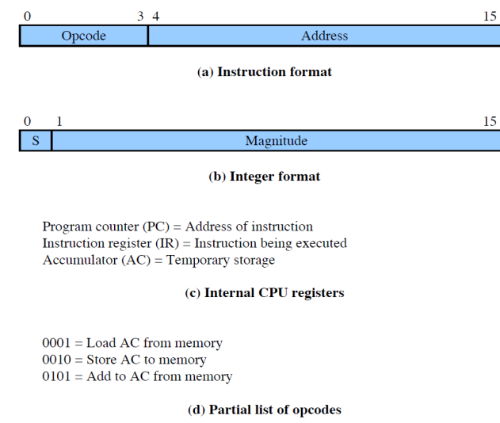


These are all displayed in hex


rows and explanation:
- 1:
  - fetch instruction from `300`
  - `1940` is loaded to `IR`
    - `1` = `0001` = load AC from memory
    - `940` is where we're grabbing from
  - increment `PC` to `301`
  - load `0003` from `940` into `AC`
- 2:
  - fetch instruction from `301`
  - `5941` is loaded to `IR`
    - `5` = `0101` = add to AC from memory
    - `941` is where we're grabbing from
  - increment `PC` to `302`
  - add `0002` from `941` to `0003` in `AC`
- 3:
  - fetch instruction from `302`
  - `2941` is loaded to `IR`
    - `2` = `0010` = Store AC to memory
    - `941` is where we're storing the data to
  - increment `PC` to `303`
  - `0005` from `AC` is stored to `941`

### Interrupts

An interrupt is a signal for the cpu to pay attention to the device.

You can process user inputs very quickly so that it doesn't feel laggy.

Most IO devices are much slower than the cpu so it's less efficient for the cpu to just wait on the IO device so it's better for the IO device to just cut in whenever it needs to.

Most operating systems are interrupt driven, I/O devices will cut in whenever they need to so that the cpu doesn't have to pause and wait on them.

There are different kinds of interrupts:
- hardware and software
  - whenever hardware or software wants to seek the attention of the processor
  - hardware sends a *signal* through a peripheral device to interrupt the processor
  - software executes a specific instruction to interrupt the processor
- vectored and non-vectored
  - interrupt transfers control to a specific address which contains the interrupt vector
    - the interrupt vector has the address of the ISR
    - it's like a low level database that tells you what to do for a given interrupt
  - interrupt vector table contains addresses that inform the interrupt handler as to where to find the Interrupt Service Routines (ISR)
  - vectored: manufacturer of the processor predefines this vector address
    - it's hardcoded/built-in
  - non-vectored: vector address is not predefined
    - address of the required ISR for the interrupt is provided by the interrupting device
- maskable and non-maskable
  - non-maskable: cannot be ignored
    - reserved for events such as
      - unrecoverable memory errors
      - hardware failure
      - system crash
      - force shutdown or cutting power
        - non-maskable, hardware interrupt
        - needs to have the option to shutdown gracefully and minimize damage to hardware
      - overheating
        - heat sensors tell the processor to stop so that the heat can dissipate
    - don't ignore
    - attend to immediately
  - maskable: can be ignored
    - turned off by CPU before the execution of critical instruction sequences that cannot be interrupted
    - non-essential for core system function
    - used by device controllers to request service
      - keyboard
      - printer
    - usually only ignored for a while
    - could potentially be ignored forever
      - almost never happens

These different types are can overlap.

We might have a vectored, non-maskable, software interrupt or a non-vectored, maskable, hardware interrupt.

When the cpu is interrupted,
it stops what it's doing and transfers execution to a fixed location.

Fixed location usually has a starting address where the service routine for the interrupt is located.

The interrupt service routine executes.

After the routine completes, the cpu goes back to what it was doing before.


For the user program,
an interrupt suspends the noraml sequence of execution.

When the interrupt processing is completed,
execution resumes.

In the above image we see the I/O device making the request, sending it to the processor, then the processor processing the interrupt shortlythereafter then signalling that it's done when it's done.


#### Instruction Cycle with Interrupts


Interrupt stage is added to the instruction cycle.

At the execute stage,
the processor checks to see if any interrupts have occured.

If none,
proceed to fetch stage as usual.

Otherwise,
the processor executes an interrupt handler routine instead of going to the fetch stage continue the program execution.
After that it continues.

An interrupt handler routine is generally part of the OS.

The routine:
- determines the nature of the interrupt
- performs whatever actions are needed
  - e.g. find out what I/O module generated the interrupt and branch to a program that will write more data out to that I/O module
- allows the processor to continue executing the user program after it finishes

#### Program Status Word

An interrupt can trigger lots of events in the processor hardware and software.

Program Status Word (PSW) contains status information about the currently running process:
- memory usage
- codes
- status information
  - interrupt enable/disable bit
  - kernel/user-mode bit

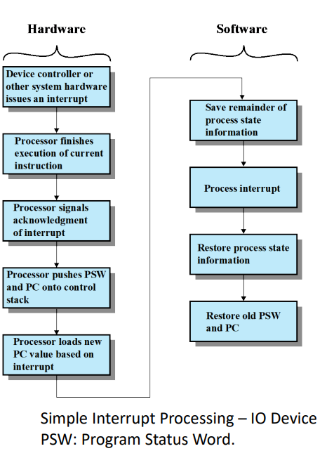

We cover this in more detail later on.

#### Flow Control With and Without Interrupts

Let's take an example of flow control without interrupts.


the black dotted arrow shows how the execution flows

`1`, `2`, `3` refer are segments of code that don't involve I/O

The write calls involve I/O and call an I/O routine/program pictured on the right:
- `4` prepares for the actual I/O operation
- then there's the I/O command
- `5` complete the I/O operation
- then it ends and we return

The write calls call to an I/O routine

Suppose now there are interrupts with short waits.


Now we see an interrupt in the segments `2` and `3` dividing them into `2a`&`2b` and `3a`&`3b` respectively.

At the dividing points we have the execution move to the interrupt handler before going back to the user program.

Suppose now there are still interrupts but now with long waits


The interrupts no longer occur during the segments that don't involve calling to another routine.

Instead they happen when the user program calls to another routine,
the write calls.

So above we went over different techniques for handling I/O operations
- `(a)`: programmed I/O
- `(b)` and `(c)`: interrupt-driven I/O

There is another third technique covered later on called Direct Memory Access (DMA)


Using interrupts it takes less time and is more efficient as the processor doesn't need to idle.

We have to be aware of the overhead as we get faster however.

A cpu core can execute 1 instruction at a time. Multi-core CPUs can execute multiple cores at a time.
Multi-threading adds to this.

In order to utilize this we need to program in a way to take advantage of parallel execution.

#### Multiple Interrupts

Suppose there is an interrupt during the processing of another interrupt, we can either:
- disable interrupts while an interrupt is being processed
  - hard to work with if there's un-maskable interrupts
- use a priority scheme

With disabled interrupts we might have an interrupt while we're handling another interrupt.

We finish handling the first interrupt before attending to the other interrupt.


This does not take into account relative priority or time-critical needs.

With prioritized interrupts we can interrupt the interrupt handler in order to handle a more important interrupt.

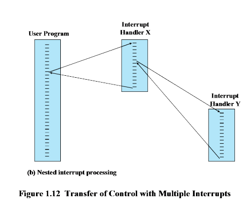

Interrupt Y has a higher priority than interrupt X which results in the execution we see above.

---
Example

3 I/O devices in order of least to greatest priority:
- printer - priority 2
- disk - priority 4
- comms - priority 5

timeline `t=x`:
- 00: begin
- 10: printer interrupt
- 15: comms interrupt
- 20: disk interrupt

each interrupt lasts 10 time units

how will these interrupts be executed?

my answer:
- 10: begin printer interrupt
  - 15: begin comms interrupt
  - 25: end comms interupt
  - 25: begin disk interrupt
  - 35: end disk interrupt
- 40: end printer interrupt


---

### Storage Structure

#### Von Neumann Architecture


```
transcribed:

The structure of most computers, in which both process instructions and data are stored in the same main memory.
```

#### Main Memory
CPU can only load instructions from memory so programs must be loaded into memory in order to run.

Computers run most of their programs from rewritable memory, called main memory (aka random access memory(aka RAM))

Main memory is volatile (loses everything when powered off) and is commonly implemented in a semiconductor technology called dynamic random-access memory (DRAM).

##### ROM, EPROM, and EEPROM

bootstrap program is loaded at power-up
or reboot:
- the computer is checking itself
  - this is also known as post
- Initializes all aspects of the system
  - all your bios shit
- Loads operating system kernel and
starts execution
- We can’t store it to the RAM, instead
it is typically stored in ROM or
EPROM, and is generally known as
firmware
  - the rom, eprom, or eeprom are non-volatile so we put the bootstrap there


###### ROM

read only memory.

non-volatile

data is written there permanently during the manufacturing.

Used for storing firmware and software that does not need to be changed frequentlya

ex:
- BIOS
- embedded system firmware

###### EPROM

EPROM (Erasable Programmable Read-Only
Memory): only reprogrammable after being erased by exposing it to
ultraviolet (UV) light.

Commonly used in early embedded systems and
microcontrollers.

###### EEPROM

EEPROM (Electrically Erasable Programmable
Read-Only Memory): A type of memory that can
be reprogrammed electrically, without the need
for UV light.

Can be reprogrammed in place without the need
for removal from the circuit.

Used in applications where data needs to be
updated or modified periodically, such as in
configuration settings.

#### Secondary Storage

we want programs and data to reside in main memory permanently but main memory is too small (to get a reasonably large size to store data permanently) and it's volatile.

We use non-volatile secondary storage as an extension of the main memory.

Hard-disk drives (HDDs) and nonvolatile memory (NVM) hold onto things before we load them into memory.

HDD
- metal or glass platters covered with magnetic recording material
- the platters are known as disks and rotate
- physical head moves to parts of the disks in order to read from them as they spin

Solid-state disks (SSD)
- faster than HDD
- is not limited by the disk head movement

It's more accurate to think of it as storage in addition to being an extension of the main memory as opposed to just being an extension of the main memory.

Non-volatile memory (NVM)
- harder than hard disks
- becoming more popular

prof uses external ssd but doesn't know about nvme ssd and sata ssd??

#### Tertiary Storage

Slow and large.

Used for special purposes,
typically as a backup of material stored on other devices.

CD-ROM or blu-ray

magnetic tapes.

`
We still use magnetic tapes even though prof doesn't think we do since last she used them was in '97.
What a fucking world we live in.
Still using magnetic tape.
`

#### Storage Hierarchy


going down the hierarchy we get cheaper, larger, and slower memory that is accessed less and less frequently by the processor.

#### Caching

Used at many levels in a computer from the most basest of hardware to the most frivolous of software.

If we want to use information from a slower piece of storage then we will copy that information to a faster piece of storage.

In the above instance we would describe the faster piece of memory as our cache.

We copy things from the secondary storage (the drives) to the main memory (ram) in order to have programs execute faster.
The main memory is the cache.

When we want to grab information we check the cache to see if it's there
- if it is, we use it directly from there
- if not, we copy the data to the cache from the other storage and then use it there

Hit Ratio:
- fraction of all memory accesses that are found in the faster memory
- ex
  - processor has access to two levels of memory
  - lvl 1 - 1,000 bytes and access time of T1=0.1 μs
  - lvl 2 - 100,000 bytes and access time of T2=1 μs
  - Suppose 95% of the memory accesses are found in the cache
  - For H=0.95, the average time to access a byte = (0.95) (0.1 μs) + (0.05) (0.1 μs + 1 μs) = 0.095 + 0.055 = 0.15 μs
  - We want to keep the hit ratio high and the access time(s) low

### I/O Structure

A large portion of operating sytem code is dedicated to managing I/O:
- important to keeping system reliable
- the varying nature of devices makes this a complex task that requires a lot of code
  - cameras, mice, keyboards, printers, fax machines, scanners, and all manner of devices are all classified under I/O device but will all have different needs

When the processor encounters an instruction relating to I/O,
it executes that instruction by issuing a command to the appropriate I/O module.

Possible techniques for I/O operations (2 of which covered previously [here](#flow-control-with-and-without-interrupts)):
1. programmed I/O
2. interrupt-driven I/O
3. Direct Memory Access (DMA)

We previously mentioned that programmed I/O is very inefficient as it would require the processor to wait on the I/O devices as no device can keep up with the processor.

Interrupt-driven is fine for moving small amounts of data but can produce high overhead when used for bulk data movement.
Burst memory movement is pretty good for all of this.
Remember that all operating systems nowadays are interrupt-driven.

But we run into the problem of I/O requests running into other I/O requests.

We need more efficiency which is where DMA comes in.

#### Direct Memory Access Structure

DMA is used for high speed I/O devices capable of transmitting info at close to memory speeds.

Blocks of data are transferred from the buffer storage to the main memory by the device controller w/o the cpu intervening.

Only one interrupt is generated per block, rather than one interrupt per byte as is the case in interrupt-driven I/O.

A von Neumann architecture:

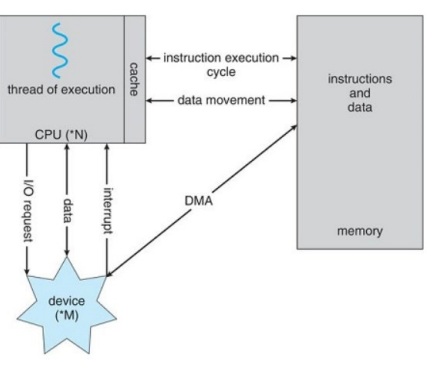

DMA is performed by a separate module on the system bus or incorporated into an I/O module.

When the prcessor wishes to read or write data it issues a command to the DMA module containing:
- whether a read or write is requested
- address of the involved I/O device
- starting memory location for the read/write
- number of words to read/write

The processor returns to it's own work while the I/O operation is continued on by the DMA module.

DMA transfers the block one word at a time, directly to/from memory w/o processor.

Once complete,
DMA sends interrupt signal to the processor.

Processor is only involved at the beginning and end of the transfer making it far more efficient than interrupt driven or programmed I/O.


# Operating System Structures

We look at generic operating system design in this course.

Different designers have different paradigms and ideas.

POSIX is used for linux and macOS

Android uses different things.

The fundamentals are all the same but we may have different names for things and different styles of schedules.

For specific issues we may look at examples of how different operating systems do things

## Computer System Architecture

we can categorize a computer system according to the # of general-purpose processors used:
- in contrast to application specific processors
  - found less often or even not at all
- single-processor systems
- multiprocessor systems
- clustered systems
  - different machines that work together


general purpose processor:
- type of microprocessor designed to handle a wide range of takss and applications
- the typical processor

single processor system:
- old days
- most systems used to use only one cpu
- a core is a basic computation unit of the cpu
  - a unit that can execute instructions

```
prof's dad used to work at msx

that was her first computer

it was popular in the middle east and asia

there was a huge pyramid scheme surrounding msx

she remembered playing hangman on it with her brother

hunt and peck typing to code up hangman.

they had to reprogram hangman everytime they wanted to play since they didn't know how to save shit or I think they couldn't idk.

she saw the rise of the era of the 1.44 mb 3.5 inch floppies

if we had a lab this would've been so cool to listen to but rn idk
```

Most systems have special-purpose processors as well.

We might have graphics processors and all that

multiprocessor:
- these now dominate the landscape of computing
- aka parallel systems, tighly-coupled systems
- advantages:
  - increaseed throughput
  - increased reliability - fault tolerance
- 2 types of systems
  - symmetric multiprocessing
    - each processor performs all tasks
    - processors share memory
  - asymetric multriprocessing
    - each processor perofrms a specific assigned task


Symmetric:
- most common and what we're working with
- each processor has a cpu w/ their own registers
- they also have their own private/local cache
- All processors share physical memory over the system bus
- `N` processes can run if there are `N` CPUs

multicore systems can be more efficient than multiple chips with single cores because on-chip communication is faster than between-chip communications

each core effectively acts as a separate cpu in terms of execution (there are some caveats) and can more quickly communicate with one another.

One chip w/ multiple cores uses significantly less power than multiple single-core chips.

There's always a lot of overhead that comes in the form of inter-process and inter-program communication as well as resource allocation.
These problems feed back into one another as they need to communicate about the resource allocation.
It's a big fucking mess

Dual-Core design

each core has it's own reigster set and it's own local cache often referred to as L1 cache

The level 2 or L2 cache is local to the chip and is shared by the two processing cores.

multicore processor with `N` cores appears to teh operating systems as N standard CPUs

Clustered Systems:
- 2 or more individual systems (known as nodes) joined together
- each node is typically a multicore system
- no shared memory
- loosely coupled systems
- usually there is shared storage via a Storage-Area Network (SAN)
  - usually for very large networks
  - prof used to use a lot of SANs back in her old job
- communication at a hardware and software level
  - there is clustering software that shows the status of every node and all that
  - at the hardware level there is a sort of mini-operating system
  - maybe not too important but cool
- all cloud servers are clustered so that any server going down is invisible to the user
  - if you ping a server that goes down then you might not even notice as the ping just gets redirected
- all linked together to communicate via a Local-Area Network (LAN)
- provides high availability and fault tolerance service which survives failures and provides increased reliability which is crucial in many applications
  - financial applications

Asymetric clustering:
- one machine in hot-standby mode while the other is running the applications
  - if server fails then standby becomes the active

symmetric clustering:
- multiple nodes running the applications and monitoring each other
- more efficient
- all active at the same time

Some clusters are for high-performance computing (HPC)
- applications must be spciallly writeten for use parallelization

```
Prof told us about PS/2, hdmi, dvi, and other ports and allat

Going over the anatomy of the motherboard.

The old university monitors still use vga and all of that.

Prof tells us how to intsall cpu and ram.
```


## Operating System Operations

### Multiprogramming and Multitasking

Allows the operating system to run multiple programs

Multiprogramming (batch system) needed for efficiency:
- single user cannot keep CPU and I/O devices busy at all times
- multiprogramming organizes jobs (code and data) so CPU always has one to execute
- a subset of total jobs in a system is kept in memory
- one job selected and run via job scheduling
- when it has to wait (for I/O for ex), OS switches to another job

multitasking is a logical extension in which CPU executes multiple processes by switching among them very quickly.

Interactive computing.

multitasking
- each user has at least one program executing in memory, a process
- if several jobs are ready to run at the same time then we scheudle jobs for the cpu
- if processes don't fit in memory then we swap them in and out of memory in order to run

multiprogramming only can only execute one program at a time meanwhile all other processors are waiting for the processor.

With multiprocessing, more than one process can be running simultaneously, each on a different processor.


Both of these let us run programs "at the same time".

### Dual Mode

Dual-mode operation:
- OS able to protect itself and other system components
- 2 modes
  - user mode
  - kernel mode
- mode bit is provided by hardware
  - distinguish between system running user or kernel code
  - some instructions are only executable in kernel mode
    - privileged instructions
  - system call changes mode to kernel mode
  - return from system call resets it to user mode

CPUs increasignly support multi-mode operations
- Virtual Machine Manager (VMM) mode for guest VMs

`I'm thinking most of the operating system shit lives in kernel mode.`

#### Transition from User to Kernel Mode

Operating system must always be in control of the CPU.

The user program can't get stuck in an infinite loop or fail to call system services.

We use a timer to stop that from happening.
When the timer runs out it interrupts the computer.
The time length can either be fixed or variable.
No matter what we are able to regain control or terminate the program that goes over time.

There are different timers.

For example on linux systems we can observe different types of timers based on how the kernel is configured, what kind of machine it's on, and what the architecture of the components are like.
We can configure a certain number of interrupts per second for example and it's a HZ value.

Crucial takeaways:
- a timer can be used to prevent a user program from never returning control to the operating system
- kernel mode has many different names
  - supervisor mode
  - system mode
  - privileged mode

### Resource Management

Remember that the operating system is a resource manager.

File space, i/o, processes, memory, chache, etc. all managed by the OS

#### Process Management

Process management:
- a process is a program in execution
  - program is passive entity
  - process is active entity
  - unit of work within the system
  - once we run a program we have a runtime environment
    - allocated area in the memory where we will load in the code and text and stack and other values/variables that we need for the process
- process needs resources to accomplish its task
  - CPU cycles
  - memory space
  - I/O
  - files
  - initialization data
- upon termination, resuable resources are reclaimed

Threads and Processes:
- threads can be single-threaded or multithreaded
- single-threaded
  - one program counter specifying the location of the next instruction to execute
  - process executes instructions sequentially
- multi-threaded
  - one program counter per thread
  - requires a multicore processor, each core works on a different thread
  - most processes aren't multithreaded

Issues to Consider with Process Management
- synchronization
  - coordinate processes that need to share data
- mutual exclusion
  - how to make processes or users share a resource at the same time
- deadlocks
  - \>=2 processes can't continue b/c they are waiting for the others to do something
- livelock
  - \>=2 processes continuously change their states in response to changes in other other process(es) without doing anything useful
  - "you go first" "no you go first" "no you go first" "no you go first" "no you go first" "no you go first" and then we do nothing forever
- starvation
  - process is overlooked indefinitely by the scheduler
  - it can proceed but is never chosen

We're going to be looking at the pseudocode and underlying theory for programs that do this stuff correctly.

After that we can look at some real, runnable code to see what's really going on.

There's a lot of groundwork that needs to be done until we can even understand what the demos we're going to get are doing when we run them.

Activities connected to process management:
- creating/deleting user and system processes
- suspending/resuming processes
- providing mechanisms for
  - process
    - synchronization
    - communication
  - handling deadlocks

#### Memory Management

All or part of the instructions and data needed for a program in the memory in order to execute the process.

Memory management optimizes cpu utilization and response to users.

What's in the memory and when.

Memory Management Activities:
- keep track of what memory is being used by who
- decide which processes (and their parts) and data to move in/out of memory

#### File-System Management

most visible component

uniform, logical view of information storage

Abstracts from the physical properties of its storage devices (stores 1s and 0s and engravings and shit) to define a logical storage unit - file (`.c`, `.java`, `.py`, `.txt`, `.exe` files)

Each storage medium is controlled by a device with various processes
- access speed
- capacity
- data-transfer rate
- access method
  - sequential or random

Activities:
- organize files into dirs
- manage access perms
- os activities
  - creating/deleting files/dirs
  - primitives to manip files and dirs
  - mapping files onto secondary storage
  - backup files onto stable(non-volatile) storage media

#### Mass-Storage Management

storing things like code and data when not in memory

Long term storage.

Very important to manage properly

Speed of computer operation hinges on this subsystem and its algos.
How do we read and write in an efficient way

SSDs have semiconductor tech that's really good but still very expensive so we still have to take other forms of storage into account.

Some storage doesn't even have to be fast, just very long lived, large, and cheap.

Optical drives and magnetic tapes fall under the above category but they still need to be managed by OS or applications.

```
Q: When I move a file to another computer, how does the other computer know what kind of file it is?

A: Every operating system has their own system to manage files. But there are many universally used ways of interpreting the files. The physical files themselves are the same so we just have to worry about the interpretation. Some files are platform specific (`.msi` = microsoft installer, `.deb` = debian package file) and they can't be interpreted properly by machines with the wrong operating system
```

OS Activities:
- (un)mounting
  - (dis)connect to storage medium
- free-space management
  - if you want to write, where do you go to write?
  - do we even have enough space to write?
- storage allocation
- disk scheduling
- partitioning
- protection

#### Caching Management

Recall that cache is a faster piece of storage that we place frequently accessed data that we would ordinarily store in slower storage.

Caches have limited size so we need to manage what we store in there and when.

The size and replacement policy can greatly impact performance.

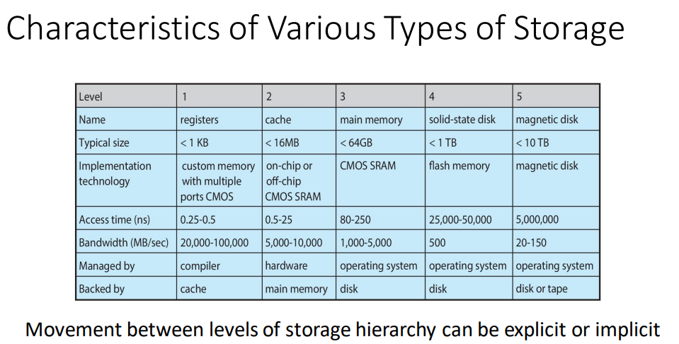

CPUs have cache that the OS doesn't really mess with but there's other forms of cache that the OS is concerned with

Access time:
- time needed to arrive at the byte we want to read/write
- takes time to do the calculation and find the exact address
- the time the cache tech needs to arrive at the right location

Bandwidth:
- speed of the read/write
- a unit of data per second, typically megabytes


##### Cache Coherence


```
transcribed:

Cache coherency is a situation where multiple processor cores share the same memory hierarchy, but have their own L1 data and instruction caches

Incorrect execution could occur if two or more copies of a given cache block exist, in two processors' caches, and one of these blocks is modified.
```

There might be multiple processors with their own caches but there could be some incorrect execution that results in 2 or more copies of a cache block to exist in 2 different processors' caches

This is a problem when we try to write back that cache.

#### I/O Subsystem Management

OS is meant to hide particularities of hardware devices from the user

responsible for:
- memory management of I/O
  - buffering - temp storage of data while being transferred
  - caching - storing parts of data in faster storage for performance
  - spooling - overlapping output of one job with input of other jobs
- general device-driver interface
- drivers for specific hardware devices

Everything not under processor or memory management can be thought of as being I/O in general but in this course we think of things more granularly

---

Q: Two important design issues for cache memory are

A: Size and replacement policy

Q: What is the unit of work in a system?

A: Process

## Operating System Services

OSes provide an env to execute programs and services for users and other programs

2 types of OS Services with different goals:
- helpful to user
- efficient operation of the system itself

Services for the system and services for the user

### For the User

The user does not have to be aware of how all of this works

User Interface:
- almost all operating systems have a User Interface (UI)
- types:
  - Command-Line (CLI)
  - Graphical User Interface (GUI)
  - touch-screen


Program Execution:
- load program into memory
- run program
- end execution
  - normally or abnormally and give error

I/O ops

File System Manip:
- read/write files
- create/delete dirs
- search for files/dirs
- list file/dir info
- manage perms

Communications:
- exchange info within or without the computer using a network
- shared memory or message passing via packets moved by the OS

Error Detection:
- constantly aware of all errors and what to do
- errors in CPU, memory, I/O devices, and programs
- give debugging facilities

```
Q: What service is it when we force quit a program?

A: Things can go wrong on the software level, hardware level, or any number of other levels (within those levels). The best thing to do is dive into the debugging hole. If you're at a low level then you can see each instruction execute one at a time. EAX register, RAX register available to you. If you're at a higher level then you'll likely just get an error code to work it out.

It depends on what is happening. 
```

### For the System

Resource Allocation:
- same as before
- make sure no one can access what they shouldn't be able to

Logging:
- keep track of what's being done and by who with what resources

Protection and Security:
- control information that is stored and used
- concurrent processes should not interfere with each other
- protection ensures that all access to system resources are controlled
- security
  - outside users require authentication
    - passwords
    - biometrics
    - physical key - yubikey
    - 2FA
  - defend against external I/O devices from invalid access attempts
- once users are allowed in, the OS looks on the Access Control List (ACL) to see what the user is allowed to do

---

System call interface is the boundary between user programs and operating system services.

Yes

Is the GUI the most common UI?

It depends. CLI might be more common depending on what you're doing.

There's probably more CLIs kicking around in total but people mostly use GUIs

Touch screen is used on mobile a lot

yes

## User Operating System Interfaces

CLI or command interpreter allows direct command entry
- implemented by kernel or some system programs
- sometimes multiple different kinds of interpreters implemented
  - known as `shells`
  - shell is loaded into run time env and we execute from there
- sometimes commands built-in, sometimes just names of programs
  - in the latter case then we don't have to modify the shell itself to add new features
    - the shell is just a powerful program that can run other programs directly and access the resources
  - we have the latter case a lot in our linux systems, even if we think things are built in they're really just programs in the `/bin/` directory
- shell is merely the interpreter that you put in commands, the OS looks at what to do with that command, and runs the program
- access to the shell is access to the whole computer

```
prof loves security, very passionate
```

GUI:
- user-friendly desktop metaphor interface
  - usually mouse, keyboard, and monitor
  - icons represent files, programs, actions, etc
  - invented at Xerox PARC
- Big developments in GUI designs come from open-source projects
  - KDE - K Desktop Environment
  - GNOME desktop by GNU project
  - both run on linux and unix systems
  - source code readily available for reading, modification, and even contribution under specific license terms

Touchscreen:
- impossible/undesired mouse
- gesture based
- virtual keyboard
- uses a lot of voice commands

---

Remember that there are many different kinds of shells to choose from

## System call

Provides a programming interface to the services provided by the OS

System calls are typically written in a high-level language (C or C++).


Mostly accessed by programs via a high-level Application
Programming Interface (API) rather than direct system call use

API specifies a set of functions that are availbe to an application programmer

params passed to functions to return expected values

3 most common:
- Win32 API for Windows
- POSIX API
  - UNIX, Linux, Mac OS X
- Java API for Java Virtual Machine

We might use system calls for:
- copying contents of one file to another file

Types of System Calls:
- Process control
- File management
- Device Management
- Information Maintenance
- Communications
- Protection

System calls are run in kernel mode

# Process Description and Control

## What is a Process

Computers used to only execute 1 program at a time.
This program had complete control of the system and access to all it's resources.

Now they can have multiple programs loaded into memory and executed at the same time.

With that evolution we needed more control and compartmentalization of running programs.

Thus came the birth of the process.

A process is:
- a program in execution
- the unit of work in a modern computing system
- an entity that can be assigned to a processor and executed on a processor
- a unit of activity characterized by
  - the execution of a sequence of instructions
  - having a current state
  - having an associated set of system resources

2 essential components of processes:
- program code
  - text section
- set of data associated with that code
  - data section

We may be more precise later

A process can be uniquely characterized by a number of elements:
- identifier
  - unique identifier associated w/ process to distinguish from all other processes
  - pid - process ID unique to a process
  - no 2 processes have the same pid
- state
  - if a prcess is currently executing it is in the `running` state
- priority
  - priority relative to other processes
  - what processes can it interrupt and what processes can interrupt it
- program counter
  - the address of the next instruction in the program to be executed
- memory pointers
  - includes pointers to the program code and data associated with the process plus any memory blocks shared with other processes
- context data
  - data that are present in the registers during execution
- i/o status information
  - outstanding i/o requests
  - assigned devices
  - list of files used in the process
- accounting information
  - may include
    - amount of processor time
    - clock time used
    - time limits
  - helps us log activities
  - find out who/what accessed things, when and why

This is all very general,
every OS has their own implementations but most every OS is going to have these things just under different names.

All of the above is stored in the process control block (PCB):
- created and managed by the operating system
- makes it possible to interrupt a running process and later resume execution as if the interruption had not occured (context-switching)
  - context-switching is what this course is all about
    - trying to keep the processor busy and feed it new processes in order to increase the performance and allat
    - the speed of the processor is the speed limit of the computer, no one is faster than the processor. less of a road speed limit and more of a physical speed limit, like the speed of light

Each process has only one program counter and thread for now.
We talk about multithreading and parallelism later on.

## Process States
### Process Trace


Trace:
- Characterize the behavior of an individual process by listing the sequence of instructions that execute for that process
- *set of instructions for a process*
- show how the traces of the various processes are interleaved

---

Example

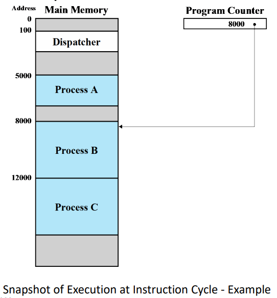

We have a small dispatcher process that switches the process from one process to another.

---

Process Trace Execution


There's a limit to how long a process can stay in the processor.

The above image shows how the dispatcher switches between the different processes in the previous image to the one above.

### Simple Two-State Process Model


Processes change state as they execute.

With a 2 state model we have 2 states:
- running
  - the process is being executed
- not running
  - not being executed by processor

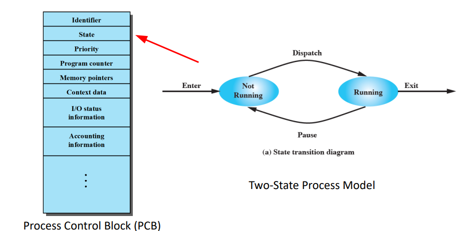


We can have the processes in a queue stored in the ram and we cycle through them, kicking a process out of the processor and back into the queue.
When we do that we set it's state to the `Not Running` state.

When we start executing the new process we get to set that process' state to `Running`.

Note: the entries in the queue are links to the process' PCB as opposed to the whole process itself.

---

The queue is a first-in-first-out list and the
processor operates in round-robin fashion on the
available processes.

Round-Robin: each process in the queue is given
a certain amount of time, in turn, to execute and
then returned to the queue, unless blocked.

`I think every prof seems to have a different definition of "round robin"`

---

### Operations on Processes

We need to be able to `_____` processes:
- create
- terminate

#### Creation

4 reasons to create a new process:
- new batch job
  - OS is provided with a batch job control system
  - operating system is given a ton of jobs and has to execute them all in the proper priority
- interactive logon
  - system d, inet, etc
  - tons of processes start up to serve the user
- created by os to provide a service
  - when the user does stuff they will often start processes, withuot the user having to wait
  - send information to printers
- spawned by existing process
  - opportunity to exploit parallelism or for the purposes of modularity
  - modular design will allow any user to take advantage of the work that the process is doing
  - processes made to support other processes

On Spawning:
- parent process creates child processes forming a tree of processes
- they may or may not be communicating with one another and/or sharing resources
- all, some, or none of the resources are shared between the parent and child process
- the parent and child may execute concurrently or the parent may wait until the child terminates
- it all depends on what the purpose for the spawning was and what the processes were designed to do

##### fork

In unix-like OSes,
the creation of a child process is established through a system called `fork`

`fork` system call creates a copy by duplicating the parent process
- returns the child process ID to the parent and returns 0 to the child process
- the child and parent processes know each others PIDs


child process can execute a different program using `exec` system call

child can't terminate until the parent collects the output of the child.
parent gives a `wait` command to the child and does the collection.

While the child waits then the child is known as a zombie.

If the parent dies then the child becomes an orphan.

---

fork can be used in a program written by the user.

There are a variety of different reasons why you would want to fork so there's many things that the child and parent processes can do together or separate.
We could see that they duplicate and continue to execute the same thing or they'll duplicate and start doing different things and receiving commands from the parent program.

---

Mircrosoft doesn't like `fork()`
- fork is insecure
- fork gives the child more access than it needs since it copies everything by default
- defies the least privilege principle
  - give the least privilege possible to get a job done in order to protect the user and system
- programs that fork but don't exec render address-space layout randomisation ineffective, since each process has the same memory layout

fork is fast and has 0 parameters while windows' `CreateProcess` has many parameters.

We also don't run into the error of running out of memory.

`prof really likes this paper and found it very interesting.`

##### CreateProcess

Windows doesn't have a direct equivalent to fork.

`CreateProcess` is used by Windows API

Spawn vs Fork
- fork
  - existing process creates identical copy of itself
- spawn
  - more general term for creating new process
  - implemented in various different ways depending on OS and programing env
  - doesn't necessarily involve duplicating the existing process
  - spawned process may or may not have a relationship with the parent process
    - spawned process can be a different program altogether

##### Tree of Processes in Linux


`pstree`

prof:
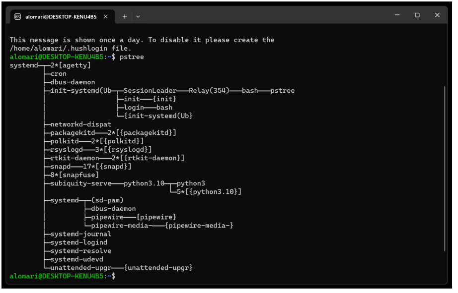

mine:

#### Termination

A process terminates when it finishes executing its final statement and asks the operating system to delete it by using the `exit()` system call

all the resources of the process (physical and virtual) are deallocated and reclaimed by the operating system.

Batch job should include a halt instruction or an explicit os service call for termination. Halt will generate an interrupt to alert the os that a process has completed.

Interactive applications (browsers and shit used by user) are terminated when the user decides typically.

parents can terminate children


WOW:


not reading allat but pretty cool :thumbsup:

### Five-State Process Model

***Note: This is on the assignment (Thanks Cate)***

Using a single queue, the dispatcher could not just select the process at the oldest end.

Dispatcher needs to find a process that is not blocked and that has been in the list for the queue for the longest.

Turn not `Not Running` into `Ready` and `Blocked`

State process diagram
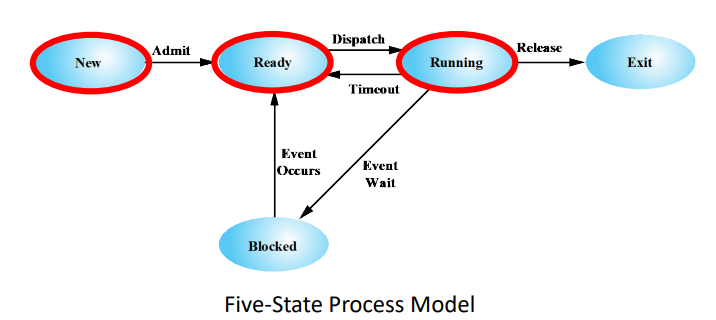

States:
- new
  - newly created process not yet admitted to the pool of executable processes by the OS
- ready
  - prepared to execute when given opportunity
- running
  - process that is currently being executed
- blocked
  - unix-based: waiting
  - process cannot execute until some event occurs such as completeion of an I/O operation
- exit
  - unix-based: terminated
  - process released from pool of executable processes by the OS
  - process has been halted or aborted for whatever reason

Transitions:
- null $\rarr$ new
  - new process is created to exec program
- new $\rarr$ ready
  - os is prepared to take on additional process
- ready $\rarr$ running
  - dispatcher dispatches the process
  - OS chooses ready process to run
- running $\rarr$ exit
  - process is terminated by the OS if the process indicates it has completed or if it aborts
- running $\rarr$ ready
  - running process has reached teh maximum allowable time for uninterrupted execution
  - no longer your turn on the xbox
- running $\rarr$ blocked
  - process requrests something for which it must wait
- blocked $\rarr$ ready
  - process in blocked state is moved to ready state when the event for which is has been waiting occurs

remember that we never have blocked to running.

still not perfect but more later

---

Example


while the processses are simply ready but not running, the dispatcher is running in order to go to dispatch them


There are 2 queues:
1. ready queue
2. blocked queue


So when we ready something up it actually goes into a queue and when something gets hit with an event wait it gets put into a blocked queue.

When a process
- is admitted to the system $\rarr$ admit to requdy queue
- is chosen to run $\rarr$ select from ready queue
- has to wait $\rarr$ send to blocked queue
- times out $\rarr$ send to ready queue again
- finishes $\rarr$ release

In the absence of any priority scheme this can be a simple FIFO queue (round-robin).
Otherwise we could use something like a priority queue.

When an event occurs, any process in the blocked queue that has been waiting on that event only is moved to the ready queue.

The problem is that we have to scan the entire blocked queue which could have 100s or 1000s of blocked processes.

We can remedy this with the use of multiple blocked queues


For each event that will cause an interrupt we will make a queue for it that way we don't have to scan through the whole queue to find a process that corresponds to the event.

### Suspended Processes

Problem - it will become common for all of the processes in memory to be waiting for I/O, and for the processor to become idle.
- there's only so much memory space to store so many processes
- we can pretty easily fill up the memory with all the processes and leave the processor idle since it only really works with shit in the memory.

Solution - swapping
- move part or all of a process from main memory to disk
- it's a very specific part of the disk that's allocated for the memory to work with
- "there is a specific page file dedicated by the operating system"
- this is like the linux swap

The only problem is how do we do that?

We add another state to our process model

When the OS swaps one of the `blocked` processes out on to the disk we put it into a `suspend`ed queue:
- a queue of existing processes that have been temporarily kicked out of the main memory or suspended

the os then brings in another process from the suspend queue or it honors a new-process request

execution then continues with the newly arrived process


So now when we block a process from there it can either go back to the ready queue or get sent to the suspend queue.

When it gets sent to the suspend queue then it gets sent to the disk to make more space in the memory.

Once it's in the suspend queue,
we can activate it again.

So there are now 4 ways to get a process into the ready queue
1. a newly admitted process
2. a process times out
3. a blocked process is unblocked thanks to the event it was waiting on occuring
4. a suspended process is selected to become active once more

If there is nothing in the ready queue and we're waiting on blocked processes then we will start suspending processes to swap out of main memory so that we can admit new processes or activate one from the suspend.

It's always preferrable to activate a suspended process.

The swap is always available - it is built into the architecture - and there's always labels for each state.

When the OS performs a swapping-out operation, it has 2 choices for selecting a process to bring into main meomry:
1. admit a newly created process
2. bring a previously suspended process(preferred)

problem:
- all suspended processes were blocked when they were suspended
- which one do we bring back?

Each process in the suspend state was originally blocked on a particular event, something tha twe accounted for with the use of multiple queues.
We also know that once that event is over we know that the processes in its corresponding queue are no longer blocked.

We want to make another state for suspended processes


For the processes in the secondary memory we're able to have a ready and blocked queue for the suspended.

When we hear/read "suspend" then we think of the disk.

`Blocked` $\rarr$ `Blocked+Suspend`:
- if there are no `Ready` processes then at least one blocked process is swapped out to make room for another process that is not blocked.

`Blocked+Suspend` $\rarr$ `Ready+Suspend`:
- a process was waiting for an event
- the event finishes
- the process is no longer blocked but it's still suspended so it remains in the disk space but gets sent to a suspended ready queue

`Ready+Suspend` $\rarr$ `Ready`:
- when there are no `Ready` processes the OS will need to bring one in to continue execution

`Ready` $\rarr$ `Ready+Suspend`:
- to free up a sufficiently large block of main memory
- we have a ton of processes that are ready.

`Running` $\rarr$ `Ready+Suspend`:
- the OS is preempting the process because a higher-priority process on the `Blocked+Suspend` queue has just become unblocked
- something higher priority just got unblocked and we need to execute on that one now instead
- the os could move the running process directly to the `Ready+Suspend` queue and free some main memory
- process preemption occurs when an execution process i interrupted by the processor so that another process can be executed

`New` $\rarr$ `Ready+Suspend`:

`New` $\rarr$ `Ready`:

We could add more states but then there's more work involved in changing between states.
There are more states in different designs however.

Q: How do we decide wether a `New` process goes straight to `Ready+Suspend` or `Ready`?

A:
we prefer to send a new process to the suspended queue.
The OS will prefer grabbing from ready suspend.
Very rare that we will send something straight to ready since that would mean that the suspend is empty as well so there would be no point in sending it there first and wasting compute time on switching

A suspended process
- non immediately available for execution
  - all info sitting on secondary memory instead of main
- process was placed in a suspended state by
  - itself
  - a parent process
  - OS
- suspended in order to prevent execution
- may or may not be waiting on an event
- process may not be removed from this state until the agent orders the removal
- reasons for suspensions
  - swapping
  - other OS reason
    - illegal memory access
      - usually terminates in that case
    - buffer overflow
  - interactive user request
    - debugging
    - want to use resource
    - minimizing applications or switching off of tabs so we don't really need the program working
  - timing
  - parent process request

## Process Description and Control


What info does the OS need to control processes and manage resources for them?

OS constructs and maintains tables of information about each entity that it is managing:
- memory tables
- I/O tables
- file tables
- process tables


### Memory Tables

main = real

secondary = virtual

we use memory tables to do:
- allocation of main memory to processes
- allocation of secondary memory to processes
- any protection attributes of blocks of main or virtual memory
  - which processes may access certain shared memory regions
  - prevent programs from accessing main or virtual memory that it's not allowed to
- any information needed to manage virtual memory

### I/O Tables

used by the OS to manage the I/O devices and channels of the computer system

at any given time, an I/O device may be available or assigned to a particular process

OS needs to know the status of the I/O operation and the location in main memory being used as the source or destination of the I/O transfer

### File Tables

Provide information about the:
- existence of files
- location on secondary memory
- current status
- other attribs

may be maintined by a file management system (windows NTFS, linux/unix FAT) or the OS based on different operating system

### Process Tables

Must be maintained to manage processes

References memory, I/O, and files directly or indirectly in the process tables to show what the process needs/uses

when the OS is initialized it must have some access to some configuration data that define the basic environment
- all the info required to build out the tables
- everything you can see and view in the bios
- I think anyways

### Process Control

to manage and control a process, the OS must know
- where the process is located
- the attribs of the process that are necessary for its management
- basically everything in the PCB

What is the physical manifestation of a process?

a process must inclue:
- a program or set of programs to be executed
- a set of data location for local and global variables
- stack that is used to keep track of
  - procedure calls
  - parameter passing between procedures
- a number of attributes that are used by the OS for process control (Process control block)

We refer to this as the `process image`

Process Layout in Memory


The stack goes from higher to lower addresses while the heap grows from lower addresses to higher addresses.

### Process Location

location of a process image will depend on the memory management scheme being used

At any given time parts of the process image can be both in the main and secondary memory

so we need process tables maintained by the OS to show the location of each page of each process image

### Process Attributes

info resides in a process control block

there are 3 general categories
1. process identification
2. processor state information
3. process control information

process identification:
- each processor gets a unique numeric identifier
  - PID
- many of the bales controlled by the OS may use process identifiers to cross-reference process tables
- interprocess communication uses PIDs to determine who is who and where
- PIDs let us see who are parent and descendent processes
  - the parents have the child PIDs and the children have the parent PID

Process State Information
- what is the current state of the process
- consists of the contents of processor registers
  - registers on the cpu itself, very fast
- nature of registers involved depend on the design of the processor but typically
  - user-visible registers
  - control and status registers
  - stack pointers
- all processor designs include a register or set of registers often known as the Program Status Word (PSW) that contains condition codes plus status information
  - EFLAGS registers is an example of a PSW used by any OS running on an x86 processor
  - 
  - 

Process Control Information
- the additional information needed by the OS to control and coordinate the various active processes


Role of the Process Control Block
- most important data structure in an OS
  - contains all info needed by OS about process
  - blocks are read and/or modified by virtually every module in the OS
- the set of PCBs define that state of the OS


## Process Control

Typical mangement functions:
- creation and termination
- scheduling and dispatching
- switching
- synchronization and support for interprocess communication
- management of PCBs

we're going to be looking at a lot of these.

### Creation

OS decides to create a new process
1. assign a unique PID to the new process
2. allocate space for the process
3. initialize the process control block
4. set the appropriate linkages (put it in the queue)
5. creates or expands other data structures

### Switching

A process switch may occur at any time that the OS has gained control from the currently running process

Some possible events that may give control to the OS

mechanism|cause|use
-|-|-
interrupt|something external to the execution of the current instruction interrupts|let's the OS react to that asynchronous external event
trap|associated with the execution of the current instruction|handling an error or exception condition
supervisor call| explicit request|call to an operating system function

Interrupt:
- an event external to and independent of the current process
- examples
  - clock interrupt
  - timeout
  - I/O interrupt
  - memory fault
    - wow so epic

Trap:
- an error or exception condition generated within the currently running process
- OS determines if the condition is __fatal__
  - fatal
    - move to exit state and a process switch occurs
  - not fatal
    - action will depend on the nature of the error and the design of the OS
    - the OS will try to recover

Supervisory Call:
- OS activated by a supervisor call from teh program being executed
- getting the manager involved b/c of smth not on ur level

Context Switch
- description:
  - when the cpu switches to another process, the system must save the state of the old process and load the saved state for the new process
  - process' context = PCB
- we have to efficiently save our old PCB and start using the new PCB to execute
- context switch time is overhead
  - no useful work is done while switching
  - more complex os and pcb = longer switch time
  - we want to minimize context switches so we don't waste too much time
- time dependent on hardware support
  - multiple sets of registers per CPU = multiple loaded contexts at once = faster
    - not common
  - typical speed is several microseconds


notice that there is idle time for the operating system to perform the saving of $PCB_0$ and subseqent loading of $PCB_1$


`"blah blah blah" - professor`

## Execution of the Operating System

recall:
- OS functions in the same way as ordinary computer software
  - OS is a set of programs executed by the processor
- OS frequently relinquishes control and depends on the processor to restore control to the OS

Question
- OS is just a colection of programs
- it's executed by the processor like any other program
- is the OS a process?
- how is it controlled?

3 approaches:
1. separate kernel
2. execution within user processes
3. process-based operating system

### Separate Kernel

Execute the kernel of the OS outside of any process
- the concept of a the proess is considered to apply only to user programs
- OS executed as separate entity operated in privileged mode
- common on older OSes
  - not often used today

### User Processes

All OS software is executed in the context of a user process:
- OS is a collection of routines that the user calls to perform variousfunctions, executed within the environment of the user's process
- common on OSes on smaller computers (PCs)
- commonly used in today's laptops

### Process-Based OS

OS as a collection of system processes
- software that is part of the kernel executes in a kernel mode
- major kernel functgions are organized as separate processes
- imposes a program design discipline that encourages the use of a modular OS with minimal, clean interfaces between the modules.
- used in
  - servers in more modern computing
  - modular design

### Summary

The most fundamental concept in a modern OS is the process.

The principal function of the OS is to create, manage, and terminate
processes.

While processes are active, the OS must see that each is allocated
time for execution by the processor, coordinate their activities,
manage conflicting demands, and allocate system resources to
processes.

# Threads

## Processes and Threads


The actual fetching and execution of the instructions is thought of as a thread or LightWeight Process (LWP).

Most unix based processing will say threads.

Some OSes don't differentiate between threads and processes, treating them all as processes.

The process model introduced so far assumed that a process as an executing program with a single thread of control.

Virtually all modern operating sytems, however, provide features enabling a process to contain multiple threads of control.


### Threaded Approaches

Single threaded approaches

a single thread of execution per process

threads are not recognized


ex.
- ms-dos
- old linux


we can make it seem as though the processes are all working simultaneously but we're actually just switching around very quickly

### What is a Thread


thread is a basic unit of cpu utilization
- each thread knows its parent process
- thread ID
- program counter
- a register set
- a stack

thread = instruction trace


If a process has multiple threads of control then it can perform more than one task at a time.

Threads belonging to the same process
- share
  - code section
  - data section
  - other operating system resources
    - open files
    - signals
- have unqiue
  - registers
  - stack
  - PC
  - ID

### Why Multithread?

Most modern applications are multhreaded

an application is typically implemented as a separate process with several threads of control

multiple tasks with the application can be implemented by separate threads for different reasons

ex:
- making thumbnails of tons of different images at once
  - 1 thread per image
- loading a webpage
  - 1 thread for text
  - 1 thread for images
- word processors
  - 1 thread for responding to keystrokes
  - 1 thread for displaying graphics
  - 1 thread for spell checking

we feed each thread a different task and they don't interfere with one another

multithreading is also good for client/server applications


Server will have
- have a port open and a thread to listen for connection requests
- make a thread to do what the request wants
- the open port
  - very vulnerable
  - an open door
  - necessary as otherwise no one can connect

Q: why multithread and not multi process

A: It's much faster
- process creation is heavywhite while thread creation is lightweight
- creation, termination, and switching of threads is faster than with processes
- threads are ten times faster to create than processes in UNIX

kernels are generally multithreaded
- during system boot time on linux system, several kernel threads are created
- each thread performs a specific task
  - device management
  - memory management
  - interrup handling
  - etc

benefits of multithreading
- responsiveness
  - allow contonued execution if part of th eprocess is blocked
  - good for user interfaces
- resource sharing
  - threads share resources of process
  - easier than shared memory or message passing b/w processes
- economy
  - cheaper than process creation
  - thread switching lower overhead than context switching
- scalability
  - process can take advantage of multicore architectures
  - one process can use at most one core
  - multi-threads could use all available cores or CPUs
  - speed of execution

## Multicore Programming


multicore:
- multiple computing cores on a single chip
- each core appears as a separate CPU to the operating system
- each core can execute 1 trace at a time

```
word on caches, specifically in this intel architecture

L1 cache has all of the instructions and stuff.
All the highest value things

L2 can allow communication between 2 cores physically next to one another. They look separate in the diagram but that's just the allocation we do, they can look at each other's work and talk to one another basically.

L3 is on the chip and is shared by all of the cores

There are different kinds of architectures out there so the interesing L2 cache sharing won't be true of every architecture.
```

multithreaded programming
- provides a mechanism for more efficient use of these multiple computing cores and improved concurrency

we need to program properly in order to take advantage of the presence of multithreading

### Concurrency vs Parallelism

Parallelism
- implies a system can perform more than one task simultaneously
- 2 cores doing 2 threads at the same time
- working in parallel

Concurrency
- supports more than one task by allowing all the tasks to make progress

Q: Is it possible to have concurrency without parallelism?

A: yes. utilize thread switching.
parallelism requires parallel execution.
We can have all the tasks progress together without parallel execution by way of thread switching.

```
parallelism cannot happen on a single core

parallelism implies concurrency

there can be concurrency on a single core

parallelism is faster than concurrency alone
```


We are either parallelising data or tasks

data parallelism:
- distribute distinctive chunk of data across multiple cores, and perform the same operation on each
- ex
  - each core gets a different image
  - each core performs the same operation of creating a thumbnail

task parallelism
- distributing threads across cores
- each thread performs a unique operation
- not necessarily all working on the same data
  - 1 core is summing rows
  - 1 core is averaging rows
  - 1 core is finding the median
  - all may or may not be working on the same rows

There are a number of challenges that come with programming for multicore or multiprocessor systems
- dividing activities into separate concurrent takss
  - what tasks are independent of each other
- balance
  - pick tasks that perform equal work of equal value
- data spliting
  - data accessed and manip'd by the tasks must be divided to run on separate cores
- data dependency
  - see what tasks require what data and see which pieces of data are shared by tasks
- testing and debugging
  - testing and debugging concurrent programs is inherently more difficult than testing and debugging single-threaded applicdations

Many deveopers argue that the advent of multicore systems will require an entirely new approach to designing software systems in the future.

Many educators believe that there should be an increased emphasis on parallel programming in software development.

### Amdahl's Law

Identifies performance gains from adding additional cores to an application that has both serial and parallel components

$$
speedup\le\frac{1}{S+\frac{(1-S)}{N}}
$$
- $S$ - serial portion
- $N$ - processing cores

example:
- application is
  - 75% parallel
  - 25% serial
- 1 core $\rarr$ 2 cores

$$
speedup\le\frac{1}{0.25+\frac{(1-0.25)}{2}}
\newline
= \frac{1}{0.25+\frac{0.75}{2}}
\newline
= \frac{1}{0.25+0.375}
\newline
= \frac{1}{0.625}
\newline
= 1.6
$$

- 1 core $\rarr$ 4 cores

$$
speedup\le\frac{1}{1/4+\frac{(1-1/4)}{4}}
\newline
=\frac{1}{1/4+\frac{3/4}{4}}
\newline
=\frac{1}{1/4+3/16}
\newline
= \frac{1}{7/16}
\newline
= 16/7
\newline
\approx 2.28
$$

as $N$ approchaes infinity
- speedup approaches 1/S
- 50% of application is serial, maximum speedup = 2 regardless of $N$

serial portion of an application has a dispropportionate effect on performance gained by adding cores.

---
Knowledge Check:
- parallelism involves distributing tasks across multiple computing cores
- use amdahl's law to find the speedup gain for an application that is 60% parallel component for 2 processing cores
  - 1.43
- it is possible to have concurrency without parallelism

---

### Thread States and Operations

Key states for a thread
- running
- ready
- blocked

thread operations associated with a change in thread state are:
- spawn
  - new process is spawned, a thread for that process is also spawned
- block
  - a thread needs to wait for an event and is blocked
- unblock
  - the event the thread was waiting for has occured, the thread is moved to the ready queue
- finish
  - thread completes. deallocate register, context, and stacks

### Thread Synchronization

We need to synch up the activities on the threads because:
- all threads share the same resources
  - namely address space
- one thread altering the shared resource will affect the other threads in the same process


## Multithreading Models

Types of threads:
- user threads
  - supported above the kernel
  - managed by user-level thread library w/o kernel support
- kernel threads
  - supported and managed directly by the kernel

virtually all contemporary operating systems support kernel threads

thread libraries contain code for:
- creating and destroying threads
- passing messages and data between threads
- scheduling thread execution
- saving and restoring thread contexts

3 primary thread libraries
- POSIX Pthreads
- Windows threads
- Java threads

### User Threads

User Threads
- many are mapped to a single kernel thread
- kernel is not aware of the existence of threads
- thread management is done by thread library at the user level


---
examples


Process `B` has 2 threads.
OS only sees process `B`,
not its threads


We're blocking the whole process.

The threads remain in their states but they aren't actually doing anything.

We can't just switch to thread 1 as the kernel isn't aware of the threads,
only the process.


---

pros:
- thread switching does not require kernel mode privileges
  - saves overhead of two mode switches
- scheduling can be application specific
  - scheduling algo can be tailored to the application
- ULTs can run on any OS

cons:
- entire process wil block if a single thread makes a blocking system call
- pure ULT strat, multithreaded application cannot take advantage of multiprocessing/parallelism
- very few systems use this model because of its inability to utilize multiple cores
  - solaris green threads

### Kernel Threads

thread management is all done by the kernel

creating a user thread creates a kernel thread (one-to-one)

kernel maintains context information for the process as a whole and for individual threads within the process

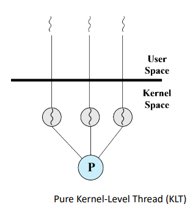

pros:
- kernel can simultaneously schedule multiple threads from the same process on multiple processes
- if one thread in a process is blocked, the kernel can schedule another thread of the same process
- linux and windows implement this

cons:
- 1-1 correspondence b/w user and kernel threads will burden the performance of a system after creating a large number of threads
  - so many threads to have to switch between

### Combined User and Kernel level threading

- thread creation done in user space
- most of scheduling and synchronization of threads within an application
- multiple user-level threads from a single application are mapped onto smaller or equal number of kernel threads
  - many-to-many
- number of kernel threads may be specific to either a particular application or a particular machine


Note:
- we can't map 3 threads to 4 cores.
- a kernel thread can only belong to one processor
- a user thread can only map to one kernel thread

pros:
- appears flexible
- number of threads and parallelism
  - many-to-one (pure ULT)
    - create many threads but no parallelism
  - one-to-one (pure KLT)
    - better concurrency but high overhead
  - many-to-many (combined approach)
    - as many threads as needed running parallel on a multiprocessor
- blocking
  - when a thread performs a blocking system call, the kernel can schedule another thread for execution 

cons:
- difficult to implement
  - windows with the `ThreadFiber` package
  - not very common outside of the above

Whether KLT or ULT remember that

a relationship must exist between user threads and kernel threads no matter the cardinality


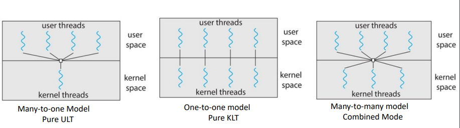


2-level model is like many-to-many but we're able to bind a user thread to a kernel thread.

we can basically dedicate a core to a thread.

Q: can we interleave threads from different processes?

A:
This is just normal process switching.

---
knowledge check


---

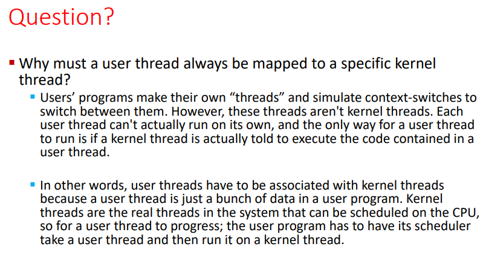

prof:

"the threads need to have a connection to the processor in order for execution"

# Concurrency: Mutual Exclusion and Synchronization

## Background for Concurrency

processes can execute concurrently or in parallel

may be interrupted at any time, partially completing execution

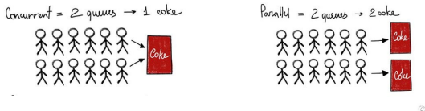

we have a shared memory where we store variables and everything we want to work with.

If we don't manage that shared memory properly we end up with data inconsistency


make sure the processes execute in an orderly fashion and don't fuck with each other when they share a resources

Race Condition
- several processes access and manip the same data at the same time
- outcome depends on who got there first


## Critical-Section Problem

critical segment of code:
- process may be accessing and updating data that is shared with at least one other process
- only one process in critical section at a time

when a process wants to enter the critical section
- entry section - process asks permission to enter
- it does the critical section
- exit section - let's everyone know it's done
- remainder section is the rest of the noncritical stuff

we need to ensure the 3 following conditions
1. mutual exclusion
   - only one process in critical section at a time
2. progress
   - if no one else is in critical and someone else wants to go critical then we have to select the next process
   - we can't postpone this selection indefinitely
3. bounded waiting
   - there must be a limit on the number of times that other processes can enter the critical sections after a process has made a request to enter
   - assume same speed of all processes


### Single Core

very shrimple

we could prevent interrupts from occuring while a shared variable was being modified

useless when we try to move to multiprocessor since it would just start disabling everything.

### OS

2 approaches depending on preemption
- preemptive
  - allows preemption of process when running in kernel mode
  - processor can tell the process to pack all their bags and get ready to move
- non-preemptive
  - runs until kernel mode, blocks, or voluntarily yields CPU
  - essentially free of race conditions as only one process is active in the kernel at a time

preemptive are difficult to design.

it allows two kernel-mode processes to run simultaneously on diff cores

it also makes things more responsive

---
knowledge check


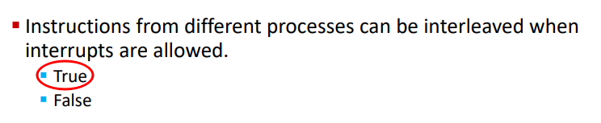


---


atomic operations

## Mutual Exclusion

### Software Approaches

#### Dekker's Algo

Dijkstra went to go publish it for him so that's why there's a jpeg of him on the slide

first known sol'n to the mutual exclusion problem in concurrent programming

allows 2 threads to share a single-use resource without conflict, using only shared memory for communication

only one access to a memory location can be made at a time

we have a global memory location labelled `turn` that is shared between the two processes

Processes check to see if it's their turn and execute accordingly.
Once they're done, they give the turn to the other process.

Mutual exclusion is guaranteed.

What is the problem?

Processes must strictly alternate in their use of their critical section
- the pace of execution is dictated by the slower of the two processes

One process being slow makes the whole things slower since everyone has to wait on that slower process.

if one process fails then the other process is permanently blocked
- this happens because the failed process can't give the turn over to the other process by exiting and setting the flag
- this happens whether or not the process is in the critical section or not

2nd attempt - a revision:
- each process has it's __own key _(flag)___
- if one fails, the other can still access its critical section
- processes can look at others flags
- one process can't change the flag of another process
- processes share a boolean vector that holds the flags
  - `Boolean vector flag[2]`

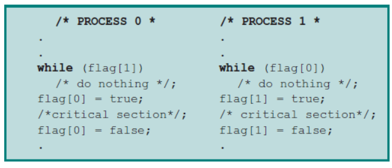

drawbacks:
- permanent blocking still possible
  - process fails inside critical section or after setting flag to true w/o entering
- no guaranteed mutual exclusion
  - P0 executes the while statement and finds flag[1] set to false
  - P1 executes the while statement and finds flag[0] set to false
  - P0 sets flag[0] to true and enters its critical section
  - P1 sets flag[1] to true and enters its critical section
  - both processes are now executing their critical sections so the program is incorrect

3rd attempt - another revision
- the problem from before was that a process can change its state after the other process has checked it but before the other process can enter its critical section
- swap around the two stateemnts to guarantee mutual exclusion


we set the flag's value before we execute the while loop

drawbacks:
- this results in a deadlock
- both processes set their flags to true
- later on they will check each other's flags and decide they need to wait for the other
  - the flag value makes them think the other process is in their critical section

4th attempt - yet another revision:
- Each process sets its flag to indicate its desire to enter its critical section but is prepared to reset the flag to defer to the other process
- mutual exclusion is guaranteed under this model


drawbacks:
- 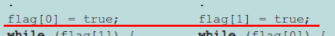
  - each process sets their flag to true
- 
  - each process checks the other's flag before proceeding with the while loop
- 
  - each flag flips from false and back to true
- the loop ends up repeating in what's known as a _livelock_
- this won't sustain for a long time
  - the processes are different and we can presume that the while loops won't always take the same amount of time and that one will finish their while loop before the other can so they'll enter the critical section first

5th iteration - the correct solution:
- we introduce ___the right to insist___


- when P0 wants to enter the critical section
  - it sets its flag to true
  - checks P1's flag
    - if P1 flag is false then P0 gets to go critical
    - else, P0 consults turn
      - turn==0
        - it's P0's turn to insist
        - P0 will just keep on checking P1's flag in order to try and enter its critical section
- P1 will at some point note that it is its turn to defer and set its flag to false, allowing P0 to proceed
- after P0 has used its critical section
  - P0 flag set to false
  - turn set to 1 to transfer the right to insist to P1

#### Peterson's Solution

Dekker's algo solves things but it's hard to follow

Peterson has a simpler sol'n that allows two processes to share a single-use resource w/o conflict

only shared memory is used for communication

it is kind of rewriting Dekker's algorithm

---

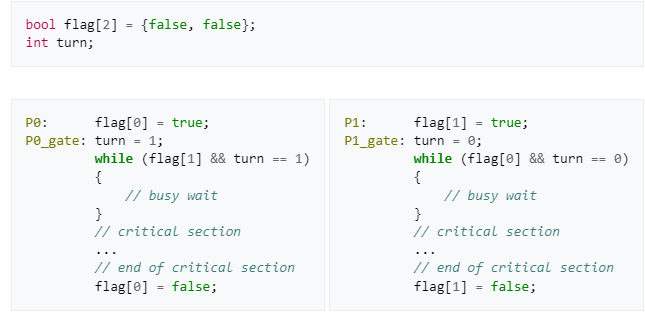

`int turn` - indicates whose turn it is to enter the critical section

`bool flag[2]` - indicate if a process is ready to enter the critical section

`flag[i]==true` implies that process $P_i$ is ready


3 critical-section requirements are met(provably):
1. mutual exclusion is preserved 
   - $P_i$ enters critical section only if: either `flag[j]==false` or `turn == i`
     - the other process is not ready or
     - it is $P_i$'s turn
2. Progress requirements is satisfied
3. Bounded-waiting requirement is met

Useful for demonstrating an algo but not guaranteed to work on modern architectures.

to improve performance, processors and/or compilers may reorder operations that have no dependencies
- fine for single-threaded as result is always the same
- may produce inconsistent or unexpected results for multithreading

```
two threads share _flag_ and _x_ variables

boolean flag = false;
int x = 0;

Thread 1 performs

while (!flag)
  print x;

Thread 2 performs

x = 100;
flag = true;

what is the expected output

100 is the expected output however the operations for thread 2 may be reordered so the output might be 0
```


We have to use a ___Memory Barrier__ to make sure that Peterson's solution will work correctly on modern computer architecture.

So this software based support will need the aid of some hardware.

---
Knowledge check:
- In Peterson's solution, the \_\_\_ variable indicates if a process is ready to enter its critical section
  - `flag[i]`

### Hardware Support Approaches

---
"There is no bullet solution... all solutions build on each other"

---

Many systems provide hardware support for implementing the cirtical section code

uniprocessors - could disable interrupts
- currently running code would execute w/o preemption
- generally, too inefficient on multiprocessor systems
  - OS using this are not broadly scalable

looking at 3 forms of hardware support
1. memory barriers (aka memory fences)
2. hardware instructions
3. atomic variables

#### Memory Barrier

How a computer architecture determines what memory guarantees it will provide to an application program is known as its memory model.

models may be either
- strongly ordered
  - memory modification of one processor is immediately visible to all other processors
- weakly ordered
  - not always immediately visible to all other processors

developers cannot make an assumption about whether or not the memory model is strongly or weakly ordered.

in lieu of this guarantee,
we use memory barriers.

memory barriers
- computer instructions that force any changes in memory to be propogated to all other processors in the system

`Sfence` is a memory barrier instruction for example with regards to storing

`lfence` is another type of instruction with regards to loading

`mfence` prevents reording of reading and writing before or after the fence

do not reorder anything before the barrier with anything that comes after the barrier


we're not able to mov the loads to either side of the fence


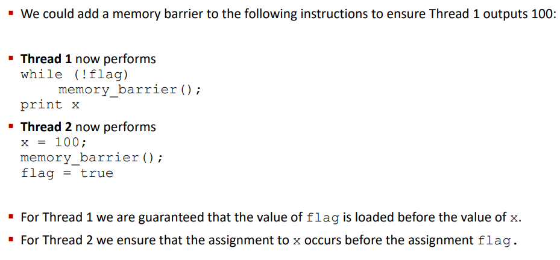

#### Hardware Instructions

```c
boolean test_and_set (boolean *target){
  boolean rv = *target;
  *target = true;
  return rv;
}
```

`test_and_set()`
- executed atomically
- read a value in memory
- set it to true
- return the value that was in memory

This let's us make a lock out of the flag we want us to make sure we don't enter the critical section while another program is in its critical section.

```c
do {
  while (test_and_set(&lock));
  /*critical section*/
  lock = false;
  /*remainder section*/
} while (true);
```

This is suported by nearly every architecture.

`compare_and_swap()`
```c
int compare_and_swap(int *value, int expected, int new_value) {
  int temp = *value;
  if (*value == expected)
    *value = new_value;
  return temp;
}
```
- executed atomically
- returns the original value of `value`
- set the `value` to the value of `new_value`
  - but only if `*value == expected`

We can also use this to make a shared lock for mutual exclusion. 
Have it initialized to 0.

```c
while (true) {
  //lock is the lock, 0 is the expected value, 1 is the prospective new value
  while (compared_and_swap(&lock, 0 ,1) != 0) {/*do nothing, someone else is in critical section*/}
  /*critical section, lock has been set to by us*/
  lock = 0;     //we left the critical section so we're able to set the lock back to 0
  /*remainder section*/
}
```

#### Atomic Variables

Typically instructions such as compare-and-swap are used as building blocks for other synchronization tools.

One tool is an atomic variable that provdes *atomic* (uninterruptible) updates on basic data types such as integers and booleans.

Ex:
- `sequence` - our atomic variable
- `increment()` - an operation on `sequence`
- command
  - `increment(&sequence)`
  - ensures the sequence is inremented without interruption

we make atomic updates so that we're guaranteed to update a variable.

`increment()` can be implemented like so:
```c
void increment (atomic_int *v) {
  int temp;
  do {
    temp = *v;
  }
  while (temp != compare_and_swap(v, temp, temp+1));
  // the above keeps looping until we are able to successfully swap, effectively incrementing the value of `v`
}
``` 

---
Knowledge Check:
- race conditions are prevented by requiring that critical regions be protected by locks
  - true
- `test_and_set()` instruction is executed atomically
  - true
- an instruction that executes atomically
  - executes as a single, uninterruptible unit

### OS & Programming Languages Approaches

#### Mutex Locks

Previous solutions are compicated and generally inaccessible to application programmers.

OS designers build software tools to solve critical section problem.

The simplest solution is the mutex lock.

>fun fact: mutex is a portmanteau of `mut`ual `ex`clusion, as it was created to solve that problem


note that the mutex is an integer that alternates between 0 for locked and 1 to unlocked, this is effectively a boolean.

Protect a critical section by first `acquire()` a lock then `release()` the lock.
Boolean variable indicating if `lock` is available or not.

`acquire()` and `release()` must be atomic.
Usually implemented via hardware atomic instructions such as compare-and-swap.

```c
while (true) {
  acquire lock

  critical section

  release lock

  remainder section
}
```

You `acquire()` the lock and no one else can touch it while you're in the critical section.
Afterwards you can `release()` since you're done with the critical section.

The instructions look something like this in implementation.
```c
acquire() {
  while (!available) { /* busy wait */}
  available = false;
}
release () {
  available = true;
}
```
- these two functions must be implemented atomically, typically through the use of something like `test_and_set()` and `compare_and_swap()`

cons:
- sol'n requires busy waiting
  - a process trying to enter enter its critical section will loop call `acquire()` over and over again to try and grab hold of it
- this lock is called a *spinlock*
  - if a lock is to be held for a `short duration`, one thread can "spin" on one processing core while another thread performs its critical section on another core.

short duration:
- how short is short?
- waiting on a lock requires 2 context switches
  - move the thread to the waiting state
    - storing away all of the process info (pcb, psw, etc.) introduces overhead
  - restore the waiting thread once the lock becomes available
- the general rule is to use a spinlock if the lock will be held for a duration of less than two context switches
- we don't know how long it will take for a critical section to take but we can get some good estimates

---
Knowledge check
- a mutex lock
  - is essentially a boolean variable
- what is the correct order of operations for protecting a critical section using mutex locks?
  - `acquire()` followed by `release()`
- busy waiting refers to the phenomenon that while a process is in its critical section, any other process that tries to enter its critical section must loop continuously in the call to acquire the mutex lock
  - yes

#### Semaphores

One problem we had with the mutex was the busy waiting.

basic idea:
- $\ge$ 2 processes can work together using simple signals
- a process can be forced to stop at a specified place until it has received a specific signal
- any complex coordination can be done with an appropriate amount of signals
- our previously mentioned mutex is akin to a single flag that we can raise up and down.

Sempahores are a more sophisticated synchronization tool than mutex locks.

A semaphore `S` is an integer variable, that can only be accessed through 2 atomic operations:
1. `wait()` - decrements the semaphore value
2. `signal()` - increments the semaphore value

```
these each have other names.
wait() originally P() from Dutch proberen, "to test", semWait()
signal() originally V() from verhogen, "to increment", semSignal()

we may find these in other literature
```
Implementation
```c
wait(S) {
  while (S <= 0) {/* busy wait */}
  S--;
}
signal(S) {
  S++;
}
```

There are 2 different kinds of semaphores:
1. counting sempahore
2. binary semaphore

Counting semaphores (aka general semaphore) is an integer value that can range over an unrestricted domain

Binary semaphores are an integer value that can only range between 0 and 1.
This is a mutex lock.

We can implement a counting semaphore as a binary semaphore.

Good tool to solve synch problems.


Initializing the semaphore to 0 will allow us to only allow $P_2$ to execute $S_2$ after the execution of $S_1$.

A semaphore must guarantee that no 2 processes can execute the `wait()` and `signal()` on the same semaphore at the same time

implementation becomes the critical section problem where the `wait` and `signal` code are placed in critical section.

Could now have busy waiting in critical section implementation.

Process can just suspend instead of waiting for the semaphore.
Each semaphore has a waiting queue w/ 2 items
- value (of type integer)
- pointer to next record in the list

2 operations:
- block (aka sleep) - place the process invoking the operation on the appropriate waiting queue
- wakeup - remove one of the processes from the waiting queue and place in ready queue

waiting queue:
```c
typedef struct {
  int value;
  struct process *list;
} semaphore
```

No busy waiting implementation:
```c
wait (semaphore *S) {
  S->value--;

  if (S->value < 0) {
    add this process to S->list;
    block;
  }
}

signal(semaphore *S) {
  S->value++;
  if (S->value <= 0) {
    remove a process P from S->list;
    wakeup(P);
  }
}
```


We're using the incrementing and decrementing to iterate through the queue.

A strong semaphore uses a queue of blocked processes, the process unblocked is the one in the queue for the longest time.

A weak semaphore uses a set of blocked processes.
The processes unblocked is unpredictable.
This can lead to process starvation as a process may remained blocked forever


---
knowledge check
- a counting semaphore
  - is essentially an integer variable
- \_\_\_ can be used to prevent busy waiting when implementing a semaphore
  - waiting queues
- mutex locks and binary sempahores are essentially the same thing
  - true

#### Monitors

# Deadlock and Starvation

## Principles of Deadlocks

Systems have different resources

Threads must:
- request a resource before using it
- release the resource after using it

The number of resources requested cannot exceed the total number of resources available in the system
- a thread cannot request 2 net interfaces if there is only 1
- `can't ask for what we don't have`

Request:
- Thread requests the resource
- if you can give it, then give it immediately
- If it can't be given right now then the requesting thread must wait until it can acquire the resource

Use:
- the thread can operate on the resource
- ex: use the mutex lock to access a process' critical section

Release:
- resource is released and made usable again

Reusable Resources:
- can be used safely by one process at a time
- not depleted by that use
- not consumable
- ex: processors, I/O channels, memory (main and secondary), I/O devices, data structures (files, databases, and semaphores)

Consumable Resources:
- created/produced and destroyed/consumed
- ceases to exist after being acquired by the consuming process
- ex: interrupts, singals, messages, info in I/O buffers

### Deadlock

A deadlock is the __permanent__ block.

Two or more processes are waiting for the other process to release a shared resource.


A set of processes is deadlocked when each process
in the set is blocked awaiting an event that can only
be triggered by another blocked process in the set.

The block is permanenet because none of the events ever get triggered.


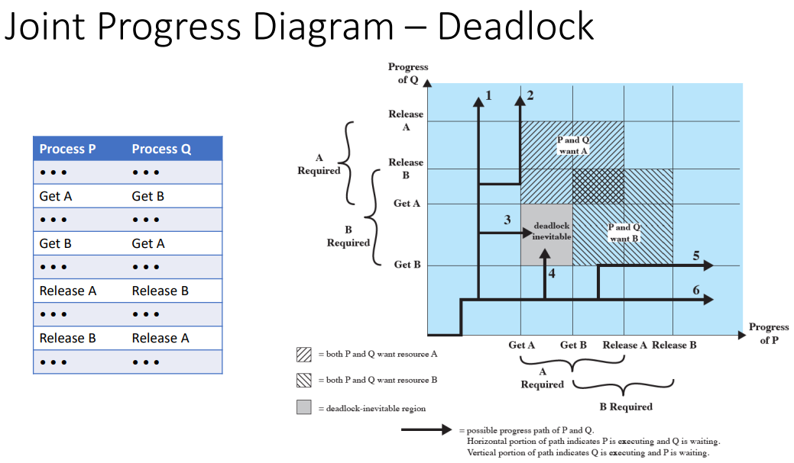

Trace 1 sees process $Q$ execute all of its desire operations before process $P$ can perform any single operation

Trace 2 sees process $Q$ get A then make process $P$ wait until it was done.

Trace 3 sees $Q$ get B and $P$ get A. 4 does the same but in reverse order

Traces 3 & 4 eventually leads to a deadlock as each process will want the other's acquired resource that they can't release until they get the resource they want.

Trace 5 sees process $P$ get B then make process $Q$ wait until it's done.

Trace 6 sees $P$ exectute everything before $Q$ gets make some meaningful progress.

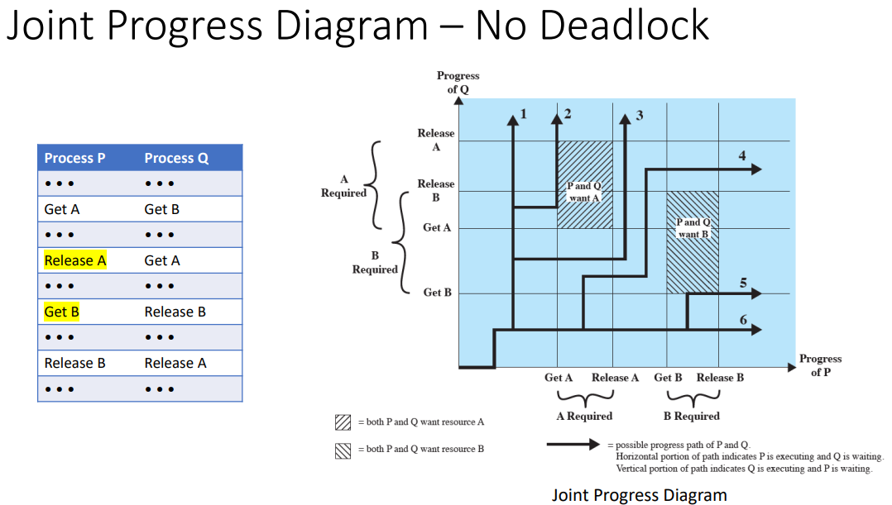

>"I would like to leave that for the banking algorithm" - Prof, no one knows what she meant by that

This rearrangement is not always a possible solution since we don't know what the order of the instructions/operations will be beforehand.

Traces 1, 2, 5, and 6 are unaffected but now traces 3 and 4 don't lead to deadlock.

instead with Trace 3
- $Q$ gets B
- $P$ gets A then releases A
- $Q$ gets A, releases B, then releases A
- $P$ gets B then releases B

Similarly with trace 4


These are reusable resources.

There will be a deadlock.

$p_0 q_0 p_1 q_1$ introduces the possibility of a deadlock

$p_0 q_0 p_1 q_1 p_2 q_2$ is where the deadlock happens.


These are reusable resources.

There will be a deadlock.

P1 and P2 can make their requests then the next requests will cause a deadlock.

P1 or P2 can make both requests but then upon the next request from the other process we will run into deadlock. That is unless there is some kind of release condition that we don't see beyond the processes' second requests.

The cause of the deadlock being that we don't have enough resources to give.


Consumable resource.

There is a deadlock as they are both waiting on each other.

If receive is not blocking - i.e. the processes just make themself open to receiving and don't wait - then there is no deadlock.

It depends on the nature of the receive operation.

```
Prof will tell us if it's blocking or not blocking.
```

## Deadlock in Multithreaded Applications

2 mutex locks are created and initialized:

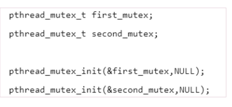

2 threads are created and both threads have access to both mutex locks.


Deadlock is possible if thread 1 acquires `first_mutex` and thread 2 acquires `second_mutex`

Each thread then waits for the other's mutex.

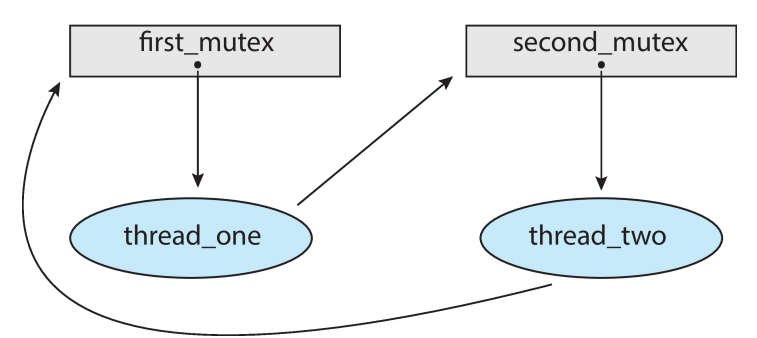

THe order depends on how the threads are scheduled by the cpu scheduler.
hard to test for deadlocks as they may only occur under certain scheduling circumstances.

this is the livelock of waiting continually trying to acquire

---
knowledge check:
- a deadlocked state occurs whenever
  - every process in a set is waiting for an event that can only be cauesd by another process in the set
- Deadlock occurs when every thread in a set is blocked waiting for an event that can be caused only by another thread in the set, while livelock occurs when a thread continuously attempts an action that fails.
  - true
- in the dining philosophers problem, there is a possibility of deadlock but not livelock
  - false
  - everyone picks a fork up then there is deadlock
  - if they keep picking it up and putting it down then there is livelock

## Deadlock Characterization

deadlock can arise if 4 conditions hold at the same time:
- mutual exclusion
  - only one process at a time can use a resource
- hold and wait
  - a process holding at least one resource is waiting to acquire additional resources held by other processes
- no preemption (for resources not the process)
  - resource only released by the process holding it after it's done its task
  - resource cannot be preempted
    - processor can't take resources from process and give it to other processes arbitrarily
- circular wait
  - process 1 is waiting on process 2
  - process 2 is waiting on process 3
  - ...
  - process n-1 is waiting on process n
  - process n is waiting on process 1

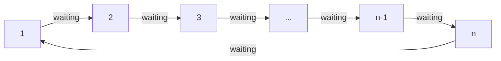
```mermaid
flowchart LR

1 --"waiting"--> 2 --"waiting"--> 3 --"waiting"--> ... --"waiting"--> n-1 --"waiting"--> n --"waiting"--> 1
```


### Resource Allocation Graph

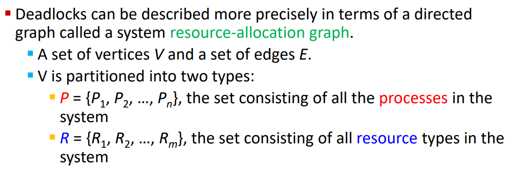

A digraph with vertices $V$ partitioned into $P$ processes and $R$ resources


There are 3 threads and 4 resources.

.|$T_1$|$T_2$|$T_3$
-|-|-|-
$R_1$|req|assigned|
$R_2$|assigned|assigned|
$R_3$||req|assigned
$R_4$|||

There are 1 instance of $R_1$ and $R_2$

2 of $R_2$ and 3 of $R_4$

There are no cycles in the graph.

Therefore there are no deadlocks

If there is no cycle then there is no deadlock.


There are 2 cycles.

T1 is assigned R2 and wants R1

T2 is assigned R1+R2 and wants R3

T3 is assigned R3 and wants R2 which it can't get since there's no more instances of R2

```
It might seem like there's no deadlock if we look at the smaller cycle.

T2 is assigned R2 and wants R3
T3 is assigned R3 and wants R2 which it can get since there's another instance of R2

T3 finishes with R3 and gives it up for T2.

This is a static situation so we have a deadlock
```


There is a cycle with the middle 4 nodes.

There is no deadlock.

The outter threads of $T_2$ and $T_4$ can finish and release their instances of $R_1$ and $R_2$ respectively.

Then $T_1$ and $T_3$ can get hold of the resources and work on them.

---
If there is no cycle,
then there is no deadlock

If there is a cycle then there may or may not be a deadlock
- if only one instance per resource type, then deadlock
- if there are several instances per resource type, possibility of deadlock

---

deadlock:


no deadlock:


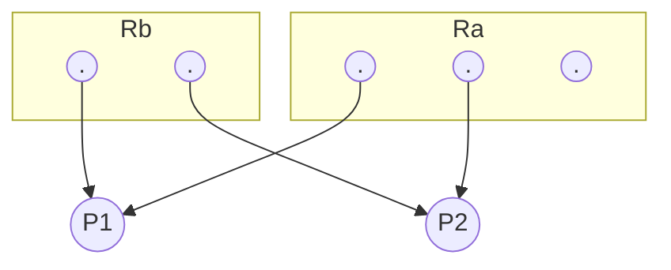
```mermaid
flowchart TB

P1((P1))

P2((P2))

subgraph Ra
1((.))
2((.))
3((.))
end
subgraph Rb
4((.))
5((.))
end

4-->P1
5-->P2
1-->P1
2-->P2
```

Resource Allocation graph for the car deadlock example showing circular wait

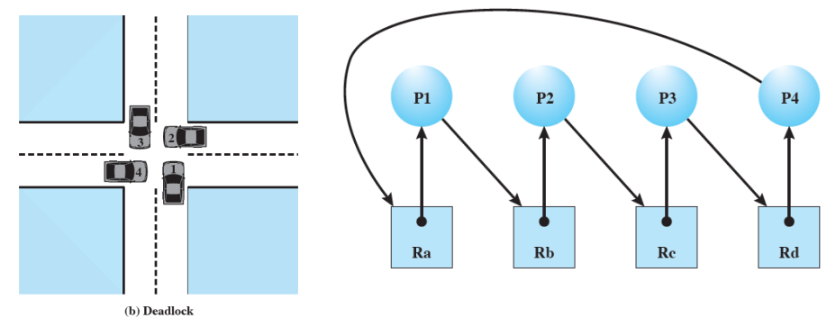

We can take the numbers on the cars to be the numbers of the processes.

Car 1 is sitting lane __Ra__ and wants to cross lane Rb

Car 2 is sitting lane Rb and wants to cross lane Rc

Car 3 is sitting lane Rc and wants to cross lane Rd

Car 4 is sitting lane Rd and wants to cross lane __Ra__

---
Knowledge Check
- one necessary condition for deadlock is \_\_\_, which states that a process must be holding one resource and waiting to acquire additional resources
  - a: hold and wait
- a cycle in a resource-allocation graph is \_\_\_
  - d. a necessary and sufficient condition for a deadlock in the case that each resource has exactly one instance
- if a resource-allocation graph has a cycle, the system must be in a deadlocked state.
  - false

## Methods for Handling Deadlocks

In general,
there are 3 ways to deal with deadlocks:
1. prevention and avoidance
2. detection and recovery
3. ignoring it

most OSes including windows and linux just pretend that deadlocks don't happen `???`

```
Prof later explained that this is just left up to the programmer/user and it's not up to the OS.

pulled a pontius pilate and washed their hands of the whole situ
```

### Prevention

In order to prevent deadlocks we have to invalidate one of the 4 necessary conditions for deadlock
```
as a refresher

deadlock can arise if 4 conditions hold at the same time:
- mutual exclusion
  - only one process at a time can use a resource
- hold and wait
  - a process holding at least one resource is waiting to acquire additional resources held by other processes
- no preemption (for resources no the process)
  - resource only released by the process holding it after it's done its task
  - resource cannot be preempted
    - processor can't take resources from process and give it to other processes arbitrarily
- circular wait
  - process 1 is waiting on process 2
  - process 2 is waiting on process 3
  - ...
  - process n-1 is waiting on process n
  - process n is waiting on process 1
```

Though there are shareable resources,
we cannot invalidate mutual exclusion as a whole since some resources just cannot be shared and used at the same time.

#### Deny Hold and Wait

We can invalidate hold and wait by ensuring that whenever a requests a resource it won't be holding any other resources.
Put another way,
If the process is holding a resource then they won't be making any requests.

how:
- require process to request and allocate all resources before execution
  - **dynamic nature of resource requesting makes this impractical**
- only allow resource requests when process has no resource allocated
  - must release resources before requesting for more

cons:
- low resource utilization
  - resources allocated but not used
- starvation possible
  - a thread may have to wait indefinitely if it needs several popular resources
  - those resources will always end up allocated to processes that will only need those resources
  - `I imagine that even with bounded wait time considerations, priority will cause this to happen as well`

#### Deny No Preemption

`reminder:
non-preemptive is when a process enters into the processor and only leaves when it's finished or voluntarily leaves when waiting on something`

if
- a process is holding some resources
- the process requests another resources
- that resource cannot be immediately allocated to it

then __all resources currently being held are preempted__, released by the processor.

Preempted resources are added to the list of resources that the process is waiting for.

The process starts again once it regains all of the resources it's requesting
(the old preempted ones and the new ones).

This is often `selectively` applied to resources whose state can be easily saved and restored later,
such as cpu registers and database transactions.

cons:
- cannot be applied to resources like mutex locks and semaphores which are the type of resources where deadlock occurs most commonly
  - it's hard to save the condition of a mutex when a process wants to lock for a critical section
  - not easy to store and retrieve $\rarr$ not easy to preempt
  - `we can't do this for the shit we actually care about bruhhhhhhh`

#### Deny Circular Wait

This is the most common approach

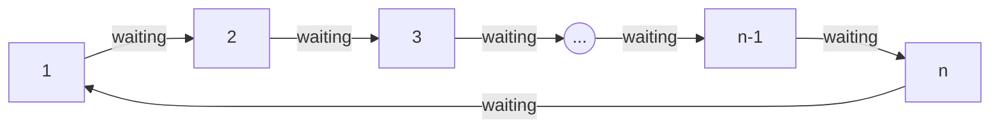
```mermaid
flowchart LR

1 --"waiting"--> 2 --"waiting"--> 3 --"waiting"--> 4((...)) --"waiting"--> n-1 --"waiting"--> n --"waiting"--> 1
```

how:
- assign each resource a unique number
- resources must be acquired in the order of their unique number

---
Knowledge check:
- to handle deadlocks, operating systems most often \_\_\_
  - a. pretend that deadlocks never occur
- both deadlock prevention and deadlock avoidance techniques ensure that the system will never enter a deadlocked state
  - true
- most operating systems choose to ignore deadlocks, because
  - d. all of the above
  - handling is expensive, they occur infrequently, livelock  recovery methods can be use on deadlocks

### Deadlock Avoidance

Dynamically made decision to see if an allocation request will potentially lead to a deadlock if granted.

System considers
- currently available resources
- currently allocated resources
- and the future requests and releases of each thread

requires knowledge of future process requests.

basics:
- state
  - reflects current allocation of resources to processes
- safe state
  - state where there is at least one execution path where all the processes will finish
  - there will be no deadlock
- unsafe state
  - state resulting in possibility of deadlock
- avoidance
  - ensuring system will never enter an unsafe state

#### Safe State

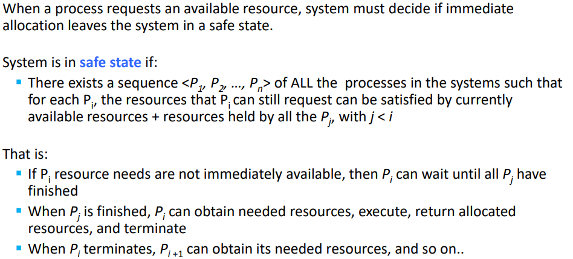

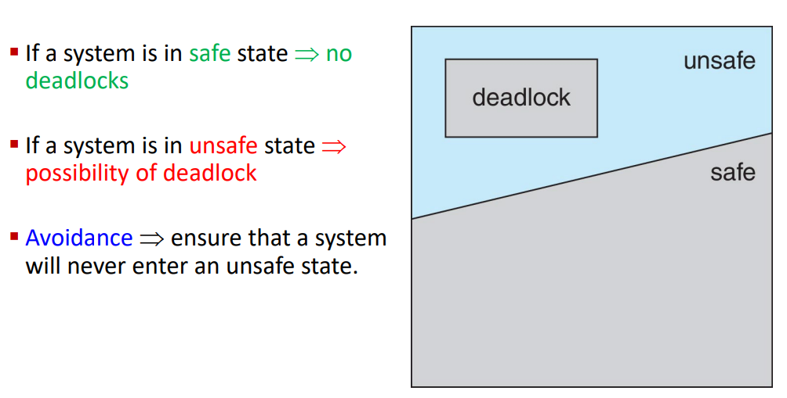

---


In the above example we only have 3 resources available.

For T1 we give it 2 then release back 4 once it's done.

Then the above steps just go as shown.

So we are in a safe state

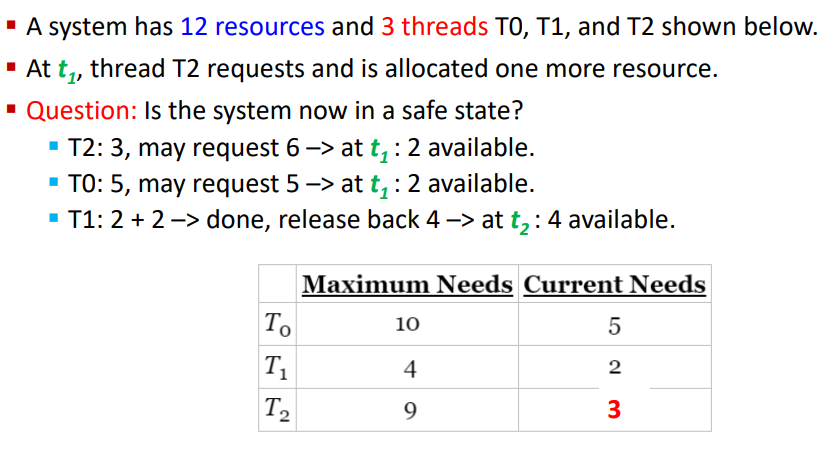

This is the same example as seen above but now $T_2$ needs 1 more resource,
requests the resource and receives it,
resulting in only 2 resources available at the beginning.

We can start the sequence with $T_1$ and allocate 2 then get back 2 once done.

We end up with only 4 available resources which isn't enough to satisfy the maximum needs of $T_0$ and $T_2$

#### Avoidance Algos

There are 2 algos:
1. using a resource-allocation when there's a single instance of a resource type
2. use the Banker's Algo when there's multiple instances of a resource type

##### Resource-Allocation Graph Scheme


`a priori` = `ahead of time`

claims turn into requests which turn into assignments before turning back into claim edges


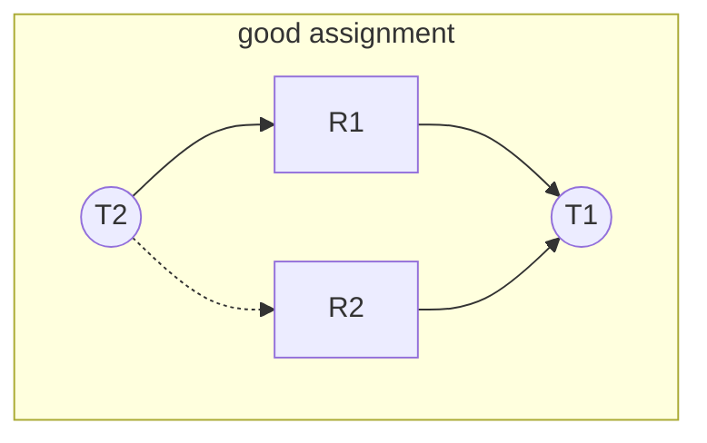
```mermaid
flowchart TB
subgraph good assignment
T1((T1))
T2((T2))
R1
R2

T2-->R1-->T1
R2-->T1
T2-.->R2
end
```


make sure there is no cycles forming if you convert a request edge to an assignment edge

##### Banker's Algorithm

`prof misspells this is as Baker at some point. It's Banker.`

conditions:
- multiple instances of resources
- each process must have a prior claim maximum use
- when a process requests a resource, it may have to wait
- when a process gets all its resources it must return them in a finite amount of time


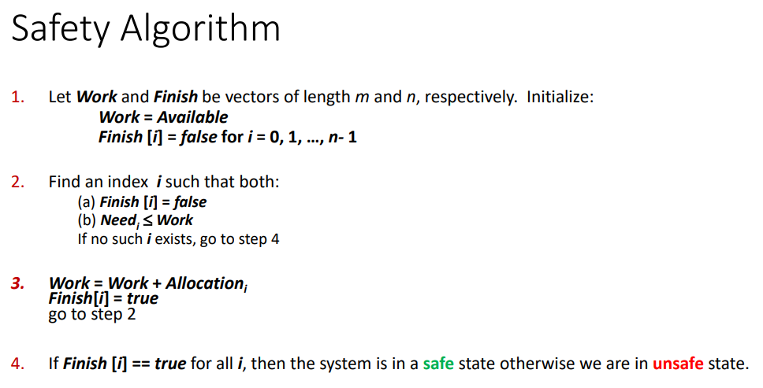


---
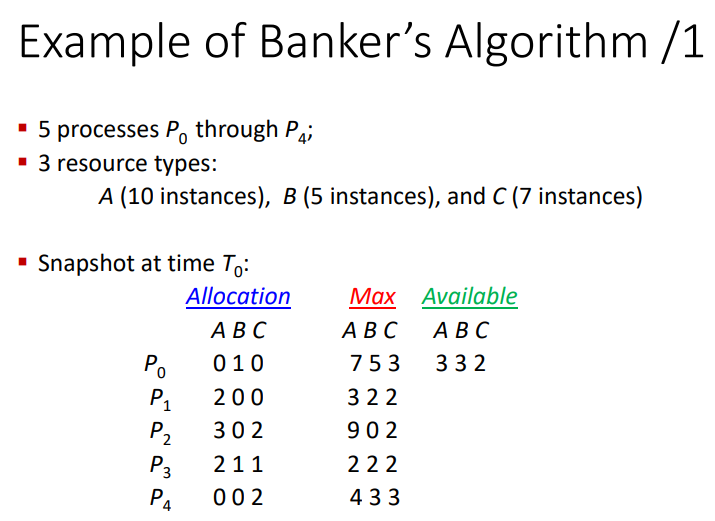


Q: Does the sequence $<P_1, P_3, P_4, P_2, P_0>$ satisfy safety criteria?

A: yes

we start with $<3, 3, 2>$

$P_1$ can be allocated and give back $<5, 3, 2>$

$P_3$ can be allocated and give back $<7, 4, 3>$

$P_4$ can be allocated and give back $<7, 4, 5>$

$P_2$ can be allocated and give back $<10, 4, 7>$, making all instances of $A$ and $C$ available

$P_0$ can be allocated and give back $<10, 5, 7>$,
making all instances of all resources available.

---
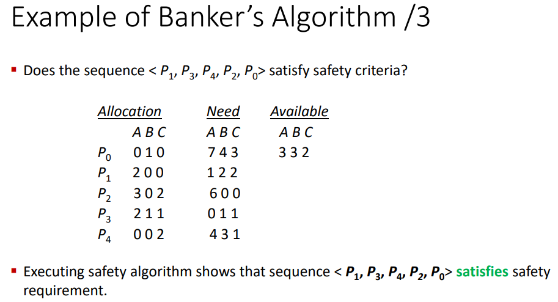

you do the same process with this.

A: the sequence satisfies safety requirement

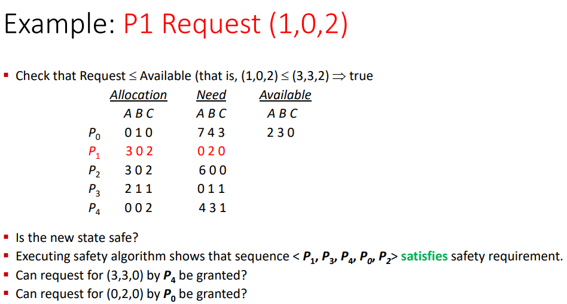

---

In essence:
- we are in a safe state if there is at least one sequence of resource allocations to processes that does not result in a deadlock
- for $i\in[0..n]$
  - compare the available with the need vector
  - if the available is lesser than the need vector then unsafe
  - else, it can be allocated
  - add allocation vector to available vector as the resources are now returned from process
- at no point should the available exceed the maximum for each entry in the vector
- if at any point in the vector of processes does the above `for-loop` exit then it does not satisfy the safety requirement

---
Knowledge Check:
- which of the following statements is true:
  - d. An unsafe state may lead to a deadlocked state
  - we may avoid the deadlocked state
- 
  - b. It is not safe
- 
  - It is safe

### Deadlock Detection

If we don't use deadlock prevention or avoidance then a deadlock situation may occur

in lieu of prevention and avoidance we can use detection and recovery

A detection algorithm to look at the system state see if a deadlock has happened.

A recovery scheme to recovery from the deadlock.

For situations where we have a single instance of each resource type:
- maintain a `wait-for` graph
  - nodes are processes
  - $P_i\rarr P_j$ if $P_i$ is waiting for $P_j$
- Periodically check for a cycle in the graph
  - if there is a cycle then there is a deadlock
- takes $O(n^2)$ where $n$ is the number of vertices in the graph


In the above,
we see that there is a deadlock as there are cycles so we are in deadlock.

For situations where we have multiple instances for each resource type:
- we use something similar to the banker's algo
- all the matrices and all of that
- "it's exactly similar to the Banker's algorithm" - prof

How often we invoke this depends on how likely it is to occur and how many threads would be affected by a deadlock if it happens.

The more often and the more impactful then the more frequently we should invoke.

Invoking everytime there is a resource request is expensive (except in the case of Banker's algo since we use it anyways).

A less expensive alternative is to invoke the algo at defined intervals.

---
Knowledge Check
- the wait-for graph scheme is not applicable to a resource allocation system with mutliple instances of each resource type
  - True
- in a wait-for graph
  - d. None of the above
  - b and c are each others' contrapositive so they're both false
- The decision of when to invoke a detection algorithm depends on the likely frequency of deadlocks and the number of threads likely to be affected by a deadlock when it happens
  - True

## Recovery from Deadlock

We have 2 options in a deadlock:
- break circular wait by aborting one or more involved threads
- preempt some resources from one or more of the deadlocked threads
  - take some resources away

for abortion we have some options
- abort all the deadlocked processes
- abort one at a time until the deadlock cycle is eliminated

Let's not kill everything.

What affects the process abortion order:
1. priorty of process
2. elapsed and remaining computation time
3. allocated resources
4. required resources
5. number of processes to be terminated


`copying slides now`

selecting a victim that minimizes cost

rollback to some safe state, restart process for that state once the resources are available.

We may have starvation if we keep selecting the same victim over and over again

we have to include the number of rollbacks as part of the cost factor

# CPU Scheduling

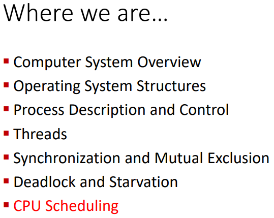

## Recap for CPU Scheduling

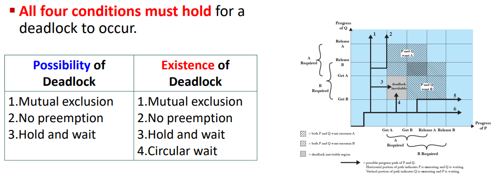

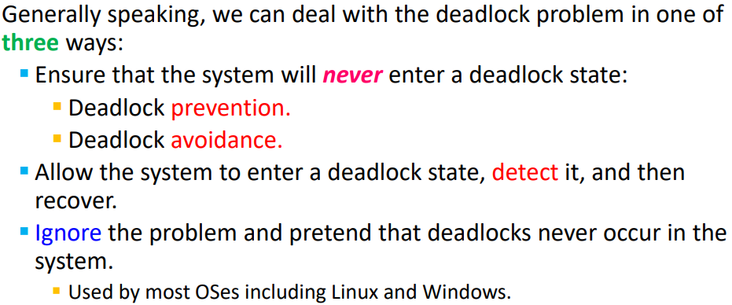

## Basics for CPU Scheduling

Kernel threads are the ones being scheduled.

"Process scheduling" and "thread scheduling" are often used interchangeably.

We say CPU to mean CPU core as a computation unit

Maximum CPU utilization obtained with multiprogramming


We alternate working (cpu) and wait (i/o) bursts.

We end on an I/O burst as the process is ending


On the histogram:
- above is cpu-bound
- below is i/o bound


Reminder: the whole process itself isn't in the queue, just the pcb (which has all the info and points to where the process actually is)


Preemptive scheduling makes decisions at all these times.

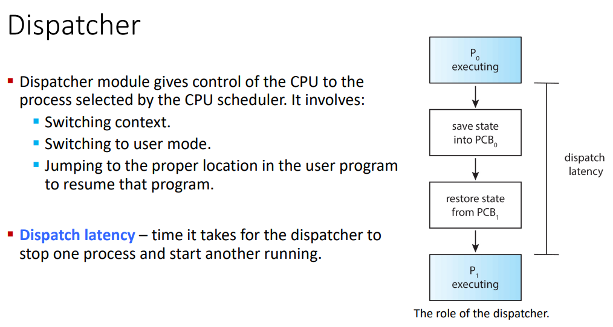

---
Knowledge Check
- which of the following is true of cooperative scheduling
  - b. A process keeps the CPU until the releases the CPU either by terminating or by switching to the waiting state.
- In preemptive scheduling, the sections of code affected by interrupts must be guarded from simultaneous use
  - True
  - we want to ensure mutual exclusion
  - we want to make sure no other process is accessing at the same time

## Scheduling Criteria

- cpu util
  - keep as busy as possible
  - maximize this
- throughput
  - num of processes that complete their execution per time unit
  - maximize this
- turnaround time
  - amount of time to execute a particular process
  - minimize this
- waiting time
  - aggregate amount of time a process has been waiting in the ready queue
  - will be affected by scheduling algo
  - minimize this
- response time
  - time between request submission and first response for interactive systems
  - minimize this

All numbers in milliseconds (ms) unless stated otherwise.

For now we assume we have 1 cpu.


## Scheduling Algos


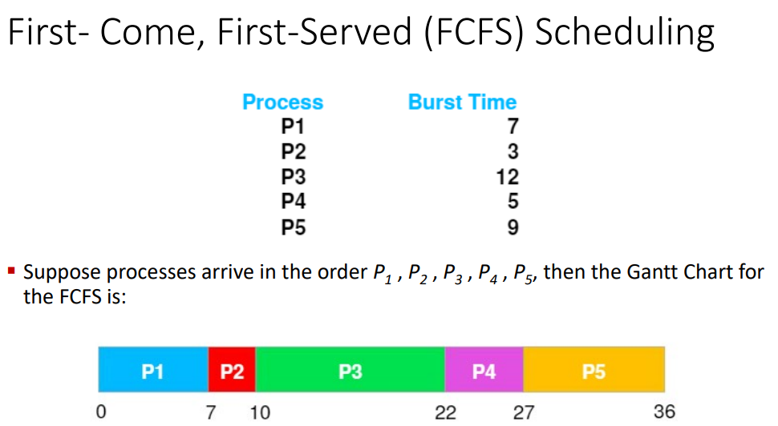

we're assuming these all arrived at (more or less) the same time since there is no `arrival time` column in the chart.
We assume in order of number just because it's convenient here.


different orders will result in different wait times but FCFS can't account for that


Convoy effect:
- short process behind long process
- consider one cpu-bound and many i/o-bound processes


FCFS is not good for interactive systems
- important that each process get a share of the cpu at regular intervals


Shortest-Job-First (SJF) Scheduling
- for each process, associate the length of its next CPU burst
  - use these lengths to schedule the process with the shortest time
  - shortest-next-cpu-burst is a more accurate description
- SJF is optimal
  - gives minimum average waiting time for a given set of processes

If the next bursts of 2 processes are the same, FCFS scheduling is used to break the tie.

But how do we know how long the next cpu burst is?
We can ask the user but there's more to it.

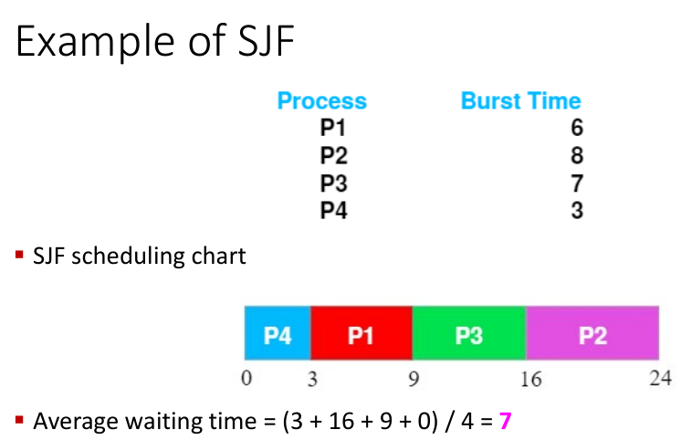

Remember that waiting time is the time that the process waits to ***start*** not to finish.

So the above calculation w/ start time $s_i$ for process $p_i$ would look like this:

average waiting time $= (w_1 + w_2 + w_3 + w_4)/4$

For FCFS we'd have

average waiting time $= (0+6+14+21)/4=10.75$

We can only estimate the length,
typically assuming it to be similar to the previous one.
Then pick the process with the shortest predicted next CPU burst.

We use an exponential averaging of the length of the previous cpu bursts

$\tau_{n+1}=\alpha t_n + (1-\alpha)\tau_n$
- $t_n$ = actual length of $n^{th}$ CPU burst
- $\tau_{n+1}$ = predicted value of the next CPU burst
- $\alpha\in[0,1]$, typically $\frac{1}{2}$ for our applications


We start by predicting 10 ms for the first burst.

It actually uses 6 ms.

We use these values to predict the next burst.

$$
\tau_{n+1}=\alpha t_n + (1-\alpha)\tau_n
=\frac{1}{2}6+(1-\frac{1}{2})10
=8
$$

Then we check against the next actual burst length.

So on and so forth.

The predictions aren't the tightest at times but they're not too too far off.

Note that we're using the actual previous burst time as well as the prebious prediction in our calculations to predict the next burst time.

---
More on exponential averaging:
- $\alpha=0$
  - $\tau_{n+1}=\tau_n$
  - recent history does not count
- $\alpha=1$
  - $\tau_{n+1}=\alpha t_n$
  - only the actual last CPU burst counts

Exponential averaging is a series that we use for prediction in genearl,
not just for processors.

Tweaking the $\alpha$ value will allow us to put more weight on near or far.

---

Preemptive vs Non-Preemptive
- SJF can be either
- the choice arises when a new process arrives at the ready queue while a previous process is still executing
- the next burst of the newer process may be shorter than what is left of the currently executing process
- in this scenario
  - if preemptive
    - preempt the currently executing process
    - sometimes known as `shortest-remaining-time-first-scheduling`
  - if non-preemptive
    - allow the currently running process to finish its CPU burst

The context switches take about 10 microseconds so preempting here is fine for us as we're typically just working in milliseconds.

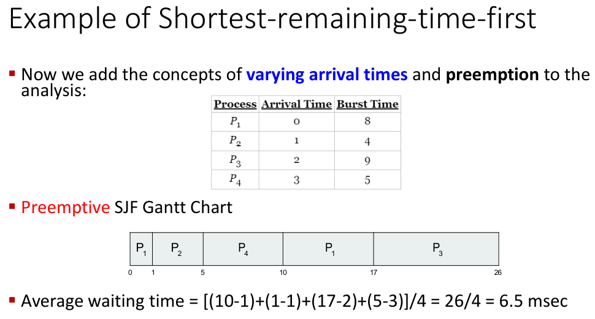

- $P_1$ arrives and works for 1 ms
- $P_2$ arrives and has 4 ms compared to $P_1$'s 7 ms
- $P_1$ is preempted and $P_2$ begins execution
- $P_3$ arrives and has 9 ms compared to $P_2$'s 3 ms
- $P_4$ arrives and has 5 ms compared to $P_2$'s 2 ms
- @ $t=5$, $P_2$ finishes
- We choose $P_4$ as it has the least remaining time to finish
- $P_4$ finishes
- $P_1$ is chosen to execute as it has 7 ms remaining
- $P_3$ is chosen after $P_1$ finishes as it has 9 ms reamining

Average waiting time
$= [P_1+P_2+P_3+P_4]/4$

Remember that waiting time is the time waiting in the queue.
So we have to add in the 9 ms that $P_1$ was sent back to the queue for.

Round Robin (RR) Scheduling
- each process gets a time quantum (q)
  - a small unit of cpu time
  - usually 10-100 ms
- after the quantum has passed
  - process is preempted
  - process added to end of ready queue
  - 


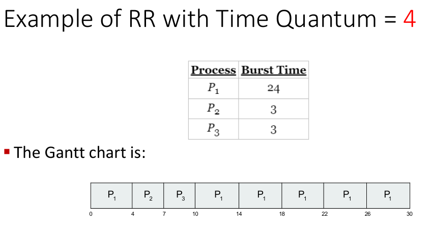
- $P_1$ starts executing
- 4 ms pass and the cpu checks the queue
- $P_1$ is preempted and $P_2$ is put in its place for execution
- $P_2$ finishes execution
- $P_3$ executes and finishes
- $P_1$ begins to execute once more and runs the course of the 4 ms quantum

averaging waiting time $= \frac{6+4+7}{3}=5.666...$


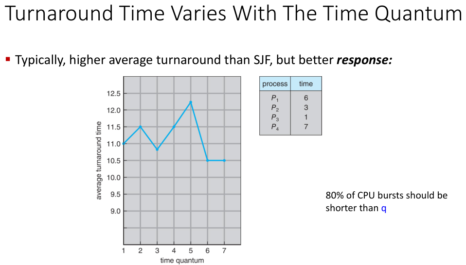

Priority Scheduling
- priority number (integer) associated w/ each process
- CPU is allocated to the process with the highest priority
  - can be done preemptively or nonpreemptively
- SJF is priority scheduling where priority is the inverse of predicted next CPU burst time
  - larger burst = lower priority
  - smaller burst = higher priority


Linux and Windows use the same numbering system

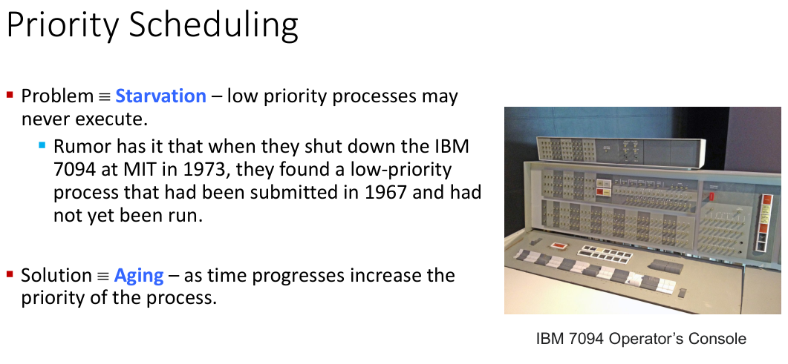

Starvation is a problem for both preemptive and nonpreemptive.

We up priority for old processes


A process can't be preempted for a process with a lower priority.
If a process is the only process within its priority tier and there are no other higher priority processes then the process gets to run with impunity.


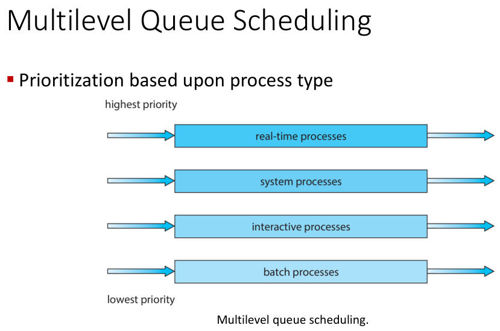

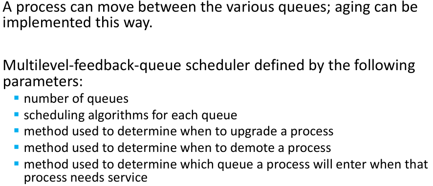

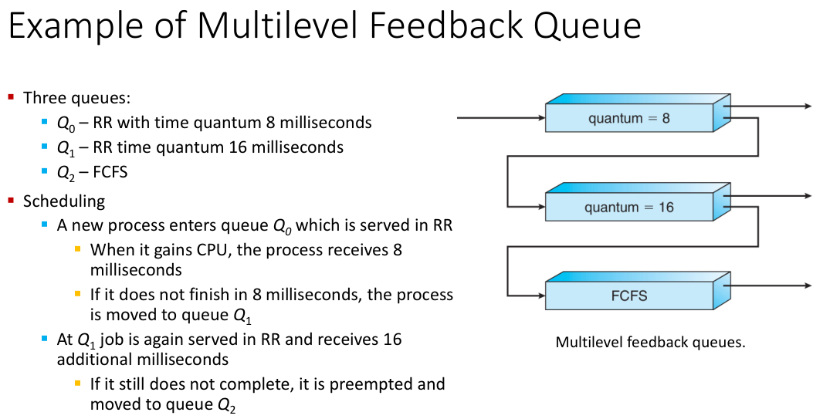

Aging is done via moving them do a different queue.

---
Knowledge Check
- \_\_\_ scheduling is approximated by predictin the next CPU burst with an exponential average of the measued lengths of previous CPU bursts
  - d. SJF
- The \_\_\_ scheduling algo is designed especially for time-sharing systems
  - c. RR
- which of the following is ture of multilevel queue scheduling?
  - b. each queue has its own scheduling algorithm
  - the most general CPU-scheduling algo is multilevel feedback
  - processes can only move between queues using the feedback variant

## Multi-Processor Scheduling

CPU scheduling is more complex when multiple CPUs available.

multiprocessor may be any one of the following architectures:
- multicore CPUs
- multithreaded cores
- NUMA systems
- heterogeneous multiprocessing

### Multicore

Symmetric Multi Processing
- each processor is self scheduling
- all threads may be in a common ready queue
- each processor may have its own private queue of threads


Lately we've been making multicore chips that are faster and less power hungry.

Multithreaded cores are also a recent advancement we've made.

This takes advantage of memory stall to make progress on another thread while memory retrieve happens.


---
What is Memory Stall?

When a processor acceses memory it waits around for the data to become available.

The processor is much faster than the memory so it has to wait on the memory.

This can also occur due to a cache miss

---

### Multithreaded Cores

Each core as > 1 hardware thread

if one thread has a memory stall then we switch to another thread for 0 downtime.


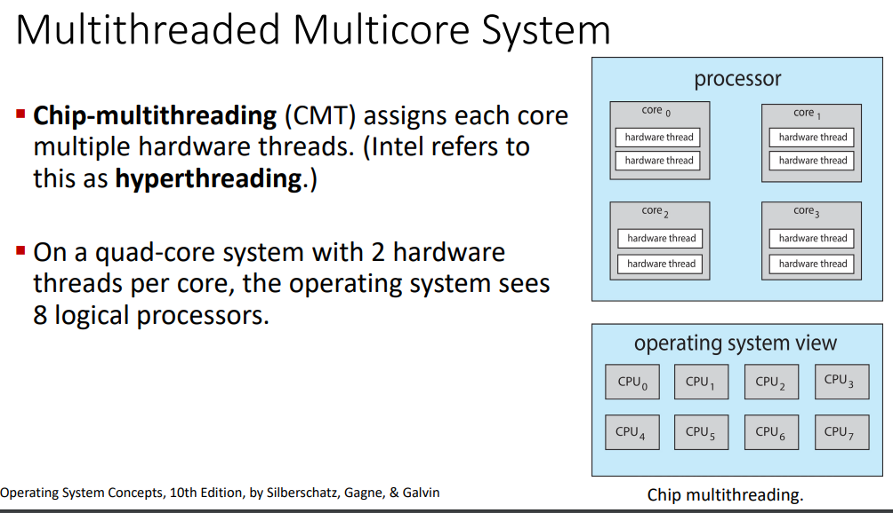

each thread is basically treated as their own cpu from a logical perspective


choose a chip then choose a thread

### Load Balancing

a concept for symmetric multiprocessing systems


push migration
- periodic task checks load on each processor
- imbalance found $\rarr$ task pushed from overloaded CPU to other CPUs

pull migration
- idle processors pull a waiting task from a busy processor

### Processor Affinity

When a thread has been running on one processor, the cache contents of that processor stores the memory accesses by that thread.

Successive memory accesses by thread are often satisfied in cache memory (aka "warm cache").

```
Prof uses an example of repititive actions on a data structure, something like a for-loop iterating through an array or spreadsheet.

We start to move things to the cache in advance to speed things up
```

If load balancing causes a thread to migrate to another processor:
- contents of cache memory must be invalidated for the 1st processor
- cache for 2nd processor must be repopulated
- ***high cost***

This high cost is undesireable so OS and SMP try to avoid migrating a thread from one processor to another.

Proceesor Affinity:
- a process has an affinity for the processor on which it is currently running
- the warm cache is there for the process to take advantage of

Soft Affinity
- OS attempts to keep a thread running on the same processor
- no guarantees

Hard Affinity
- allows a process to specify a set of processor it may run on

```
initially the cache is empty (usually almost all 16 kilobytes)

when the process starts it misses over and over again but then starts filling out the cache

processor starts prepopulating the cache in order to help it out.
seeing what to remove and what to get rid of.

for hard affinity the process decides on a number of CPUs.

It can choose CPUs to benefit from a shared L2 cache
```

### NUMA Systems


### Hetereogeneous Multiprocessing

so far we have assumed all processors are identical so we can allow any thread to run on any processing core.

We only differed based on load balancing, processor affinity policies, and NUMA systems

Some mobile systems are now designed using cores that run the same instruction set but vary in terms of their clock speed and power management.

They can also adjust the power draw of a core to the point of idling.

These are known as Heterogeneous Multiprocessing (HMP).

This type of architecture is known as `big.LITTLE`:
- `big` cores are higher-performance cores
  - greater power draw $\rarr$ used for short periods of time
  - interactive tasks
- `LITTLE` are energy efficient cores
  - use less energy $\rarr$ used for longer periods of time
  - background tasks

Windows 10 supports HMP scheduling by allowing a thread to select a scheduling policy that best supports its power management

---
knowledge check
- \_\_\_ allows a thread to run on only one processor
  - a. processor affinity
- two general approaches to load balancing are \_\_\_ and \_\_\_
  - d. push migration, pull migration
  - course grained is when a process keeps executing on a core until there's a huge stall event
  - fine grained is when we are switching on a very fine level of granularity between processes
    - the boundary of an instruction cycle
      - fetch and execute then now we switch to another thread
  - each comes with their pros and cons with relation to process switching

## Real-Time CPU Scheduling

can present special issues

2 types
- soft real-time systems
  - critical real-time tasks have the highest priority
  - no guarantee as to when tasks will be scheduled
- hard real-time systems
  - task must be serviced by its deadline
  - service after deadline has expired is the same as no service at all

event latency
- amount of time that elapses from when an event occurs to when it is serviced
- 2 types that affect performance
  - interrupt
  - dispatch
    - time for schedule to take current process off CPU and switch to another

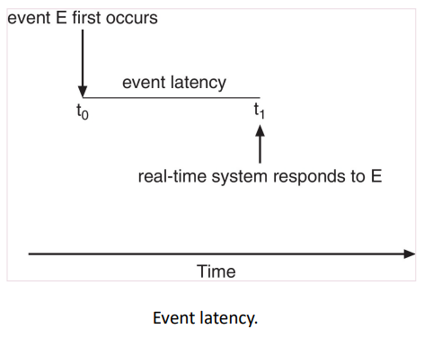


conflict phase of dispatch latency:
1. preemption of any process running in kernel mode
2. release by low-priority process of resources needed by high-preiority processes

### Priority Based Scheduling

for soft real-time scheduling, scheduler must support preemptive, priority-based scheduling.

For hard real-time we must also provide the ability to meet deadlines which requires additional scheduling features.


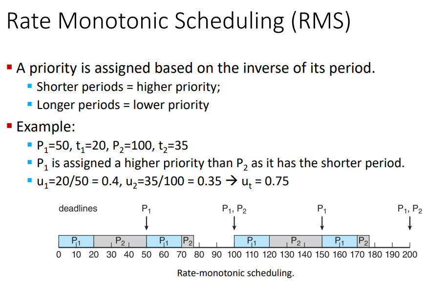


---
knowledge check
- the reate of a periodic tasks in a hard real-time system is \_\_\_, where p is a period and t is the processing time.
  - a. 1/p
- which of the following is true of the rate-monotonic scheduling algo?
  - a is for first scheduling
  - rate-monotonic scheduling does not have a dynamic priority policy
  - it has to be preemptive
  - answer: c. cpu utilization is bounded when using this algo
- which of the following is true of earliest-deadline-first (EDF) scheduling algo?
  - the rule for `b` is reversed
  - priorities aren't assigned statically
  - priorities are not fixed
  - answer: a. when a proces becomes runnable, it must announce its deadline

## Algo Eval

How to select CPU-scheduling algo for an OS?

Determine criteria, then eval algos

example of criteria:
- maximizing utilization under the constraint that the maximum response time is 300 milliseconds
- maximizing throughput such that turnaround time is (on average) linearly proportional to total execution time

### Deterministic

Deterministic Modelling:
- type of analytic evaluation
- takes a particular predetermined workload and defines the performance of each algo for that workload


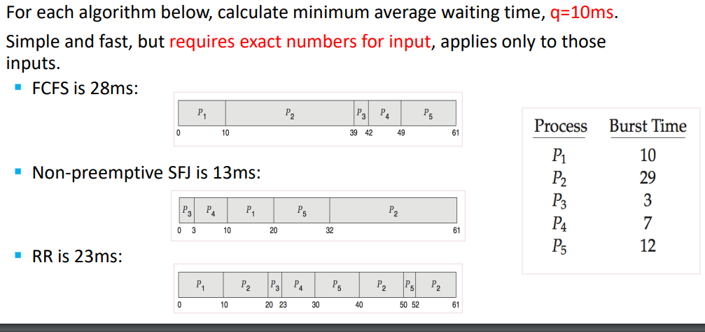

### Queueing Models


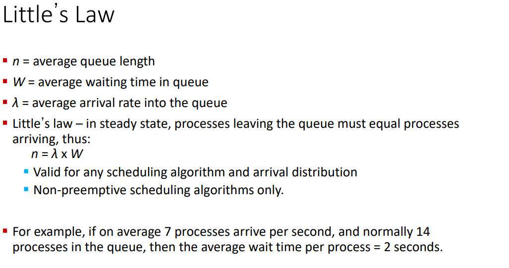

### Simulations

Queueing models are complicated and limited.

Simulations give more accurate evaluation of scheduling algos:
- programmed model of computer system
- clock is a variable
- gather stats indicating algo performance
- data to drive sim gathered via:
  - rng according to probabilities
  - dists defined mathematically or empirically
  - trace files record sequences of real events in real systems


`I did not fucking hear anything she said about this`

### Real Implementation

The best way is to just implement this stuff for real.

This is very costly.

In general,
most flexible scheduling algos are those that can be altered by the system mangers or by the users so that they can be tuned for a specific (set of) app(s)

Envionments can vary however.

---
Knowledge Check
- in little's formula, $\lambda$, represents the \_\_\_:
  - b. average arrival time for new processes in the queue
- 

# Memory Management

## Background for Memory Management

recap:
- a program must be brought from the disk into the memory and placed within a process for it to be run
- main memory and registers are the only storage the CPU can access directly
  - accessing the non-volatile memory is limited to copying over data to the memory to work with
  - we don't work directly off of disk


a memory unit only sees a stream of either:
  - addresses & read reqeusts
  - addresses & data and write requests

register access is done in one CPU clock cycle.

Main memory can take many cycles, causing a stall where the cpu has to wait on the memory.

cache sits b/w main mem & cpu regs for faster access than mem
- principle of locality
  - whenever a task is being done on a specific collection of data, it is very likely that we're going to select the next piece of data in the collection so we may fetch it preemptively as we anticipate that it will be required next
  - hit ratio keeps increasing
  - at some point we start doing something else however

### Memory Protection

Protection is required to ensure correct operation.
`recall: mutual exclusion`

Make sure that a proccess can only access its allocated area in the address space.

We can use a pair of `base` and `limit` registers to define the logical address space of a process


`base` = smallest legal physical mem address

`limit` = size of range

`base+limit` = highest legal physical mem address

trying to access anything outside of the range is not allowed.

In the above we see a base of 300040 and a limit of 120900 added together to get the highest legal address of 420940.

```
prof brought up the fact that modern operating systems sit in the highest addresses while older operating systems may do other things like sitting at the oldest

prof will designate which one is which on assessment(s)
```

```
Q: Are all the ranges mutually exclusive?
A: Yes. All the ranges are mutually exclusive
```

Hardware Address Protection
- CPU has to check every memory access request generated in user mode to make sure it's inside of the range
- the instructions to loading the base and limit registers are privileged

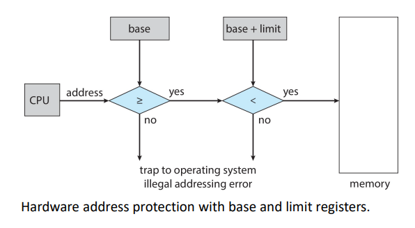

```
malicious programs often try to break out of this limit.
```

Address Binding
- programs are stored on disk, ready to be brought into memory to execute form an input queue
  - most systems allow a user process to reside in any part of the physical memory
  - the address space of the computer may start at 00000 but the first address of the user process does not need to be 00000
    - it's inconvenient to enforce it to be 00000
      - why?
        - you can waste memory as you get closer to the OS in mem space
        - we have processes starting and finishing all the time so we have to fit them in whereever we can


- we start out with the source code
- compile it
- link with the object file
- turn it into an executable
- dynamically linked libraries are provided by the OS and are linked by the loader
- program gets swapped in and swapped out as it needs the libraries

addresses are represented in different ways at different stages of a program's life:
- source code addresses are usually symbolic (`int x`)
- compiled code addresses bind to relocatable addresses
  - "14 bytes from beginning of this module"
- `after this point we have to have actual concrete physical addresses`
- linker or loader will bind relocatable addresses to absolute addresses
  - ex: 74014
- each binding maps one address space to another


it's very unlikely that you will know at compile time where the process will reside in memory.

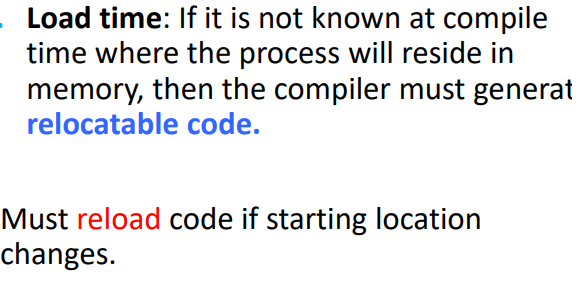


Most OSes do this binding during execution time.

### Logical vs Physical Address Space

Logical Address
- generated by cpu
- aka virtual address

Physical Address
- address seen by the memory unit


logical address space is bound to the phsyical address space.

The CPU does not directly see/access the physical addresses, only the logical.

Both types of addresses are the same in compile-time and load-time address-binding schemes.

They differ in the execution-time address-binding schemes (so most OSes)

The addresses are all generated by a program by refer to different address spaces (logical or physical)

### Memory Mangement Unit

The memory management unit (MMU) is a hardware device that maps virtual to physical addresses at run time.

many methods to do this mapping


simple scheme:
- generalization of the base-register scheme
- base register is now called relocation register
- value of in the relocation register is added to every address generated by a user process at the time it is sent to memory
- user program deals with logical addresses
  - never sees real physical addresses
- execution-time binding occurs when a reference is made to a location in memory
- memory-mapping hardware converts logical addresses into physical addresses

### Dynamic Loading

sometimes the program is larger than the size of memory

with dynamic loading, a routine is not loaded until it is called
- better memory-space util
  - unused routine never loaded
- all routines kept on disk in relocatable load format

this is very useful when large amounts of code are needed to handle infrequently occuring cases.
`heavy, memory-hungry edge cases`

There is no special support from the OS required
- implement via program design
- OS *can* help by providing libraries to implement dynamic loading

### Dynamic Linking

Dynamically Linked Libraries (DLLs) are system libraries that are linked to user programs when the run (during execution time)

DLLs are also known as shared libraries
- used extensivley in windows and linux systems
- small pieces of code (stub) used to locate the appropriate memory-resident library routine
- stub replaces itself with the address of the routine and executes the routine

Dyn. Linking and DLLs require help from the OS
- if the processes in mem are protected from one another, OS is the only one that can check to see that
  - whether the needed reoutines is in another process' memory space
  - can allow multiple processes to access the same memory address
- w/o this each program needs to include its own copy of its language library

Static linking
- used only by older computers
- system libraries and program code combined by the loader into the binary program image

---
Knowledge Check
- absolute code can be generated for \_\_\_
  - a. compile-time binding
  - load-time binding can gen relocatable
- In a dynamically linked library, \_\_\_
  - d. a stub is included in the image for each library-routine reference
- the mapping of a logical address to a physical address is done in hardware by the \_\_\_
  - a. memory-management-unit (MMU)

## Contiguous Memory Allocation

> Contiguous means continuous. No broken pieces. Only one large piece

mem support OS and user processes

contiguous allocation is an earlyo method of memory management

mem usually divided into 2 partitions
- OS partition
  - usually held in high memory with interrupt vector
  - used to be in the lowest vector in older systems
- user processes held in low memory
  - each process contained in single contiguous section of memory.

### Memory Protection in Contiguous Memory Allocation

Relocation Registers
- protect user processes from each other
- prevent user processes from changing operating-system code and data
- base contains value of smallest physical address
- limit contains range of logical addresses
  - example: relocation = 100040 and limit = 74600
- MMU maps logical address dynamically
- relocation-register scheme allows OS' size to chnage dyanmically


### Memory Allocation

a simple method to allocate memory is to use variably sized partitions
- used for efficiency
- hole
  - block of available memory
  - holes of various size are scattered throughout memory


- Process 8 finishes and leaves a hole b/w processes 5 and 2.
- we allocate process 9 and and it fits into the hole
- process 5 finishes and makes another hole

Holes are a problem that we need to deal with later on.

When a process arrives,
it is allocated memory form a hole large enouhg to accomodate it.

A process exiting frees its partition.

Adjacent free partitions are combined.

OS maintains info about
- allocated partitions
- free partitions (holes)

How do we satisfy an allocation request of size `n` from a list of free holes?

fitting approaches:
- first-fit
  - allocate the first hole that is big enough
- best-fit
  - allocate the smallest hole that is big enough
  - must search entire list unless ordered by size
  - produces smallest leftover hole
- worst-fit
  - allocate the largest hole
  - must search entire list unless ordered by size
  - produces the largest leftover hole
    - may be more useful than the smaller leftover hole from a best-fit approach
    - not so much smaller fragments of memory
    - usually not used
```
- next-best-fit
  - not used in the course
  - we find the best-fit then take the next one
  - prof thought it was cool so she brought it up
```

simulations show
- first-fit and best-fit are better thatn worst-fit in terms of
  - decreasing time util
  - decreasing storage util
- neither is clearly better than the other in terms of storage util
- first-fit is generally faster than best-fit

### Fragmentation

External Fragmentation
- outside the process
- total memory space exists to satisfy a request but not contiguous
  - the holes are not within an assigned space of a process

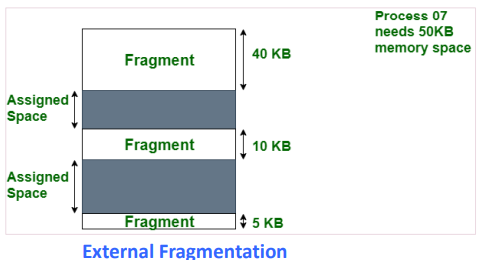

Internal Framgentation
- allocated memory may be slightly larger than requested memory
- size difference is memory internal to a partition but not being used


The processes in the above don't use up all of their allocated memory

given $N$ blocks allocated, $N/2$ blocks will be lost to (internal and external) fragmentation.
- 1/3`?` may be unusuable -> 50% rule

Reduce external fragmentation by compaction:
- shuffle memory contents to place all free memory together in one largeblock
- requires
  - dynamic relocation
  - done at execution time
    - not compile or load time

Fragmentation applies to more than just memory and can occur wherever we manage blocks of data (disk, external storages, etc.)

The simplest compaction algo is to move all processes toward one end of memory
- all holes move in the other direction to make one large hole
- can be very expensive

We will discuss other strategies in the following 2 sections

---
Knowledge Check:
- \_\_\_ is the dynamic storage-allocation algo which results in the smallest leftover hole in memory.
  - b. best fit
- \_\_\_ is the dynamic storage-allocation algorithm which results in the largest leftover hole in memory
  - c. worst fit
- which of the following is true of compaction
  - c. it is possible only fif relocation is dynamic and done at execution time

## Paging

Permitting the physical address space of processes to be non-contiguous in order to solve the external-fragmentation problem.

This still has internal fragmentation.

set up a `page table` to translate logical to physical addresses
- divide physical memory into fixed-sized blocks called `frames`
  - size is a power of 2
    - between 512 bytes and 16 Mbytes
- divide logical memory into fixed-sized blocks called `pages`
  - size is a power of 2
    - typically either 4 kb or 8kb in size

These aren't equivalent to one another so frames can be different sizes as pages.

We can eventually use paging to load processes that are too big for our memory.

- keep track of all free frames

to run a program of size $N$ pages, need to find $N$ free frames and the program.

Address generated by CPU divided into:
- p - page number
  - index into page table
  - contains base address of each page in physical memory
- d - page offset
  - conbined with base address to define the physical memory address that is sent to the memory unit

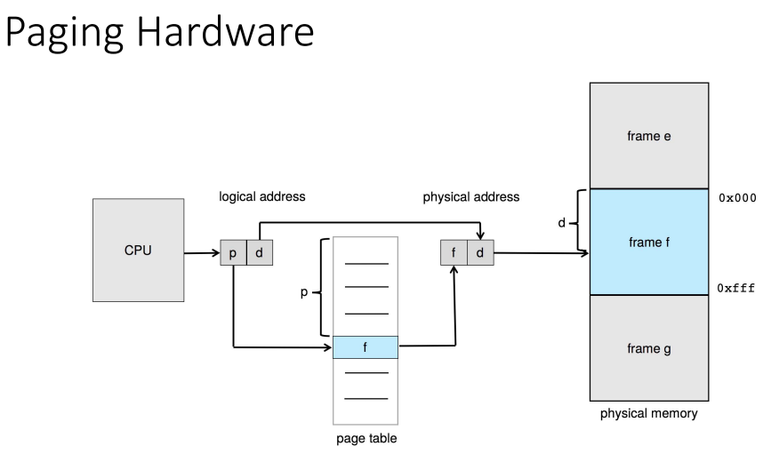

page size:
- defined by hardware
  - like frame size
- size is a power of 2
  - makes translation of logical address to page number and page offset easier this way
- if the size of the logical address space is $2^m$ and page size is $2^n$
  - the high-order $m-n$ bits of a logical address designate the page number
  - $n$ low-order bits designate the page offset

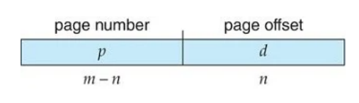

### Paging Hardware


steps the MMU takes to translate a logical address gen'd by cpu to a phys address
- extract page number `p` and use it to index into page table
- get corresponding frame number `f` from page table
- replace `p` in the logcal address with `f` to get physical address

the offset `d` is unchanged and unreplaced, combining with `f` to get the physical address


Logically we see the pages as being contiguous but physically they are all over the place and in a different order.

our paging scheme makes it so that there is no external fragmentation since any free frame can be allocated to a process that needs it.

### Example

given
- n = 2
- m = 4

map the following logical addresses to physical addresses:
- 0
- 3
- 4
- 13


using a page size of $2^n = 4$ bytes
and a physical memory of $2^m=32$
bytes (8 pages)

so the logical addresses translate as follows:
- $0=(5\times 4)+0=20$
- $3=(5\times 4)+3=23$
- $4=(6\times 4)+0=24$
- $13=(2\times 4)+1=9$ 


### Calculating Internal Fragmentation

if page size = 2048 bytes, how many pages will a process of size 72,766 bytes need?
- 35 pages + 1,086 bytes

It will be allocated 36 pages with an internal framgentation of 2048 - 1086 = 962 bytes

can you think of a worst case internal fragmentation scenario
- process needs n pages + 1 byte
- will be allocated n+1 frames with an internal fragmentation of almost a frame

on average fragmentation = 1/2 frame size. so are the small frames more desirable?
- not necessarily as each page table entry takes memory to track.

### Free Frames

The frame table has one entry for each physical page frame indicating whether the latter is free or allocated and, if it is allocated, to whihc page of whihc process.

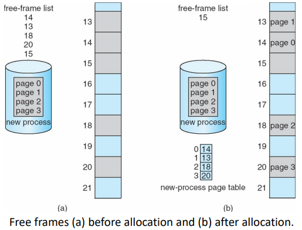

### Implementation of Page Table

OS maintains a copy of the page table for each process just as it maintains a copy of the instruction counter and register contents

page table is kept in main memory
- page-table base register (PTBR) points to the page table
- page-table length register (PLTR) indicates size of the page table

in this scheme ever data/instruction access requires two memory accesses
- one for the page table
- one for the actual data or instruction
- memory access is slowed by a factor of 2

sol'n:
- se a special fast-lookup hardware cached called translation look-aside buffers (TLBs) (aka associative memory)

#### TLB

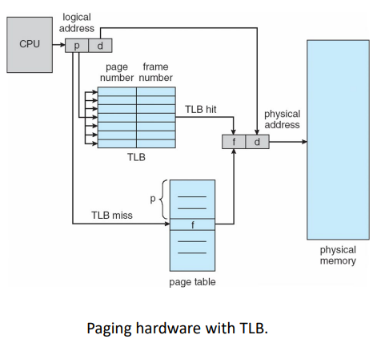

each entry in the TLB has 2 parts:
1. key/tag
2. value

TLB is associative, hihg-speed memory
- when the associative memory is presented with an item
- the item is compared with all keys simultaneously

typically small
- 32-1024 entries

tlb is a hardware feature

`This is a lot like a cache`

on hit:
- mmu checks if page number is present in the tlb
- if the number is found then its frame number is immediately available and is used to access memory

on miss:
- page number is not in the tlb
- have to reference the page table
- page and frame number are loaded into TLB for faster access next time

if TLB is full:
- an existing entry must be selected for replacement
  - replacement policies must be considered
    - range from least recently used (LRU) through round-robin to random
  - some CPUs allow the OS to participate in LRU entry replacment
    - other handle the matter themselves
  - some entries can be wired down for permanent fast access
    - never replaced
    - entries for key kernel code are wired down, typically

##### Effective Access Time

Hit ratio
- % of times that a page number is found in the TLB
- % of the time we find our desired page number

ex:
- suppose it takes 10 nanoseconds to access memory
- if we find the desired page in TLB then a mapped-memory access takes 10 ns
- otherwise we need 2 memory accesses, one to the page table and frame number then one more to access the desired byte in memory, which takes 20 ns
- calculate effective access time

Effective Access Time
- statistical or real measure of how long it takes the CPU to read or write to memory
  - 80% hit ratio
    - EAT = 0.8 * 10 + 0.2 * 20 = 12 ns
    - 20% slowdown in access time implied
    - ((12-20)/10)*100%
  - 99% hit ratio (more realistic)
    - EAT = 0.99 * 10 + 0.01 * 20 = 10.1 ns
    - 1% slowdown in access time implied
    - ((10.1-10)/10)*100%

##### Memory Protection in Page Table

memory protection implemented by associating protection bit with each frame to indicate if read-only or read-write acces is allowed
- can also add more bits to indicate page execute-only, and so on

for now we're doing a valid-invalid bit attached to each entry in the page table
- valid
  - the associated page is in the process' logical address space
  - thus a legal page
- invalid
  - indicates the page is no tin the process' logical address space
- or we can use the page-table length register (PTLR)

any violations result in a trap to the kernel


##### Shared Pages

shared code
- one copy of read-only code shared among processes
  - text editors, compilers, window systems
- multiple threads sharing the same process space

private code and data
- each process keeps a separate copy of the code and data
- th epages for the private code and data can appear anywhere in the logical address space


---
Knowledge Check
- consider a logical address with a page size of 8 kb. How many bits must be used to represent the page offset in the logical address?
  - the page offset in a logical address is determined by the size of the page
  - to represent the page offset iwthin this 8 kb page we need enough bits to address each byte within the page
    - (8*1024=8192)
  - nnumber of bits required $=log_2(\text{Page Size})=log_2(8192)=13$


`prof recommends doing the knowledge checks at home.`

## Swapping


the backing store can be a harddrive or ssd or whatever

standard swapping
- moving entire processes between main memory and a backing store

backing store
- fast disk large enough to accomodate copies of all memory images for all users
- must provide direct access to these memory images


page out
- move page from memory to the backing store

page in
- move page from backing store to memory

# Virtual Memory

## Background for Virtual Memory

code needs to be in physical memory to execute but entire program is rarely used
- error code
  - used to handle unusual error conditions
  - almost never executed
- large data structures
  - often allocated more mem than needed
- unusual routines
  - lesser used options and features of a program

we only have to load what we need for execution

ability to execute partially-loaded program
- no longer limited by physicla mem
- each program takes less memory while running
  - more programs can run at the same time
    - cpu util and throughput increase
    - response time and turnaround time the same
- less i/o needed to load or swap programs into mem
  - each user program runs faster

virtual mem
- separation of user logical mem from physical mem
- only part of the pgram needs to be in mem for execution
- logical address space can be larger than physical address space
- allows address spaces to be shared by several processes
- allows for more efficient process creation
- more programs running concurrently
- less i/o needed to load or swap processes

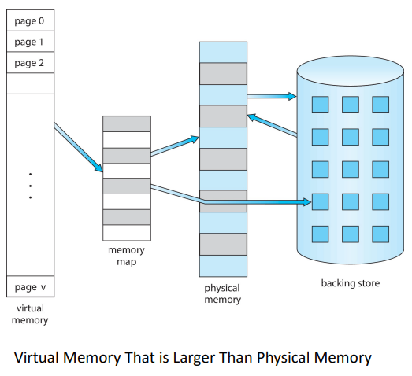

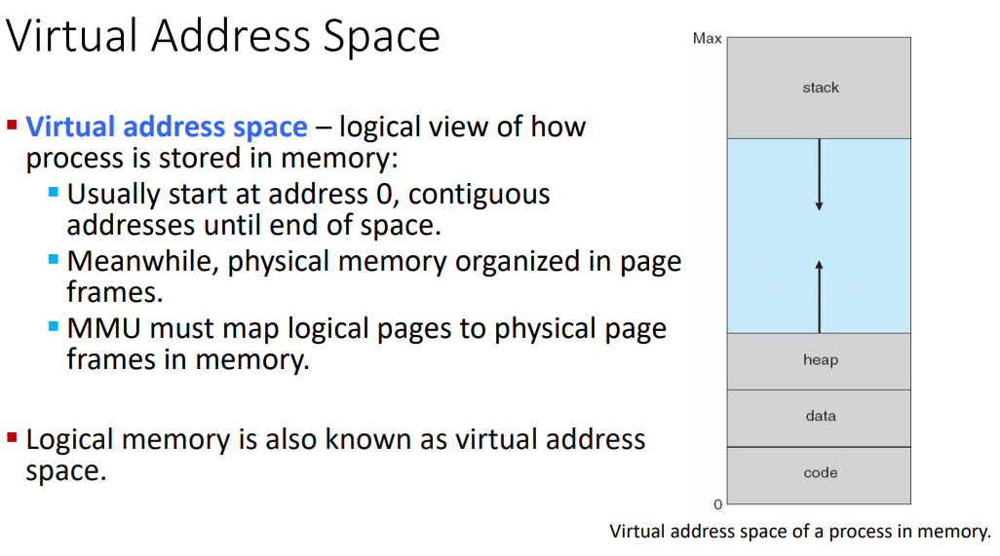

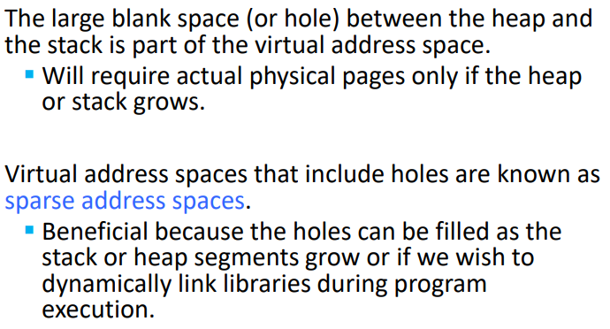


- logical memory
  - memory space perceived by a process
- real/physical memory
  - physical ram sticks in you're machine
- virtual memory
  - memory management technique
  - used by operating system
  - extends beyond available physical ram

---
Knowledge check:
- which of the following is a benefit of allowing a program that is only partially in memory to execute?
  - d. all of the above
  - programs can be written to use more memory than is available in physical memory
  - cpu util and throughput is incdreased
  - less io needed to load or swap each user program into mem
- in general virtual memory decreases the degree of multiprogramming in a system
  - false
  - why would these even effect each other??????????????????

## Demand Paging

virtual memory can be implemented via
- demand paging
- demand segmation

demand paging:
- bring a page into memeory ONLY when it is needed
  - less required
    - I/O
    - memory
  - faster response
  - more users
- similar to a paging system with swapping


valid-invlid bit
- with each page entry there is a valid-invalid bit
  - v $\rarr$ in-memory - memory resident
  - i $\rarr$ not-in-memory
- initially valid-invalid bit is set to `i` on all entries
  - all invalid
- during MMU address translation
  - if bit is invalid for a page entry then there's a page fault


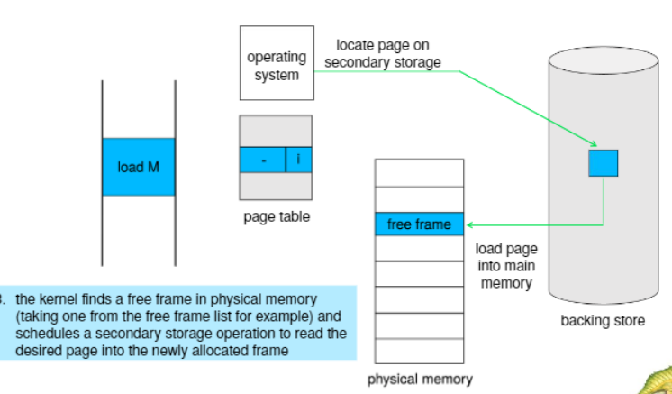

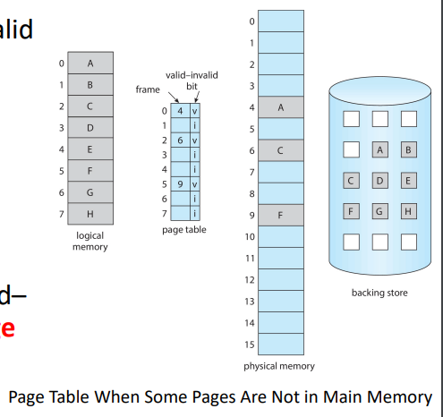

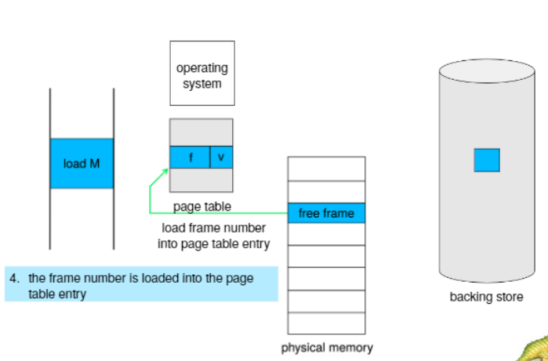


`there are some more slides that are the same thing`

free-frame list
- a pool of free frames for satisfying such requests
- maintained by most operating systems
- when a page fault occurs, the operating system must bring the desired page from secondary storage into main memory
- OS typically allocate free frames using zero-fill-on-demand
  - we flush out the frame
  - the content of the frames zeroed-out before being allocated
- when a system starts up, all available memory is placed on the free-frame list
  - this lets us start allocating frames as they are demanded


performance of demand paging
- 3 major activities of servicing a page-fault
  - serivce the page-fault interrupt
  - read in the page
    - this is where most of the time is spent
  - restart the process
- page fault rate $0\le p\le 1$
  - $p=0 \rarr$ no page faults
  - $p=1 \rarr$ every reference is a fault
- Effective Access Time (EAT) =
  - $(1-p) \times \text{memory access} + p (\text{page fault overhead} + \text{swap page out} + \text{swap page in})$
  - we're basically averaging it out

---
Example of Demand Paging

memory access time = 200 ns

avg page-fault service time = 8 ms

$$
\text{EAT} = (1-p) \times 200 + p(8 \text{ms})
\newline
=((1-p)\times 200) + (p \times 8,000,000)
\newline
=200 + (p \times 7,999,800)
$$

if 1 in 1000 accesses causes a page fault ($p=0.001$) then EAT = 8.2 microseconds. a slowdown by a factor of 40

if we want a perfoamnce degredation (slowdown) less than 10 percent
- 10% of 200 (effective access time we want) = 20 ns
- 220>200 + 7,999,800 * p
- 20 > 7,999,800 * p
- p < 0.0000025
- p < one page fault in every 400,000 memory accesses

This needs hardware support,
it can't all be done by the OS.

---
Knowledge Check
- on a system with demaend-paging, a process will experience a high page fault rate when the process begins execution
  - true
  - similar principle to caching where we need to slowly fill things up in the memory that the process asks for
  - since the page table is invalid to start with we end up faulting a ton as we're setting things up for the process
  - as it starts going on it'll start hitting the pages we already loaded for it
- a page fault occurs when
  - c. a process tries to access a page that is not loaded in memory
- if memory access time is 250 ns and average page fault service time 10 ms the probability of page faults must be less \_\_\_ to keep the performance degradation less than 20%
  - options
    - a) 0.0000025
    - b) 0.000005
    - c) 0.0000075
    - d) 0.00001
  - takehome exercise

## Copy on Write

copy-on-write (COW):
- allows both parent and child processes to initially share the same pages in memory
- the page is copied once either process modifies a shared page
  - read: write
- allows more efficient process creation as only modified pages are copied


---
Knowledge Check
- \_\_\_ allows the parent and child processes to initially share the same pages, but when either process modifies a page, a copy of the shared page is created.
  - a. copy-on-write

## Page Replacement

sometimes there is no free frame

how:
- memory is used up by process pages but also in demand from the kernel, I/O buffers, etc
- the page is a hot commodity that everyone needs access to

scenario
- process executing
- page fault occurs
- OS determines where the desired page is residing on secondary storage
- but there are no free frames on the free-frame list
  - all mem is in use

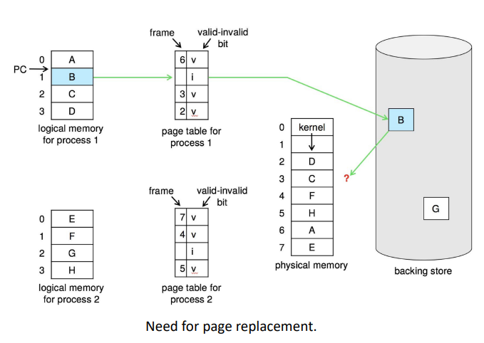

need for page replacement
- algorithms
  - do we terminate it
  - do we swap out the whole process till there are more free frames
  - do we replace the page
    - we can find some page in memory but notreally in use, page it out
    - most operating systems now combine swapping pages with page replacement

we want an algor that has the minimum number of page faults

basic page replacement:
- prevent over-allocation of mem
  - modify page-fault service routine to include page replacement
- use modify (dirty) bit to reduce the overhead of page transfers
  - only modified pages are written to disk
  - unmodified pages have no need ot be written back to backing store since it wouldn't make a differnce
- page replacement completes separation b/w logicla mem and phys mem
  - large virt mem can be provided on a smaller phys mem


frame allocation algo determines how many frames given to each process
- some small processes are smaller
- are frames reserved
- etc

page-replacement algo
- which pages to replace
- want lowest page-fault rate on both first access and re-access

### Page Replacement Algorithms

#### Page Replacement Algo Evalutation

evalutate algo by running it on a particular string of memory reference (reference string)
and
computing the number of page faults on that string
- string is just page numbers, not full addresses
- if we have a referece to a page `p`, then any references to page `p` that immediately follow will never cuase a page fault
- results depend on the number of frames available


#### Different Types

algos:
- FIFO
- Optimal
- Least Recently Used (LRU)
- LRU-Approximation
  - Second-Chance
  - Enhanced Second-Chance
- Counting-Based

In all our examples, the reference string of referenced page numbers is:
7, 0, 1, 2, 0, 3, 0, 4, 2, 3, 0, 3, 0, 3, 2, 1, 2, 0, 1, 7, 0, 1

##### FIFO

first-in-first-out algo

Reference string:
7, 0, 1, 2, 0, 3, 0, 4, 2, 3, 0, 3, 0, 3, 2, 1, 2, 0, 1, 7, 0, 1

3 frames (3 pages can be in memory at a time per process)

How to track ages of pages?
Just use a FIFO queue.


##### Optimal Algo


This is an example,
not an actual algo.

##### Least Recently Used (LRU) Algorithm

Replace the page that has not been used in the most amount of time.
Associate time of last use with each page.

Results in 12 faults which is closer to optimal than FIFO

generally good and frequently used.


```
7 - assign to open page
0 - assign to open page
1 - assign to open page
2 - replace 7 since LRU
0 - 0 already has page
3 - replace 1 since LRU
0 - 0 already has page
4 - replace 2 since LRU
2 - replace 3 since LRU
3 - replace 0 since LRU
...
```
It's possible that with a different reference string we'll end up with performance similar to FIFO

---
Implementation
- requires hardware support
- hardware counter implementation
  - every page entry has a counter
    - every tmie the page is referenced through this entry, copy the clock into the counter
  - when a page needs to be changed
    - look at the counters (clock) of the pages
    - find the one w/ smallest value (least recently used)
      - replace that one
- `prof also mentioned a stack hardware implementation which is interesting`

---

LRU approximation algos
- LRU needs special hardware
  - the aforementioned counter implementation
- LRU is still slow even with the special hardware
- reference bit
  - with each page associate a bit
    - initially set to 0
  - when a page is refernced, the bit is set to 1
  - if a reference page has reference bit = 0 then we replace it
    - we don't know the order so this isn't perfect
- for this reason, we make many algos that approximate LRU

###### Second-Chance Algo (Clock) - LRU Approximation

Generally implemented using FIFO and a hardware-provided reference bit

if the reference bit of the page to be replaced is equal to:
- 0 $\rarr$ replace it
- 1
  - page is given second chance
  - move on to select the next FIFOpage
  - clear reference bit
    - set it to 0
  - arrival time is set to current time

if all the bits are set then this algo degenerates to FIFO replacement.

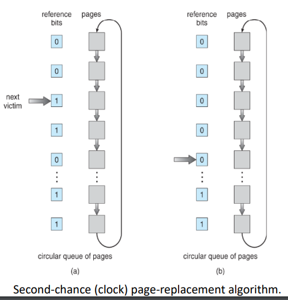

> "The hand is like a clock going tick, tick, tick around the circle... that is why it is called the clock algorithm" - Professor

###### Enhanced Second-Chance Algo

Uses 2 bits
- reference bit
- modify bit (if available)

replacing a modified page introduces more overhead

So we can eval pages with the ordered pair (reference, modify)

pair|meaning|assessment
-|-|-
(0,0)|neither recently used nor modified| best page to replace
(0,1)|not recently used but modified|must write out before replacement, more overhead
(1,0)|recently used but clean|will probably be used again soon
(1,1)|recently used and modified|probably will be used again AND need to write out before replacement

The above table is in order of replacement preference

When page replacement is called for, use the clock scheme but use the four classes & replace page in lowest non-empty class
- this may require searching the circular queue several times

##### Counting Algos

Keep a counter of the ## of references that have been made to each page

Least Frequently Used (LFU) algo
- replaces the page with the smallest count

Most Frequently Used (MFU) algo
- based on the argument that the page with the smallest count was probably just brought in and has yet to be used

neither are common
- implementation is expensive
- does not approximate OPT well

---
Knowledge Check
- Q:
  - Suppose we have the follow page accesses:
    - 12342341211314
  - 3 frames within our system
  - use LRU replacement algo
  - what is the ## of page faults for the given ref string?
- A:
  - take home exercise
  - The answer is: c. 8
- Q: Belady's anomaly states that \_\_\_
- A:
  - d. for some page replacement algorithms, the page-fault rate may increase as the number of allocated frames increases
- Q: in the enhanced second chance algo, which orderd pair represents a page that would be the best choice for replacmeent?
- A: a. (0,0)

## Allocation of Frames

`Much easier design principle compared to page replacement according to prof`

The question of how we allocate the fixed amount of ofree memory among the various processes

ex:
- 128 frames
- os takes 35
- 93 free for iser
- we have 2 processes
  - how many frames does each process get?

1. when a user process started execution, it would generate a sequence of page faults

The first requests need to generate the page faults to populate their frames

2. first 93 page faults wuold all get free frames from the free-frame list

3. when the free-frame list was exhausted, a page-replacement algo would be used to select one of the 93 in-memory pages to replaced by the 94th, and so on
4. when the process terminated, the 93 frames would once again be placed on the free-frame list

2 major allocation schemes that variate this simple strat
- fixed allocation
  - equal allocation
    - each process gets an equal amount of frames
    - ex. 93 frames split among 5 processes result in 18 frames/process and 3 free frames
  - proportional allocation
    - bigger processes get more frames than smaller processes
    - dynamic as degree of multiprogramming
    - process sizes change
- priority allocation
  - proportional allocation scheme using priority rather than size
  - higher priority processes get more frames

## Thrashing

thrashing
- process is spending more time paging than executing

if there aren't "enough" pages, page fault rate is very high
- page fault to get page
- replace existing frame
- quickly need replaced frame back

leads to
- low cpu util
- os thnks it needs to increase degree of multiprogramming
- can be exacerbated by more processes being added

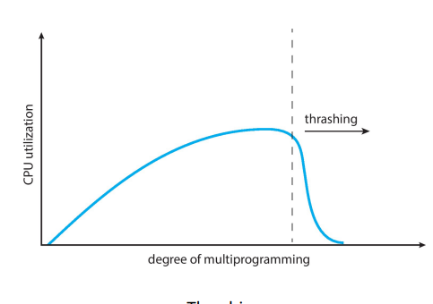

### Demand Paging

The solution to thrashing

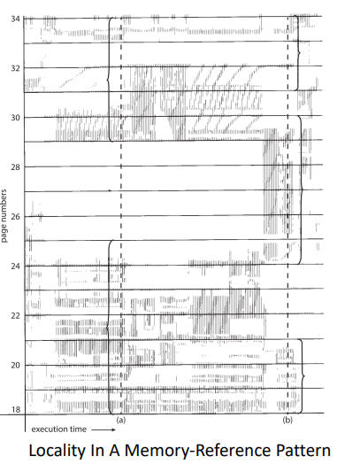

locality:
- the tendency of processes to reference memory in patterns rather than randomly
- process migrates from one locality to anther
- localities may overlap

why does thrashing occur
- total size of locality is greater than total memory size

we can limit the effect by using local or priority page replacement

### Working-Set Model

the working-set model is based on the assumption of locality


---
Knowledge Check
- Q:
  - \_\_\_ occurs when a process spends more time paging than executing
- A:
  - a. thrashing
- Q:
  - The \_\_\_ is an approximation of a program's locality
- A:
  - b. working set
- Q:
  - if the page fault rate is too high, the process may have too many frames. True or false?
- A:
  - false

## Allocating Kernel Memory

treated differnetly from user memory, allocating and deallocating memory frequently

often allocated from a free-memory pool:
- kernel reqs memory for structure of varying sizes
- some kernel memory needs to be contiguous like for device i/o

The "buddy system"
- strategy for managing free memory that is assigned to kernel processes
- allocates memory from fixed-size segments consisting of physically-contiguous pages
- memory allocated using power-of-2 allocator
  - satisfies requests in units sized as power of 2
  - request rounded up to next highest power of 2
  - when smaller allocation needed than is available
    - current chunk split into two buddies of next-lower power of 2
    - continue until the appropriate-sized chunk becomes available
- quickly combining(coalescing) unused chunks into a larger chunk
- can cause internal fragmentation
  - 50% wastage of memory

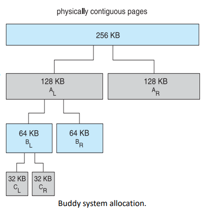

example:
- 256kb chunk available
- kernel req 21kb
- split into $A_L$ & $A_R$ of 128 kb each
- 1 further divided into $B_L$ and $B_R$ of 64kb each
- 1 further divided into $C_L$ and $C_R$ of 32 kb each
- finallly have a chunk small enough to justify using on the request
  - any smaller would be 16kb

# Storage Management

## Mass-Storage Structure

### Overview of Mass Storage Structure

bulk of secondary storage for modern computers provided by
- hard disk drives HDDs
- nonvolatile memory (NVM)
  - semiconductor tech like ram
  - doesn't dump info on power off like ram
  - relatively newer


#### Hard Disks

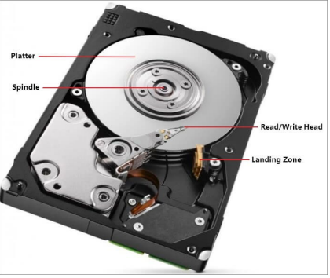

Note that there are several read/write heads and magnetically coated platters.

`Landing Zone` is where the read/write head sits when it's not doing anything

HDDs spin platters of magnetically-coated materiaul under moving read-write heads

info stored by recording magnetically on platters

read info by detecting magnetic pattern on platters

read-write head "flies" just above each surface of every platter.
Head cannot touch the platter or else it causes damage to the disk.

The surface of a platter is logically divided into circular `tracks` which are subdivided into `sectors`.

The set of tracks at a given arm position make up a cylinder.


The heads themselves cannot move independently of one another as they all share one phsyical arm assembly but each platter can rotate independently of one another.

Drives rotate at 60-250 times per second (can vary depending on brand and usecase).
Rotation speed relates to transfer rates.

Trasnfer rate is rate at which data flow b/w drive and computer.

This can be improved by other things.

Positioning time (random-access time) is time to
1. move disk arm to desired cylinder (seek time)
2. time for desired sector to rotate under the disk head (rotational latency)

Head crash results from disk head making contact with the disk surface which is really bad.
This can be caused by sudden power off.
`Prof says and it is true, better to be safe than sorry. But it's also worth noting that a lot of modern drives have mechanisms to prevent head crashes as a result of sudden power loss. Mechanism in place to automatically retract the head upon power loss detection. Not infallible mechanisms and not in all drives, especially old ones, but it's worth noting.`

Platters range from .85" to 14" (historyically).
More commonly they will be in 3.5, 2.5, and 1.8 inch sizes

range from 30gb to 3tb per drive `we've gotten much larger from then`

disks can be removable

performance varies.

#### Nonvolatile Memory Devices

electrical rather tahn mechanical

solid-state-disk (SSD)
- flash-memory based NVM
- used in a disk-drive-like container

USBs also fall under this category

pros:
- can be more reliable than HDDs
- faster
  - no moving parts
    - no seek time
    - no rotatinoal latency
- less power hungry

cons:
- more expensive per mb
- less capcity

#### Disk Attachment


NVM is much faster than HDD

new fast interface for NVM called NVM express (NVMe) connects directly to the PCI (peripheral component interconnect) bus.

PCI provides a high-speed data path b/w cpu and peripher devices such as netowrk adpaters, sound cards, graphics cards, and storage controllers


#### Address Mapping

disk drives are addressed as large 1-dimensional arrasy of logical blocks
- 1 block is the smallest unit of transfer
- low-level formatting creates logical blocks on physical media
- each logical block maps to a physical sector or semiconductor page
- logical block address is easier for algos to use than a secotry, cylinder, or track

---
Knowledge Check
- read or write perforamnce depends on 
  - bit transfer rate, seek time, and rotational latency
- one advantage of HDDs over SSDs is
  - HDDs are cheaper per megabyte than SSDs

Note:

### HDD Scheduling

OS wants to get a fast access time and high disk bandwidth

minimize seek time
- can be minimized by minimizing seek distance

bandwidth
- total bytes transferred / total time b/w first req and completion of last transfer
- bytes transferred / time elapsed for transfer

improve both by managing order in which i/o requests are serviced


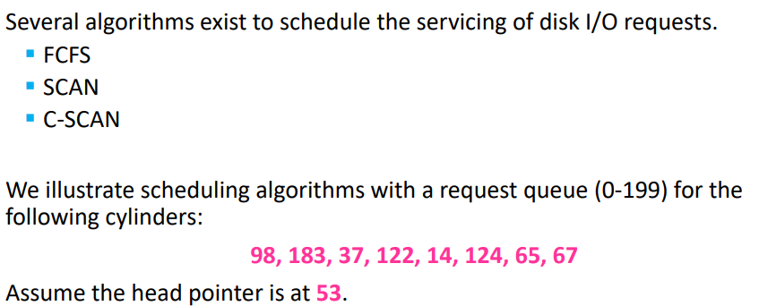

#### First Come First Serve


#### SCAN

disk arm starts at one end fo the disk, and moves toward the other end, servicing requests until it gets to the other end of the disk.

once it gets to the end of disk it goes back the other way

the head continuously scans back and forth across the disk

also known as the elevator algo

`prof left this for us to read`


#### C-SCAN

circular scan

higher seek time but more uniform wait time than SCAN

does the same motion of running across the whole disk but it doesn't service on the return trip,
just goes back to the start immediately
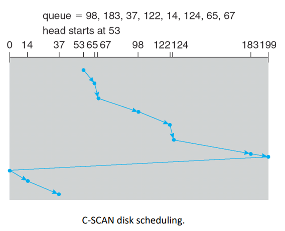

SCAN and C-SCAN perform better fo rsystems that place a heavy load on the disk

---


d since it's first come first serve

### NVM Scheduling

nvm devices do not contain moving disk heads and commonly use a simple FCFS policy

FCFS is used but adjacent requests are combined for optimization purposes

NVM best perform at random I/O while HDD excels at sequential I/O

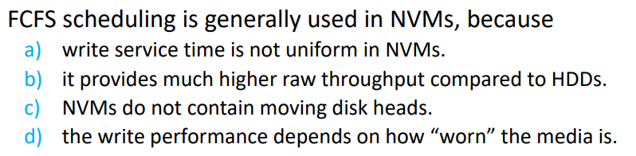

c. NVMs do not contain moving disk heads

### RAID Structure

Redundant Array of Inexpensive (or independent) Disks

a set of physical disk drives viewed by the operating system as a single logical drive

data is copied onto multiple disks to provide fault tolerance

raid is arranged into different levels
`and these different levels are different from each person you may ask lmao`

data copying techniques whihc differ based on raid level
- data mirroring
  - logical disk consists of two physical drives
  - every write carried out on both drives
- data striping
  - splitting the bits of each byte across multiple drives
    - bit-level striping
  - blocks of a file are striped across multiple drives
    - block-level striping

typically a small number of hot-spare disks are left unallocated, automatically replacing a failed disk and having data rebuilt onto them

levels and their features (that Ruba thinks is good enough to give us an idea to jump off of)


- logical disk is divided into stripes
  - prof is assuming byte level for this
- user and system data are distributed across all of the disks in the array
- doesn't rpovide fault tolerance
  - failure of one disk causes complete data loss
- improves performance
  - 2 heads instead of 1 makes accessing data faster
- only helps with performance
- might actually be worse for fault tolerance due to the striping since 1 disk failing corrupts the data on the remaining disk


- drive mirroring present
- when a dirve fails the data may still be accessed from the second drive
  - actual fault tolerance
- main disad is cost


Redundant disk capacity is used to store parity information which guarantees data recoverability in case of a disk failure.

parity is calculated across corresponding blocks on all data disks
- for every stripe of data blocks, a parity block is calculated

ex:
- an array of three drives where $A_1$ - $A_3$ contain data, and $A_p$ is the parity disk.
- calculate using
- $A_p = A_3 \oplus A_2\oplus A_1$
- $A_1 = A_p\oplus A_3\oplus A_2$

If we lose a disk we can recover the data using the parity calculations.

Only 1 disk


- distribute parity blocks across all disks
  - interleaved distributed parity
  - typical allocation is a round-robin scheme
- avoids potential overuse of a single parity drive which can occur with RAID 4
- RAID 5 is the most common parity RAID
- can lose any single disk

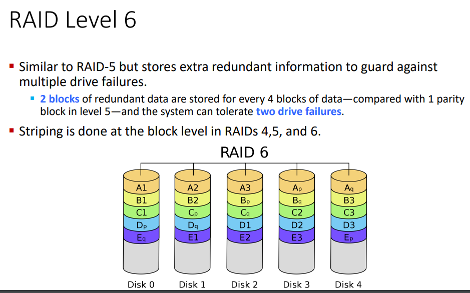

---
Knowledge Check
- a RAID structure
  - c. stands for redundant arrays of inexpensive disks
  - b. is primarily used to ensure higher data reliability
- in most RAID implemenations, a hot spare disk is not used for data, but is configured for replacement should any other disk fail
  - true

## I/O Systems

### Overview


### I/O Hardware


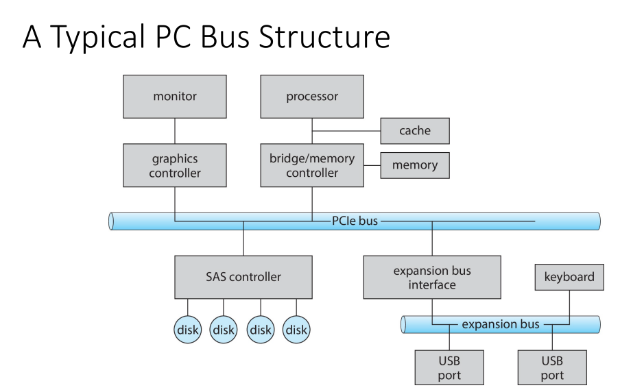

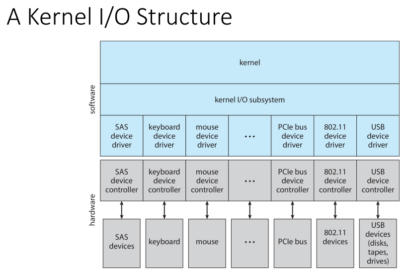

next week is security lect and exam review

# Security and Protection

## Security

>"I will tell you a few stories today. Everybody loves a good story that is perfectly fine but they also have some kind of impact on hardware and software design" - Professor


Starting at Lawrence Berkely Laboratory (LBL or Berkely Lab) in California had the 75 cent error.
They were performing research for some energy dept.
They were connected to many other institutions, army bases, and defense contractors over the combination arpanet and milnet.

How could this happen?

```
prof wanted to show us a cool little video 

 Clifford Stoll - Watch from 2:22 to 5:05 - Movie: The KGB, the Computer, and Me
available at https://www.youtube.com/watch?v=PGv5BqNL164
```

Clifford Stoll was a grad student at UC Berkely.
He pointed out the 75 cent error after taking a summer job there.

Stoll found out that a single account was responsible for this.
Surely,
just a prankster of u cali.
This account was the acct of a prof who was on sabattical after all.


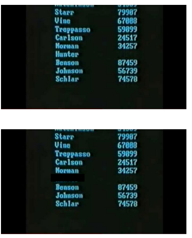

The account from a prof who was on sabattical.

Clifford got a notification that someone was trying to log into docmaster.


tons of pinging from the person trying to login and creating tons of accounts

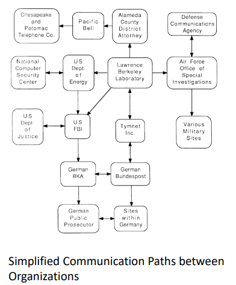

LBL was a part of a huge network of very important organizations' computers.
An attacker started from Tymnet machines.


By gaining the privileges the attacker was able to move between machines.

movemail
- worked by changing the file ownership and moving it to the designated user's folder
- permanently ran as sudo
  - `movemail` can write into protected system folders
  - given access to any and every folder
  - also had access to `atrun` folder
- the attacker
  - wrote a script
  - used `movemail` to put the script in the `atrun` folder
  - set the script to execute in 5 minutes
  - the script gave his account superuser privileges

The attacker used the new privileges to make more accounts.

An original thought was to start locking down all those accounts.

But Stoll wanted to get to the root of it.
Who is the hacker, what are they doing, and why?

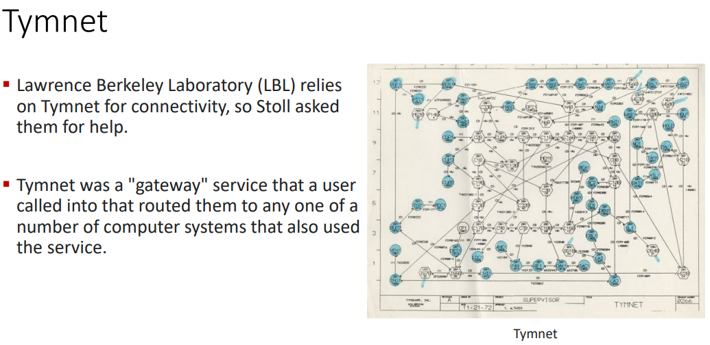

Stoll had a gf (SHOCKING)
who suggested making some fake docs to lure the attacker to stay in a machine long enough to trace the connection.

This is what would come to be known as a honeypot.

The honeypot of fabricated docs that were supposed described the Strategic Initiative (SDI) aka the Star Wars program.

The honeypot worked and they traced it back to a West German man named Markus Hess.

It took 6 months to get to this point.

3 years later Stoll was flown into Germany to testify.

```
prof likes this summary

Watch The 1985 KGB Hack (6:43 minutes) at
https://www.youtube.com/watch?v=dFagMZLMI6o
```

There was no huge damage in the end though.

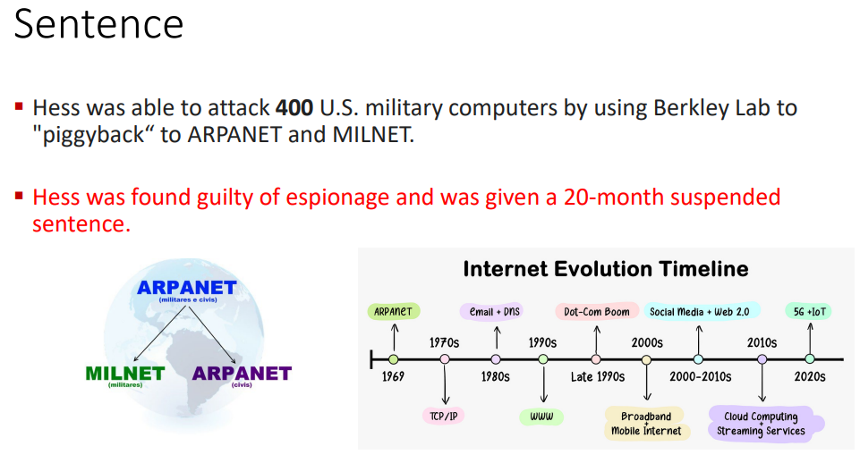


---

New story: passwords and power drills

This story ends with someone using a power drill to crack open a safe.

In 2012,
google had their own internal password manager to store and share secrets for third-party services that don't support better auth mechanisms at the time.

Initially for very few people.

This was used for the auth for shuttlebus wifi for google employees.


`In 2012, Stamen Design tracked the movements of
tech shuttles and created a map of them - a map that
was never created or released by the companies
themselves who keep routes and stops secret.`


This crashed the service b/c everyone hopped on to load up the password.


It took an hour for everyone to realize that they were putting the card in wrong.

password manager failure was triggered by an availability problem:
poor load-balancing.

recovery complicated by multiple measures designed to increase system sec
- improve breakglass mechanisms
  - mechanisms to bypass policies to allow engineers to quickly resolve outages

---

march 2012 there was a power outage at a google datacenter in in belgium

turn out a cat destroyed some nearby external psu thingies


---
in 2006 an open-source dev noticed that the memory debugger Valgrind was reporting warnings about memory used prior to initialization.

to eliminate the warnings, the dev removed two lines of code.


cuased a bug in OpenSSL's pseudo-random number gen.
Only got seeded w/ process ID.

lead to things being easily brute force breakable.

understanding the systems' adversaries is critical to buildilng reliable and secure systems

adversaries to reliability are typically benign, routine hardware failures or config changes that make unintended effects

security adversaries are typically humans trying to make the system work in a way that they want

### How Systems Fail

many reasons including
- reliability
  - accidental failures
- usability
  - failures from operating mistakes
- design and goal oversights
  - oversights, errors, adn omissions during designing
- security
  - intentional failures created by intelligent parties

all of the above are related

### What is Security


CNSS Security Model
- Committee on National Security Systems (CNSS)
- serves as standard for understanding many aspects of infosec


still used today.

ahead of his time

3 dimensions of infosec
- info characteristics
  - confidentiality
  - integrity availability
- security controls
  - policy
  - education
  - technology
- information location
  - storage
  - processing
  - transmition

Each cube cell is a specific 3 way intersection that we should be thinking about


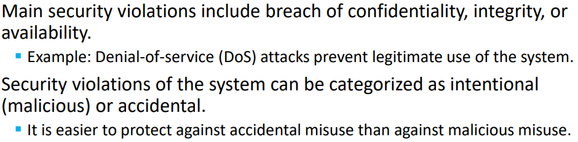


AAA processes
- start with identification
  - subject must provide an identity to a sytsem to start the AAA processes
  - identities should be
    - unique
    - securely issued
  - non-descriptive of role
- authentication
  - proves identiy of subj that tires to connect
  - subject must supply verifiable creds referred at as factors
    - single-factor
      - just one pasword
    - multifactor
      - two or more
      - password + duo mobile
      - bank card + pin
  - factor categories
    - knowledge - something you know
      - passowrd, pin, answer to security questions
    - possession - something you have
      - one time auth password, smart cards, ubikey
    - biometrics - something you are
      - fingerprints, eye scan
  - you might notice that these days the message for an incorrect username or password are the same message, this is also a security measure
- authorization
  - determines what a user is allowed to do on a computer system or network
  - the model for this defines how access rights and permissions are granted
    - there are many different models
      - rule based
      - dynamic
      - discretionary
      - 
- accounting
  - auditing and monitoring what a user does w/ accessed resources
  - produce audit trail log
  - when the user accessed the resource
  - what the user did with that resource
  - when the user stopped using that resource

### Info Security Strats

don't just hope that it works out for you

off sec (read team) and defensive sec (blue team)

zero trust security: never trust, always verify


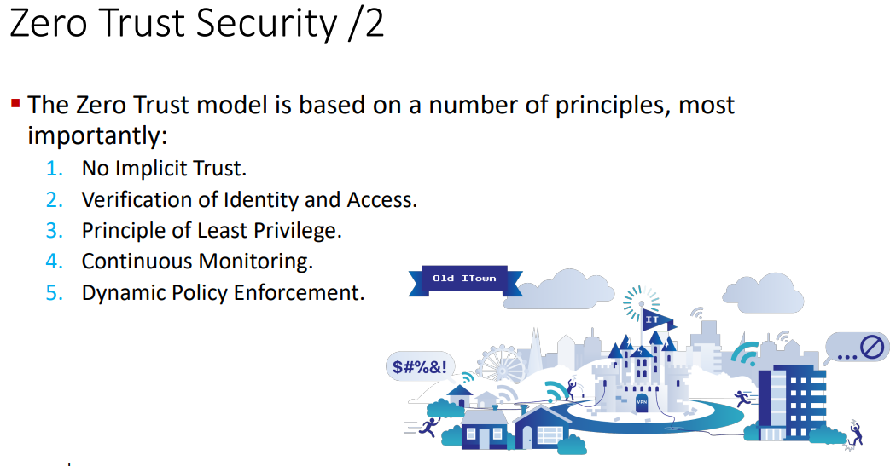

## Protection

### Goal of protection

defend the system from internal or external attacks

concerned with controlling access of processes or users to the resources of the computer system.

Protection problem
- ensure that each object is accessed correctly
- only accessed by those processes that are allowed to do so

### Principles of Protection

protection principles including but not limited to
- principle of least privilege
  - similar to need-to-know basis
  - properly set perms can limit damage in the case of bugs or abuse of perms
  - can be static or dynamic
    - static during life of system or pocess
    - dyanmically changed by process as needed
      - privilege escalation
- compartmentalization
  - derivative concept regarding access to data
  - protect each individual system component
  - use specific permissions and access restrictions
  - ex
    - we can have a virtual testing machine so that if the testing machine gets compromised we can kill it very easily and hopefully the attacker doesn't know to try and jump the hypervisor
    - we don't even have to do a full blown vm for some usecases
- audit trail
  - recording all protection-oriented activities
  - important to understand
    - what happened
    - why
    - what happened that shouldn't have happened

Defense in Depth
- application of multiple, sometimes redundant, defense mechanisms
- if a single control fails then the other controls can still protect the env and assets

# Exam Review

## Exam Housekeping
Date: Mon 15 apr 2024 @ 0900

location: WSC 106 108 105

Duration: 2 hours

Format: e-class quiz with use of labtest mode

Scope: Everything

bring: id, mfa auth, pen and/or dark pencil, calculator (leave in backpack)

closed book, no
- notes
- book
- e-class resources
- slides

Provided with 5 scratch papers to be left.

Use of the calculator app is permitted.

All questions may be on the exam.

Number of questions, question types, and weight of questions are shown on exam.

Non-sequential, allowed to go back and forth between questions.

protocol:
- Arrive 15 minutes before exam.
- Put device into airplane mode after logging in.
- Leave photo id on desk
- no questions during test
- choose the ***best*** answer for multiple-choice or true-false questions
- write your assumptions
- don't worry too much about the answer format. just go with what the question is asking for
  - if you're unsure then there will be manual review
- deduct 5 marks if you ask the instructor/proctor to
  - explain a question
    - this will not be answered
  - verify understanding of question
  - verify answer
  - ask about answer format
  - voice concern of missing info in answer
    - do so after the exam

in the case of technical/machine related login failure, restart the machine and try again

All else fails, you will be provided a paper-based copy and retrieve your calculator.

## QnA

Q: are we allowed cheat sheats?

A: No.

Q: Will there be a practice exam?

A: Yes.

Q: Will there be more weight given to post midterm material?

A: There will be more weight but the exam is cumulative so study up on everything.

Q: Will there be any coding questions?

A: No. You won't be creating code to feed to a java or c compiler but we will be looking at snippets that we looked at in class. We may also be asked to write a small piece of code to implement a mutex.

Q: Do we still get to write "I don't know" for 10%?

A: No

Q: Why not do a paper exam?

A: Prof likes e tests better

Q: Will we be given formulas?

A: Only Amdahl's law type fomulae. Things like effective access time you need to memorize

Q: What will be the weight of the exam?

A: It's still 40%. The weight of A2 was placed on to the other completed course materials

Q: Is there any sort of set seating arrangement between the rooms?

A: undecided

Q: WIll the difficulty be similar to the midterm?

A; "It depends. Did you think it was Difficult?" "This is a very relative question"

Q: Can we opt-in to paper based?

A: No, it is only an emergency provision. Likely only a single digit number of paper-based tests will be on-site.

## Final Exam Practice

suggested study methods
- go through lecture notes and existing notes
- refer to textbook to attain deeper understanding
  - Operating System Concepts, 10th Edition, by Abraham Silberschatz, Greg Gagne, et al., (Aavailable from York Library in Softcopy)
  - contains practice questions
- practice and understand assignments and tutorials
  - `tutorial, singular`
- use the practice exam given by professor
  - provides answers to the knowledge checks throughout the course
  - new knowledge checks added for chapters that didn't have many
  - "there are only 117 questions that I encourage you to go through"
  - answer to on the following slide

what have we learned
1. computer system overview
2. os structures
3. process description and control
4. threads
5. synchronization and mutex
6. deadlocka nd starvation 
7. cpu scheudling
8. main memory
9. virtual memory
10. storage management
11. Security and Protection

There are also sub-topics