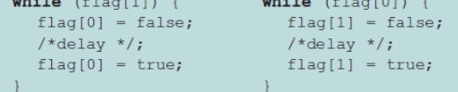
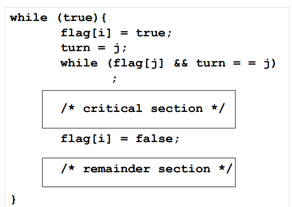
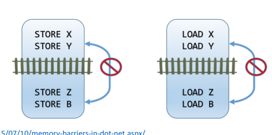
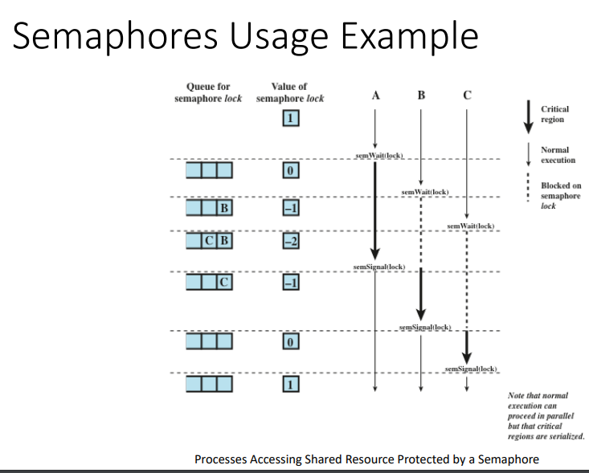
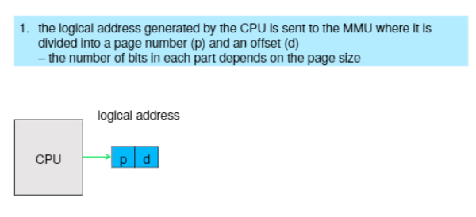
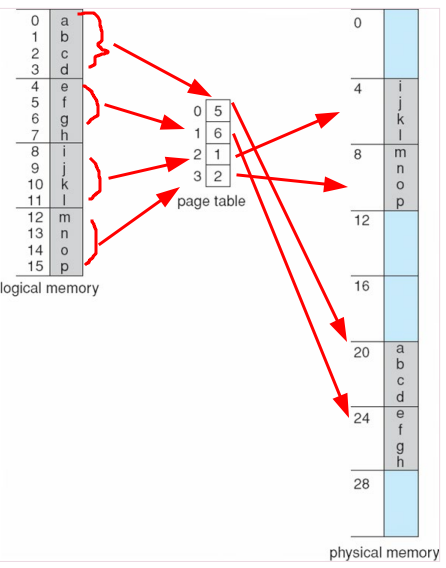
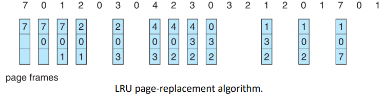

toc:
- [Critical Section Problem and Mutual Exclusion](#critical-section-problem-and-mutual-exclusion)
  - [Software Approaches](#software-approaches)
    - [Dekker's Algo](#dekkers-algo)
    - [Peterson's Solution](#petersons-solution)
  - [Hardware Support Approaches](#hardware-support-approaches)
    - [Memory Barrier](#memory-barrier)
    - [Hardware Instructions](#hardware-instructions)
    - [Atomic Variables](#atomic-variables)
  - [OS \& Programming Languages Approaches](#os--programming-languages-approaches)
    - [Mutex Locks](#mutex-locks)
    - [Semaphores](#semaphores)
- [Deadlocks and Starvation](#deadlocks-and-starvation)
- [CPU Scheduling](#cpu-scheduling)
  - [Different ALgos](#different-algos)
  - [Multiprocessing](#multiprocessing)
  - [Real Time](#real-time)
- [Memory Management](#memory-management)
  - [Paging](#paging)
    - [Paging Hardware](#paging-hardware)
    - [Example](#example)
    - [Calculating Internal Fragmentation](#calculating-internal-fragmentation)
    - [Free Frames](#free-frames)
    - [Implementation of Page Table](#implementation-of-page-table)
      - [TLB](#tlb)
        - [Effective Access Time](#effective-access-time)
        - [Memory Protection in Page Table](#memory-protection-in-page-table)
        - [Shared Pages](#shared-pages)
- [Page Replacement Algorithms](#page-replacement-algorithms)
  - [Page Replacement](#page-replacement)
    - [Page Replacement Algorithms](#page-replacement-algorithms-1)
      - [Page Replacement Algo Evalutation](#page-replacement-algo-evalutation)
      - [Different Types](#different-types)
        - [FIFO](#fifo)
        - [Optimal Algo](#optimal-algo)
        - [Least Recently Used (LRU) Algorithm](#least-recently-used-lru-algorithm)
          - [Second-Chance Algo (Clock) - LRU Approximation](#second-chance-algo-clock---lru-approximation)
          - [Enhanced Second-Chance Algo](#enhanced-second-chance-algo)
        - [Counting Algos](#counting-algos)

# Critical Section Problem and Mutual Exclusion

Processes share resources like disk space or memory which they will read from and write to.
If this is ill-managed then we end up with stuff like data inconsistency,
where we might expect something to happen to the shared data but something else happens in reality.
One process gets to it before the other and/or they try working on it at the same time.

Whenever a process wants to work on that shared resource we refer to that as a critical section.

There are 3 things we have to ensure to make sure there is no data inconsistency:
- bounded waiting
  - a process can't just sit idly by forever while all the other processes take their turn in their critical sections
- progress
  - if no one is in critical section and someone can go then we must choose someone
  - this is not a decision we can hold off on forever
- mutual exclusion
  - only one process can be in critical section at a time

The hardest thing is mutual exclusion though we have come up with solutions.

## Software Approaches

### Dekker's Algo

Dijkstra went to go publish it for him so that's why there's a jpeg of him on the slide

first known sol'n to the mutual exclusion problem in concurrent programming

allows 2 threads to share a single-use resource without conflict, using only shared memory for communication

only one access to a memory location can be made at a time

we have a global memory location labelled `turn` that is shared between the two processes

Processes check to see if it's their turn and execute accordingly.
Once they're done, they give the turn to the other process.

Mutual exclusion is guaranteed.

What is the problem?

Processes must strictly alternate in their use of their critical section
- the pace of execution is dictated by the slower of the two processes

One process being slow makes the whole things slower since everyone has to wait on that slower process.

if one process fails then the other process is permanently blocked
- this happens because the failed process can't give the turn over to the other process by exiting and setting the flag
- this happens whether or not the process is in the critical section or not

2nd attempt - a revision:
- each process has it's __own key _(flag)___
- if one fails, the other can still access its critical section
- processes can look at others flags
- one process can't change the flag of another process
- processes share a boolean vector that holds the flags
  - `Boolean vector flag[2]`


drawbacks:
- permanent blocking still possible
  - process fails inside critical section or after setting flag to true w/o entering
- no guaranteed mutual exclusion
  - P0 executes the while statement and finds flag[1] set to false
  - P1 executes the while statement and finds flag[0] set to false
  - P0 sets flag[0] to true and enters its critical section
  - P1 sets flag[1] to true and enters its critical section
  - both processes are now executing their critical sections so the program is incorrect

3rd attempt - another revision
- the problem from before was that a process can change its state after the other process has checked it but before the other process can enter its critical section
- swap around the two stateemnts to guarantee mutual exclusion


we set the flag's value before we execute the while loop

drawbacks:
- this results in a deadlock
- both processes set their flags to true
- later on they will check each other's flags and decide they need to wait for the other
  - the flag value makes them think the other process is in their critical section

4th attempt - yet another revision:
- Each process sets its flag to indicate its desire to enter its critical section but is prepared to reset the flag to defer to the other process
- mutual exclusion is guaranteed under this model


drawbacks:
- 
  - each process sets their flag to true
- 
  - each process checks the other's flag before proceeding with the while loop
- 
  - each flag flips from false and back to true
- the loop ends up repeating in what's known as a _livelock_
- this won't sustain for a long time
  - the processes are different and we can presume that the while loops won't always take the same amount of time and that one will finish their while loop before the other can so they'll enter the critical section first

5th iteration - the correct solution:
- we introduce ___the right to insist___


- when P0 wants to enter the critical section
  - it sets its flag to true
  - checks P1's flag
    - if P1 flag is false then P0 gets to go critical
    - else, P0 consults turn
      - turn==0
        - it's P0's turn to insist
        - P0 will just keep on checking P1's flag in order to try and enter its critical section
- P1 will at some point note that it is its turn to defer and set its flag to false, allowing P0 to proceed
- after P0 has used its critical section
  - P0 flag set to false
  - turn set to 1 to transfer the right to insist to P1

### Peterson's Solution

Dekker's algo solves things but it's hard to follow

Peterson has a simpler sol'n that allows two processes to share a single-use resource w/o conflict

only shared memory is used for communication

it is kind of rewriting Dekker's algorithm

---


`int turn` - indicates whose turn it is to enter the critical section

`bool flag[2]` - indicate if a process is ready to enter the critical section

`flag[i]==true` implies that process $P_i$ is ready



3 critical-section requirements are met(provably):
1. mutual exclusion is preserved 
   - $P_i$ enters critical section only if: either `flag[j]==false` or `turn == i`
     - the other process is not ready or
     - it is $P_i$'s turn
2. Progress requirements is satisfied
3. Bounded-waiting requirement is met

Useful for demonstrating an algo but not guaranteed to work on modern architectures.

to improve performance, processors and/or compilers may reorder operations that have no dependencies
- fine for single-threaded as result is always the same
- may produce inconsistent or unexpected results for multithreading

```
two threads share _flag_ and _x_ variables

boolean flag = false;
int x = 0;

Thread 1 performs

while (!flag)
  print x;

Thread 2 performs

x = 100;
flag = true;

what is the expected output

100 is the expected output however the operations for thread 2 may be reordered so the output might be 0
```


We have to use a ___Memory Barrier__ to make sure that Peterson's solution will work correctly on modern computer architecture.

So this software based support will need the aid of some hardware.

---
Knowledge check:
- In Peterson's solution, the \_\_\_ variable indicates if a process is ready to enter its critical section
  - `flag[i]`

## Hardware Support Approaches

---
"There is no bullet solution... all solutions build on each other"

---

Many systems provide hardware support for implementing the cirtical section code

uniprocessors - could disable interrupts
- currently running code would execute w/o preemption
- generally, too inefficient on multiprocessor systems
  - OS using this are not broadly scalable

looking at 3 forms of hardware support
1. memory barriers (aka memory fences)
2. hardware instructions
3. atomic variables

### Memory Barrier

How a computer architecture determines what memory guarantees it will provide to an application program is known as its memory model.

models may be either
- strongly ordered
  - memory modification of one processor is immediately visible to all other processors
- weakly ordered
  - not always immediately visible to all other processors

developers cannot make an assumption about whether or not the memory model is strongly or weakly ordered.

in lieu of this guarantee,
we use memory barriers.

memory barriers
- computer instructions that force any changes in memory to be propogated to all other processors in the system

`Sfence` is a memory barrier instruction for example with regards to storing

`lfence` is another type of instruction with regards to loading

`mfence` prevents reording of reading and writing before or after the fence

do not reorder anything before the barrier with anything that comes after the barrier



we're not able to mov the loads to either side of the fence


### Hardware Instructions

```c
boolean test_and_set (boolean *target){
  boolean rv = *target;
  *target = true;
  return rv;
}
```

`test_and_set()`
- executed atomically
- read a value in memory
- set it to true
- return the value that was in memory

This let's us make a lock out of the flag we want us to make sure we don't enter the critical section while another program is in its critical section.

```c
do {
  while (test_and_set(&lock));
  /*critical section*/
  lock = false;
  /*remainder section*/
} while (true);
```

This is suported by nearly every architecture.

`compare_and_swap()`
```c
int compare_and_swap(int *value, int expected, int new_value) {
  int temp = *value;
  if (*value == expected)
    *value = new_value;
  return temp;
}
```
- executed atomically
- returns the original value of `value`
- set the `value` to the value of `new_value`
  - but only if `*value == expected`

We can also use this to make a shared lock for mutual exclusion. 
Have it initialized to 0.

```c
while (true) {
  //lock is the lock, 0 is the expected value, 1 is the prospective new value
  while (compared_and_swap(&lock, 0 ,1) != 0) {/*do nothing, someone else is in critical section*/}
  /*critical section, lock has been set to by us*/
  lock = 0;     //we left the critical section so we're able to set the lock back to 0
  /*remainder section*/
}
```

### Atomic Variables

Typically instructions such as compare-and-swap are used as building blocks for other synchronization tools.

One tool is an atomic variable that provdes *atomic* (uninterruptible) updates on basic data types such as integers and booleans.

Ex:
- `sequence` - our atomic variable
- `increment()` - an operation on `sequence`
- command
  - `increment(&sequence)`
  - ensures the sequence is inremented without interruption

we make atomic updates so that we're guaranteed to update a variable.

`increment()` can be implemented like so:
```c
void increment (atomic_int *v) {
  int temp;
  do {
    temp = *v;
  }
  while (temp != compare_and_swap(v, temp, temp+1));
  // the above keeps looping until we are able to successfully swap, effectively incrementing the value of `v`
}
``` 

---
Knowledge Check:
- race conditions are prevented by requiring that critical regions be protected by locks
  - true
- `test_and_set()` instruction is executed atomically
  - true
- an instruction that executes atomically
  - executes as a single, uninterruptible unit

## OS & Programming Languages Approaches

### Mutex Locks

Previous solutions are compicated and generally inaccessible to application programmers.

OS designers build software tools to solve critical section problem.

The simplest solution is the mutex lock.

>fun fact: mutex is a portmanteau of `mut`ual `ex`clusion, as it was created to solve that problem


note that the mutex is an integer that alternates between 0 for locked and 1 to unlocked, this is effectively a boolean.

Protect a critical section by first `acquire()` a lock then `release()` the lock.
Boolean variable indicating if `lock` is available or not.

`acquire()` and `release()` must be atomic.
Usually implemented via hardware atomic instructions such as compare-and-swap.

```c
while (true) {
  acquire lock

  critical section

  release lock

  remainder section
}
```

You `acquire()` the lock and no one else can touch it while you're in the critical section.
Afterwards you can `release()` since you're done with the critical section.

The instructions look something like this in implementation.
```c
acquire() {
  while (!available) { /* busy wait */}
  available = false;
}
release () {
  available = true;
}
```
- these two functions must be implemented atomically, typically through the use of something like `test_and_set()` and `compare_and_swap()`

cons:
- sol'n requires busy waiting
  - a process trying to enter enter its critical section will loop call `acquire()` over and over again to try and grab hold of it
- this lock is called a *spinlock*
  - if a lock is to be held for a `short duration`, one thread can "spin" on one processing core while another thread performs its critical section on another core.

short duration:
- how short is short?
- waiting on a lock requires 2 context switches
  - move the thread to the waiting state
    - storing away all of the process info (pcb, psw, etc.) introduces overhead
  - restore the waiting thread once the lock becomes available
- the general rule is to use a spinlock if the lock will be held for a duration of less than two context switches
- we don't know how long it will take for a critical section to take but we can get some good estimates

---
Knowledge check
- a mutex lock
  - is essentially a boolean variable
- what is the correct order of operations for protecting a critical section using mutex locks?
  - `acquire()` followed by `release()`
- busy waiting refers to the phenomenon that while a process is in its critical section, any other process that tries to enter its critical section must loop continuously in the call to acquire the mutex lock
  - yes

### Semaphores

One problem we had with the mutex was the busy waiting.

basic idea:
- $\ge$ 2 processes can work together using simple signals
- a process can be forced to stop at a specified place until it has received a specific signal
- any complex coordination can be done with an appropriate amount of signals
- our previously mentioned mutex is akin to a single flag that we can raise up and down.

Sempahores are a more sophisticated synchronization tool than mutex locks.

A semaphore `S` is an integer variable, that can only be accessed through 2 atomic operations:
1. `wait()` - decrements the semaphore value
2. `signal()` - increments the semaphore value

```
these each have other names.
wait() originally P() from Dutch proberen, "to test", semWait()
signal() originally V() from verhogen, "to increment", semSignal()

we may find these in other literature
```
Implementation
```c
wait(S) {
  while (S <= 0) {/* busy wait */}
  S--;
}
signal(S) {
  S++;
}
```

There are 2 different kinds of semaphores:
1. counting sempahore
2. binary semaphore

Counting semaphores (aka general semaphore) is an integer value that can range over an unrestricted domain

Binary semaphores are an integer value that can only range between 0 and 1.
This is a mutex lock.

We can implement a counting semaphore as a binary semaphore.

Good tool to solve synch problems.


Initializing the semaphore to 0 will allow us to only allow $P_2$ to execute $S_2$ after the execution of $S_1$.

A semaphore must guarantee that no 2 processes can execute the `wait()` and `signal()` on the same semaphore at the same time

implementation becomes the critical section problem where the `wait` and `signal` code are placed in critical section.

Could now have busy waiting in critical section implementation.

Process can just suspend instead of waiting for the semaphore.
Each semaphore has a waiting queue w/ 2 items
- value (of type integer)
- pointer to next record in the list

2 operations:
- block (aka sleep) - place the process invoking the operation on the appropriate waiting queue
- wakeup - remove one of the processes from the waiting queue and place in ready queue

waiting queue:
```c
typedef struct {
  int value;
  struct process *list;
} semaphore
```

No busy waiting implementation:
```c
wait (semaphore *S) {
  S->value--;

  if (S->value < 0) {
    add this process to S->list;
    block;
  }
}

signal(semaphore *S) {
  S->value++;
  if (S->value <= 0) {
    remove a process P from S->list;
    wakeup(P);
  }
}
```



We're using the incrementing and decrementing to iterate through the queue.

A strong semaphore uses a queue of blocked processes, the process unblocked is the one in the queue for the longest time.

A weak semaphore uses a set of blocked processes.
The processes unblocked is unpredictable.
This can lead to process starvation as a process may remained blocked forever


---
knowledge check
- a counting semaphore
  - is essentially an integer variable
- \_\_\_ can be used to prevent busy waiting when implementing a semaphore
  - waiting queues
- mutex locks and binary sempahores are essentially the same thing
  - true

# Deadlocks and Starvation

These are also important.
I recommend looking at the `deadlock characterization` section and onwards in the [lecture notes](./allLectureNotes.md).

# CPU Scheduling

We're actually scheduling different threads to have time with the CPU.

## Different ALgos

A good scheduling algo has
- high CPU utilisation
- high throughput
- low turnaround time
  - low time to execute a particular process
- low waiting time
- low response time
  - time between first request and first response in interactive systems

types:
- FCFS
- SJF
  - w/ exponential averaging
- shortest remaining time first
  - Preemptive SJF
- Round Robin
  - time quantum
  - timing
- priority based
- priority based with round robin
- multi-level feedback queue scheduler

First Come First Serve is a very laggy way of going about it and it doesn't optimize for waiting time of algos.

Shortest Job First scheduling is optimal as it gives the minimum average waiting time for a given set of processes.
A more accurate description of this is the "shortest-next-cpu-bursts" as that's the criteria for being a "short" job.

However we don't know the exact length of the next job so we can predict it.

We use an exponential averaging of the length of the previous cpu bursts,
the details of this are in the notes and slides.

If we implement a non-preemptive version of Shortest Job First will just allow the currently running process to finish its CPU urst.

However we can make a preemptive version of this.
This way we can also make a choice when anew process arives at teh ready queue while a previous process is still executing.

Context switches take about 10 microseconds so we're fine with preempting here since bursts take milliseconds.

We basically switch between processes based on how much time is remaining for a process to burst.

Then there's Round Robin scheduling.
Depending on the number of processes in the ready queue we decide on a certain time quantum.
Each process gets to have that much time uninterrupted with the CPU,
this stops a single process from hogging the CPU.
We don't want a large quantum or else the performance starts to resemble that of FCFS but we also want quantum that isn't so small that it's comparable to the time it takes to context switch.

Once a process spends it's quantum time with the processor it is swapped out.
If the process finishes before the quantum runs out then we swap to a new process and restart the timer.

Average waiting time is often quite high and the turnaround is higher than SJF but it has a better response time.

Priority Scheduing is associating a priority number (integer) with each process and allocating the CPU to the process with the highest priority.
This allocation can be done preemptively or non-preemptively.

SJF is priority scheduling where priority is the inverse of predicted next cpu burst time. (larger burst = lower priority and vice versa)

We run into the problem of starvation in both of these however as a low priority process may never execute.

Sometimes we pair priority scheduling with Round-Robin so that we can preempt a process for another process within its priority tier.
But since we can't preempt for a process in alower tier a higher priority process just gets to use the CPU with impunity.

With Priority Scheduling we have separate queues for each priority.

For older processes we can "age" them by moving them to different queues.

The final scheduler is the mutlilevel-feedback-queue scheduler.
It's the most general CPU scheduling algo.
There are:
- a number of queues
- diff algo for each queue
- method used to determine
	- when to
		- upgrade a process
		- demote a process
	- which queue a process will enter when that process needs service

There's a good example of this in the lecture notes doc thing

## Multiprocessing

We have things like hyperthreading now where a single core multiple hardware threads that we can treat as effectively being different CPUs.

We can have one common ready queue of threads that the different CPUs can be assigned from or each of them can have a privately managed ready queue.


When multiprocessing we have to consider load balancing and processor affinity.

Load Balancing:
- we ideally want each CPU to do the same amount of work
- push migration
  - periodic task checks load on each processor
  - if there's an imbalance fonud
    - task pushed from overloaded CPU to other CPUs
- pull migration
  - idle processors pull a waiting task from a busy processor

Processor Affinity:
- processor's cache fills up with a thread's memory accesses after running for a while
  - the cache is now warm
  - the thread has an affinity for the processor
- when moving the thread to another processor
  - first processor's contents must be invalidated
  - new cache needs to be filled/warmed
  - ***high cost****
    - we don't like this hgih cost so we try to avoid migrating a thread from one processor to another
- soft affinity
  - OS attmpets to keep a thread running on the same processor
  - no guarantees
- hard affinity
  - allows a process to specify a set of processors it may run on

```
initially the cache is empty (usually almost all 16 kilobytes)

when the process starts it misses over and over again but then starts filling out the cache

processor starts prepopulating the cache in order to help it out.
seeing what to remove and what to get rid of.

for hard affinity the process decides on a number of CPUs.

It can choose CPUs to benefit from a shared L2 cache
```

## Real Time

no clue what the fuck is going on here

at least not to the extent that I can lay it out here simply

# Memory Management

paging is important and there's some formulae in there we need to go over

## Paging

Permitting the physical address space of processes to be non-contiguous in order to solve the external-fragmentation problem.

This still has internal fragmentation.

set up a `page table` to translate logical to physical addresses
- divide physical memory into fixed-sized blocks called `frames`
  - size is a power of 2
    - between 512 bytes and 16 Mbytes
- divide logical memory into fixed-sized blocks called `pages`
  - size is a power of 2
    - typically either 4 kb or 8kb in size

These aren't equivalent to one another so frames can be different sizes as pages.

We can eventually use paging to load processes that are too big for our memory.

- keep track of all free frames

to run a program of size $N$ pages, need to find $N$ free frames and the program.

Address generated by CPU divided into:
- p - page number
  - index into page table
  - contains base address of each page in physical memory
- d - page offset
  - conbined with base address to define the physical memory address that is sent to the memory unit


page size:
- defined by hardware
  - like frame size
- size is a power of 2
  - makes translation of logical address to page number and page offset easier this way
- if the size of the logical address space is $2^m$ and page size is $2^n$
  - the high-order $m-n$ bits of a logical address designate the page number
  - $n$ low-order bits designate the page offset


### Paging Hardware




steps the MMU takes to translate a logical address gen'd by cpu to a phys address
- extract page number `p` and use it to index into page table
- get corresponding frame number `f` from page table
- replace `p` in the logcal address with `f` to get physical address

the offset `d` is unchanged and unreplaced, combining with `f` to get the physical address


Logically we see the pages as being contiguous but physically they are all over the place and in a different order.

our paging scheme makes it so that there is no external fragmentation since any free frame can be allocated to a process that needs it.

### Example

given
- n = 2
- m = 4

map the following logical addresses to physical addresses:
- 0
- 3
- 4
- 13


using a page size of $2^n = 4$ bytes
and a physical memory of $2^m=32$
bytes (8 pages)

so the logical addresses translate as follows:
- $0=(5\times 4)+0=20$
- $3=(5\times 4)+3=23$
- $4=(6\times 4)+0=24$
- $13=(2\times 4)+1=9$ 




### Calculating Internal Fragmentation

if page size = 2048 bytes, how many pages will a process of size 72,766 bytes need?
- 35 pages + 1,086 bytes

It will be allocated 36 pages with an internal framgentation of 2048 - 1086 = 962 bytes

can you think of a worst case internal fragmentation scenario
- process needs n pages + 1 byte
- will be allocated n+1 frames with an internal fragmentation of almost a frame

on average fragmentation = 1/2 frame size. so are the small frames more desirable?
- not necessarily as each page table entry takes memory to track.

### Free Frames

The frame table has one entry for each physical page frame indicating whether the latter is free or allocated and, if it is allocated, to which page of which process.


### Implementation of Page Table

OS maintains a copy of the page table for each process just as it maintains a copy of the instruction counter and register contents

page table is kept in main memory
- page-table base register (PTBR) points to the page table
- page-table length register (PLTR) indicates size of the page table

in this scheme ever data/instruction access requires two memory accesses
- one for the page table
- one for the actual data or instruction
- memory access is slowed by a factor of 2

sol'n:
- se a special fast-lookup hardware cached called translation look-aside buffers (TLBs) (aka associative memory)

#### TLB


each entry in the TLB has 2 parts:
1. key/tag
2. value

TLB is associative, hihg-speed memory
- when the associative memory is presented with an item
- the item is compared with all keys simultaneously

typically small
- 32-1024 entries

tlb is a hardware feature

`This is a lot like a cache`

on hit:
- mmu checks if page number is present in the tlb
- if the number is found then its frame number is immediately available and is used to access memory

on miss:
- page number is not in the tlb
- have to reference the page table
- page and frame number are loaded into TLB for faster access next time

if TLB is full:
- an existing entry must be selected for replacement
  - replacement policies must be considered
    - range from least recently used (LRU) through round-robin to random
  - some CPUs allow the OS to participate in LRU entry replacment
    - other handle the matter themselves
  - some entries can be wired down for permanent fast access
    - never replaced
    - entries for key kernel code are wired down, typically

##### Effective Access Time

Hit ratio
- % of times that a page number is found in the TLB
- % of the time we find our desired page number

ex:
- suppose it takes 10 nanoseconds to access memory
- if we find the desired page in TLB then a mapped-memory access takes 10 ns
- otherwise we need 2 memory accesses, one to the page table and frame number then one more to access the desired byte in memory, which takes 20 ns
- calculate effective access time

Effective Access Time
- statistical or real measure of how long it takes the CPU to read or write to memory
  - 80% hit ratio
    - EAT = 0.8 * 10 + 0.2 * 20 = 12 ns
    - 20% slowdown in access time implied
    - ((12-20)/10)*100%
  - 99% hit ratio (more realistic)
    - EAT = 0.99 * 10 + 0.01 * 20 = 10.1 ns
    - 1% slowdown in access time implied
    - ((10.1-10)/10)*100%

##### Memory Protection in Page Table

memory protection implemented by associating protection bit with each frame to indicate if read-only or read-write acces is allowed
- can also add more bits to indicate page execute-only, and so on

for now we're doing a valid-invalid bit attached to each entry in the page table
- valid
  - the associated page is in the process' logical address space
  - thus a legal page
- invalid
  - indicates the page is no tin the process' logical address space
- or we can use the page-table length register (PTLR)

any violations result in a trap to the kernel


##### Shared Pages

shared code
- one copy of read-only code shared among processes
  - text editors, compilers, window systems
- multiple threads sharing the same process space

private code and data
- each process keeps a separate copy of the code and data
- th epages for the private code and data can appear anywhere in the logical address space


---
Knowledge Check
- consider a logical address with a page size of 8 kb. How many bits must be used to represent the page offset in the logical address?
  - the page offset in a logical address is determined by the size of the page
  - to represent the page offset iwthin this 8 kb page we need enough bits to address each byte within the page
    - (8*1024=8192)
  - nnumber of bits required $=log_2(\text{Page Size})=log_2(8192)=13$


`prof recommends doing the knowledge checks at home.`


# Page Replacement Algorithms

FIFO

Optimal (use the one that won't be used for the longest)

least recently used (very close to Optimal)

requires special hardware to implement so we use second-chance or clock algo.

Normal second-chance has a bit to keep track of if a page has been referenced.

enhanced has a bit to keep track of if it's been modified

## Page Replacement

sometimes there is no free frame

how:
- memory is used up by process pages but also in demand from the kernel, I/O buffers, etc
- the page is a hot commodity that everyone needs access to

scenario
- process executing
- page fault occurs
- OS determines where the desired page is residing on secondary storage
- but there are no free frames on the free-frame list
  - all mem is in use


need for page replacement
- algorithms
  - do we terminate it
  - do we swap out the whole process till there are more free frames
  - do we replace the page
    - we can find some page in memory but not really in use, page it out
    - most operating systems now combine swapping pages with page replacement

we want an algor that has the minimum number of page faults

basic page replacement:
- prevent over-allocation of mem
  - modify page-fault service routine to include page replacement
- use modify (dirty) bit to reduce the overhead of page transfers
  - only modified pages are written to disk
  - unmodified pages have no need to be written back to backing store since it wouldn't make a differnce
- page replacement completes separation b/w logical mem and phys mem
  - large virt mem can be provided on a smaller phys mem


frame allocation algo determines how many frames given to each process
- some small processes are smaller
- are frames reserved
- etc

page-replacement algo
- which pages to replace
- want lowest page-fault rate on both first access and re-access

### Page Replacement Algorithms

#### Page Replacement Algo Evalutation

evalutate algo by running it on a particular string of memory reference (reference string)
and
computing the number of page faults on that string
- string is just page numbers, not full addresses
- if we have a reference to a page `p`, then any references to page `p` that immediately follow will never cause a page fault
- results depend on the number of frames available


#### Different Types

algos:
- FIFO
- Optimal
- Least Recently Used (LRU)
- LRU-Approximation
  - Second-Chance
  - Enhanced Second-Chance
- Counting-Based

In all our examples, the reference string of referenced page numbers is:
7, 0, 1, 2, 0, 3, 0, 4, 2, 3, 0, 3, 0, 3, 2, 1, 2, 0, 1, 7, 0, 1

##### FIFO

first-in-first-out algo

Reference string:
7, 0, 1, 2, 0, 3, 0, 4, 2, 3, 0, 3, 0, 3, 2, 1, 2, 0, 1, 7, 0, 1

3 frames (3 pages can be in memory at a time per process)

How to track ages of pages?
Just use a FIFO queue.


##### Optimal Algo


This is an example,
not an actual algo.

##### Least Recently Used (LRU) Algorithm

Replace the page that has not been used in the most amount of time.
Associate time of last use with each page.

Results in 12 faults which is closer to optimal than FIFO

generally good and frequently used.



```
7 - assign to open page
0 - assign to open page
1 - assign to open page
2 - replace 7 since LRU
0 - 0 already has page
3 - replace 1 since LRU
0 - 0 already has page
4 - replace 2 since LRU
2 - replace 3 since LRU
3 - replace 0 since LRU
...
```
It's possible that with a different reference string we'll end up with performance similar to FIFO

---
Implementation
- requires hardware support
- hardware counter implementation
  - every page entry has a counter
    - every time the page is referenced through this entry, copy the clock into the counter
  - when a page needs to be changed
    - look at the counters (clock) of the pages
    - find the one w/ smallest value (least recently used)
      - replace that one
- `prof also mentioned a stack hardware implementation which is interesting`

---

LRU approximation algos
- LRU needs special hardware
  - the aforementioned counter implementation
- LRU is still slow even with the special hardware
- reference bit
  - with each page associate a bit
    - initially set to 0
  - when a page is referenced, the bit is set to 1
  - if a reference page has reference bit = 0 then we replace it
    - we don't know the order so this isn't perfect
- for this reason, we make many algos that approximate LRU

###### Second-Chance Algo (Clock) - LRU Approximation

Generally implemented using FIFO and a hardware-provided reference bit

if the reference bit of the page to be replaced is equal to:
- 0 $\rarr$ replace it
- 1
  - page is given second chance
  - move on to select the next FIFO page
  - clear reference bit
    - set it to 0
  - arrival time is set to current time

if all the bits are set then this algo degenerates to FIFO replacement.


> "The hand is like a clock going tick, tick, tick around the circle... that is why it is called the clock algorithm" - Professor

###### Enhanced Second-Chance Algo

Uses 2 bits
- reference bit
- modify bit (if available)

replacing a modified page introduces more overhead

So we can eval pages with the ordered pair (reference, modify)

pair|meaning|assessment
-|-|-
(0,0)|neither recently used nor modified| best page to replace
(0,1)|not recently used but modified|must write out before replacement, more overhead
(1,0)|recently used but clean|will probably be used again soon
(1,1)|recently used and modified|probably will be used again AND need to write out before replacement

The above table is in order of replacement preference

When page replacement is called for, use the clock scheme but use the four classes & replace page in lowest non-empty class
- this may require searching the circular queue several times

##### Counting Algos

Keep a counter of the ## of references that have been made to each page

Least Frequently Used (LFU) algo
- replaces the page with the smallest count

Most Frequently Used (MFU) algo
- based on the argument that the page with the smallest count was probably just brought in and has yet to be used

neither are common
- implementation is expensive
- does not approximate OPT well

---
Knowledge Check
- Q:
  - Suppose we have the follow page accesses:
    - 12342341211314
  - 3 frames within our system
  - use LRU replacement algo
  - what is the ## of page faults for the given ref string?
- A:
  - take home exercise
  - The answer is: c. 8
- Q: Belady's anomaly states that \_\_\_
- A:
  - d. for some page replacement algorithms, the page-fault rate may increase as the number of allocated frames increases
- Q: in the enhanced second chance algo, which orderd pair represents a page that would be the best choice for replacmeent?
- A: a. (0,0)
